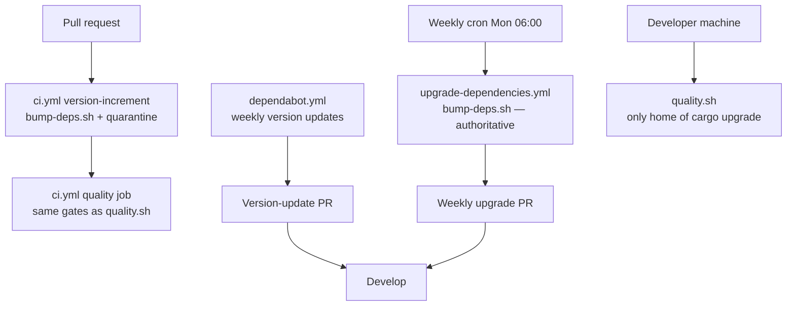

# Correct the dependency/CI pipeline description in AGENTS.md and README

## Summary

`AGENTS.md` and `README.md` described a pipeline the repository does not run.
All three claims are now rewritten to match the committed workflows, and a bats
suite pins each doc statement against the file it describes so the prose cannot
drift back. Closes #500.

1. **`cargo upgrade --incompatible` in the PR pipeline** — the PR path runs
   `./bump-deps.sh --quarantine-hours … --skip-build` (`ci.yml`), i.e.
   `cargo update` under the `VIBE_BUMP_QUARANTINE_HOURS` quarantine.
   `cargo upgrade` appears in `quality.sh` only. This was the dangerous claim:
   an agent "fixing" CI to match it would reintroduce the quarantine bypass
   `ci.yml` explicitly warns against. AGENTS.md now names `bump-deps.sh` and
   adds a do-not-do-this note for the local-only `cargo upgrade`.
2. **Dependabot "security-updates fast lane"** — `.github/dependabot.yml` is a
   *version-updates* entry (weekly, 7-day cooldown, 10-PR limit), not an
   advisory-triggered channel. Dependabot security updates are a
   repository-level setting invisible in the tree, so the README now links
   GitHub's documentation for that half rather than restating it, and states
   that the quarantine-aware `upgrade-dependencies.yml` is the authoritative
   routine channel with the Dependabot entry overlapping it. The same stale
   claim in `dependabot.yml`'s own header comment and in `SECURITY.md`'s intro
   is corrected too.
3. **"runs `bump-deps.sh` before `quality.sh` on every such PR"** — no workflow
   invokes `quality.sh`; the CI `quality` job re-implements the equivalent
   steps. The glossary and propagation sentences now say `bump-deps.sh` runs on
   every PR and the CI `quality` job applies the same gates `quality.sh` runs
   locally.

## Evidence

Documentation change — no UI and no runtime behaviour, so there is nothing to
screenshot and no benchmark to run. The evidence is the new bats suite, which
cross-checks each doc claim against the pipeline file it describes.

Corrected view of the dependency channels:

`./quality.sh < /dev/null` passes cleanly, including the new suite
(315+ bats assertions, full Rust gate, codespell, Mermaid validation).

## Test Plan

Added `tests/scripts/docs_pipeline_accuracy.bats` (10 tests). Each doc
assertion is paired with a premise test that reads the pipeline file, so the
suite fails if either side drifts:

- `ci.yml refreshes dependencies through bump-deps.sh, not cargo upgrade` —
  premise for the AGENTS.md assertions.
- `AGENTS.md describes the PR dep refresh as bump-deps.sh`.
- `AGENTS.md never attributes cargo upgrade to the PR pipeline` — any mention
  must carry the local-only `quality.sh` qualifier.
- `the committed dependabot.yml configures weekly version updates only` —
  premise, parsed from YAML.
- `README describes dependabot.yml as the weekly cargo version-updates channel`.
- `README does not claim the committed file enables a security-updates channel`.
- `README links GitHub's Dependabot security-updates documentation`.
- `no workflow invokes quality.sh` — premise, comment-stripped sweep of
  `.github/workflows/*.yml`.
- `README does not claim bump-deps.sh runs before quality.sh in CI`.
- `README credits the CI quality job with applying the same gates`.

Six of the ten failed against the pre-fix docs and pass after the rewrite; the
other four are the premise assertions, green throughout.
