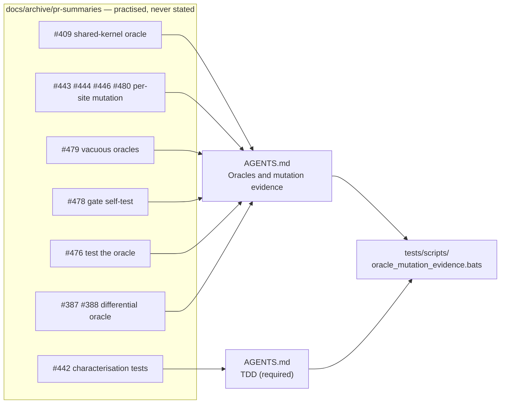

# Fold the oracle-integrity and mutation-evidence learnings into AGENTS.md

## Summary

Nine PR summaries in `docs/archive/pr-summaries/` independently practised and
justified a test-oracle integrity and mutation-evidence protocol that no main
document stated — `AGENTS.md` covered only the "what" vs "how" distinction, and
none of `README.md`, `AGENTS.md`, `SECURITY.md` or `RELEASING.md` contained the
words *mutation*, *oracle*, *falsifiable* or *vacuous*. This is the de facto
merge gate for refactors here, so it now lives in the instruction file an agent
actually reads. Closes #501.

Added `## Oracles and mutation evidence` to `AGENTS.md`, immediately after
*Testing: "what" not "how"*, carrying five rules with the concrete case that
taught each:

| Rule | Source |
| --- | --- |
| An oracle must not share the code path under test — use an independent implementation or the **differential-oracle** pattern (pre-change implementation kept verbatim as `reference_<fn>`); independence costs exactness, so state the numeric reason for a tolerance (`TOL = 1e-3`) rather than reusing the kernel to stay bit-exact | #409, #387, #388 |
| A refactor collapsing N copies must mutate each former site **one at a time** and show every one dies; sites left unreached tighten the test, never the claim; show both nets (compile error *and* test failure) where the compiler carries part of the rule | #443, #444, #446, #480 |
| No vacuous oracles — `is_finite()`, loose inequalities, bare magic lengths, or a fixture where the branch under test never fires; derive the expected value and write the derivation beside it | #479 |
| A gate self-test must compile the **live** pattern, not a private copy; read shared patterns through a quoted heredoc (`<<'PY'`) | #478 |
| When production cannot exercise an oracle's edge case, test the oracle directly with synthetic input and make it fail loud | #476 |

The **characterisation-test exception** (a pure extraction has no new behaviour
for a failing-first test to describe, so tests are written against the
pre-change copies and kept green through the extraction — #442) is recorded as
one bullet in *TDD (required)*, beside the rule it qualifies.

The nine summaries are **kept**. The issue conditions deletion on their
remaining content being fully absorbed elsewhere, and it is not: they still hold
the only record of the #387/#388 memory and Criterion A/B tables, #409's
breaking-change migration path, #442's per-arm bounds table and #480's
per-wrapper mutation matrix. Only the testing protocol was extracted.

## Evidence

Documentation and test-gate change — no web interface to screenshot. Evidence is
the new bats gate plus mutation testing of that gate, which is the protocol the
section itself demands.

**The gate is falsifiable.** Three mutations of the new `AGENTS.md` content,
each reverted afterwards, and each caught:

| Mutation of `AGENTS.md` | Result |
| --- | --- |
| Delete the vacuous-shape catalogue line (`assert!(result.is_finite())`) | `not ok 8 AGENTS.md forbids the vacuous oracle shapes found in this repo` |
| Delete the characterisation-test exception bullet | `not ok 14 …records the characterisation-test exception in the TDD section`, `not ok 15 the characterisation exception is scoped to pure extractions` |
| Reword the gate self-test rule from "live pattern" to "private copy" | `not ok 11 AGENTS.md requires a gate self-test to compile the live pattern` |

Against the unmutated tree the new suite is 16/16 green, and
`./quality.sh < /dev/null` exits `0` with `✅ All quality checks passed!`
(shellcheck, 347 bats tests with `0` failures, TypeScript gate, Mermaid gate,
codespell, `cargo deny`, fmt, clippy under `-D warnings`, workspace tests, doc
build, release build).

Where the learnings landed:

## Test Plan

Added `tests/scripts/oracle_mutation_evidence.bats` — 16 tests, written and run
**red before** the `AGENTS.md` edit, following the existing doc-invariant
pattern of `unsafe_simd_invariants.bats` (#259) and `docs_single_source.bats`
(#264):

- section exists, and is positioned after the *Testing: "what" not "how"*
  section (line-order assertion, not a bare presence check);
- oracle independence: the "must not share" rule names the real shared kernel
  (`score_batch_into`), the honest-tolerance consequence names `1e-3`, and the
  differential-oracle pattern is named with its `verbatim` requirement;
- per-site mutation evidence: mutations are applied `one at a time`, and
  unreached sites are recorded as tightening the test;
- no vacuous oracles: the `is_finite()` shape is named, a derivation is
  required, and the never-fires-branch fixture trap is recorded;
- gate self-tests: the live-pattern rule and the quoted-heredoc (`<<'PY'`) rule;
- testing the oracle itself with synthetic input;
- the characterisation-test exception is inside the *TDD (required)* section
  (asserted by extracting that section's line range) and scoped to pure
  extractions;
- provenance: the section cites the source PRs (#387, #409, #443, #476, #478,
  #479) so the archived detail stays traceable.

No existing test was modified, removed or disabled.
