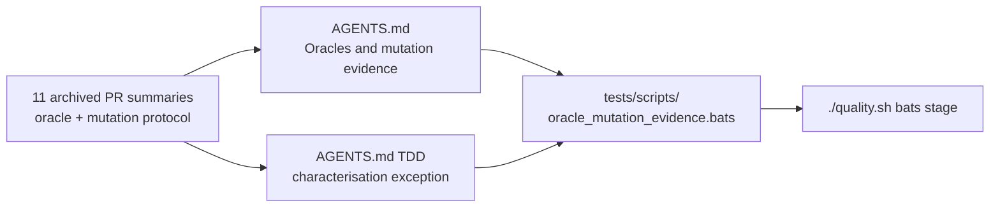

# Fold the oracle-integrity and mutation-evidence protocol into AGENTS.md

## Summary

Eleven PR summaries in `docs/archive/pr-summaries/` independently practise and
justify a test-oracle integrity and mutation-evidence protocol that no main
document stated — none of `README.md`, `AGENTS.md`, `SECURITY.md` or
`RELEASING.md` contained the words *mutation*, *oracle*, *falsifiable* or
*vacuous*. It is this project's de facto merge gate for refactors, so an agent
reading `AGENTS.md` got "what not how" and nothing about oracle independence,
and a green-but-blind parity test would pass review again. Closes #501.

`AGENTS.md` gains **Oracles and mutation evidence**, immediately after
*Testing: "what" not "how"*, carrying the five rules with the concrete failure
each was learnt from:

| Rule | Learnt from |
| --- | --- |
| An oracle **must not share** the code path under test — independent reference (scalar `activate`, or the pre-change implementation as a differential oracle), and the honest `TOL = 1e-3` that independence costs | `pr-summary-409.md`, `-387.md`, `-388.md` |
| A refactor collapsing N copies must kill **every former site** under mutation, one site at a time, results listed per site | `pr-summary-443.md`, `-444.md`, `-446.md`, `-480.md` |
| No **vacuous** oracles — `is_finite()`, loose inequalities, bare magic lengths, fixtures that never arm the branch; derive the expected value and write the derivation beside it | `pr-summary-479.md` |
| A gate self-test must compile the **live pattern**, not a private copy, read through a quoted heredoc | `pr-summary-478.md` |
| Test the oracle itself with **synthetic** input when production cannot reach its edge cases | `pr-summary-476.md` |

The *TDD (required)* section gains the **characterisation-test exception**: a
pure extraction has no new behaviour for a failing-first test to describe, so
tests are written against the pre-change copies and kept green through the
extraction — with the mutation evidence, not a red-first run, doing the proving
(`pr-summary-442.md`).

**No PR summary was deleted.** The issue permits deleting a summary only once
its remaining content is fully absorbed elsewhere, and none of the eleven meets
that bar: each still carries per-test plans, benchmark or allocation A/B tables
and per-site mutation results that live nowhere else (`-387`/`-388` allocation
and Criterion numbers, `-443`'s `forward_pass` table, `-480`'s 20-test
inventory). That also matches the standing repo practice — `pr-summary-409.md`
records archived summaries as historical records deliberately left untouched,
and Issue #2173 makes the archive their permanent home.

## Evidence

Documentation change to a Rust library — no web interface to screenshot. The
evidence is the new gate plus its mutation results, since a passing gate is not
evidence for this class of change.

**Mutation check on the new gate.** Each rule was removed or weakened in
`AGENTS.md` and the suite re-run; every mutation was reverted afterwards and the
committed tree is green.

| Mutation to `AGENTS.md` | Result |
| --- | --- |
| Whole *Oracles and mutation evidence* section deleted | 10 of 11 tests **FAILED** |
| Rule 1 weakened: "must not share" → "should differ from" | `rule 1: an oracle must not share the code path under test` **FAILED** |
| Rule 3's `is_finite()` example dropped | `rule 3: no vacuous oracles — derive the expected value` **FAILED** |
| Rule 4's quoted heredoc `<<'PY'` → `<<PY` | `rule 4: a gate self-test compiles the live pattern, not a private copy` **FAILED** |
| Characterisation-test bullet dropped from *TDD (required)* | `TDD section carries the characterisation-test exception for pure extractions` **FAILED** |
| Mermaid diagram dropped from the section | `the oracle section draws the blind-vs-independent oracle as a mermaid diagram` **FAILED** |

The gate slices each `##` section into its own file before asserting, so a rule
cannot be satisfied by wording that happens to sit elsewhere in `AGENTS.md` —
the same "assert against the live text, not a copy" discipline rule 4 states.

**Quality gate.** `./quality.sh < /dev/null` → `✅ All quality checks passed!`
(shellcheck, bats — 326 passed / 0 failed, `deno check`, Mermaid gate,
codespell, `cargo deny`, fmt, clippy under `-D warnings`, `cargo check`, full
workspace tests, doc build, release build). `markdownlint-cli2` reports
0 errors.

## Test Plan

Added `tests/scripts/oracle_mutation_evidence.bats` — 11 tests against the live
`AGENTS.md`:

- `AGENTS.md has an Oracles and mutation evidence section`
- `the oracle section follows the what-not-how testing section` — placement,
  by heading line number.
- `rule 1: an oracle must not share the code path under test` — the
  independence rule and the tolerance it honestly costs.
- `rule 2: a collapse of N copies shows every former site dies under mutation`
- `rule 3: no vacuous oracles — derive the expected value` — names the banned
  `is_finite()` shape and requires the derivation.
- `rule 4: a gate self-test compiles the live pattern, not a private copy` —
  including the quoted-heredoc rule.
- `rule 5: test the oracle directly when production cannot reach the edge case`
- `the differential-oracle pattern keeps the pre-change implementation as reference`
- `the oracle section draws the blind-vs-independent oracle as a mermaid diagram`
- `the oracle section names the archived PR summaries it absorbs`
- `TDD section carries the characterisation-test exception for pure extractions`

No existing test was modified, removed or commented out; no production code
changed.
