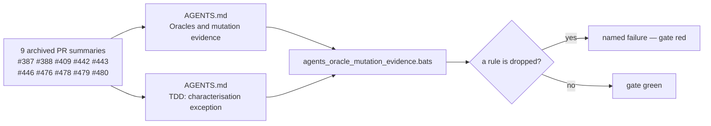

# Fold the oracle-integrity and mutation-evidence protocol into AGENTS.md

## Summary

Nine archived PR summaries independently practised and justified a test-oracle
integrity and mutation-evidence protocol that no main document stated — none of
`README.md`, `AGENTS.md`, `SECURITY.md` or `RELEASING.md` contained the words
*mutation*, *oracle*, *falsifiable* or *vacuous*. It is the de facto merge gate
for refactors here, so an agent reading only `AGENTS.md` could still ship a
green-but-blind parity test. **Closes #501.**

`AGENTS.md` gains one section, **Oracles and mutation evidence**, immediately
after *Testing: "what" not "how"*, stating the five rules with the concrete case
that produced each:

| Rule | Source | The blind spot it closes |
| --- | --- | --- |
| An oracle must not share the code path under test — independent reference, honest tolerance (`TOL = 1e-3`) | #409 | `score_records_flat` vs `score_records` both fed `score_batch_into`, so a kernel fault moved both sides and the test stayed green |
| A copy-collapsing refactor proves **every former copy** dies under mutation, per site | #443, #444, #446, #480 | Two of #443's eleven former copies were initially unreached by the suite |
| No vacuous oracles — derive the expected value and write the derivation beside it | #479 | `is_finite()`, loose inequalities, bare magic lengths, a fixture whose branch never fires |
| A gate self-test must compile the **live** pattern, not a private copy (quoted `<<'PY'` heredoc for shared patterns) | #478 | Gutting the live regex to `.*` failed nothing |
| Test the oracle itself with synthetic input when production cannot reach its edge cases | #476 | A latent `len0`-for-`len2` slip passed because every fixture record had the same length |
| The differential-oracle pattern: keep the pre-change implementation verbatim as the reference, then fault-inject | #387, #388 | A wrong-but-non-panicking order left every pre-existing test green |

The *TDD (required)* section gains the **characterisation-test exception** (#442):
for a pure extraction there is no new behaviour for a failing-first test to
describe, so the tests are written against the pre-change copies, run green
before the extraction, and kept green through it.

**The nine summaries are retained.** The issue makes deletion conditional on the
remaining content being fully absorbed elsewhere, and it is not: #409 carries the
`0.3.0` breaking-change migration path, #442 the per-arm safe-zone bounds table,
#443 the `forward_pass` before/after benchmark, #476 the follow-up to #484. No
learning is lost by keeping them; deleting them would lose some.

## Evidence

Documentation change with no web interface, so no screenshot applies. The
evidence is the new gate plus mutation testing of that gate — a passing
documentation assertion is not evidence for this bug class, which is the rule the
section itself states.

**Mutation check.** Each mutation was applied to `AGENTS.md`, the suite re-run,
and the mutation reverted:

| Mutation to `AGENTS.md` | Result |
| --- | --- |
| Heading renamed `## Oracles and mutation evidence` → `## Oracles` | 9 of 10 tests **FAILED** (every rule assertion plus the placement check) |
| Tolerance sentence loosened — `TOL = 1e-3` dropped | `an oracle must not share the code path under test` **FAILED** |
| `assert!(x.is_finite())` example replaced with "Weak assertions." | `no vacuous oracles` **FAILED** |
| Quoted-heredoc rule `<<'PY'` replaced with "a heredoc" | `a gate self-test compiles the live pattern` **FAILED** |
| Characterisation-test bullet deleted from *TDD (required)* | `TDD section records the characterisation-test exception` **FAILED** |

Each failure names its cause rather than reporting a bare `[[ ... ]]` status, e.g.

```text
not ok 6 rule: a gate self-test compiles the live pattern, not a copy
# AGENTS.md does not state the quoted-heredoc rule for a shared pattern (no /<<'PY'/)
```

`section_body` also fails loud when a heading exists with an empty body, so a
renamed or emptied section cannot make the rule assertions pass vacuously.

**Quality gate** — `./quality.sh < /dev/null` → `✅ All quality checks passed!`
(shellcheck, **326 bats tests passed / 0 failed**, TypeScript gate, Mermaid gate,
codespell, `cargo deny`, fmt, clippy `-D warnings`, full workspace test run, doc
build, release build). `markdownlint-cli2` is clean on `AGENTS.md`.



## Test Plan

No tests were removed, disabled or modified.

Added `tests/scripts/agents_oracle_mutation_evidence.bats` — 10 tests, each
asserting an observable outcome of the documentation (the rule a reader can find
in `AGENTS.md`), not the file's formatting:

- `AGENTS.md carries an oracle/mutation-evidence section`
- `the oracle section follows the testing guidance it extends` — it must sit
  immediately after `Testing: "what" not "how"`.
- `rule: an oracle must not share the code path under test`
- `rule: a refactor collapsing N copies proves each former site dies`
- `rule: no vacuous oracles — derive the expected value`
- `rule: a gate self-test compiles the live pattern, not a copy`
- `rule: test the oracle directly when production cannot reach an edge case`
- `the differential-oracle pattern is stated`
- `the section cites the archived summaries it absorbs` — provenance for all
  seven cited PRs.
- `TDD section records the characterisation-test exception` — including that the
  Australian spelling is used.
