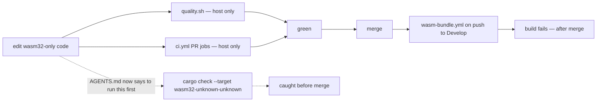

# Document the CI blind spots: ungated wasm32, repo-owned unconditional gates (Issue #502)

## Summary

Two CI blind spots were recorded only in the PR-summary archive, so nothing an
agent reads before editing warned about either. Both now sit in `AGENTS.md`'s
*CI / secrets* section. Closes #502.

1. **`wasm32` is gated by nothing on a PR.** Verified against the tree:
   `quality.sh` names no wasm target at all, and no `pull_request` workflow runs
   a `cargo build/check/clippy` against `wasm32-unknown-unknown` (the
   `wasm64-memory64-smoke` job is a Deno Memory64 runtime test). The target
   compiles only *after* merge — `wasm-bundle.yml` on push to `Develop`, and the
   scheduled `upgrade-dependencies.yml`, whose `bump-deps.sh` dual build the PR
   lane skips with `--skip-build`. The new bullet names the load-bearing manual
   check, `cargo check -p neat-core --target wasm32-unknown-unknown`, the
   failure it catches (an orphaned `use core::arch::wasm32::{…}` left behind a
   `#[cfg(target_arch = "wasm32")]` when its last consumer is deleted — Issues
   #422, #423), and the `wasm32-wasip1`/Node-WASI `f32` bit-diff method for
   numeric changes (Issue #448). Cross-referenced from both SIMD sections, since
   that is where the blind spot bites.
2. **CI gates must be repo-owned and unconditional.** The Mermaid step was
   `if:`-gated on a file only another repo owns, so it never ran once and a
   broken diagram merged (Issue #379); its replacement `scripts/check_mermaid.ts`
   is repo-owned and unconditional in both `quality.sh` and `markdown-lint.yml`.
   The same bullet records that GitHub rejects `timeout-minutes:` on a
   reusable-workflow **caller** job — the budget belongs on the called
   workflow's own job (`ci.yml`'s `security` job → `security.yml`, Issue #333).

The four cited summaries are **kept**, not deleted: the issue conditions removal
on "no other unabsorbed content", and each still holds PR-specific record that
`AGENTS.md` does not carry — the breaking-change removal tables in `-422`/`-423`,
the 492-span bit-identical diff evidence in `-448`, and the per-job timeout table
in `-333`.



## Evidence

Documentation change to a Rust/CLI repo — no web interface to screenshot. The
evidence is the new test suite, which is a "what" test in the style of
`docs_pipeline_accuracy.bats`: every doc claim is paired with a premise
assertion read from the pipeline file it describes, so the suite fails both if
the prose drifts and if the pipeline changes underneath the prose.

Pre-fix (doc assertions only, run against `AGENTS.md` at `HEAD~1`) — the premise
assertions already passed, confirming the blind spots are real:

```
not ok 3 AGENTS.md CI section says wasm32 is ungated on PRs and names the manual check
not ok 4 AGENTS.md records the WASI bit-diff method for numeric wasm changes
not ok 5 the SIMD sections cross-reference the wasm32 check
not ok 8 AGENTS.md CI section states the repo-owned, unconditional gate rule
```

Post-fix:

```
1..8
ok 1 no pull_request workflow and no quality.sh step builds for wasm32
ok 2 wasm-bundle.yml builds wasm32 only on push to Develop
ok 3 AGENTS.md CI section says wasm32 is ungated on PRs and names the manual check
ok 4 AGENTS.md records the WASI bit-diff method for numeric wasm changes
ok 5 the SIMD sections cross-reference the wasm32 check
ok 6 the Mermaid gate is repo-owned and runs unconditionally
ok 7 reusable-workflow callers carry no timeout-minutes and the callee does
ok 8 AGENTS.md CI section states the repo-owned, unconditional gate rule
```

`./quality.sh < /dev/null` — green (shellcheck, the full bats suite including
the new file, TypeScript gate, Mermaid gate, deny, fmt, clippy `-D warnings`,
`cargo test --workspace`, doc, release build).

## Test Plan

New — `tests/scripts/docs_ci_blind_spots.bats` (8 tests). Premise assertions
parse the committed YAML/shell; doc assertions read the *CI / secrets* section
extracted by heading, so a matching phrase elsewhere in `AGENTS.md` cannot
satisfy them.

- `no pull_request workflow and no quality.sh step builds for wasm32` — parses
  every workflow, skips those without a `pull_request` trigger, and fails if any
  step compiles for `wasm32-unknown-unknown`; also asserts `quality.sh` never
  names the target. Fails loudly if a wasm PR gate is ever added, since the doc
  claim would then be stale.
- `wasm-bundle.yml builds wasm32 only on push to Develop` — the trigger is
  push-only on `Develop` and the workflow does build the target.
- `AGENTS.md CI section says wasm32 is ungated on PRs and names the manual check`
  — the section states the absence *and* carries the `cargo check` command and
  `wasm-bundle.yml`.
- `AGENTS.md records the WASI bit-diff method for numeric wasm changes` —
  `wasm32-wasip1` and `-C target-feature=+simd128,+relaxed-simd` are present.
- `the SIMD sections cross-reference the wasm32 check` — the command is cited
  from at least one section outside *CI / secrets* whose heading names SIMD or
  wasm.
- `the Mermaid gate is repo-owned and runs unconditionally` —
  `scripts/check_mermaid.ts` exists, no `markdown-lint.yml` step running it
  carries an `if:`, and the `quality.sh` invocation is at top level rather than
  nested inside a guard.
- `reusable-workflow callers carry no timeout-minutes and the callee does` —
  `ci.yml`'s `uses:` jobs declare none, every `security.yml` job declares a
  positive integer budget.
- `AGENTS.md CI section states the repo-owned, unconditional gate rule` — the
  rule, `check_mermaid.ts`, the caller/`timeout-minutes` carve-out and
  `security.yml` all appear in the section.

No existing tests were removed or modified.
