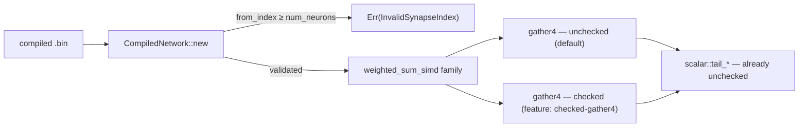

# Unchecked WASM `gather4` activation loads (Issue #509)

## Summary

Prototyped removing the bounds checks from the `wasm32` `gather4`
activation-load hot path, using the existing load-time synapse-index validation
as the safety invariant, and measured it against the safe control on a
production-sized creature and a production-sized record batch inside a real wasm
runtime.

**The acceptance gate is met, so the prototype is kept.** The unchecked gather
is faster on the isolated kernel (**−20% to −23%** median, every session, both
production shapes) and on production-sized end-to-end single-record inference
(**+2.0% records/sec** on a quiet host, more on a loaded one, never slower in
any session), with **bit-identical** numerics, a **neutral** batched-scoring
path, and native targets untouched by construction.

`CompiledNetwork::new` already rejects any `from_index >= num_neurons`
(`NetworkError::InvalidSynapseIndex`), and the `scalar::tail_*` helpers plus
every native SIMD kernel already index unchecked on the strength of it — the
wasm `gather4` was the outlier still paying four unprovable, data-dependent
bounds checks per four synapses.

What landed:

- **One helper changed.** All `unsafe` sits in `gather4`
  (`neat-core/src/simd.rs`) with an explicit `# Safety` contract naming both
  obligations and a `// SAFETY:` note discharging each from the load-time
  validation. `gather4_products`, `reduce4`, the four kernels and every fold are
  untouched, so lane order and FMA order are preserved — which is why the result
  is bit-identical rather than merely close.
- **The control is retained** behind the off-by-default `checked-gather4`
  feature: the A/B reference, and the one-flag way back out.
- **`wasm-bench/`** — an out-of-workspace A/B harness that holds both wasm
  modules in one process and alternates between them, plus a WASI cargo-test
  runner so the wasm-only parity tests execute on a real runtime.
- **The full result record** — hypothesis, setup, raw statistics, decision and
  cause — is in
  [`docs/research/wasm-gather4-unchecked-loads.md`](../../research/wasm-gather4-unchecked-loads.md),
  so this is not rediscovered and re-tested without new evidence.

Closes #509.

## Evidence

Library change with no web interface, so no screenshot applies. This is a
performance change, so before/after benchmarks are the evidence.

### Benchmark setup

`wasm32-unknown-unknown`, `--release` (`opt-level = 3`, `lto`,
`codegen-units = 1`), `RUSTFLAGS="-C target-feature=+simd128,+relaxed-simd"`;
`rustc 1.97.1`; Node v25.6.1 (V8 14.9); Apple M4, 10 cores, macOS 26.6 —
a **shared, loaded** host (load average 3.5–16 across the session).

Fixtures are `neat-core/benches/common/mod.rs` verbatim: `production_exact`
(2,461 inputs, 4,127 neurons, 21,513 synapses — the committed production
topology to the synapse) and `production_2x`, over one production training
shard's worth of records (4,096 / 2,048). Warm-up: 3 full passes per variant,
discarded. The driver holds **both modules in one process** and alternates them
sample by sample, flipping the order each sample; the statistic is the paired
ratio `unchecked / control`, which is what makes the comparison survive a noisy
host.

### Paired median ratio (< 1 = unchecked faster)

| Run | Shape | Host load | `kernel` | `activate` (end-to-end) | `score` (batched) |
| --- | --- | ---: | ---: | ---: | ---: |
| A (quiet) | `production_exact` | 11.5 → 3.6 | **0.7893** | **0.9807** | 0.9998 |
| B (quiet) | `production_exact` | 3.6 | **0.7691** | **0.9802** | 1.0002 |
| C | `production_exact` | 13.8 | 0.7969 | 0.8931 | 1.0009 |
| D | `production_exact` | 16.4 | 0.7844 | 0.9113 | 0.9831 |
| E (quiet) | `production_2x` | ~4 | **0.8072** | **0.9692** | 1.0061 |
| F | `production_2x` | 11.9 | 0.7976 | 0.9627 | 0.9772 |

Run A absolutes (125 paired samples): `kernel` 2.022 ms → 1.551 ms (IQR
1.897–2.038 → 1.498–1.599, 125/125 pairs faster); `activate` 166.738 ms →
163.480 ms (IQR 166.297–167.422 → 163.238–164.110, 115/125 pairs faster);
`score` 36.037 ms → 36.058 ms (neutral).

### Production-scale end-to-end result

| Path | Control | Unchecked | Change |
| --- | ---: | ---: | ---: |
| Single-record inference, `production_exact` | 24,566 rec/s | 25,055 rec/s | **+2.0%** |
| Single-record inference, `production_2x` | 10,687 rec/s | 10,971 rec/s | **+2.7%** |
| Batched scoring, `production_exact` | 113,663 rec/s | 113,597 rec/s | −0.06% (neutral) |

Batched scoring is flat because it never calls `gather4` — it runs the 8-record
kernels — so it doubles as the no-regression check. End-to-end moves only ~2%
against a ~21% kernel gain because the weighted sum is a minority of a forward
pass on this topology (2,461 input copies and a per-neuron `tanh` dominate).

Binary size: `neat-core` wasm `cdylib` 605,582 → 608,927 bytes
(**+3,345, +0.55%**), unstripped and pre-`wasm-opt` — immaterial.

### Parity and safety

- **Bit-identical**: all 1,980 paired samples across six runs returned the same
  `f64` checksum bits for both variants on all three benchmarks.
- **39 tests executed on a real wasm runtime** (`wasm32-wasip1`, Node WASI),
  passing in **both** variants: `simd_weighted_sums` (23), `simd_scalar_layer`
  (10), `simd_chunk_walk_scaffold` (3), `unchecked_gather_invariant` (3).
  `neat-core`'s own test targets cannot be built for wasm — its `criterion`
  dev-dependency refuses to compile for wasi — which is why `wasm-bench`
  re-points them.
- `./quality.sh` passes: fmt, clippy (`-D warnings`, `--all-features`), deny,
  doc, and the full native suite.

## Test Plan

Added `neat-core/tests/unchecked_gather_invariant.rs` (3 tests) — the safety
contract the `unsafe` rests on, asserting on loader behaviour and on the loaded
structure, not on source text:

- `an_out_of_range_index_is_rejected_from_every_lane_position` — the coverage a
  4-wide gather specifically needs: an out-of-range `from_index` planted at each
  of 21 positions in a span (every lane of the 8/8/4/remainder walk) must be
  rejected with `InvalidSynapseIndex`. `network.rs`'s existing unit tests only
  cover a single-synapse network.
- `every_synapse_of_a_loaded_network_indexes_its_activation_buffer` — the
  positive half: a loaded network has `activations.len() == num_neurons`, every
  `from_index` inside it, and the neuron's declared span inside `synapses` —
  i.e. both `# Safety` obligations hold for anything `new` returns.
- `the_largest_in_range_index_still_loads` — the boundary `num_neurons - 1` is
  not over-rejected.

No existing tests were removed or modified. The existing wasm parity suites
(`simd_weighted_sums`, `simd_scalar_layer`, `simd_chunk_walk_scaffold`) are now
additionally **executed** against the wasm kernels via `wasm-bench`, in both
variants, rather than only compiled.
