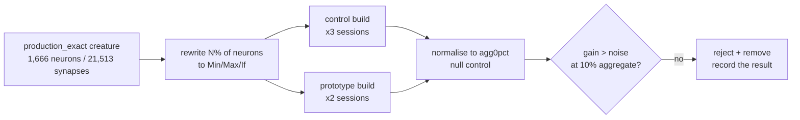

## Summary

Prototyped bounds-check removal in the `Minimum`, `Maximum` and `If` aggregate
inference kernels, measured it at production scale, and **rejected it**. The
acceptance gate in the issue was not met, so the prototype was reverted — this
PR ships the recorded result, not an optimisation. Closes #510.

**A negative result is a successful research result**, and the issue's stated
deliverable was the record ("Written positive, neutral or negative conclusion",
"Prototype removed unless the acceptance gate is met"). No library source file
is changed by this PR.

### Headline numbers

At the production-realistic ~10% aggregate frequency the prototype measured
**−1.3% to −4.8%** end-to-end, against a **19–40%** session noise floor on the
benchmark host. The 15–38% gains it does show appear only at 50–100% aggregate
frequency — synthetic fixtures the gate explicitly excludes.

An isolated A/B against *safe* attribution controls showed the little that was
there does not come from bounds-check removal at all: rewriting
`synapses[start + i]` as a validated span-slice walk recovers most of it with no
`unsafe`.

### The larger finding

The sweep surfaced something worth far more than the lever under test: because
`score_batch_into` dispatches on `has_aggregate_squash()`, **one** aggregate
neuron costs the whole creature the record-interleaved fast path — 35.8 ms →
85.9 ms per 4,096-record shard, a **2.4×** cost at 10% aggregates. Filed as
stSoftwareAU/NEAT-AI-core#514.

## Evidence

Backend/library work — no web interface to screenshot. The evidence is benchmark
data plus the parity tests listed below.

### Measurement method

Raw before/after numbers were unusable on this host: whole sessions drift by up
to 40%. The `agg0pct` configuration contains no aggregate neuron, so the
prototype build runs byte-identical work there — its measured delta *is* the
noise floor, and every figure below is normalised within its own session against
it before the builds are compared.

### End-to-end, production-sized creature

Median of 3 control vs 2 prototype sessions, each normalised to its session's
null control:

| Group | Aggregate frequency | Control | Prototype | Normalised delta |
| --- | --- | --- | --- | --- |
| `aggregate_forward_pass` | **10% (production)** | 25.60 µs | 29.87 µs | **−3.4%** |
| `aggregate_forward_pass` | 100% (synthetic) | 36.83 µs | 29.10 µs | −37.6% |
| `aggregate_traced` | **10% (production)** | 27.71 µs | 33.57 µs | **−4.8%** |
| `aggregate_traced` | 100% (synthetic) | 43.81 µs | 46.04 µs | −17.3% |
| `aggregate_scoring` (4,096 records) | **10% (production)** | 85.88 ms | 88.82 ms | **−1.3%** |
| `aggregate_scoring` | 100% (synthetic) | 173.24 ms | 132.30 ms | −19.7% |

Noise floor from the null control alone: forward 39.6%, traced 31.7%, scoring
19.4%.

### Isolated kernels — attribution

| Kernel | `safe` (shipped) | safe attribution control | `unchecked` |
| --- | --- | --- | --- |
| forward `Minimum` | 17.55 µs | 16.69 µs | 16.45 µs |
| forward `If` | 39.88 µs | 36.60 µs | 40.82 µs *(slower)* |
| traced `Minimum` | 22.77 µs | 18.63 µs | 16.69 µs |
| traced `Maximum` | 24.87 µs | 17.87 µs | 17.70 µs |

The safe control captures most of the traced gain; the unchecked gather adds a
few percent, inside noise, and reverses sign on `If`.

Full record, including host/toolchain metadata, aggregate-frequency sourcing,
the gate-by-gate verdict and the cause analysis:
[`docs/research/aggregate-unchecked-kernels-2026-08-05.md`](../../research/aggregate-unchecked-kernels-2026-08-05.md).

### Parity and safety (prototype, before removal)

All ten parity tests passed against the prototype: forward and traced kernels
bit-identical to the checked reference over a 48-neuron all-aggregate network,
winning-index tie-breaking preserved, empty spans returning bias, non-prototyped
squashes untouched, a malformed synapse span still panicking rather than reading
out of bounds, and `CompiledNetwork::new` still rejecting an out-of-range
`from_index` with `InvalidSynapseIndex`. The prototype commit (`107633a`) is
retained in this branch's history for anyone re-running the experiment.

## What this PR changes

| File | Change |
| --- | --- |
| `docs/research/aggregate-unchecked-kernels-2026-08-05.md` | the result record (new) |
| `neat-core/benches/aggregate_frequency.rs` | aggregate-frequency sweep (new bench target) |
| `neat-core/benches/common/mod.rs` | `with_aggregates` / `aggregate_count` fixture helpers |
| `neat-core/benches/README.md` | new target documented; two "levers learned" entries so this is not re-attempted |
| `neat-core/Cargo.toml` | `[[bench]] aggregate_frequency` |
| `neat-core/tests/bench_fixtures.rs` | tests for the new fixture helpers |

The benchmark is kept deliberately: the committed `production*` fixtures are
homogeneous `Tanh` (0% aggregate), so it is the only fixture that puts aggregate
neurons in a production-sized creature, and it is what #514 is reproducible
from. It is `harness = false` and opt-in, so CI runtime is unaffected.

## Test Plan

Added to `neat-core/tests/bench_fixtures.rs` (these run in `cargo test`, not
just the bench):

- `aggregate_rewrite_hits_the_requested_frequency` — 0/10/50/100% produce
  0/167/833/1666 aggregate neurons on `production_exact`.
- `aggregate_rewrite_leaves_topology_and_weights_untouched` — every synapse
  source and weight, and every neuron span, fan-in and bias, is bit-identical to
  the un-rewritten network, so aggregate frequency is genuinely the only swept
  variable.
- `rewritten_if_neurons_carry_a_condition_synapse` — a rewritten `If` neuron
  always has a condition synapse, otherwise the `If` positive branch would never
  be exercised.

`./quality.sh` passes clean (fmt, clippy `-D warnings` with `--all-targets
--all-features`, `cargo deny`, full test suite, docs, release build).
