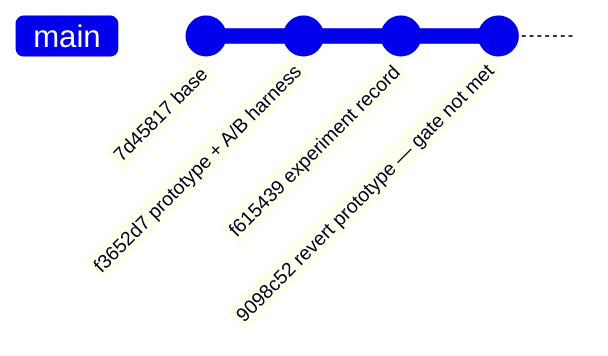

# Prototype validated exact-size inference entry point (Issue #511)

## Summary

Ran the Issue #511 experiment end to end and recorded a **neutral result**: the
validated exact-size inference entry point was prototyped, measured on a
production-sized creature on both native and wasm, failed the acceptance gate,
and was removed. The only surviving change is the experiment record,
`docs/research/exact-size-inference-entry-point.md`. Closes #511.

The prototype (`activate_into_exact` + an internal `activate_into_validated`
hot path, typed `InputLengthMismatch` / `OutputLengthMismatch` errors, parity
and dimension-error tests, a Criterion A/B bench and a wasm-bench arm) is
preserved in the branch history at commit `f3652d7` and reverted by `9098c52`,
exactly as Issue #510 handled its prototype.

## Evidence

**This is a performance experiment with no web interface.** The evidence is
benchmark and codegen data, reproduced in full in
`docs/research/exact-size-inference-entry-point.md`.

### Codegen — nothing was elided (native release, aarch64, `codegen-units=1`)

| | `activate_into` (control) | `activate_into_exact` (prototype) |
| --- | ---: | ---: |
| Instructions in the function body | 1,268 | **1,305** (+37) |
| `panic_bounds_check` call sites | 12 | **12** |
| `slice_index_fail` call sites | 2 | **2** |
| `libneat_core.rlib` | 3,478,512 B | 3,511,560 B (**+0.95%**) |
| `wasm` module | 672,497 B | 682,819 B (**+1.5%**) |

The control's `min` is a single branchless `csel`; the prototype does not even
remove it, because the destination-slice bound is still checked and two
validation branches are added in front.

### Native, production-sized end-to-end (4,096 × 2,461-f32 records per iteration)

Eight sessions, median ms/iteration — `control_b` runs **byte-identical** code
to `control`:

| | `control` | `exact` | `control_b` (null) |
| --- | ---: | ---: | ---: |
| Median | 201.34 | 197.61 | 198.43 |
| Records/s | 20,344 | 20,728 | 20,642 |

The two identical-code arms varied by 0.79–1.94× per session (session 4: 182.62
ms vs 94.40 ms in the same process), so this host cannot resolve the effect.

### WASM paired A/B (Issue #509 interleaved driver, `production_exact`, 4,096 records)

Paired median ratio, prototype ÷ control (<1 = prototype faster). `score` /
`kernel` are unaffected by the switch and are in-run null controls:

| Run | `activate` (differs) | `score` (null) |
| --- | ---: | ---: |
| Real A/B ×3 runs | 0.9981 / 0.9924 / 1.0014 | 1.0000 / 0.9982 / 1.0649 |
| Null A/B (control vs control) ×3 runs | 1.0014 / 1.0009 / 1.0024 | 1.0002 / 0.9848 / 0.9894 |

Best estimate after subtracting the identical-code baseline: **≈0.3% faster**,
smaller than the ~1% swing between runs of the same comparison. Checksums were
bit-identical in every run.

### Why the gate fails

| Gate condition | Outcome |
| --- | --- |
| Production-sized throughput improves above noise | ❌ ≤0.3% wasm; unresolvable natively |
| Repeatable | ❌ 0.9924 / 0.9981 / 1.0014 across identical comparisons |
| Contract acceptable to real callers | ❌ `packed_record_scan` / `load_record` support records narrower than `num_inputs` |
| Numerical parity, tests pass | ✅ bit-identical, native and wasm |
| Error handling clearer | ✅ typed errors instead of silent truncation — but no perf follows |
| No target materially regresses | ⚠️ +0.95% native, +1.5% wasm binary |

### Split out, not merged

The experiment surfaced a genuine semantic asymmetry — `activate_into` never
zero-fills, so a narrower follow-up call keeps the previous call's inputs, while
`load_record` (which claims to match it) does zero-fill. As Issue #511 directs,
that is **not** counted as performance evidence and is filed separately as
[#519](https://github.com/stSoftwareAU/NEAT-AI-core/issues/519).

## Test Plan

Tests were written for the prototype and ran green before it was reverted
(commit `f3652d7`, `neat-core/tests/exact_inference.rs`, 9 tests):

- `exact_entry_point_matches_control_bit_for_bit` — parity with `activate_into`
  across standard, aggregate and vectorised-aggregate squashes and three output
  widths;
- `exact_entry_point_matches_control_across_repeated_calls` — parity over a
  sequence, so reused-buffer state cannot drift between the paths;
- `constant_neurons_activate_identically_through_both_paths`;
- `short_input_is_rejected_instead_of_truncated`,
  `long_input_is_rejected_instead_of_truncated`,
  `empty_and_oversized_output_buffers_are_rejected` — the dimension-error
  contract;
- `a_rejected_call_leaves_network_and_buffers_untouched`;
- `control_keeps_stale_inputs_where_exact_entry_point_rejects_the_call` — the
  finding now tracked as #519;
- `dimension_errors_describe_the_mismatch`.

The merged tree contains documentation only, so the existing suite is unchanged:
`./quality.sh` passes (`cargo test --workspace --lib --tests --all-features`,
clippy `-D warnings`, fmt, deny, docs, release build).
