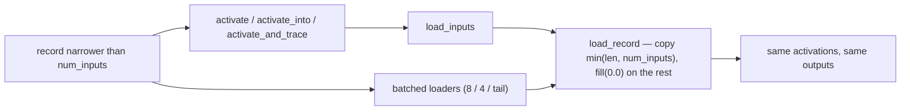

# Zero-fill uncovered input slots in the single-record entry points (Issue #519)

## Summary

`CompiledNetwork::activate`, `activate_into` and `activate_and_trace` copied
`min(input.len(), num_inputs)` values into the reused activation buffer and
stopped. Because that buffer lives on the network across calls, a record
narrower than `num_inputs` silently scored against the **previous** call's
values in every slot it did not cover — and disagreed with the batched path,
where `load_record` (`batch_scoring.rs`, Issue #445) has always zeroed the
uncovered tail. Narrower-than-`num_inputs` records are explicitly supported
(`packed_record_scan` takes a caller-supplied `input_size`), so the two paths
were scoring the same record differently.

All three entry points now route their input copy through `load_record` — the
single home of the clamp-and-zero loading rule — via a private `load_inputs`
helper. Only the *loading* is shared; the activation rule itself stays inlined
in those hot entry points for the Issue #441 performance reason. Full-width
production records are unaffected: the fill covers an empty tail.

Closes #519.

## Evidence

This is a library/CLI change with no web interface, so there is no screenshot.
The evidence is the new test file plus the existing suite and the forward-pass
benchmark.

Before this change the single-record path and the batched loaders diverged for a
short record; now both zero the uncovered slots:

Failing-before / passing-after, `cargo test --test short_input_zero_fill`:

- before the fix: 5 of 6 tests failed (e.g. `activate_into/identity: warmed vs
  fresh: output 0 was -0.8970501, expected -0.12529999`)
- after the fix: 6 passed

`./quality.sh` passes cleanly (fmt, clippy, deny, full workspace tests, doc
build, release build), and `cargo check -p neat-core --target
wasm32-unknown-unknown` succeeds.

### Forward-pass benchmark

AGENTS.md asks for `cargo bench --bench hot_paths -- forward_pass` whenever the
single-record entry points are touched. Full-width production records make the
added fill zero-length, so no change is expected — and none is measurable. Both
arms were run back to back on the same host (fixed first, then the pre-fix
sources restored from `HEAD~1`):

| Benchmark | Fixed (median) | Pre-fix (median) | Criterion verdict |
| --- | --- | --- | --- |
| `forward_pass/production` | 34.10 µs | 70.94 µs | "regressed" (p < 0.05) |
| `forward_pass/production_2x` | 69.90 µs | 68.48 µs | no change (p = 0.53) |
| `forward_pass/production_exact` | 41.73 µs | 39.21 µs | no change (p = 0.76) |
| `forward_pass/large_5000` | — | −24.9% | "improved" (p = 0.01) |

The verdicts contradict each other in both directions — the *unmodified* code
measures 2× slower on one fixture and 25% faster on another — which reproduces
the host-noise finding already recorded in
`docs/research/exact-size-inference-entry-point.md` ("a 0.79–1.94× spread on
identical code; nothing below ~20% is decidable there"). The committed
`benches/BASELINE.md` figure for `forward_pass/production` is 32.76 µs, which the
fixed build's 34.10 µs sits alongside. This is therefore a no-regression check
on a noisy shared host, not a performance claim in either direction; the change
adds one `fill` over an empty tail for full-width records.

## Test Plan

New file `neat-core/tests/short_input_zero_fill.rs` — every test runs across
three hidden-squash arms (Identity, Tanh, and the Mean aggregate, which takes
the exact single-record kernel):

- `activate_into_scores_a_narrow_record_without_the_previous_calls_inputs` —
  the reproduction from the issue: full-width call, then a narrow call, must
  match a freshly loaded network's answer for the same narrow record.
- `activate_scores_a_narrow_record_without_the_previous_calls_inputs` — same for
  `activate`.
- `activate_and_trace_scores_a_narrow_record_without_the_previous_calls_inputs`
  — same for `activate_and_trace`.
- `a_narrow_record_matches_its_zero_padded_full_width_form` — pins the contract
  that wins: uncovered slots read as zero.
- `single_record_entry_points_match_the_batched_loader_for_a_narrow_record` —
  the parity test the issue asked for, against `score_records_flat` with a
  stride narrower than `num_inputs`.
- `a_full_width_record_is_unaffected_by_the_zero_fill` — the common production
  case is unchanged.
