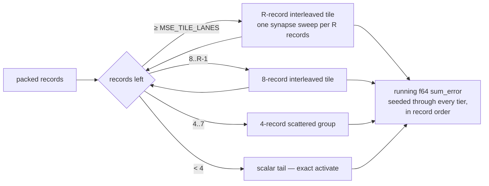

# Widen the fused-MSE record tile to a tunable `MSE_TILE_LANES` (Issue #530)

## Summary

The fused MSE forward pass (`mse_sum_batch_packed` → `mse_sum_batch_8way` →
the #287 record-interleaved gather) processed records in groups of **8**, so the
network's entire synapse array was re-streamed once per eight records. On the
production creature that array is ~172 KB (21,513 × 8 B `SynapseData`) and the
8-lane `mse_inter` is ~132 KB — together well past an Apple M4 performance
core's 128 KB L1D, so every group re-fetched the synapses from L2.

This makes the tile width a single constant, `loss::MSE_TILE_LANES` (**32**),
gathered by const-generic kernels — `R / 8` `__m256` accumulators on AVX2,
`R / 4` `float32x4` on NEON, contiguous `f32x4` quads on wasm `simd128`, scalar
elsewhere. Per-record synapse traffic falls by `R / 8`.

Two supporting changes turned out to be load-bearing, and both are pinned by
tests:

- **The tile transpose walks input-major.** A neuron's `R` lanes go to
  consecutive `mse_inter` slots, so the scratch buffer is filled by one linear
  sweep. The original lane-major order revisits the whole `num_inputs * R`
  region once per lane, which stops fitting in L1 as `R` grows and would have
  eaten most of the gain.
- **`interleaved_tile_mse` is seed-taking** — it takes the running `f64`
  `sum_error` and returns it, like the SIMD tail helpers in
  `simd::scalar` (Issue #447). Returning a per-tile partial sum re-associates
  the reduction; that was caught during development as a 12-ULP parity failure
  at n = 4096, which is exactly what the oracle is for.

Numerics are unchanged at **every** tile width: each lane accumulates its own
`bias + Σ w·a` in synapse order independently of the other lanes, and every tier
reduces into `sum_error` in strict record order. The `< R` remainder steps down
whole 8-record interleaved tiles, then the unchanged 4-way and scalar tiers.

The batched **scoring** lane (`score_records_flat` → `BatchScratch::inter`)
is deliberately untouched and stays at 8 lanes — this issue scopes the fused MSE
loss path only.

Closes #530.

## Evidence

### Benchmark — this is a performance change

`cargo bench --bench hot_paths -- mse_sum_production/production_exact`
(4,096 records per iteration, the exact committed production topology: 2,461
inputs, 1,666 non-input neurons, 21,513 synapses).

**Method.** 5 interleaved A/B rounds; each round rebuilds and runs every arm
back to back so thermal drift hits all arms alike. `base` is the pre-change code
run from a separate `git worktree` at the parent commit; the `R = 8/16/32/64`
arms are this branch with only `MSE_TILE_LANES` changed — one constant apart, as
the issue asks. Apple M4 (10 cores), rustc 1.97.1, `--release`, quiet host.
**Medians:**

| arm | n | median | min | max | vs `base` |
| --- | ---: | ---: | ---: | ---: | ---: |
| `base` (pre-#530, 8-record groups) | 6 | 21.343 ms | 19.877 | 21.819 | — |
| `MSE_TILE_LANES = 8` | 6 | 17.994 ms | 16.978 | 19.127 | **−15.7%** |
| `MSE_TILE_LANES = 16` | 6 | 14.468 ms | 13.659 | 15.281 | **−32.2%** |
| **`MSE_TILE_LANES = 32` (shipped)** | 5 | **11.558 ms** | 10.252 | 12.152 | **−45.8%** |
| `MSE_TILE_LANES = 64` | 5 | 12.728 ms | 12.130 | 13.496 | −40.4% |

**The arms do not overlap at all** — `R = 32`'s worst round (12.152 ms) beats
`base`'s best (19.877 ms) and `R = 8`'s best (16.978 ms) — so the ordering does
not rest on the medians alone. Against the same-code `R = 8` arm, `R = 32` is
**−35.8%**.

The issue's bar was a reproducible **≥1–2%** median gain with the change staying
minor; the measured **−45.8%** clears it by more than an order of magnitude.

**Where the curve turns.** `R = 64` gives back ~10% against `R = 32`:
`mse_inter` reaches ~1 MB on this creature and the NEON kernel needs 16 live
accumulators, so capacity and register pressure both bite. 32 is the shipped
default. The `R = 8` row also shows the input-major transpose is worth ~15% on
its own, before any tile widening.

> **Scope caveat.** The issue's acceptance gate names the *production* fixture
> in NEAT-AI-scorer — N ≈ 50 distinct creature variants over the ≈22 GiB
> multi-file corpus in directory mode. Neither the 3 MB production
> `network.json` nor the corpus is available in this repo (`BASELINE.md`,
> "Bench-only baseline"), so that end-to-end A/B cannot run here. What is
> measured above is the exact kernel the issue targets, on the committed
> `production_exact` topology at production record volume, which is the
> closest reproducible proxy this repo has. The scorer-side confirmation on the
> full corpus remains the human-run gate before the wall-clock claim is made
> there.

### Memory

`mse_inter` is `num_neurons * MSE_TILE_LANES * 4` bytes **per compiled
network** — ~132 KB at 8 lanes, **~528 KB at 32**, ~1 MB at 64 on the
~4,127-neuron production creature. Directory scoring holds one compiled network
per worker, so at N = 50 workers the shipped width costs ~26 MB of scratch.
That figure is documented in `README.md`, on the constant itself, and in
`BASELINE.md` so it can be budgeted against the scorer's worker-count RAM
ceiling before anyone raises the constant.

### Mutation evidence — the tests can fail

Per AGENTS.md rule 2, each mutation was applied alone and reverted afterwards.
`cargo test -p neat-core --lib interleaved_mse_parity` (4 tests):

| # | mutation | result |
| --- | --- | --- |
| M1 | `interleaved_tile_mse` returns a per-tile partial sum instead of taking the running seed | **3 of 4 red** |
| M2 | tile transpose drops the lane offset (`base_idx + l` → `base_idx`) | **3 of 4 red** |
| M3 | `< R` remainder skips the whole 8-record interleaved tier | **2 of 4 red** |
| M4 | NEON kernel accumulates `R / 8` quads instead of `R / 4` (upper lanes never FMA'd) | **3 of 4 red** |
| M5 | forward pass strides output lanes by `SCORING_LANES` instead of `R` | **2 of 4 red** |
| — | all mutations reverted | **4 of 4 green** |

M3 and M5 kill only the wide-tile tests, which is correct: both mutations are
no-ops when `R == SCORING_LANES`, and that is precisely the blind spot the new
`every_tile_width_is_bit_identical_to_scattered` test exists to cover. M1 is not
hypothetical — it is the bug this suite actually caught during development.

The oracle is independent per AGENTS.md rule 1: `mse_sum_batch_scattered`
reaches the same value through the per-lane scattered kernels driven by the
shared 8 → 4 → 1 skeleton, sharing no code with the interleaved tile path, so a
fault in the tiled kernel moves only one side of the assertion. Because the
paths are genuinely bit-identical the assertion is `f64::to_bits` equality, not
a tolerance.

### Architecture

### No UI

This is a backend SIMD/loss-kernel change with no web interface, so there is no
screenshot. It was verified by the test suite, the mutation sweep above, the
benchmark A/B, `./quality.sh` (green), and
`cargo check -p neat-core --target wasm32-unknown-unknown` — the manual gate
AGENTS.md requires, since no PR job compiles the `wasm32` half of this hot path
and this change edits it.

## Test Plan

Added to `loss::interleaved_mse_parity` (`neat-core/src/loss.rs`):

- `every_tile_width_is_bit_identical_to_scattered` — **new.** Asserts tiles of
  16, 32 and 64 are `f64::to_bits`-identical to the independent scattered oracle
  across 15 record counts and 7 squash types. This is the guard that makes
  `MSE_TILE_LANES` a free knob.
- `shipped_tile_width_is_a_supported_multiple_of_eight` — **new.** States the
  contract on the shipped constant (multiple of 8, within
  `simd::MAX_INTERLEAVED_LANES`) and runs the same bit-identity sweep at
  whatever width is actually shipped, so flipping the constant cannot ship an
  unproven width.
- `interleaved_mse_bit_identical_to_scattered_across_boundaries` — **extended,
  not weakened.** Now parameterised over the tile width and run at 8 lanes, with
  the record-count set grown from 9 to 15 values (adding 31, 32, 33, 40, 64, 71)
  to straddle the wide-tile boundaries the new ladder introduces.

No existing test was removed, commented out, or loosened. The whole workspace
suite (`cargo test --workspace`) and `./quality.sh` pass.

Unchanged tests that keep the surrounding contracts honest:
`tests/mse_batch_interleaved_parity.rs` (public entry point vs the scalar
single-record reference), `tests/simd_weighted_sums.rs`
(`weighted_sum_interleaved_8` vs the scattered 8-record kernel — the 8-lane
alias is retained precisely so this public-API guard still applies), and
`loss::interleaved_mse_parity::aggregate_dispatch_stays_on_scattered_path`
(aggregate-squash networks never reach the tiled gather).

## Documentation

- `README.md` — new "Fused-MSE record tile" section: the constant, its bounds,
  the per-network memory cost, the bit-identity guarantee, and a Mermaid diagram
  of the tier ladder.
- `neat-core/benches/BASELINE.md` — full methodology and the A/B table above.
- `AGENTS.md` — the Issue #445 "one batched record-scan skeleton" section now
  records the tunable tile and the two load-bearing invariants (seed-taking
  reduction, input-major transpose), so a future edit does not silently
  reintroduce M1 or the lane-major transpose.

## Security self-check

- No new external input surface: `MSE_TILE_LANES` is a compile-time constant,
  and its bounds (non-zero multiple of 8, `≤ MAX_INTERLEAVED_LANES`) are
  enforced by a `const` assertion that fails the **build**, not at runtime.
- The widened `get_unchecked` / `_mm256_loadu_ps` / `vld1q_f32` reads rest on
  the same load-time invariant as before — `CompiledNetwork::new` rejects any
  `from_index >= num_neurons`, so `from_index * R + R <= inter.len()` holds for
  every supported `R`. Each `unsafe` block carries a `// SAFETY:` note naming
  the `is_*_feature_detected!` guard, per the AGENTS.md SIMD rules.
- No secrets, no new dependencies, no new shell/SQL/HTTP call sites, no
  user-facing error strings changed.
