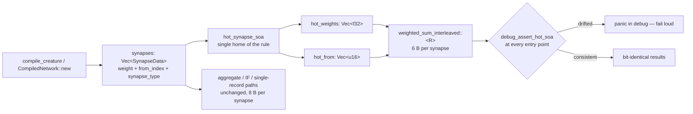

# Struct-of-arrays hot synapse fields for the interleaved gather (Issue #533)

## Summary

The record-interleaved gather reads only two of `SynapseData`'s three fields —
`weight` and `from_index` — but streams all 8 bytes of the struct. This adds a
parallel **struct-of-arrays** view, `CompiledNetwork::hot_weights: Vec<f32>` and
`hot_from: Vec<u16>`, built by the new `hot_synapse_soa` at every construction
path, and points `weighted_sum_interleaved::<R>` (scalar / AVX2 / NEON / wasm
`simd128`) at those two slices. The hot loop's synapse stream drops from **8 B
to 6 B** per synapse and the prefetcher gets two clean sequential streams over
`start..end`.

The change is **additive**: `synapse_type` stays on `SynapseData`, so
`neuron_activation_scalar`, the aggregate/IF paths, the per-lane scattered
kernels, the single-record forward passes and the binary format are all
untouched. Numerics are bit-identical — the same values accumulate in the same
order.

The redundancy is the correctness hazard the issue calls out, so
`CompiledNetwork::debug_assert_hot_soa` guards every interleaved entry point: a
network whose hot view has drifted from `synapses` panics in debug and test
builds rather than silently scoring wrong numbers, and compiles away entirely in
release.

Closes #533.

### Breaking change

Marked with a `perf(network)!:` Conventional Commit and a `BREAKING CHANGE:`
footer, so the `version-increment` job bumps the **minor** per `RELEASING.md`:

- `simd::weighted_sum_interleaved` / `weighted_sum_interleaved_8` now take
  `hot_weights: &[f32], hot_from: &[u16]` instead of `&[SynapseData]`.
- `CompiledNetwork` gains two public fields, so struct-literal construction must
  supply them. `hot_synapse_soa` is exported from the crate root for exactly
  that (the test and bench fixtures use it). Consumers that build networks
  through `CompiledNetwork::new` or `compile_creature` — the normal route — need
  no change.

## Evidence

### Benchmark — this is a performance change

`cargo bench --bench hot_paths` on the committed `production_exact` topology
(2,461 inputs, 1,666 non-input neurons, 21,513 synapses; 4,096 records per
iteration). `base` is the parent commit run from a separate `git worktree`;
`after` is this branch.

**Method.** 24 **ABBA** pairs per group — each round runs `base, after, after,
base` so the two arms bracket each other and thermal/load drift cancels within
the round — with criterion `--warm-up-time 1 --measurement-time 3 --sample-size
20`. Each arm's round score is the mean of its two runs. Apple M4 Pro
(12 cores), rustc 1.97.1, `--release`.

| group | base median | after median | Δ median | paired Δ (mean ± SE) | rounds favouring `after` |
| --- | ---: | ---: | ---: | ---: | ---: |
| `mse_sum_production/production_exact` | 15.566 ms | 15.412 ms | **−0.99%** | −1.12% ± 0.72 | 18 / 24 |
| `scoring/production_exact` | 24.621 ms | 24.061 ms | **−2.28%** | −1.02% ± 0.71 | 17 / 24 |

**Read the sign, not the magnitude.** The host was **not quiet** — an unrelated
process held the load average near 15 on a 12-core machine, so round-to-round
noise is ~3.5% and neither group's mean clears its own standard error. What does
clear is the direction: **35 of 48** paired rounds favour `after`, a two-sided
sign test p ≈ 0.002, and symmetric noise cannot produce that. The honest reading
is a real gain of roughly **1–2%** — at the low end of the issue's ≥1–2% bar,
not the 3–8% it hoped for.

**Why the upside shrank.** The issue's L1-residency argument was written against
the pre-#530 world: 21,513 synapses × 8 B = 168 KB against an M4 core's 128 KB
L1D, with an 8-lane `mse_inter` of 132 KB, so 6 B/synapse would have flipped the
array into L1. At the shipped `MSE_TILE_LANES = 32` that framing no longer
holds — `mse_inter` is ~528 KB and never L1-resident, and each synapse drives
`R = 32` lanes (128 B of gather traffic) against its own 8 B, so trimming 2 B
removes ~1.5% of the loop's bytes rather than crossing a capacity threshold. The
8-lane `scoring` group, where the ratio is 8 B against 32 B, is the
better-placed of the two and shows the larger median — which is why both groups
were measured rather than just the one the issue names.

> **Scope caveat** (same as `pr-summary-530.md`). The issue's acceptance gate
> names the *production* fixture in NEAT-AI-scorer — N ≈ 50 distinct creature
> variants over the ≈22 GiB multi-file corpus in directory mode. Neither the
> 3 MB production `network.json` nor the corpus is available in this repo
> (`BASELINE.md`, "Bench-only baseline"), so that end-to-end A/B cannot run
> here. What is measured above is the exact kernel the issue targets, at
> production record volume, on the closest reproducible proxy this repo has.
> The scorer-side confirmation on the full corpus remains the human-run gate
> before the wall-clock claim is made there — and given the measured margin sits
> at the bar rather than above it, that confirmation matters more than usual.

### Memory

`hot_weights` + `hot_from` cost **+6 B per synapse per compiled network** —
~126 KB on the production creature, ~6 MB across a 50-strong population, since
`CompiledNetwork: Clone` means directory-mode scoring clones them once per
worker. Documented in `README.md` and `benches/BASELINE.md`.

### No UI to screenshot

This is a library-internal performance change with no web interface. The
evidence is the benchmark table above plus the test results below.

### Mutation evidence — the tests can fail

Per AGENTS.md rule 2, each mutation was applied alone and reverted afterwards.
Suites: `hot_synapse_soa`, `mse_batch_interleaved_parity`,
`interleaved_scoring_parity`.

| # | mutation | result |
| --- | --- | --- |
| M1 | `hot_synapse_soa` builds the arrays in reverse order | **5 of 7 red** |
| M2 | `compile_creature` builds the SoA from an empty slice | **3 of 7 red** |
| M3 | `CompiledNetwork::new` drops the last synapse from the SoA | **3 of 7 red** |
| M4 | NEON kernel reads `hot_from[start]` for every synapse (source slip) | **1 of 7 red** (`interleaved_scoring_matches_the_single_record_reference`) |
| M5 | drop `debug_assert_hot_soa` from the MSE interleaved entry point | **1 of 7 red** (the fail-loud guard test) |
| — | all mutations reverted | **all suites green** |

M4 is caught only by the parity test, which is correct — a source slip does not
change the SoA arrays themselves, only the numbers they produce, which is
exactly why the suite carries an independent oracle as well as the structural
assertions.

The oracle is independent per AGENTS.md rule 1:
`interleaved_scoring_matches_the_single_record_reference` scores each record on
its own through the scalar `CompiledNetwork::activate` forward pass, which never
reads `hot_weights` or `hot_from`, so a fault in the gather moves only one side
of the assertion.

### Architecture

## Test Plan

New suite `neat-core/tests/hot_synapse_soa.rs` (7 tests):

- `compile_creature_builds_a_hot_view_matching_every_synapse` — the JSON
  construction path, asserted element-for-element **and** against the fixture's
  actual asymmetric weights/sources, so a zeroed or sorted copy fails.
- `binary_deserialiser_builds_a_hot_view_matching_every_synapse` — the same for
  `CompiledNetwork::new` over a hand-serialised `.bin` buffer.
- `cloning_a_network_preserves_the_hot_view` — `Clone` is on the directory-mode
  path, one network per worker.
- `both_construction_paths_agree_on_the_hot_view` — the JSON and binary routes
  describe one topology and must produce one hot view; this is what stops the
  two construction paths drifting apart.
- `hot_synapse_soa_preserves_order_and_handles_an_empty_array` — empty input,
  plus repeated sources and a repeated weight that a de-duplicating or sorting
  implementation would collapse.
- `interleaved_scoring_matches_the_single_record_reference` — the independent
  oracle, over record counts 1 / 5 / 8 / 33 / 70 straddling the scalar, 4-way,
  8-record and 32-record interleaved tiers.
- `a_drifted_hot_view_fails_loud_instead_of_scoring_wrong_numbers` — mutating
  `synapses[0].weight` without rebuilding the view must panic, not score.

Existing suites carried through unchanged (fixtures updated to supply the two
new fields via `hot_synapse_soa`): `mse_batch_interleaved_parity`,
`interleaved_scoring_parity`, `flat_record_scoring_parity`,
`score_squash_simd_parity`, `mse_squash_simd_parity`, `simd_weighted_sums`,
`aggregate_squash_set`, `aggregate_squash_tail_parity`,
`batch_record_skeleton`, `packed_record_scan`, `inline_squash_dispatch`,
`network_activate_trace_batch`, `short_input_zero_fill`. No test was commented
out, skipped, or weakened.

`./quality.sh` passes (fmt, clippy `-D warnings`, `cargo deny`, full workspace
tests, doc build, release build). `cargo check -p neat-core --target
wasm32-unknown-unknown` passes — required by AGENTS.md because no PR gate
compiles the wasm half of `simd.rs`, which this change edits.

### Security self-check

- No new external input surface: `hot_synapse_soa` reads an in-memory slice the
  loader has already validated.
- The load-time `from_index < num_neurons` guard in `CompiledNetwork::new`
  (Issue #207) is unchanged and still the soundness precondition for the
  kernels' `get_unchecked`; the new `unsafe` reads of `hot_weights` / `hot_from`
  are bounded by the same `start..end` span as the `synapses` reads they
  replace, and carry `SAFETY:` notes saying so.
- No secrets, no new dependencies, no shell/SQL/HTTP surface.
