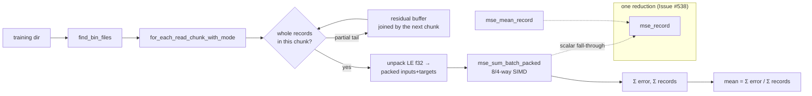

# Streaming directory MSE helper + exported per-record MSE reduction (Issue #538)

## Summary

`neat-core` owned the MSE maths but not the loop around it, so every consumer
that scored a `.bin` **directory** re-implemented the streaming walk — and two
of them re-implemented the squared-error reduction itself. Neither
`mse_sum_batch_packed` nor `mse_mean_record` could be reused, because both take
an in-memory packed `&[f32]`.

Two additive, non-breaking public items in `neat-core/src/loss.rs`, both
re-exported from `lib.rs`:

- **`mse_record(targets, outputs) -> f64`** — the per-record reduction: the mean
  over outputs of `(target - output)^2`, accumulated in `f64`. This is what a
  backpropagation trace pass calls when it already holds the activations.
  `mse_sum_batch_packed`'s scalar `packed_record_scan` closure and
  `mse_mean_record`'s closure — the same maths written twice — now delegate to
  it. The SIMD tiles (`interleaved_tile_mse`, `mse_sum_batch_scattered`) are
  **untouched**: they read strided/interleaved buffers and are
  bit-parity-critical.
- **`mse_mean_streaming(network, dir, input_size, num_outputs, forward_only,
  max_records) -> Result<(f64, u64), String>`** — the chunk → packed-buffer →
  fused-MSE loop over a `.bin` directory, buffering records out of
  `for_each_read_chunk_with_mode` chunks and handing each batch to
  `mse_sum_batch_packed`, so the SIMD 8/4-way fast path carries the work. A
  record straddling a chunk or shard boundary is held in a residual buffer.
  `max_records` truncates the batch at the cap rather than throttling the
  reader, so the cap costs no extra I/O. The signature is deliberately general
  (explicit `input_size` / `num_outputs` / `forward_only`) rather than
  creature-shaped, so NEAT-AI-scorer's `stream_score.rs` can converge on it
  later.

Bit-parity detail: `mse_record` scales by the **reciprocal** of the output count
(`sq_sum * inv_outputs`), exactly as the closures it replaces did — not
`sq_sum / n`, which rounds differently. The existing bit-parity tests
(`interleaved_mse_parity` and friends) pass unchanged.

Per the issue, the helper stays **out of** the
`#[cfg_attr(target_arch = "wasm32", wasm_bindgen)]` export surface — it is a
native-host convenience — and follows the `training_data.rs` precedent of using
`std::fs` unconditionally. `cargo check -p neat-core --target
wasm32-unknown-unknown` is clean (AGENTS.md: wasm32 is not gated on PRs).

**Fail-loud boundary (guideline #3234).** A path that is not a directory, an
unreadable shard, and a corpus ending mid-record all return `Err` — the same
stance NEAT-AI-scorer already takes on trailing bytes. `(0.0, 0)` is reserved
for a directory that genuinely yields no whole records (empty directory,
zero-length shards, zero-width record, `max_records = Some(0)`); as the issue
specifies, the caller decides whether that is an error.

Additive only — no signature changes to existing public items.

Closes #538.

## Evidence

Backend/library change, no web interface to screenshot. Evidence is the test
suite, the mutation sweep below, and the quality gate.

### Quality gate

`./quality.sh < /dev/null` → **`✅ All quality checks passed!`** (fmt, clippy,
`cargo deny`, `cargo test --workspace` — 44 test binaries green, doc build,
release build). `cargo check -p neat-core --target wasm32-unknown-unknown` also
clean.

### Mutation evidence (AGENTS.md rules 1–3)

Every mutation was applied one at a time and reverted before commit.

| # | Mutation | Result |
| --- | --- | --- |
| M1 | `mse_record` returns `sq_sum` instead of `sq_sum * inv_outputs` | **7 red** — `mse_record_is_the_mean_of_the_squared_differences`, `mse_record_ignores_targets_beyond_the_output_count`, `packed_sum_scalar_path_averages_over_the_output_count`, `mean_record_averages_over_the_output_count`, `streaming_mean_is_stateless_when_not_forward_only`, `streaming_mean_matches_a_per_record_reference`, `streaming_max_records_truncates_to_the_first_n_records` |
| M2 | residual bytes discarded (no straddle carry) | **3 red** — the straddling-shard parity test, the cap test, and the trailing-partial-record test |
| M3 | `max_records` clamp removed | **1 red** — `streaming_max_records_truncates_to_the_first_n_records` |
| M4 | trailing-partial-record error removed | **1 red** — `streaming_mean_fails_loud_on_a_trailing_partial_record` |
| M5 | missing-directory guard removed | **1 red** — `streaming_mean_fails_loud_on_a_missing_directory` |

**Rule 2 — every former site dies.** M1 is the load-bearing one: both closures
that used to hold the reduction now go red through it (site 1
`mse_sum_batch_packed`'s scalar path, site 2 `mse_mean_record`). The two
delegation tests exist because M1 initially killed *neither* former site —
the pre-existing `loss.rs` unit tests all use `num_outputs = 1`, where
`inv_outputs == 1.0` and dropping the factor is invisible. Both new tests use
**two** outputs, so the per-record `1/num_outputs` factor is observable.

**Rule 1 — the acceptance-criteria oracle shares the kernel, so it does not
stand alone.** `streaming_mean_equals_the_packed_sum_over_the_record_count`
compares `mse_mean_streaming` against `mse_sum_batch_packed(...) / N`; both
sides run the same kernel, so under M1 it stayed **green**. The independent
oracle (`reference_mean_mse` — every record scored on its own through
`CompiledNetwork::activate`, with the squared-error reduction written out in
the test) is what caught it. Both are kept: the shared-kernel one because the
issue asks for it, the independent one because it is the assertion that can
actually fail.

**Rule 3 — no vacuous oracles.** Every expected value is derived: `mse_record`
against a hand-worked `4.5 / 4 = 1.125`, and every streaming assertion against
the per-record reference rather than a finiteness or magnitude check.

## Test Plan

New file `neat-core/tests/mse_streaming.rs` (16 tests). Fixture: a 3-input,
2-output forward-only creature with TANH/IDENTITY/LOGISTIC squashes, so the
vectorised and scalar squash paths both carry real work.

**`mse_record`**

- `mse_record_is_the_mean_of_the_squared_differences` — hand-derived `1.125`.
- `mse_record_returns_zero_for_no_outputs` — empty `outputs`, and a non-empty
  `targets` with empty `outputs`.
- `mse_record_ignores_targets_beyond_the_output_count` — extra targets cannot
  inflate the mean (the reduction zips).

**Delegation sites**

- `packed_sum_scalar_path_averages_over_the_output_count` — `forward_only =
  false` keeps `mse_sum_batch_packed` on the scalar closure.
- `mean_record_averages_over_the_output_count` — `mse_mean_record` against the
  independent reference.

**`mse_mean_streaming`**

- `streaming_mean_matches_a_per_record_reference` — 11 records (8-way group,
  4-way remainder and scalar tail) across 66-byte shards against 20-byte
  records, so records straddle shard boundaries and the residual buffer runs.
- `streaming_mean_equals_the_packed_sum_over_the_record_count` — the
  acceptance-criteria parity with `mse_sum_batch_packed(...) / num_records`.
- `streaming_mean_is_stateless_when_not_forward_only` — the `forward_only =
  false` route.
- `streaming_mean_of_an_empty_directory_is_a_silent_zero` — `(0.0, 0)`.
- `streaming_mean_of_empty_shards_is_a_silent_zero` — `(0.0, 0)`.
- `streaming_max_records_truncates_to_the_first_n_records` — caps 1/5/8/13/20
  over 20 records in 46-byte shards, so caps land mid-shard; each equals the
  mean over the first N records.
- `streaming_max_records_above_the_corpus_scores_every_record`.
- `streaming_max_records_of_zero_scores_nothing` — `(0.0, 0)`, no I/O.
- `streaming_mean_fails_loud_on_a_missing_directory` — `Err` naming the path.
- `streaming_mean_fails_loud_on_a_trailing_partial_record` — `Err` naming the
  incomplete record.
- `streaming_mean_of_a_zero_width_record_is_zero` — bytes present but
  `input_size + num_outputs == 0`; the guard fires before any read.

No existing test was modified or removed.

## Documentation

- `README.md` — new "Streaming directory MSE (Issue #538)" section with a usage
  snippet and a Mermaid flow of the chunk → residual → fused-MSE walk.
- `AGENTS.md` — new "One per-record MSE reduction, and one streaming directory
  entry point (Issue #538)" rule, alongside the existing single-home rules: what
  delegates to `mse_record`, why the SIMD tiles must not, the fail-loud
  boundary, and why the shared-kernel oracle cannot stand alone.

## Dependencies

`quality.sh` bumped `wasm-bindgen` 0.2.126 → 0.2.127 and refreshed `Cargo.lock`
(`cc`, `clap`, …), which lands in this PR per the repo's bump policy (#1613).
The full suite, `cargo deny` and the release build are green on the bumped
versions.

## Consumers

NEAT-AI-Backpropagation#30 can now convert both local MSE surfaces —
`mse.rs::compute_mse` onto `mse_mean_streaming`, and
`propagate_layout.rs::accumulate_creature_learning_report` onto `mse_record`.
This change is additive, so its `neat-core.expected-version` gate does not trip
and no baseline change is needed.
