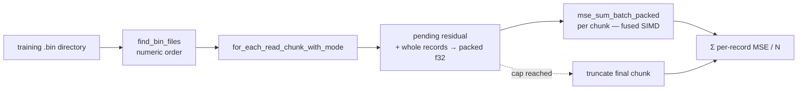

# Streaming directory MSE + exported per-record reduction (Issue #538)

## Summary

`neat-core` owned the MSE maths but not the loop around it, so every consumer
that scored a `.bin` training directory re-implemented the streaming loop — and
some re-implemented the squared-error reduction itself. This adds the two
missing public items to `loss.rs`, both additive:

- **`mse_record(targets, outputs) -> f64`** — the per-record reduction: mean
  over a record's outputs of `(target - output)^2`, accumulated in `f64` from
  the `f32` inputs, `0.0` when `outputs` is empty. The two scalar closures in
  this module (`mse_sum_batch_packed`'s `packed_record_scan` closure and
  `mse_mean_record`'s) were the same maths written twice and now both delegate
  to it. The SIMD tile kernels (`interleaved_tile_mse`,
  `mse_sum_batch_scattered`) are **untouched** — they read strided/interleaved
  buffers and are bit-parity-critical.
- **`mse_mean_streaming(network, dir, input_size, num_outputs, forward_only,
  max_records) -> Result<(f64, u64), String>`** — the streaming directory scan.
  Records are buffered into packed `[inputs…, targets…]` chunks and scored
  through the existing `mse_sum_batch_packed`, so the fused 8/4-way SIMD path
  still does the work; a record straddling a read-chunk or file boundary is
  carried in a residual buffer and scored with the next chunk. `max_records`
  truncates both the file list (files past the cap are never opened) and the
  final chunk.

Both are re-exported from `lib.rs` and both are deliberately **off** the
`#[cfg_attr(target_arch = "wasm32", wasm_bindgen)]` export surface — they are
native-host conveniences, not JS/WASM boundary calls.

No existing signature changed, so this is a patch/minor bump, not a breaking
one. Closes #538.

### Fail-loud boundaries

An empty directory returns `(0.0, 0)` — the silent zero the issue asks for,
leaving that decision to callers. A *malformed* corpus does not get the same
treatment: a path that is not an existing directory, a file that cannot be
listed/stat-ed/opened/read, or a corpus ending mid-record all return `Err`
rather than a plausible-looking mean over whatever was readable.

## Evidence

Backend/library change — no web interface to screenshot. Evidence is the test
suite, the mutation sweep below, and the quality gate.

### Quality gate

- `./quality.sh < /dev/null` → **All quality checks passed** (fmt, clippy
  `-D warnings`, cargo-deny, `cargo test --workspace`, docs, release build).
- `cargo check -p neat-core --target wasm32-unknown-unknown` → clean. Required
  because `loss.rs` compiles for `wasm32` and this change adds `std::path` /
  `std::fs` uses to it; no PR gate builds that target (AGENTS.md, CI section).
- Existing bit-parity tests pass unchanged — `interleaved_mse_parity`,
  `mse_batch_interleaved_parity`, `mse_squash_simd_parity`,
  `packed_record_scan`, `batch_record_skeleton`.

### Mutation evidence (AGENTS.md rule 2)

The refactor collapses two copies of the reduction into one helper, so each
former site was mutated on its own to prove the suite reaches it. All mutations
were reverted before commit (`git diff` clean against the tested code).

| Mutation | Tests that went red |
| --- | --- |
| Site A — `mse_sum_batch_packed`'s scalar closure `+ 0.25` | 15, incl. `mse_scalar_tail_matches_reference_for_every_aggregate_squash`, `every_sum_entry_point_equals_the_sum_of_its_single_record_scans`, `stateless_reset_is_conditional_on_forward_only`, and 3 new streaming tests |
| Site B — `mse_mean_record`'s closure `+ 0.25` | `mse_mean_record_matches_hand_rolled_reference`, `mse_mean_record_agrees_with_sum_divided_by_records_on_forward_only`, `stateless_reset_is_conditional_on_forward_only` |
| Shared — `diff * diff` → `diff * diff * 1.0001` inside `mse_record` | 9, spanning both former sites plus `mse_record_is_the_mean_squared_difference_over_outputs` and `mse_mean_streaming_recurrent_route_matches_the_forward_only_route` |

Both former sites die independently, so neither is a site the suite fails to
reach.

### Oracle independence (AGENTS.md rule 1)

The new streaming tests do **not** rest on `mse_sum_batch_packed` alone. The
primary oracle is the fixture creature's closed form
(`out = 0.5*in0 - 0.3*in1 + 0.1`) evaluated in `f64` in the test file, which
shares no code path with the crate; the `mse_sum_batch_packed(…) / N`
comparison named in the issue's acceptance criteria is kept as a second,
weaker check. Tolerance is `1e-6` — the batched path re-associates its sums and
uses the vectorised squash approximations, so parity is a tolerance, not
bit-exactness.

## Test Plan

New file `neat-core/tests/mse_streaming_directory.rs` (15 tests, all calling
real functions against temp `.bin` directories):

`mse_record`
- `mse_record_is_the_mean_squared_difference_over_outputs` — hand-derived
  expected value (`5.25 / 4 = 1.3125`), not a finiteness assertion.
- `mse_record_returns_zero_for_empty_outputs` — including targets-present /
  outputs-empty.
- `mse_record_squares_the_difference_in_both_directions` — sign must not
  survive the square.

`mse_mean_streaming`
- `mse_mean_streaming_matches_the_independent_closed_form_reference` — 12
  records (crosses the 8-record SIMD group boundary) against the independent
  oracle; asserts the returned count too.
- `mse_mean_streaming_equals_the_packed_sum_divided_by_records` — the issue's
  acceptance criterion.
- `mse_mean_streaming_reads_every_bin_file_in_numeric_order` — three shards.
- `mse_mean_streaming_rejoins_records_straddling_a_chunk_boundary` — shards
  split 5 bytes into a record, so the residual buffer is the only way that
  record is scored at all.
- `mse_mean_streaming_empty_directory_returns_zero_and_no_records` — empty dir,
  and a dir holding only a non-`.bin` file.
- `mse_mean_streaming_max_records_truncates_to_the_first_n` — caps 1/5/8/11
  over 3 shards (the cap lands mid-file), each compared to the oracle mean over
  the first N records.
- `mse_mean_streaming_max_records_above_the_corpus_reads_everything`.
- `mse_mean_streaming_max_records_zero_reads_nothing`.
- `mse_mean_streaming_recurrent_route_matches_the_forward_only_route` —
  `forward_only = false` (reset-per-record, non-fused) agrees with the fused
  route on a stateless creature.
- `mse_mean_streaming_missing_directory_fails_loud` — `Err` naming the path.
- `mse_mean_streaming_trailing_partial_record_fails_loud` — `Err` on a corpus
  truncated 5 bytes short.
- `mse_mean_streaming_zero_width_records_return_zero` — degenerate layout.

Documentation: new **Streaming directory MSE (Issue #538)** section in
`README.md` with a Mermaid flow of the chunk → packed → fused-MSE loop.
