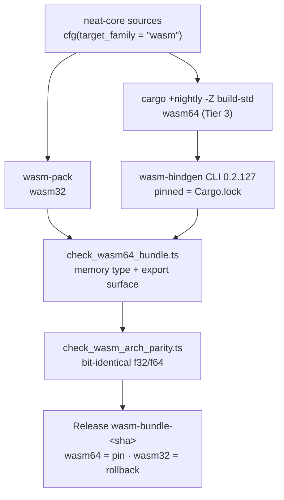

# Ship a production wasm64 (Memory64) activation bundle

## Summary

`neat-core` now builds, gates and **ships** a genuine Memory64
(`(memory i64 …)`) `wasm_activation` bundle through the production
`wasm-bindgen` path — no raw `extern "C"` fallback. Closes #541.

The July 2026 lane (b) NO-GO was **CLI skew, not a permanent gap**: the spike
measured `wasm-bindgen` CLI **0.2.108**, and **0.2.120** added Memory64 codegen
([wasm-bindgen#5004](https://github.com/wasm-bindgen/wasm-bindgen/pull/5004)).
Re-measured **2026-08-14** against CLI **0.2.127** (the version this crate
depends on): the CLI emits the full activation/backprop surface.

What changed:

1. **Every wasm `cfg` widened to the family.** `cfg(target_arch = "wasm32")` →
   `cfg(target_family = "wasm")` across `neat-core/src` and `Cargo.toml`. The
   arch-keyed tables failed in *both* directions on wasm64 at once — dropping
   `wasm-bindgen` (no bindings) while pulling in the native-only `rayon`.
   `neat-core/src/wasm_arch.rs` is the single home of the one genuinely
   arch-shaped split (`core::arch::wasm32` vs `core::arch::wasm64`, the latter
   behind the unstable `simd_wasm64` feature enabled for that arch only).
2. **A wasm64 build lane.** `build-wasm-bundle.sh --arch wasm64` runs
   `cargo +nightly … --target wasm64-unknown-unknown -Z build-std=std,panic_abort`
   then the `wasm-bindgen` CLI. wasm-pack cannot do this: 0.15.0 still hard-codes
   `wasm32-unknown-unknown` as the cargo target it builds and reads back.
3. **Three fail-loud gates.** `scripts/check_wasm64_bundle.ts` (memory index type
   must match `--arch`; the activation/backprop surface must survive into **both**
   the `_bg.wasm` and the glue), `scripts/check_wasm_arch_parity.ts` (bit-exact
   wasm32/wasm64 agreement over a committed fixture), and the existing
   `verify-wasm-bundle.sh` post-publish check, now run per asset.
4. **Dual-ship.** The per-commit Release carries
   `wasm_activation-wasm64-pkg.tar.gz` (the pin new `neatCore.rev` revisions take)
   alongside the unchanged `wasm_activation-pkg.tar.gz` (rollback window until
   NEAT-AI's Memory64 loader lands). Each has its own `.sha256` sidecar and a
   CycloneDX SBOM resolved against **its own** target triple; both are attested.
5. **The skew that caused the NO-GO cannot recur silently.** The pinned CLI
   version is compared against `Cargo.lock` — on the PR (bats) and again in the
   workflow (fails the publish).

**This does not fix V8 exit-133 JS-heap aborts.** That ceiling is the JS heap,
not WASM linear memory; `--max-old-space-size` remains its lever (lane (a),
#296). Downstream adoption (Memory64 glue, workers, `build.sh`) is a separate
NEAT-AI issue, and `wasm_dataset` is **not** re-introduced here.

## Evidence

Backend/WASM only — no web interface to screenshot. Evidence is measured output.



### The artefact is genuinely Memory64, with the surface intact

```text
$ ./scripts/build-wasm-bundle.sh --arch wasm64 --rev "$(git rev-parse HEAD)" ...
🛠️  Building neat-core for wasm64-unknown-unknown (nightly + -Z build-std)
🔗  Running wasm-bindgen (target=web, out-name=wasm_activation)
🚦 Gating the built bundle (arch=wasm64)
✅ neat-core/wasm_activation/pkg/wasm_activation_bg.wasm validates (525546 bytes)
✅ linear memory declares the i64 index type
✅ activation/backprop export surface present in module and glue
✅ grew linear memory to 65552 pages (> 65536 = 4 GiB)
✅ neat-core/wasm_activation/pkg passes the wasm64 bundle gate
✅ Built bundle: /tmp/wasm_activation-wasm64-pkg.tar.gz (172694 bytes, rev=2103f56…)

$ wasm-objdump -x -j Memory .../wasm_activation_bg.wasm
 - memory[0] pages: initial=17 i64
```

The generated glue is **68 KB with 50 exported bindings** and the module carries
**192 exports** — not the `initSync`/`init`-only stub CLI 0.2.108 produced.
`CompiledNetwork`, `propagate_topological`, `compilednetwork_activate*`,
`__wbindgen_malloc` and `__wbindgen_free` are all present. Driven from Deno,
slice marshalling round-trips:
`compute_score_components([0.5,-1.5,2.0],[0.25,0.75])` → `[5, 5, 2, 1.5]`.

### Numeric parity: bit-identical, no tolerance

```text
$ deno run --allow-read scripts/check_wasm_arch_parity.ts parity/wasm32/pkg parity/wasm64/pkg
✅ wasm32 and wasm64 agree bit-for-bit on 485 values
```

### Throughput: no measurable regression

`mse_sum_batch_packed` over the 11-record fixture, 200 000 calls × 3 runs
(Deno 2.9.5 / V8 15.0, aarch64-apple-darwin), identical checksums:

| Target | µs/call (3 runs) |
| --- | --- |
| wasm32 | 3.116 · 3.088 · 3.252 |
| wasm64 | 2.985 · 3.226 · 2.976 |

Within run-to-run noise — recorded, not hidden.

### Mutation evidence

A green gate is not evidence; each was made to go red.

| Mutation | Gate | Result |
| --- | --- | --- |
| `inline_squash` ReLU `sum.max(0.0)` → `sum.max(0.1)`, wasm64 rebuilt only | `check_wasm_arch_parity.ts` | **red** — 165/485 values differ |
| `reduce4` lane 3 scaled by `1.000001` (wasm-only SIMD kernel), wasm64 rebuilt only | `check_wasm_arch_parity.ts` | **red** — 209/485 differ, at **one ulp** (`0xbf877560` vs `0xbf877561`); a tolerance comparison would have passed |
| Glue replaced with the `initSync`-only stub 0.2.108 emitted | `check_wasm64_bundle.ts` | **red** — names all six missing bindings |
| wasm32 pkg gated as `--arch wasm64` | `check_wasm64_bundle.ts` | **red** — "linear memory declares a 32-bit (i32) index type (flags 0x00)" |
| Workflow pin skewed to `0.2.126` | `wasm_bundle_wasm64_dual_ship.bats` | **red** — names both versions |
| Gate stubbed to exit 1 | `build_wasm_bundle_wasm64.bats` | **red** — no tarball produced |

Every mutation was reverted; `git status` is clean and `./quality.sh` passes.

### Local gates

- `./quality.sh` — ✅ all checks passed (shellcheck, 370 bats, deno check,
  Mermaid, cargo deny, clippy `-D warnings`, tests, doc, release build).
- `cargo check -p neat-core --target wasm32-unknown-unknown` — ✅ (AGENTS.md
  manual wasm gate; the widened `cfg` did not regress wasm32).
- `./scripts/verify-wasm-bundle.sh --archive wasm_activation-wasm64-pkg.tar.gz`
  — ✅ the wasm64 tarball satisfies the same downstream contract NEAT-AI's
  `build.sh` checks.

## Test Plan

New:

- `tests/wasm64_bundle_gate_test.ts` (11 tests) — memory-section parsing for i32
  and i64 modules, `assertMemory64` rejection by name, module/glue export
  extraction, and `assertBundleExportSurface` failing loud on both a stripped
  glue and a dropped `.wasm` export. Runs against synthetic modules, so no
  nightly build is needed.
- `tests/wasm_arch_parity_test.ts` (13 tests) — the committed fixture serialises
  to exactly the bytes it declares, every `from_index` is in range for the
  unchecked gather, and it genuinely reaches the 8-chunk walk, a 0..3 remainder,
  both inline-squash tiers and all four aggregate squashes; plus the comparator
  reporting a single differing bit pattern, a one-sided observation and a length
  mismatch. `bitPatterns` is shown to separate `+0`/`-0` and one-ulp neighbours.
- `tests/scripts/build_wasm_bundle_wasm64.bats` (11 tests) — the wasm64 lane
  builds through `cargo +nightly -Z build-std` and `wasm-bindgen` (not
  wasm-pack), wasm32 still goes through wasm-pack, the arch reaches the gate, a
  failing gate and a missing `deno` both block the tarball, and the wasm64
  archive still unpacks to a top-level `pkg/`.
- `tests/scripts/wasm_bundle_wasm64_dual_ship.bats` (14 tests) — both bundles
  built and published under distinct names, wasm64 sidecar, parity gate ordered
  before `gh release create`, nightly + `rust-src`, pinned/checksummed
  wasm-bindgen CLI, the CLI/`Cargo.lock` agreement (asserted directly *and*
  executed against a skewed lockfile), per-arch SBOM triples, attestation
  coverage, and post-publish re-verification.

Modified:

- `tests/wasm64_memory64_smoke.ts` — the page/ceiling constants and
  `parseMemoryLimits` now re-export from `scripts/wasm64_bundle_gate.ts` instead
  of holding a second copy. No test was changed, removed or disabled; the
  existing smoke suite passes unmodified.
- `.github/workflows/ci.yml` — the `wasm64-memory64-smoke` job also runs the two
  new Deno suites, so both are gated on every PR.
