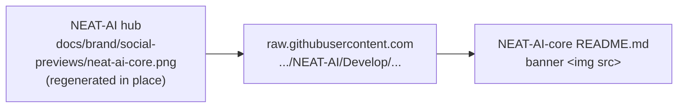

## Summary

Added the repo's brand banner to the top of the root `README.md`, hot-linked
from the NEAT-AI hub rather than copied here, and pinned that outcome with a
new BATS guard. Closes #543.

The hub (stSoftwareAU/NEAT-AI#3764) owns the artwork and regenerates each
per-repo preview **in place** at the same committed path, so referencing the
hub's raw `Develop` URL means a hub refresh — including the pending transparent
regeneration — propagates here with no PR in this repo. Siblings pull, they do
not copy: no image binary is committed.

Scope held to the root `README.md`. `neat-core/benches/README.md` and
`wasm-bench/README.md` are internal developer docs and stay text-only.

## Evidence

No UI surface and no web interface to drive, so no Playwright screenshot was
captured — and deliberately no image was saved into this repo: the new guard
`no brand image binary is committed to this repo` fails if any `*.png`/`*.jpg`/
`*.svg` is tracked, which is the behaviour the issue asks for.

Verified instead:

- The hot-linked URL resolves — `curl` against
  `https://raw.githubusercontent.com/stSoftwareAU/NEAT-AI/Develop/docs/brand/social-previews/neat-ai-core.png`
  returns `200`, `image/png`, 103091 bytes.
- `bats tests/scripts/readme_brand_banner.bats` — 6/6 pass; the three banner
  assertions failed before the README edit and pass after it.
- Pre-existing README guards still pass: `readme_glossary.bats` (5),
  `readme_private_repo_reference.bats` (4).
- `markdownlint-cli2 README.md` — 0 errors (MD033 inline HTML is already
  permitted by `.markdownlint-cli2.jsonc`).
- `./quality.sh` passes cleanly.

## Test Plan

- Added `tests/scripts/readme_brand_banner.bats`, which parses the README
  header block (H1 to the next heading) for Markdown and inline-HTML images and
  asserts:
  - a banner image is present in the header block;
  - its `src` is the hub's raw `Develop` URL for `neat-ai-core.png`;
  - its alt text is non-empty and names the repo;
  - it is not a local path (no vendored copy);
  - `git ls-files` tracks no brand image binary in this repo.
- Re-ran `tests/scripts/readme_glossary.bats` and
  `tests/scripts/readme_private_repo_reference.bats` — unaffected, as the issue
  predicted.
