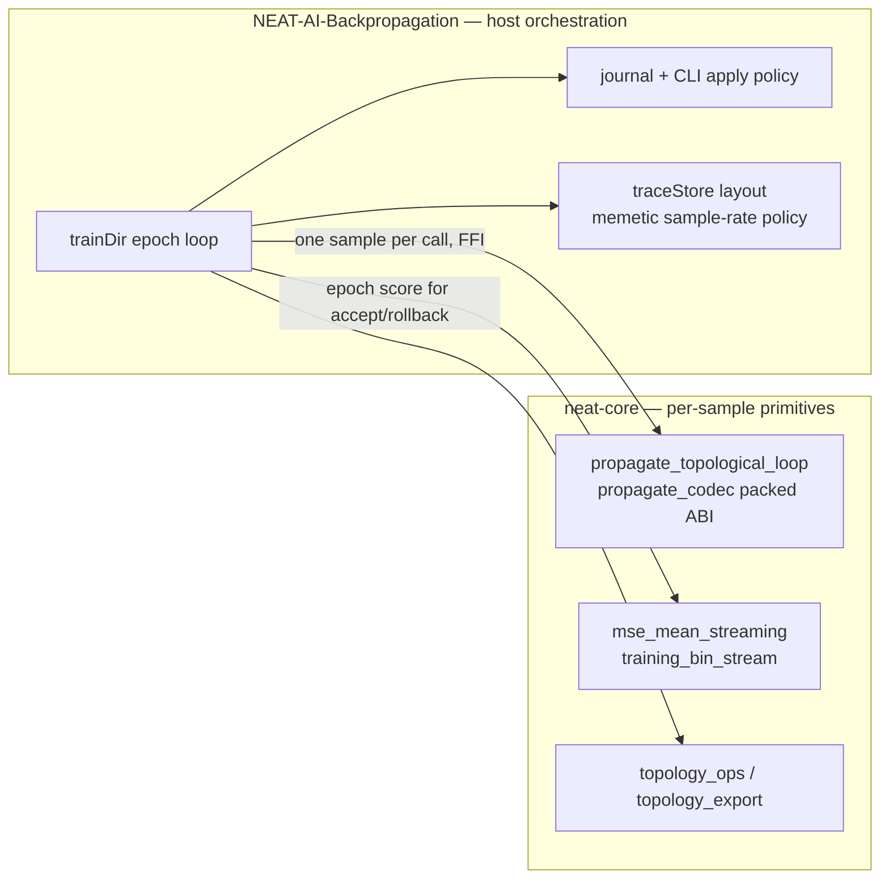

# PR Summary — Ownership fence: per-sample propagate here, `trainDir` epochs in Backpropagation (Issue #544)

## Summary

Native training is split across two FFI surfaces: `neat-core` owns the
**per-sample** primitives, and NEAT-AI-Backpropagation owns the **directory
epoch** loop (`trainDir`: accumulate → apply → MSE accept/rollback → journal).
That split was implicit — nothing stopped a future "simplify by putting
`trainDir` in core" change from pulling journal, CLI apply policy and
`traceStore` layout into every core consumer, the scorer and Discovery
included.

This PR writes the fence down and gates it. No API is deleted, moved or
narrowed; the only Rust change is a new test. Closes #544.

- **`AGENTS.md` — `## Ownership fence (Issue #544)`**: what stays here
  (`propagate_topological_loop`, the `propagate_codec` packed ABI,
  `mse_mean_streaming` over `training_bin_stream`, the `training_data` /
  `training_state` iterators, the `topology_ops` / `topology_export` helpers)
  and what stays in NEAT-AI-Backpropagation (the `train` epoch loop over a
  directory, the journal, the CLI apply policy, the `traceStore` layout, the
  memetic sample-rate policy), with the reasoning and a Mermaid diagram.
- **`README.md`**: a one-paragraph pointer under *Related Repositories* that
  links to the AGENTS.md section rather than restating the rule (the
  single-source convention `docs_single_source.bats` already enforces for other
  procedures).
- **`tests/scripts/core_ownership_fence.bats`**: the gate. Sweeps
  `neat-core/src` for host-orchestration **item definitions** and for
  `train.rs`/`journal.rs`-style module files, and checks the documented rule is
  present and complete.
- **`neat-core/tests/backprop_ffi_surface.rs`**: the "do keep" half — exercises
  the typed loop and the packed ABI codec from **outside** the crate, so
  narrowing either to `pub(crate)` (or moving it out) is a compile error here.

## Evidence

Backend/library change with no web interface, so there is no screenshot to
capture; the evidence is the gate output and the mutation runs below.



### Gate output

```text
bats tests/scripts/core_ownership_fence.bats
1..10
ok 1 neat-core sources define no trainDir/epoch/journal/traceStore item
ok 2 neat-core has no train.rs-style epoch orchestration module
ok 3 the item pattern rejects epoch-orchestration definitions
ok 4 the item pattern accepts the primitives core keeps
ok 5 the module pattern rejects train.rs but keeps the training_* primitives
ok 6 AGENTS.md carries the ownership fence section
ok 7 the fence names the per-sample primitives core keeps
ok 8 the fence names the host orchestration Backpropagation owns
ok 9 the fence points at the gates that pin it
ok 10 README defers the fence to AGENTS.md via a link

cargo test -p neat-core --test backprop_ffi_surface
test result: ok. 4 passed; 0 failed
```

Tests 6–10 were **red before** the AGENTS.md/README edits (`AGENTS.md has no
body under '## Ownership fence (Issue #544)'`), which is the failing-first run
for the documentation half.

### Mutation evidence

A green test is not evidence, so each new assertion was shown to be reachable.
Every mutation below was reverted before commit (`git status` clean).

| Mutation | Expected red | Result |
|----------|--------------|--------|
| Append `pub fn train_dir_epoch_loop() {}` to `neat-core/src/training_state.rs` | fence sweep | `not ok 1` ✔ |
| Create empty `neat-core/src/journal.rs` | module-name sweep | `not ok 2` ✔ |
| Gut `HOST_ITEM_RE` to `NEVER_MATCHES` | pattern self-test | `not ok 3` ✔ (the live pattern is compiled by both the sweep and the literal checks — AGENTS.md oracle rule 4) |
| Gut `HOST_MODULE_RE` to `NEVER_MATCHES` | module pattern self-test | `not ok 5` ✔ |
| `pub mod propagate_codec;` → `pub(crate) mod propagate_codec;` in `lib.rs` | boundary test | `error[E0603]: module propagate_codec is private` ✔ |
| `encode_propagate_output`: `f64::NEG_INFINITY` → `f64::INFINITY` for the noChange slot | sentinel test | `packed_abi_round_trip_keeps_the_no_change_sentinel ... FAILED` ✔ |

The sweep is deliberately narrow: it matches Rust **item definitions** whose
name carries an epoch-loop concept, not prose — the existing doc comment
"Initialise persistent training state for an epoch" in `training_state.rs`, and
the `training_data` / `training_state` / `training_bin_stream` modules, are all
explicitly asserted to pass (tests 4 and 5), so the gate cannot be satisfied by
renaming a core primitive.

### Quality gate

`./quality.sh` passes on the Rust side: `cargo fmt --all` (no diff),
`cargo clippy --workspace --all-targets --all-features -- -D warnings`,
`cargo test --workspace --lib --tests --all-features`, `cargo deny check`,
`RUSTDOCFLAGS="-D warnings" cargo doc`, release build, `deno` TypeScript gate
and the Mermaid gate (`check-mermaid: all Mermaid blocks passed`).

The workflow-contract bats suites report 107 failures **in this container only**
— `python3` has no `yaml` module, which those suites need to parse workflow YAML
(`ModuleNotFoundError: No module named 'yaml'`, no `pip`/`sudo` available to
install it). The identical 107 failures occur on the base commit `bbc4b15`
before any change in this PR, and the new suite contributes none of them.

## Test Plan

- Added `tests/scripts/core_ownership_fence.bats` (10 tests): the source sweep,
  the module-name sweep, good/bad literal self-tests for both patterns, and the
  documented-rule assertions against `AGENTS.md` / `README.md`.
- Added `neat-core/tests/backprop_ffi_surface.rs` (4 tests) at the out-of-crate
  boundary:
  - `typed_propagate_loop_drives_an_identity_output_to_its_expected_value` —
    identity output at 0.5 with expected 1.0 gives
    `total_error_absolute_delta = |1.0 − 0.5| = 0.5`, `cached_activation = 1.0`,
    one bias accumulation, and one positive weight accumulation per inward
    synapse carrying the source activation 0.5.
  - `typed_propagate_loop_reports_no_change_when_the_output_already_matches` —
    error below `plank_constant` yields `NoChange` and moves no weight
    statistics.
  - `packed_abi_round_trip_encodes_the_standard_outcome_slots` — a buffer packed
    by an independent mirror of the TypeScript encoder decodes, runs and
    re-encodes into the documented
    `neurons × PER_NEURON_OUT_F64S + synapses × PER_SYNAPSE_OUT_F64S` layout,
    with input-neuron slots NaN and the output slots carrying the values derived
    above.
  - `packed_abi_round_trip_keeps_the_no_change_sentinel` — slot 1 is
    `−Infinity` with the cached activation in the last slot, the contract the
    TypeScript host decodes.
- No existing test was modified or removed.
