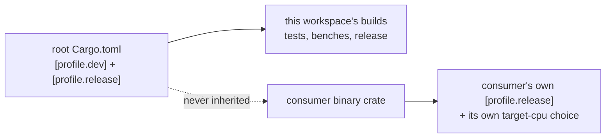

# Rust build profiles: line-tables-only dev, fat-LTO release, consumer-owned target-cpu

## Summary

Applies the fleet build-profile decision to this repo — **dev builds compile as
fast as possible, release builds produce the most optimised artefact possible**
— on stable Rust only. Closes #546.

- `Cargo.toml`: added `[profile.dev] debug = "line-tables-only"` at the
  workspace root (panic/backtrace `file:line` kept, the rest of the DWARF
  dropped; `opt-level = 0` and incremental stay at cargo's dev defaults).
- `Cargo.toml`: `[profile.release]` now spells `lto = "fat"` instead of
  `lto = true` — the same LTO mode to cargo, but unambiguous to a reader and to
  the new gate — alongside the existing workspace-wide `opt-level = 3` and
  `codegen-units = 1`.
- **No** `target-cpu=native` added: the `wasm32`/`wasm64` bundles and downstream
  consumers must stay portable, so that flag stays consumer-owned.
- New gate `tests/scripts/rust_build_profiles.bats` pins the contract.
- Docs: README gains a **Build profiles** section (settings, measured dev-build
  numbers, the consumers-carry-their-own rule, and how a consumer sets
  `target-cpu=native`); AGENTS.md and RELEASING.md carry the same rule where
  they describe the manifest and the release.

The redundant-but-harmless `[profile.release.package."*"] opt-level = 3` is left
as-is; the new gate asserts no package-scoped table can *weaken* the
workspace-wide settings.

## Evidence

Backend/build-configuration change — no web interface to screenshot. Evidence is
the measured build times and the gate output below.

### Dev-build measurement (acceptance criterion)

Same machine, same command, a fresh `CARGO_TARGET_DIR` per side; "rebuild" is
`cargo build --workspace --all-targets` after appending one comment line to
`neat-core/src/lib.rs` (median of three).

| Measurement | Before (`debug = 2` default) | After (`line-tables-only`) | Change |
|---|---|---|---|
| Rebuild after a one-line edit | 1.92 / 1.81 / **1.87** s | 1.50 / 1.49 / **1.50** s | **−20%** |
| Clean `cargo build --workspace --all-targets` | 8.37 s | 6.72 s | **−20%** |
| `target/debug` size | 1.4 G | 1.1 G | **−21%** |

Release side: `cargo build --workspace --release` succeeds inside `./quality.sh`,
and cargo hands rustc `-C opt-level=3 -C lto=fat -C codegen-units=1` (asserted by
the gate, so one codegen unit per crate with fat LTO).

### Profile ownership



### Gate output

```text
$ bats tests/scripts/rust_build_profiles.bats
ok 1 dev profile keeps panic file:line but drops full DWARF
ok 2 dev profile stays unoptimised and incremental
ok 3 release profile is fully optimised workspace-wide, not per package
ok 4 no build input pins target-cpu=native — consumers own that flag
ok 5 cargo resolves the dev profile to line-tables-only debuginfo
ok 6 cargo resolves the release profile to fat LTO in one codegen unit
```

`./quality.sh` exits 0 (fmt, clippy `-D warnings`, `cargo check --all-targets`,
tests, rustdoc, `cargo deny`, Mermaid, TypeScript, release build). Two local
caveats, both pre-existing and environmental: `codespell` is not installed in
this container (CI still enforces it), and this container's `python3` has no
`yaml` module, so 107 of the existing workflow-contract bats tests error on
`ModuleNotFoundError: No module named 'yaml'`. Verified pre-existing by counting
failures with the change (107) against the same suite on the unmodified
manifest/docs (111 — the extra 4 being this PR's own red tests before the fix).
The new suite uses `tomllib` only and needs no `yaml`.

## Test Plan

New suite `tests/scripts/rust_build_profiles.bats` (runs in `./quality.sh` and in
the CI `quality` job's bats step):

- **TOML contract, read through a real parser** — `[profile.dev] debug` is
  `line-tables-only`; dev keeps `opt-level = 0` and incremental; `[profile.release]`
  declares `opt-level = 3`, `lto = "fat"`, `codegen-units = 1` at the workspace
  level, and no `[profile.release.package.<name>]` table weakens them.
- **Behavioural** — the live `[profile.*]` tables are spliced into a throwaway
  crate and built with `cargo build -v`, asserting the flags **cargo itself**
  passes rustc: `-C debuginfo=line-tables-only` + `-C incremental=` and no
  `-C opt-level=[1-9]` for dev; `-C opt-level=3 -C lto=fat -C codegen-units=1`
  for release. A profile key cargo would ignore (misspelling, wrong table depth)
  therefore fails here rather than silently doing nothing.
- **Portability** — every build input under `.cargo/`, `scripts/` and
  `.github/workflows/` is swept for `target-cpu=native` (prose explaining the
  rule is deliberately not swept).

### Mutation evidence (AGENTS.md rule 2)

Each mutation applied alone to the fixed manifest, suite re-run, mutation
reverted. Every one is caught:

| Mutation | Tests that went red |
|---|---|
| `debug = "line-tables-only"` line removed | #1, #5 |
| `debug = "full"` | #1, #5 |
| `opt-level = 1` added to `[profile.dev]` | #2, #5 |
| `incremental = false` added to `[profile.dev]` | #2, #5 |
| release `lto = "thin"` | #3, #6 |
| release `codegen-units = 16` | #3, #6 |
| release `opt-level = 2` | #3, #6 |
| `[profile.release.package.neat-core] opt-level = 1` | #3 |
| `.cargo/config.toml` pinning `-C target-cpu=native` | #4 |

The `codegen-units = 16` row is why #6 anchors its match: a plain `-F` grep for
`-C codegen-units=1` also accepts `=16`, and that mutation initially survived #6
until the assertion was anchored.
