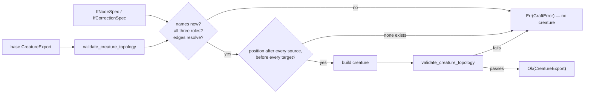

# Canonical IF decision-tree fixtures and a safe graft helper

## Summary

Gives the NEAT-AI family one authoritative Rust representation of small
decision trees built from the existing `IF` aggregate, plus a helper that
constructs them safely, so NEAT-AI-Forests does not have to invent its own
reading of the synapse roles or hand-edit neuron/synapse JSON. Closes #555.

Two new modules, both public library surface (Forests consumes them, so they
cannot be test-only):

- **`neat-core/src/decision_tree.rs`** — the canonical fixtures and their
  documented expected outputs:

  | Builder | Shape | Covers |
  |---------|-------|--------|
  | `stump_creature()` | `x > 0.5 ? 3.0 : 0.0` | single split, zero/default branch (`STUMP_CASES`) |
  | `depth2_tree_creature()` | root on `x0 > 0.5`, both children on `x1 > 0.25` | nested depth-2, all four leaves (`DEPTH2_CASES`) |
  | `linear_base_creature()` | `2x`, no `IF` at all | the pre-graft base |
  | `residual_correction_creature()` | `2x + (x > 0.75 ? 1.5 : 0)` | non-zero residual/correction leaf (`RESIDUAL_CASES`) |

- **`neat-core/src/if_graft.rs`** — `IfNodeSpec` / `IfCorrectionSpec` describe
  *what* is wanted; `graft_if_node`, `graft_if_tree` and `graft_if_correction`
  return a **new** validated `CreatureExport` and never mutate the source.

Nothing in the serialisation format, the squash discriminants or the existing
activation kernels changed — the modules are additive, and `SquashType::If` /
`SynapseType` are used exactly as they already were.

### Design notes a reviewer needs

- **Why each grafted node brings three constants.** A split test `x > t` needs a
  constant `1.0` source to carry `-t`, and each leaf value needs one too. A
  creature may not hold two synapses between the same ordered pair of neurons
  (`validate_topology`'s `DUPLICATE_CONNECTION`), so one node cannot take all
  three roles from a single constant. `IfCorrectionSpec` therefore introduces
  `<uuid>-condition-one`, `<uuid>-positive-one` and `<uuid>-negative-one`, all
  bias `1.0`, leaving the threshold and leaf values in the trainable **weights**.
- **Placement is the `forwardOnly` guarantee.** The node is inserted at the
  earliest position that still sits after every source and before every target;
  when no such position exists the graft fails with `ForwardOrderViolation`
  rather than emitting a node that reads a stale activation.
- **The gate reuses existing single-home rules.** `validate_creature_topology`
  calls `validate_creature_width`, `validate_topology` and
  `validate_structural_integrity` rather than restating them. The ordering gate
  runs only for `forwardOnly` creatures, because a recurrent creature
  legitimately carries backward edges that gate rejects by design.
- **Fail closed, and prove it.** Every rejection is a typed `GraftError` and no
  creature is produced. `graft_if_correction` on `linear_base_creature()`
  reproduces `residual_correction_creature()` **exactly**, which is what stops
  the helper and the fixture drifting apart.

## Evidence

Backend/library change — there is no web interface to screenshot. The evidence
is the test suite and the mutation sweep below.

`./quality.sh` passes clean (fmt, clippy `-D warnings`, `cargo check`,
`cargo test --workspace`, rustdoc `-D warnings`, release build, Mermaid gate,
`cargo deny`). 39 new tests, all existing tests still green.

### Oracle integrity

Per [AGENTS.md](../../../AGENTS.md#oracles-and-mutation-evidence):

1. **The oracle does not share the code path under test.**
   `neat-core/tests/decision_tree_fixture.rs` declares the reference trees as
   plain `if x > t` Rust (`stump_reference`, `depth2_reference`,
   `residual_reference`) that touch neither `compile_creature` nor
   `CompiledNetwork::activate`. Each documented `*_CASES` constant is checked
   against that reference too, so a wrong constant in the library is caught as
   well as a wrong kernel.
2. **No vacuous assertions.** Every expected value is the leaf the documented
   tree produces, derived beside the assertion — no `is_finite()`, no bare
   magic lengths.
3. **The gate is tested directly.** The post-build validation inside
   `graft_if_node` is unreachable while the pre-checks are complete (mutation
   M6 below), so `validate_creature_topology` is exercised against synthetic
   creatures instead — oracle rule 5.

### Mutation sweep

Each mutation was applied to one site, the two new suites run, then reverted;
the working tree is clean of all of them.

| # | Mutation | Result | First tests that went red |
|---|----------|--------|---------------------------|
| M1 | `network.rs` `activate`: IF `condition_sum > 0.0` → `>= 0.0` | **RED** | all four fixture/boundary tests |
| M2 | `build_grafted`: emit `Standard` instead of `Condition` | **RED** | `gate_rejects_an_if_neuron_that_lost_a_role`, 5 more |
| M3 | drop the `ForwardOrderViolation` check | **RED** | `rejects_a_graft_that_cannot_be_placed_forward_only` |
| M4 | drop the duplicate-source-edge check | **RED** | `rejects_two_synapses_between_the_same_pair` |
| M5 | pin placement to position `0` | **RED** | `grafted_node_is_placed_after_its_sources_and_before_its_targets` |
| M6 | drop the result post-check | GREEN — see note | — |
| M7 | `GRAFT_CONSTANT_BIAS` `1.0` → `2.0` | **RED** | `residual_fixture_matches_reference_on_every_documented_case` |
| M8 | stump leaves swapped in `leaf_synapses` | **RED** | `stump_fixture_matches_reference_on_every_documented_case` |
| M9 | skip base-creature validation | **RED** | `rejects_a_base_creature_that_is_already_malformed` |
| M10 | drop the target-is-input check | **RED** | `rejects_a_synapse_that_targets_an_input` |
| M11 | drop the missing-role checks | **RED** | `rejects_a_node_missing_any_if_role` |
| M12 | drop the duplicate-UUID check | **RED** | `graft_if_correction_reproduces_the_canonical_residual_fixture`, 5 more |
| M13 | drop the non-finite-weight check | **RED** | `rejects_non_finite_weights_and_biases` |
| M14 | drop the target-is-constant check | **RED** | `rejects_a_synapse_that_targets_a_constant` |
| M15 | flip the correction threshold sign | **RED** | `graft_if_correction_fires_only_above_the_threshold` |
| M16 | depth-2 root leaves swapped | **RED** | `depth2_fixture_matches_reference_on_every_documented_case` |
| M17 | `batch_scoring.rs` IF `>` → `>=` | **RED** | `batched_scoring_reproduces_the_documented_branch_outputs` |
| M18 | `batch_scoring.rs` route `Negative` into `positive_sum` | **RED** | `batched_scoring_reproduces_the_documented_branch_outputs` |

**M6 is a deliberate, documented gap.** The post-build
`validate_creature_topology` call is defence in depth: no specification that
survives the pre-checks can produce a malformed creature, so nothing reaches it.
It is kept because it makes "never emit a malformed creature" hold even if a
future pre-check is weakened, and the gate it calls is covered directly by the
eight `gate_*` tests — M2 and M12 both turn those red, so those tests are not
vacuous. This is recorded in `AGENTS.md` so a later reader does not delete the
check as dead code.

M17/M18 were GREEN on the first sweep — the batched aggregate path was not
reached at all. `batched_scoring_reproduces_the_documented_branch_outputs` was
added to close that gap: it packs 13 records (`8 + 4 + 1`, so the 8-record
group, the 4-record remainder and the scalar tail all run) with the documented
branch outputs as targets, and asserts the summed MSE is zero.

## Test Plan

**`neat-core/tests/decision_tree_fixture.rs`** (10 tests) — fixture semantics:

- `stump_fixture_matches_reference_on_every_documented_case`,
  `depth2_fixture_matches_reference_on_every_documented_case`,
  `residual_fixture_matches_reference_on_every_documented_case` — every
  documented case through `CreatureExport` → `compile_creature` → `activate`,
  against the independent reference.
- `stump_takes_the_zero_default_branch_at_and_below_the_threshold` — pins the
  strict `>` at the split point and the zero/default branch.
- `depth2_cases_cover_all_four_leaves` — the case table reaches every leaf.
- `residual_fixture_adds_a_non_zero_correction_over_the_linear_base` — the
  non-zero residual leaf, measured as the difference from the linear base.
- `round_trip_preserves_every_synapse_role`,
  `round_trip_preserves_branch_semantics` — export → JSON → parse → compile
  keeps the compiled role histogram and the activations.
- `stripping_synapse_roles_changes_the_branch_output` — the in-suite guard that
  the role assertions are not vacuous.
- `batched_scoring_reproduces_the_documented_branch_outputs` — 8-way, 4-way and
  scalar-tail agreement (added to close the M17/M18 gap).

**`neat-core/tests/if_graft.rs`** (29 tests) — the helper:

- Happy path: branch added to the target, source creature untouched, placement
  after sources and before targets, `IF` squash and all three roles present on
  the compiled network, `graft_if_tree` ordering and all-or-nothing behaviour.
- `graft_if_correction_reproduces_the_canonical_residual_fixture` — structural
  equality against the hand-written fixture; the acceptance criterion that a
  caller can graft a depth-1 correction without duplicating role logic.
- Thirteen rejection tests, one per `GraftError` variant reachable through the
  helper: duplicate UUID (node and constant), unknown source, unknown target,
  target is an input, target is a constant, each missing `IF` role, no outward
  edge, duplicate edge, self edge, non-finite weight/bias (node and constant),
  forward-order violation, and an already-malformed base.
- Eight `gate_*` tests driving `validate_creature_topology` directly with
  synthetic creatures: every canonical fixture accepted; hidden-with-no-outward,
  an `IF` node that lost a role, a synapse into an input, a duplicate
  connection, a backward edge (rejected when `forwardOnly`, accepted when
  recurrent), an unresolvable UUID, and a widthless creature all rejected with
  the expected `topology_ops` code.

**Docs:** `README.md` gains a "Canonical IF decision trees and the graft helper"
section with the role rule, the fixture table and a Mermaid flow of the graft
gate; `AGENTS.md` gains the matching "One IF decision-tree construction rule"
entry so the single-home rule and the M6 rationale survive.
