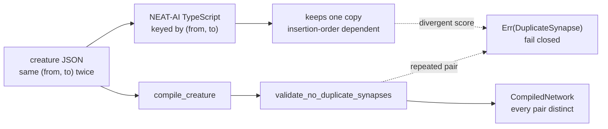

# PR Summary — Issue #556

## Summary

`compile_creature` accepted two or more synapses sharing the same
`(fromUUID, toUUID)` pair and **summed** them. NEAT-AI's TypeScript loader keys
synapses by that pair and keeps only one, so the same JSON scored differently
under the two engines — production saw `rust_scorer` 0.356183 against
`Creature.scoreDir` 0.353147, with the minimal repro an `IF` neuron fed three
times (condition / positive / negative) by one constant neuron.

Which copy TypeScript keeps falls out of its map insertion order, so there is
no value this crate could reproduce and no safe way to dedupe. The fix fails
closed: a new `validate_no_duplicate_synapses` is the single home of the rule,
`compile_creature` calls it immediately after `validate_creature_width`, and a
repeated pair returns `CreatureError::DuplicateSynapse { from_uuid, to_uuid }`
naming the first pair that repeats in declaration order. The helper is public
so consumers assembling a `CreatureExport` in Rust can apply the same rule at
their own boundary. Closes #556.

Distinct pairs sharing one endpoint — fan-out from a source, fan-in to a
target — are untouched.

## Evidence

Backend/library change only; there is no web interface to screenshot. Evidence
is the test suite and the mutation sweep below.

### Test run

`./quality.sh` passes end to end (fmt, clippy `-D warnings`, `cargo check`,
`cargo test --workspace --lib --tests --all-features`, rustdoc `-D warnings`,
release build, cargo-deny, Mermaid gate, codespell).

`cargo test --test creature_duplicate_synapses` — 8 passed, 0 failed.

### Mutation evidence

The new tests were proved able to fail. Each mutation was applied on its own
and reverted afterwards; the working tree contains none of them.

| Mutation | Tests that went red |
|----------|---------------------|
| Drop the `validate_no_duplicate_synapses(creature)?` call from `compile_creature` | 4 (all rejection tests) |
| Make the helper never report a duplicate (`continue` before the insert) | 5 (rejection tests + the consumer-boundary test) |
| Key the set on `to_uuid` only (over-broad) | 2 (both acceptance tests) |
| Key the set on `from_uuid` only (over-broad) | 1 (`compile_accepts_distinct_pairs_that_share_one_endpoint`) |

The last two mutations are what make the acceptance tests non-vacuous: a check
that rejected legitimate fan-in / fan-out topologies would be caught.

## Test Plan

New file `neat-core/tests/creature_duplicate_synapses.rs`:

- `compile_rejects_an_if_neuron_fed_three_times_by_one_constant` — the issue's
  minimal repro; asserts the typed variant names `("c", "if-0")`.
- `compile_rejects_a_repeated_pair_with_identical_weight_and_type` — the
  plainest duplicate (same weight, no type) via `parse_creature_json`.
- `duplicate_error_display_names_both_endpoints` — `Display` names both UUIDs
  and the variant carries no serde `source()` chain.
- `compile_reports_the_first_repeated_pair_in_declaration_order` — two
  independent duplicate pairs; the earlier repeat is reported.
- `compile_accepts_distinct_pairs_that_share_one_endpoint` — fan-out and fan-in
  still compile, asserted through a derived activation (19.5).
- `compile_accepts_an_if_neuron_fed_by_three_distinct_constants` — the
  canonical IF shape still compiles and takes the positive branch (4.5).
- `compile_accepts_a_creature_with_no_synapses_at_all` — empty synapse list.
- `validate_no_duplicate_synapses_answers_for_a_hand_built_creature` — the
  public helper answers for a `CreatureExport` that never went through
  `parse_creature_json`.

### Modified existing test — documented

`neat-core/tests/creature_compile.rs::test_compile_creature_with_if_neuron`
carried the exact fixture this change now rejects: its positive and negative
branches both ran from `input-1` to `if-node`, one repeated pair. The fixture
was widened to three inputs so the negative branch runs from `input-2`; both
branch-selection assertions (3.0 positive, -3.0 negative) are unchanged. No
test was removed or commented out.

## Documentation

`README.md` gains a **Duplicate `(fromUUID, toUUID)` synapses are rejected**
section beside the existing observation-width contract, with the Mermaid
diagram above; `neat-core/src/creature.rs` module docs record the rule and its
single home.
