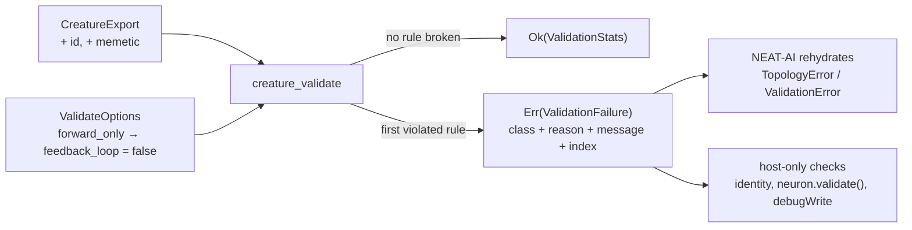

# creature_validate: define the validation contract (Issue #559)

## Summary

New module `neat-core/src/creature_validate.rs` fixes the contract for the port
of NEAT-AI's `src/architecture/CreatureValidate.ts` — options, success value,
structured failure, input format and rule order — so the two rule-porting
issues can be worked in parallel against a stable interface. Closes #559.

What landed:

- **`ValidateOptions`** — `forward_only` forces `feedback_loop` to
  `Some(false)` (`resolved_feedback_loop`); otherwise `feedback_loop` passes
  through and only an explicit `Some(false)` rejects `from > to`
  (`rejects_recursive_synapses`). The two count options keep the TypeScript's
  asymmetry: `neurons: Some(0)` is **skipped** (`if (options &&
  options.neurons)` is a truthiness test) while `connections: Some(0)` **is**
  checked (`Number.isInteger`). `expected_neurons` / `expected_connections` are
  the single home of that difference.
- **`ValidationStats`** — the `stats` object `creatureValidate` returns.
- **`ValidationFailure` / `FailureClass`** — class, verbatim `reason`,
  `message`, `neuron_index`, `synapse_index`, with `Display` rendering
  `ValidationError(NO_INWARD_CONNECTIONS): …` and `std::error::Error`.
- **`VALIDATION_REASONS` / `TOPOLOGY_REASONS`** — the `ValidationErrorName` and
  `TopologyErrorReason` unions verbatim, one named constant each, with a doc
  comment naming `src/errors/ValidationError.ts` / `src/errors/TopologyError.ts`
  as the source of truth. Three `const _: () = assert!(…)` gates check at
  **compile time** that each list is internally distinct and the two are
  disjoint, and the failure constructors reject a reason outside their class.
- **Rule order** — a numbered 31-row table in the module doc, in TypeScript
  evaluation order with the class/reason each rule raises. First failure wins,
  and the order is contract, not implementation detail.
- **Input format** — the validator reads the existing `CreatureExport`,
  extended by two optional fields.
- **Host-side-only checks** — `neuron.creature !== creature`, the
  `neuron.index` vs loop-position check, `neuron.validate()` and the `debugWrite` diagnostics
  dump are documented as staying in TypeScript, with the failure's
  neuron/synapse index as the hook that lets the host run them against the same
  neuron.

### Input format decision, and why it is backward compatible

A creature reaches the validator as the `CreatureExport` this crate already
parses — no second validator-only struct. Two fields were added:

| Field | Why | Wire compatibility |
|-------|-----|--------------------|
| `NeuronExport::id: Option<i64>` | the neuron-id rules and the memetic keys; signed because output neurons carry negative ids (NEAT-AI #1958) | `#[serde(default, skip_serializing_if = "Option::is_none")]` — absent input parses, absent output emitted |
| `CreatureExport::memetic: Option<MemeticExport>` | the `MEMETIC` rule (`biases`, `weights`) | same attributes; `MemeticExport::extra` is `#[serde(flatten)]` so `generation`, `score` and `ancestry` survive a round trip instead of being dropped |

Both default to absent and are skipped on output, so every existing
`parse_creature_json` caller and every already-written creature file round trips
byte-identically. `MemeticWeightExport`'s `to_id` / `weight` are optional on
purpose: the `MEMETIC` rule must be able to *report* an entry missing them, and
making them required would turn that failure into a serde error instead.

The export form is index-free (it lists only non-input neurons, wired by UUID),
so the indices the TypeScript rules use are derived exactly as
`compile_creature` derives them: `0..input` are the implicit input neurons
(`input-N`, `id == index`), and `input + i` is `neurons[i]`. An endpoint naming
no neuron — a failure the in-memory TypeScript form cannot express — maps onto
the existing `INVALID_SYNAPSE_REFERENCE` reason rather than a new name.

### Deviation from the acceptance criteria, and why

The issue suggests the stub return an empty `ValidationStats`. It returns a
`Validation` / `OTHER` failure saying the rule bodies are not ported instead: an
unconditional `Ok` reports **every** creature as valid, including the invalid
one this work exists to catch, which is exactly the silent-success shape the
repo forbids. The interface the downstream issues fill in is unchanged, and the
stub fails loudly for anyone who wires it up early.

## Evidence

Backend library change — no web interface to screenshot. Evidence is the test
suite plus the mutation sweep below.

`./quality.sh` passes end to end (shellcheck, bats, deno TypeScript gate,
Mermaid gate, fmt, clippy `-D warnings`, `cargo test --workspace`, doc build,
release build).

### Mutation evidence (AGENTS.md rules 2 and 3)

Each mutation was applied on its own, the suite run, then reverted. Every one
was caught:

| # | Mutation | Result |
|---|----------|--------|
| 1 | `resolved_feedback_loop` drops the `forward_only` forcing | 1 failure |
| 2 | `expected_neurons` stops skipping `Some(0)` | 1 failure |
| 3 | `expected_connections` starts skipping `Some(0)` | 1 failure |
| 4 | `reason::NEURON_ORDER` drifts to `"NEURON_ORDERING"` | 1 failure |
| 5 | the fail-loud reason guard in `ValidationFailure::new` is deleted | 2 failures |
| 6 | the stub returns `Ok(ValidationStats::default())` | 1 failure |
| 7 | `NeuronExport::id` loses `skip_serializing_if` | 1 failure |
| 8 | `MemeticExport::extra` stops capturing unknown keys | 1 failure |
| 9 | `ValidationStats::neurons` drops the constant count | 1 failure |
| 10 | `FailureClass::permitted_reasons` swaps the two lists | 6 failures |
| 11 | `CreatureExport::memetic` is skipped by serde | 3 failures |
| 12 | `MEMETIC` is copied into `TOPOLOGY_REASONS` | **compile error** — `evaluation panicked: assertion failed: disjoint(&VALIDATION_REASONS, &TOPOLOGY_REASONS)` |

## Test Plan

`neat-core/tests/creature_validate_contract.rs` — 16 tests, all against real
calls and observable results:

- **Options** — `forward_only_overrides_an_explicit_feedback_loop_request`,
  `only_an_explicit_false_feedback_loop_rejects_recursive_synapses`,
  `zero_expected_neuron_count_is_skipped_but_zero_connections_is_checked`.
- **Success value** — `validation_stats_start_at_zero_and_carry_all_five_counters`.
- **Failure value** — `reason_sets_reproduce_the_typescript_unions_verbatim`
  (both unions, member by member, in declaration order),
  `each_class_permits_only_its_own_union`,
  `failure_carries_class_reason_message_and_the_offending_index`,
  `failure_display_names_the_typescript_error_class_and_reason`, and two
  `#[should_panic]` tests pinning the fail-loud constructor guard.
- **Entry point** —
  `the_entry_point_refuses_to_certify_a_creature_until_the_rules_are_ported`,
  run against the Issue #555 `stump_creature()` fixture. The porting issues
  replace this test with the real rule coverage.
- **Input format** —
  `a_creature_without_id_or_memetic_parses_and_serialises_unchanged`
  (backward compatibility), `negative_output_neuron_ids_round_trip`,
  `the_memetic_block_round_trips_including_keys_the_validator_does_not_read`,
  `a_memetic_weight_missing_its_fields_still_parses_so_the_rule_can_report_it`,
  `a_hand_built_creature_can_carry_the_extension`.

Existing suites are unchanged in behaviour; the `CreatureExport` /
`NeuronExport` literals across `decision_tree.rs`, `if_graft.rs` and the
creature tests gained the two new fields as `None`.

## Security self-check

- Input validation: the new fields are optional and typed; a malformed `id` or
  memetic block fails at the serde boundary, before any rule runs.
- No secrets, no new dependencies, no new shell/SQL/HTTP surface.
- Errors carry no host paths or internal state — the message reproduces the
  TypeScript text and the indices of the offending neuron/synapse.
