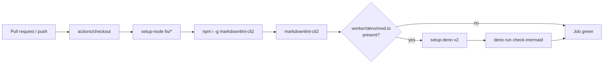

## Summary

Adds the **Markdown Lint** GitHub Actions workflow requested in the
issue, plus a permissive `markdownlint-cli2` config tuned for this
repository, and a bats suite that exercises the new gate against real
files. The workflow runs `markdownlint-cli2` on every pull request and
push to `main`/`master`, and conditionally validates Mermaid blocks
when a Deno worker module is present (this repo currently has none, so
that step is skipped at runtime). Closes #56.

## Evidence

CLI-only change — no UI surface. Verified with the new bats suite and
by running `markdownlint-cli2` directly against the working tree:

```text
$ markdownlint-cli2
Linting: 6 file(s)
Summary: 0 error(s)

$ bats tests/scripts/markdown_lint_workflow.bats
1..8
ok 1 markdown-lint workflow file exists
ok 2 markdown-lint workflow is valid YAML
ok 3 markdown-lint workflow exposes a markdownlint job that runs markdownlint-cli2
ok 4 markdown-lint workflow pins third-party actions to commit SHAs
ok 5 markdown-lint workflow gates Mermaid validation on a Deno worker module
ok 6 markdownlint config file exists and is valid JSONC
ok 7 markdownlint-cli2 passes against the current tree
ok 8 markdownlint-cli2 rejects a known-bad Markdown file
```

`./quality.sh` passes locally end-to-end.



## Test Plan

- Added `tests/scripts/markdown_lint_workflow.bats` covering eight
  observable outcomes:
  - Workflow file exists.
  - Workflow YAML parses.
  - `markdownlint` job runs `markdownlint-cli2`.
  - Every third-party action is pinned to a 40-char commit SHA.
  - The Mermaid validation step is gated on the `detect-deno` output.
  - `.markdownlint-cli2.jsonc` exists and parses as JSONC.
  - `markdownlint-cli2` exits 0 against the current tree.
  - `markdownlint-cli2` exits non-zero on a deliberately malformed
    Markdown file (sanity check that the gate is wired up rather than
    silently passing).
- `./quality.sh < /dev/null` passes end-to-end (shellcheck, bats,
  cargo fmt/clippy/deny/test/doc/release build).

## Notes

- Historical `docs/pr-summary-*.md` files are excluded via the `ignores`
  list — they are point-in-time snapshots and are not retroactively
  reformatted (per the change-scope rule). New PR summaries still pass
  the rules.
- `MD013` (line-length), `MD060` (table-pipe spacing), `MD033` (inline
  HTML), and `MD041` (first-line H1) are disabled to match this repo's
  established style; structural rules (headings, lists, fences,
  trailing-space, missing-newline) remain enforced — confirmed by test
  case 8.
