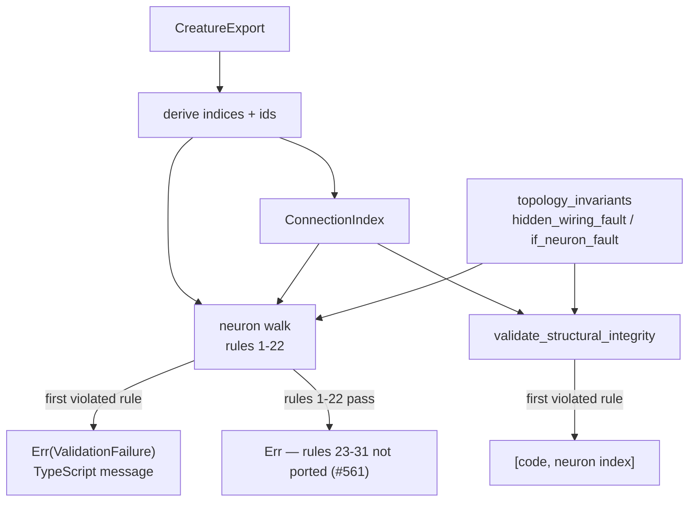

# creature_validate: port the neuron-level rules from CreatureValidate.ts

## Summary

Fills in the **neuron half** of `creature_validate` — rules 1–22, everything
NEAT-AI's `src/architecture/CreatureValidate.ts` evaluates before its synapse
walk — in the TypeScript's own order, first failure wins, with every message
reproduced verbatim so NEAT-AI's error-message tests keep passing across the
boundary. Rules 23–31 (synapses, `forwardOnly`, memetic) stay with Issue #561,
so the entry point runs the neuron half and *then* reports the un-ported half
rather than returning an `Ok` this build cannot stand behind. Closes #560.

Two derivations make the port work on the index-free, id-optional export form:

| Derivation | Why |
|------------|-----|
| Indices — `0..input` are the implicit input neurons, `input + i` is `neurons[i]` | the walk position every rule reads; same derivation as `compile_creature` |
| Ids — input `= index`, output `= -(outputIndex + 1)`, everything else its exported `id` or a deterministic hash of its UUID | NEAT-AI's loader assigns these *before* `creatureValidate` runs; without it every modern export (UUIDs, no ids) would fail rule 4 |

Four rules cannot fail for a `CreatureExport` and are ported anyway so the two
files stay line-for-line comparable: rules 7, 10 and 21 hold by construction
because the input neurons are derived from the declared width, and rule 19 is
unreachable in **both** stacks behind rule 8 (which rejects a missing or
non-finite bias on every non-input neuron first). Each is covered against the
function that implements it rather than left as dead text.

`neuronWireLabelForDiagnostics` (rules 11, 16, 17, 18) is reproduced branch for
branch from `src/neuron/NeuronSerialization.ts` — `input-N`, `output-N`, the
wire UUID, then the two no-UUID fallbacks — since NEAT-AI asserts on that text.
The substitute is documented in the module docs and pinned by
`the_wire_label_reproduces_the_typescript_diagnostic_label`.

### One implementation per invariant

`creature_validate` and `topology_ops::validate_structural_integrity` ask the
same wiring questions but answer them differently — a TypeScript message and a
neuron index here, a numeric `STRUCTURAL_*` code there — and they evaluate in
different orders, so neither can call the other and the existing codes cannot
express the messages. What they share is therefore **factored out** rather than
mapped, into `neat-core/src/topology_invariants.rs`:

- `ConnectionIndex` — inward/outward degree and the inward synapse list, built
  once in `O(neurons + synapses)`. This also removes the `O(synapses)` rescan
  `validate_structural_integrity` did *per* `IF` neuron.
- `hidden_wiring_fault` — inward before outward, the order both raise them in.
- `if_neuron_fault` / `IfRoles` / `IF_MINIMUM_INWARD` — count, then condition →
  positive → negative.

Deliberately *not* extracted: the checks that are a single comparison over those
values (`constant has inward`, `bias is finite`). Wrapping `inward_count(i) > 0`
in a named function moves no logic and only adds a hop.

The `SYN_*` code constants in `topology_ops` became test-only: the role tally
now converts through `SynapseType::from` instead of comparing four constants.
The drift guard they carried is replaced by a round-trip test on that
conversion.

## Evidence

Backend/library change — no web interface to screenshot. `./quality.sh` passes
end to end (fmt, clippy `-D warnings`, `cargo check`, 51 test binaries,
rustdoc `-D warnings`, release build).

**Red run.** With `validate_neuron_rules` short-circuited to
`Ok(ValidationStats::default())` — the pre-port state — **24 of the 31** new
`creature_validate` tests fail:

```
test result: FAILED. 7 passed; 24 failed; 0 ignored; 0 measured; 188 filtered out
```

The 7 survivors are the ones that call `walk_neurons`, `hidden_bias_failure`,
`derived_neuron_id`, `wire_label` and `number_text` directly — the rules that a
`CreatureExport` cannot break — so they never reach the stub.

**Mutation evidence for the shared invariants.** Each mutation was applied to
`topology_invariants.rs` alone and reverted afterwards; every one fails tests on
**both** sides, which is what proves the two validators genuinely share the
code rather than each keeping a copy:

| Mutation | Tests killed |
|----------|--------------|
| `hidden_wiring_fault`: inward/outward swapped | `creature_validate::a_hidden_neuron_must_be_wired_in_and_out`, `topology_invariants::a_hidden_neuron_needs_an_inward_edge_before_an_outward_one`, `topology_ops::structural_hidden_no_inward`, `topology_ops::structural_hidden_no_outward` |
| `if_neuron_fault`: minimum inward 3 → 2 | `creature_validate::an_if_neuron_with_fewer_than_three_inward_connections_is_rejected`, `topology_invariants::an_if_neuron_reports_its_count_then_each_missing_role_in_turn`, `topology_ops::structural_if_too_few_inward` |
| `ConnectionIndex`: outward degree never counted | 8+ `creature_validate` tests, including `a_constant_with_no_outward_connection_is_rejected` and `a_hidden_neuron_must_be_wired_in_and_out` |



## Test Plan

31 unit tests in `neat-core/src/creature_validate.rs`, each rule with a
positive and a negative case:

| Rules | Tests |
|-------|-------|
| valid creatures | `the_decision_tree_fixtures_pass_every_neuron_rule` (stats per type), `the_entry_point_reports_a_neuron_rule_before_the_unported_half` |
| 1–3 | `an_expected_neuron_count_that_misses_the_total_is_reported_with_both_counts`, `a_creature_with_no_input_neurons_is_rejected`, `a_creature_with_no_output_neurons_is_rejected` |
| 4–6 | `a_neuron_with_no_id_and_no_uuid_is_rejected`, `ids_are_derived_from_the_uuid_when_the_export_carries_none`, `an_id_above_int32_max_is_rejected_and_the_boundary_is_accepted`, `a_duplicate_neuron_id_is_rejected`, `distinct_ids_including_the_negative_output_id_are_accepted` |
| 7, 10 | `an_input_neuron_whose_id_is_not_its_index_is_rejected`, `an_input_neuron_past_the_declared_width_is_rejected` |
| 8, 9, 11 | `a_non_finite_bias_on_a_non_input_neuron_is_rejected` (NaN / ±Infinity), `a_neuron_after_an_output_neuron_is_rejected`, `a_constant_after_a_hidden_neuron_breaks_the_required_order` |
| 12 | `an_if_neuron_with_fewer_than_three_inward_connections_is_rejected`, `an_if_neuron_missing_a_role_names_the_role_it_is_missing`, `an_untyped_inward_synapse_fills_the_positive_role`, `the_if_rule_is_skipped_for_the_first_three_neurons` |
| 13–20 | `a_synapse_into_an_input_neuron_is_rejected`, `a_constant_with_an_inward_connection_is_rejected`, `a_constant_carrying_a_squash_is_rejected`, `a_constant_with_no_outward_connection_is_rejected`, `a_hidden_neuron_must_be_wired_in_and_out`, `a_hidden_neuron_needs_a_present_and_finite_bias`, `an_unknown_neuron_type_is_rejected_and_so_is_a_declared_input` |
| 21, 22 | `fewer_input_neurons_than_declared_is_rejected`, `fewer_output_neurons_than_declared_is_rejected` |
| input format | `a_synapse_endpoint_that_names_no_neuron_is_rejected`, `the_wire_label_reproduces_the_typescript_diagnostic_label`, `numbers_render_the_way_javascript_interpolates_them` |

6 unit tests in `neat-core/src/topology_invariants.rs` cover the index
(degrees, inward list order, ignored out-of-range endpoints, the fail-loud
length assert) and both fault functions.

Unchanged and still green: `neat-core/tests/creature_validate_contract.rs`
(Issue #559) and the `validate_structural_integrity` suite in `topology_ops`,
which is what holds the refactor behaviour-preserving.

## Security self-check

- Input validation: the new code *is* validation — every field it reads
  (`id`, `type`, `bias`, `squash`, UUIDs) is bounds- and range-checked before
  use, and an unresolvable synapse endpoint is rejected rather than indexed.
- No secrets, no new dependencies, no SQL/shell/filesystem/HTTP surface.
- Messages carry only creature data the caller already holds (ids, UUIDs, type
  names, counts) — no paths, no internal state.
- Fail loud: `ConnectionIndex::build` asserts its endpoint lists match rather
  than validating half a topology, and a fully valid creature still returns an
  error naming the un-ported half instead of a green `Ok`.
