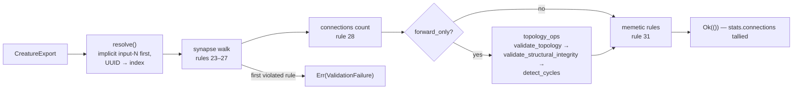

# creature_validate: port the synapse, forwardOnly and memetic rules (Issue #561)

## Summary

Fills in the **synapse and memetic half** of the #559 validation contract —
rules 23–31 of the table in `neat-core/src/creature_validate.rs` — ported from
NEAT-AI `src/architecture/CreatureValidate.ts`. Closes #561.

```rust
pub fn validate_synapse_and_memetic_rules(
    creature: &CreatureExport,
    options: &ValidateOptions,
    stats: &mut ValidationStats,
) -> Result<(), ValidationFailure>;
```

`stats` is threaded in the way the TypeScript threads its single `stats`
literal: this half adds the connection tally and leaves the neuron counters to
the neuron walk (#560).

Evaluated in TypeScript order, first failure wins:

1. **Synapse walk** (rules 23–27) — a synapse into an input neuron
   (`Topology`/`INVALID_CONNECTION`), a self connection *only* under
   `forward_only` (`Validation`/`SELF_CONNECTION`), `(from, to)` sort
   regressions (`Topology`/`SORT_FAILURE`), an adjacent duplicate pair
   (`Topology`/`INVALID_CONNECTION`), and `from > to` when `feedback_loop`
   resolves to an explicit `Some(false)` (`Validation`/`RECURSIVE_SYNAPSE`).
2. **Connections count** (rule 28) — `Validation`/`OTHER`.
3. **Forward-only leg** (rules 29–30) — `topology_ops`' `validate_topology`,
   `validate_structural_integrity` and `detect_cycles`, in that order. No
   invariant is reimplemented; the two label lookups
   (`topology_error_message` / `structural_error_message`, the Rust twins of
   NEAT-AI's `TopologyErrorMessages.ts`) were added beside the codes they
   mirror in `topology_ops.rs`.
4. **Memetic rules** (rule 31) — all `Validation`/`MEMETIC`, matched on
   **neuron id**, not index: the synapse set is built from
   `neurons[s.from].id -> neurons[s.to].id`.

Message text is byte-for-byte the TypeScript's, including the `WASM ... at
synapse {i}` / `at neuron {i}` shapes and the `neuronWireLabelForDiagnostics`
labels (`input-{index}`, `output-{outputIndex}`, else the UUID) — NEAT-AI's
error-message tests read this text.

`creature_validate` itself **still returns the loud #559 stub**. The neuron half
is #560, and running half a rule set would certify creatures this crate has not
fully checked — the failure the stub exists to prevent. Wiring is a one-line
change once #560 lands.

### Duplicate-synapse parity (#556)

Written up on
[#556](https://github.com/stSoftwareAU/NEAT-AI-core/issues/556#issuecomment-5368307375),
behaviour deliberately unchanged. In short: a *non-adjacent* duplicate cannot
reach the duplicate branch, because separating the copies necessarily creates
the sort regression rule 25 stops on first — so nothing slips through, only the
reported reason differs (`SORT_FAILURE` rather than `INVALID_CONNECTION`).
`validate_no_duplicate_synapses` is order-independent and rejects the same
creature either way. The three names for one invariant
(`DUPLICATE_CONNECTION` / `INVALID_CONNECTION` / the unused
`DUPLICATE_SYNAPSE`) are recorded on #556 rather than unified here — a port must
not change which error a creature reports.

## Evidence

Backend/library change with no web interface, so there is nothing to screenshot;
the evidence is the test run and the mutation checks below.



`./quality.sh` passes end to end (fmt, clippy `-D warnings`, `cargo deny`, full
workspace test run, rustdoc, release build).

**Mutation evidence** — the tests can fail:

| Mutation | Result |
|----------|--------|
| memetic synapse set keyed by index instead of neuron id | 3 memetic tests FAILED, including `memetic_matching_is_by_neuron_id_not_by_index` |
| `rejects_recursive_synapses()` → `feedback_loop.is_some()` | `a_recursive_synapse_is_legal_when_feedback_loop_is_explicitly_true` FAILED |
| `from == last_from` guard dropped **and** `last_to` reset removed | 7 tests FAILED, including `the_last_to_resets_when_from_advances` |

The third pair is redundant with each other (either alone masks the other), which
is why the mutation is applied to both — noted in the code so the `last_to = -1`
line is not mistaken for load-bearing.

## Test Plan

`neat-core/tests/creature_validate_synapse_rules.rs` — 26 tests through the
public entry point, each rule with a positive and a negative case:

- rule 23: a synapse into an input neuron vs a clean feed-forward creature
  (which also pins `stats.connections`);
- rule 24: a self connection legal by default, rejected under `forward_only`;
- rule 25: a backwards step in `from`, a backwards step in `to` naming
  `last to:`, and the legal case where `from` advances;
- rule 26: an adjacent duplicate, plus the non-adjacent duplicate cross-checked
  against `validate_no_duplicate_synapses` (#556);
- rule 27: the `feedback_loop` tri-state — `None` legal, `Some(true)` legal,
  `Some(false)` rejected — and `forward_only` overriding a `Some(true)` request;
- rule 28: matching and mismatched `connections`;
- rules 29–30: `stump_creature()` passing the whole half under `forward_only`,
  and a dead-end hidden neuron caught by `validate_structural_integrity` with
  its `neuron_index` (legal without `forward_only`);
- input format: a synapse endpoint naming no neuron
  (`INVALID_SYNAPSE_REFERENCE`);
- rule 31: a resolving memetic block, an unknown bias id, an unknown weights
  key, a missing `toId`, a missing `weight` (with its index), an unresolvable
  `toId`, a pair with no matching synapse, and the id-vs-index test that fails
  if matching were index-based.

`neat-core/src/creature_validate.rs` unit tests — 4 tests for what the public
walk makes unreachable, because an earlier rule always stops the creature first:
the forward-only leg reporting a `topology_ops` error code with its synapse
index, topology-before-structural ordering, the cycle check being defence in
depth (a topology-valid edge list is a DAG; a cyclic one is rejected regardless),
and every branch of the ported wire label.

No existing test was modified or removed; the #559 contract test still asserts
`creature_validate` refuses to certify anything.
