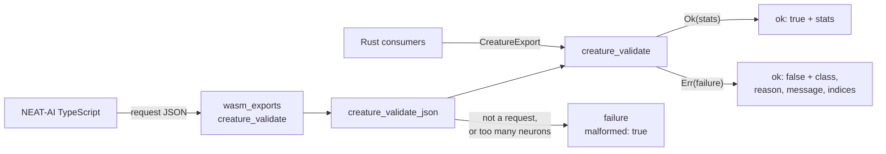

# creature_validate: both consumers, proven conformance

## Summary

`creature_validate` was ported (Issues #559–#561) but reachable only from Rust
and unproven against the TypeScript it replaces. This change makes it reachable
by both consumer kinds and proves it agrees, case by case, with NEAT-AI's own
conformance corpus. Closes #562.

- **Native API** — `creature_validate` was already re-exported from `lib.rs`; it
  now carries worked doctests (a valid creature returning `ValidationStats`, an
  invalid one returning a `ValidationFailure` naming its `reason`), and
  `cargo test --doc` was added to `quality.sh` and CI so a doctest that stops
  compiling fails the gate instead of passing unrun.
- **WASM export** — `#[wasm_bindgen(js_name = creature_validate)]` in
  `wasm_exports.rs`, a rename over the new native
  `neat-core/src/creature_validate_json.rs`. The ABI is **JSON in, JSON out**:
  the existing exports split between packed byte buffers and scalar arguments,
  and neither fits a whole creature in and a structured failure out. The whole
  ABI lives in the native module so it is covered by `cargo test` rather than
  only in a browser.
- **Malformed input cannot panic** — a panic in WASM aborts the module and
  `catch_unwind` is unavailable there, so anything that is not a request comes
  back as a structured failure carrying `"malformed": true` and a
  `MALFORMED_REQUEST:` message, the JSON twin of `topology_ops`'
  `MALFORMED_BUFFER`. A creature declaring more than `MAX_REQUEST_NEURONS`
  neurons is refused **before** the per-neuron allocation, which would otherwise
  abort on a payload saying `"input": 17179869180`.
- **A real panic fixed** — rule 11 computed `neurons.len() - output` on a
  `usize`. A creature declaring more outputs than it carries neurons underflowed
  and panicked. It now saturates, which *is* the JavaScript semantics (the
  comparison against a negative number is false), and rule 22 reports the
  miscount.
- **Conformance** — the NEAT-AI#3801 corpus is vendored under
  `neat-core/tests/fixtures/creature_validate/` with its source commit and
  checksums recorded, and replayed against `creature_validate`.

### Wire ABI

```jsonc
// in
{ "creature": { /* CreatureExport */ },
  "options": { "neurons": 3, "connections": 2, "feedbackLoop": false, "forwardOnly": true } }

// out — one of
{ "ok": true,  "stats": { "input": 1, "constant": 0, "hidden": 1, "output": 1, "connections": 2 } }
{ "ok": false, "failure": { "class": "ValidationError", "reason": "NO_INWARD_CONNECTIONS",
                            "message": "hidden neuron h1 has no inward connections",
                            "neuronIndex": 1, "synapseIndex": null, "malformed": false } }
```

Two decisions worth a reviewer's eye:

- **An unknown option key is a failure**, not a silent default — ignoring
  `forwardonly` would validate a production creature under the wrong rules and
  call it healthy. Unknown *creature* keys stay ignored, so NEAT-AI's own extra
  fields still parse.
- **The creature is deserialised with serde alone**, deliberately not through
  `parse_creature_json`, whose width check would shadow rules 2 and 3 and answer
  `InvalidInputCount` where NEAT-AI expects
  `Must have at least one input neurons was: 0`.

## Evidence

Backend/WASM change — no web interface to screenshot. The evidence is the gate.



**`./quality.sh` passes**, including the new doctest step:

```text
🧪 Running tests...
test result: ok. 226 passed  (lib)
test result: ok. 3 passed    (creature_validate_conformance)
test result: ok. 11 passed   (creature_validate_json_boundary)
🧪 Running doctests...
test neat-core/src/creature_validate.rs - creature_validate::creature_validate (line 580) ... ok
test neat-core/src/creature_validate.rs - creature_validate::creature_validate (line 607) ... ok
test neat-core/src/creature_validate_json.rs - creature_validate_json::creature_validate_json (line 236) ... ok
✅ All quality checks passed!
```

**The conformance gate bites.** Mutating one message
(`has no {direction} connections` → `links`) fails it on the offending case:

```text
forward-only-structural-defect-shadowed: message "hidden neuron h1 has no inward links"
  does not contain "hidden neuron h1 has no inward connections"
test result: FAILED. 2 passed; 1 failed
```

**The rule-11 panic was real** — before the fix, a creature with
`input: 1, output: 5` and one hidden neuron gave:

```text
thread 'probe' panicked at neat-core/src/creature_validate.rs:941:38:
attempt to subtract with overflow
```

**Corpus result: 37 of 47 cases replay exactly** — same error class, same
`reason`, same message text; the happy paths match all five counters. The other
ten describe something the wire shape cannot express, each a consequence of the
input format Issue #559 fixed rather than of a rule that was dropped:

| Case | Why | What this crate does |
|------|-----|----------------------|
| `input-count-not-integer`, `output-count-not-integer`, `neuron-id-not-integer`, `hidden-bias-undefined-shadowed`, `memetic-weights-not-an-array` | the value cannot be written on the wire at all | rejected at the parse boundary |
| `neuron-missing-id` | an output's id is derived as `-(outputIndex + 1)` whatever the file says (rule 4 unreachable through one) | — |
| `input-neuron-id-not-index`, `input-neuron-past-input-count` | input neurons are implicit (rules 7 and 10 unreachable) | — |
| `stats-input-count-mismatch` | the wire form carries exactly `input` implicit inputs (rule 21) | accepts, `stats = 2/0/1/1/2` |
| `neuron-index-mismatch` | `neuron.index` stays host-side (NEAT-AI#3802) | ignores the key, accepts |

None is skipped: each is declared in `DIVERGENCES` in the runner **with what
this crate does instead**, and that behaviour is asserted, so a stale
declaration or a changed Rust outcome fails the test as loudly as a mismatch.
The full table is on issue #562, and no contract change (#559) is outstanding —
every divergence is a decision that contract already recorded.

**wasm32 / wasm64 bundles.** The container has no `wasm32-unknown-unknown`
target installed (`rustup` is absent), so both bundles are built by
`.github/workflows/wasm-bundle.yml` on merge to `Develop`, which also runs the
arch parity and export-surface gates. The shim is the same shape as the
existing `version()` export — `&str` in, `String` out — and carries no
target-specific code.

**Release.** Additive change, so the `version-increment` job bumps the patch on
this PR; `release.yml` cuts the `v<version>` tag and `wasm-bundle.yml` publishes
the bundle carrying the new export on merge, per `RELEASING.md`. No manual
version edit is needed, and NEAT-AI's `build.sh` picks the bundle up by SHA.

### Security self-check

- Input validation: the boundary accepts only the declared request shape,
  refuses unknown option keys, and caps the neuron count before allocating.
- Injection surface: no SQL, shell, filesystem or HTTP call is added; the only
  parsing is `serde_json` on caller-supplied text.
- Error handling: failure messages carry the serde diagnostic for the caller's
  *own* payload and no internal state, paths or stack traces.
- Secrets and dependencies: none added; no new third-party crate.

## Test Plan

Added:

- `neat-core/tests/creature_validate_conformance.rs` — replays the vendored
  NEAT-AI#3801 corpus (3 tests): every case matches or is a declared divergence
  with its Rust outcome pinned; every `coverage.json` site still has a case; the
  replayed/declared split is asserted so a case cannot quietly move into the
  divergence table.
- `neat-core/tests/creature_validate_json_boundary.rs` — 11 tests over the ABI:
  the five counters, the options bag, `forwardOnly`, the failure indices, 14
  hostile payloads (empty, non-JSON, truncated, trailing garbage, wrong-typed,
  negative and non-integer widths), a misspelt option key, an absurd neuron
  count, 2 000-deep nesting, a creature at the ceiling, and `input: 0` reaching
  rule 2 in NEAT-AI's own words.
- `creature_validate_json::tests` — 5 unit tests pinning the exact response text
  and the options mapping.
- `creature_validate::tests::declaring_more_outputs_than_neurons_reports_rule_22_rather_than_panicking`
  — the rule-11 underflow regression.
- Two doctests on `creature_validate`.

Modified: `quality.sh` and `.github/workflows/ci.yml` gained a
`cargo test --workspace --doc` step. No existing test was changed or removed.
