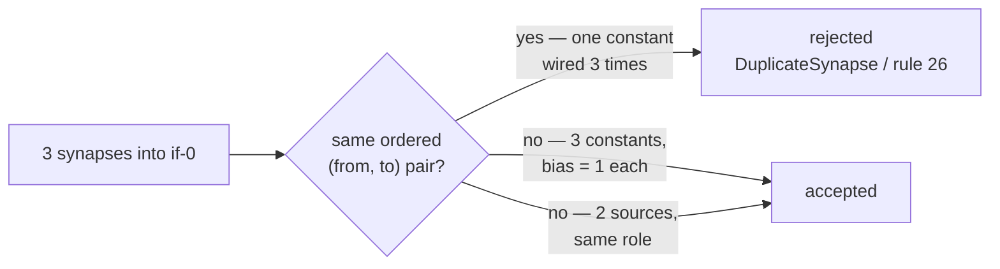

# Duplicate `(from, to)` synapse rejection — verified, and the role pinned out of it

## Summary

Issue #572 asked for the existing duplicate-`(from, to)` rejection coverage to
be verified and recorded. It is correct on every entry point, and the evidence
is below. What was **not** pinned anywhere is the other half of the rule the
user clarified: many synapses may carry the **same role** into one neuron as
long as their sources differ — GRQ #4277 reads as though that were forbidden.
Four tests now state the rule precisely and the docs say it in words. No
behaviour change: the only source edits are doc comments. Closes #572.

The rule, exactly:

> A creature is rejected when two synapses share the same ordered
> `(fromUUID, toUUID)` pair — and only then. The synapse role is not part of
> the key, so two `positive` edges into one `IF` neuron are legal when their
> sources differ. This is why an `IF` neuron needs up to three separate
> constants (each with `bias = 1`) rather than one constant wired three times:
> one constant feeding condition, positive and negative is the same pair three
> times.



## Evidence

Backend-only change, so there is no UI to screenshot. The evidence is the test
runs and the mutation sweep.

### Existing coverage, verified green on the default branch

```text
$ cargo test -p neat-core --test creature_duplicate_synapses \
      --test creature_validate_synapse_rules
test result: ok. 8 passed; 0 failed    (creature_duplicate_synapses)
test result: ok. 26 passed; 0 failed   (creature_validate_synapse_rules)
```

Where each entry point is covered:

| Entry point | Rejects a repeated pair | Covered by |
|---|---|---|
| `compile_creature` | `CreatureError::DuplicateSynapse` | `creature_duplicate_synapses.rs` |
| `validate_no_duplicate_synapses` (consumer boundary) | `CreatureError::DuplicateSynapse` | `creature_duplicate_synapses.rs` |
| `creature_validate` (export shape, rules 25/26) | `Topology` / `INVALID_CONNECTION` | `creature_validate_synapse_rules.rs`, `creature_validate_contract.rs` |
| `creature_validate_json` (runtime/wire shape) | `Topology` / `INVALID_CONNECTION` | `creature_validate_runtime_conformance.rs`, corpus case `duplicate-synapse` |

A duplicate separated by another pair is stopped by rule 25 (`SORT_FAILURE`)
before it reaches rule 26; `validate_no_duplicate_synapses` is order-independent
and rejects it either way. Both paths reject — only the reported reason differs
(already pinned by `a_non_adjacent_duplicate_pair_is_still_rejected_by_both_paths`).

### Mutation evidence — the new tests can fail

Each mutation was applied alone and reverted; the suite is unmodified at commit
time.

| # | Mutation | Result |
|---|---|---|
| M1 | key the duplicate set on `(from, to, weight)` | `compile_rejects_a_repeated_pair_that_shares_one_role` **red** (+ 4 existing) |
| M2 | key the duplicate set on `to` alone | `compile_accepts_repeated_roles_into_one_neuron_when_the_sources_differ` **red** (+ 2 existing) |
| M3 | `positive_sum = val` instead of `+=` in the `IF` branch | `compile_accepts_repeated_roles_into_one_neuron_when_the_sources_differ` **red** — and nothing else, so the `5.5` oracle is what catches it |
| M4 | drop the `from == last_from` guard so any repeated target reads as a duplicate (GRQ #4277's reading, encoded) | `same_role_fan_in_from_distinct_sources_breaks_no_rule` **red** (+ 6 existing) |
| M5 | `else if false` in place of rule 26's `to == last_to` | `repeating_one_pair_of_that_creature_is_still_a_duplicate` **red** (+ 1 existing) |

The oracles are independent of the code under test: M3's target is the network's
`IF` aggregation, and the expected `5.5` is derived in the test from the
declared constants and weights (`1.0 * 2.0 + 1.0 * 3.0 + bias 0.5`), not read
back from the compiler.

### Quality gate

```text
$ ./quality.sh < /dev/null
✅ All quality checks passed!
```

## Test Plan

Added to `neat-core/tests/creature_duplicate_synapses.rs`:

- `compile_rejects_a_repeated_pair_that_shares_one_role` — two `positive`
  synapses from one constant are still the same pair twice, so
  `CreatureError::DuplicateSynapse` names both endpoints.
- `compile_accepts_repeated_roles_into_one_neuron_when_the_sources_differ` — an
  `IF` neuron fed two `positive` synapses from two distinct `bias = 1`
  constants compiles, and both contribute to the branch (`activate` → `5.5`).

Added to `neat-core/tests/creature_validate_synapse_rules.rs`:

- `same_role_fan_in_from_distinct_sources_breaks_no_rule` — six constants, two
  per role, into one `IF` neuron clear rules 12 and 26 through the whole
  `creature_validate` entry point (`constant = 6`, `connections = 7`).
- `repeating_one_pair_of_that_creature_is_still_a_duplicate` — repeating one of
  those pairs stops on rule 26 with the verbatim
  `1) duplicate synapse k-cond-a -> if-0`.

Documentation updated to state the rule precisely: the README
"Duplicate `(fromUUID, toUUID)` synapses are rejected" section, the
`validate_no_duplicate_synapses` doc comment, and the rule-26 note in the
`creature_validate` module docs.

No existing test was modified or removed.
