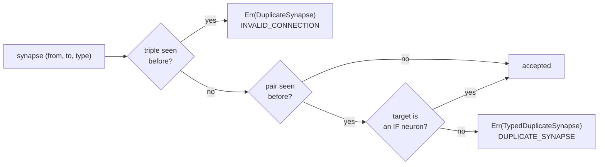
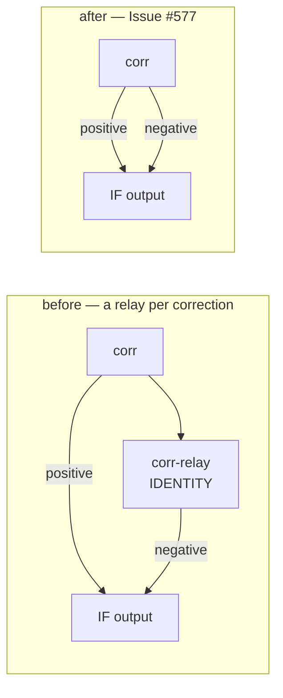

# Key synapses by `(from, to, type)`, relaxed for `IF` targets

## Summary

A synapse into an `IF` neuron carries a role and the kernel keeps one sum per
role, so a contribution that must apply **whichever way the node branches**
needs two synapses from the same source. Keying synapses by the ordered
`(from, to)` pair forbade that, and the workaround was an IDENTITY relay neuron
existing only to be a second distinct source — 455 of them had accumulated on a
production creature, and removing 415 was worth +4.96e-5 of score for behaviour
identical to 1.5e-9.

Uniqueness is now the `(from, to, type)` **triple**, and only an `IF` target may
carry more than one role from one source: every other squash sums its inward
synapses regardless of role, so two synapses from one source there are exactly
one with the summed weight — redundancy with no meaning. Canonical sort order
becomes `(from, to, type)` so it stays total. The wire format is unchanged
(`type` is already in the JSON) and every currently valid creature stays valid.

The two rejections carry **distinct codes**, as the issue asks, so a caller can
tell "you repeated yourself" from "that target cannot mean what you wrote":

| Creature | Export rule | Validator rule |
|----------|-------------|----------------|
| same `(from, to, type)` twice | `CreatureError::DuplicateSynapse` | `Topology` / `INVALID_CONNECTION` |
| pair repeated into a non-`IF` target | `CreatureError::TypedDuplicateSynapse` | `Validation` / `DUPLICATE_SYNAPSE` |

What changed, file by file:

- **`creature.rs`** — `validate_no_duplicate_synapses` keys the triple and looks
  up the target's squash through the new `is_if_squash` helper (which reads the
  name through `parse_squash_name` rather than comparing to a literal).
- **`creature_validate.rs`** — rule 25 sorts by `(from, to, type)`, rule 26 is
  the exact-triple repeat, and rule 26b is the pair repeated into a target that
  reads no roles. `synapse_walk` now takes the role buffer and fails loud on a
  length that does not match rather than silently unkeying the rule.
- **`topology_ops.rs`** — `validate_topology_typed` keys the index-level gate by
  role, with the new `SORT_ERROR_TYPE` code for roles out of order inside a
  repeated pair. The existing `validate_topology` is untouched for callers that
  hold no roles; both share one walk, so the two cannot drift.
- **`if_graft.rs`** — a node reaches **both** branches of an `IF` target from
  its own outward edges, so no relay neuron is created for that; the same source
  in the same role is still `DuplicateEdge`, and two roles into a non-`IF`
  target are the new `TypedDuplicateEdge`. `validate_creature_topology` now also
  runs `validate_no_duplicate_synapses`, which is the order-independent leg that
  knows what a *target* may mean.
- **`synapse_type.rs`** — `SynapseType` derives `Eq`, `Hash`, `PartialOrd` and
  `Ord`, since the role is now part of a key and of a sort order.

Closes #577.

## Evidence

Backend/CLI change with no web interface, so the evidence is the test suite and
`./quality.sh` — no screenshot applies.

The relay this removes, and what replaces it:

`./quality.sh` passes clean: fmt, clippy `-D warnings`, `cargo check`, 60 test
binaries, doctests, `cargo doc -D warnings`, `cargo deny`, Mermaid and
markdownlint gates.

Behaviour is proven, not just accepted:
`a_node_reaches_both_branches_of_an_if_target_without_a_relay` asserts the
relay-free creature produces the **same** correction for every record as the
relay version, with one fewer neuron and one fewer synapse.

## Test Plan

Existing tests that changed, because the rule they pinned changed — documented
here as required:

- `neat-core/tests/creature_duplicate_synapses.rs` —
  `compile_rejects_an_if_neuron_fed_three_times_by_one_constant` asserted the
  Issue #556 rule that one constant may not feed an `IF` neuron three times.
  That shape is exactly what Issue #577 legalises, so it is now
  `compile_accepts_an_if_neuron_fed_three_times_by_one_constant` and asserts the
  activation. The rejection it used to cover is kept by
  `compile_rejects_a_repeated_role_from_one_source` (an exact triple repeat),
  and the display / consumer-boundary tests now build their duplicate from that
  fixture instead.
- `neat-core/tests/if_graft.rs` —
  `rejects_two_synapses_between_the_same_pair` listed one source under two
  branches of the grafted `IF` node, which is now legal. Split into
  `accepts_one_source_under_two_branches_of_the_if_node` (asserting both
  branches' activations and the shared validator's verdict) and
  `rejects_two_synapses_between_the_same_pair_in_one_role`.

Added:

- `neat-core/tests/creature_duplicate_synapses.rs` —
  `a_repeated_source_keeps_one_sum_per_role` (the negative branch of the shared
  source), `compile_rejects_two_roles_from_one_source_into_a_non_if_target`.
- `neat-core/tests/creature_validate_synapse_rules.rs` —
  `one_source_may_carry_every_role_into_an_if_target` (half, whole entry point
  and forward-only leg), `a_repeated_role_into_an_if_target_is_still_an_invalid_connection`,
  `roles_out_of_order_within_one_pair_are_a_sort_failure`,
  `two_roles_into_a_non_if_target_are_a_duplicate_synapse` — each asserting the
  class, `reason`, message text and synapse index verbatim.
- `neat-core/tests/if_graft.rs` —
  `a_node_reaches_both_branches_of_an_if_target_without_a_relay`,
  `rejects_two_roles_into_a_target_that_is_not_an_if_neuron`,
  `rejects_one_role_repeated_into_an_if_target`.
- `neat-core/tests/creature_validate_packed_conformance.rs` —
  `one_source_carries_every_role_into_an_if_target_through_both_shapes` and
  `the_same_wiring_into_a_non_if_target_is_rejected_through_both_shapes`, so the
  role buffer is proven to reach the rules through the runtime **and** packed
  request shapes, not only the export form.
- `neat-core/src/topology_ops.rs` unit tests — the typed gate accepts one pair
  once per role (and the untyped gate still calls it a duplicate, which is why
  the forward-only leg had to pass roles), still rejects a repeated role,
  reports `SORT_ERROR_TYPE` for descending roles, resets the role when the pair
  advances, and reports a short role buffer as `MALFORMED_BUFFER`.
