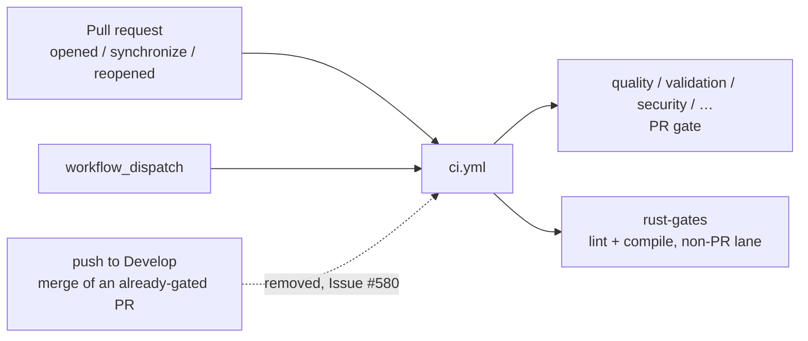

# PR summary — Issue #580

## Summary

`.github/workflows/ci.yml` is a test/lint gate, but it also fired on every push
to `Develop`. The default branch is PR-only — `.github/rulesets/develop.json`
requires a reviewed pull request and lists no bypass actors — so the only push
events `Develop` ever sees are merges of pull requests this same workflow had
already gated. That post-merge run was a duplicate: it burnt CI minutes on the
repo's heaviest workflow (the whole workspace compiles several times per run)
and could leave a red tick on the default branch for a check that had already
passed on the PR.

The `push:` trigger is dropped; `pull_request:` (including the `milestone/*`
filter from Issue #327) and `workflow_dispatch:` stay. This follows the
precedent already applied to `actionlint.yml` (Issue #314) and
`markdown-lint.yml` (Issue #316). Closes #580.

Nothing is lost on the PR lane. Every job except `rust-gates` either carries
`if: github.event_name == 'pull_request'` or no event guard at all, so all of
them still run on pull requests. `rust-gates` alone carried
`if: github.event_name != 'pull_request'` (Issue #337 — `quality` runs the
identical clippy invocation on PRs, so running both compiled the workspace
twice); with the push trigger gone, `workflow_dispatch` is its lane, giving an
on-demand lint + compile gate over the default branch.

## Evidence

Backend/CI-configuration change — no web interface to screenshot. The trigger
change:



Checks run locally (`bats` and PyYAML were fetched into the container; neither
is committed):

- `bats tests/scripts` — **393 tests, 0 failures** (the suite that owns the CI
  wiring assertions).
- `actionlint .github/workflows/ci.yml` — exit 0.
- `markdownlint-cli2 README.md` — 0 issues.
- `cargo-fmt --all -- --check`, `cargo-clippy --workspace --all-targets
  --all-features -- -D warnings`, `cargo test --workspace --lib --tests
  --all-features`, `cargo test --workspace --doc --all-features` — all pass
  (no Rust source is touched by this diff).

`./quality.sh` itself could not run to completion in this container: it stops
at its `cargo fmt --all` step with

```text
error: rustup could not choose a version of cargo-fmt to run, because one wasn't
specified explicitly, and no default is configured.
```

That is an environment fault (no `rustup` on `PATH`, no default toolchain), not
a fault in this change. The gate's remaining steps were therefore run directly
through the installed binaries, as listed above; every one passed. CI runs the
same checks on this PR.

## Test Plan

- **Added** `tests/scripts/ci_workflow.bats::ci workflow gates PRs only and
  does not re-run on push to Develop` — parses `ci.yml` and asserts
  `pull_request` and `workflow_dispatch` are present while `Develop` is absent
  from any `push.branches` filter. Observed **failing** against the unchanged
  workflow (`AssertionError: ['Develop']`) and passing after the trigger was
  removed.
- **Modified** `tests/scripts/rust_gates_workflow.bats` — two assertions
  encoded the old wiring and had to change with it; the change is documented in
  that file's header comment:
  - `ci workflow triggers on PRs and on pushes to Develop` →
    `ci workflow triggers on PRs and not on pushes to Develop`: it now requires
    the `pull_request` and `workflow_dispatch` triggers and the absence of a
    push-to-`Develop` trigger.
  - `ci workflow gates lint + compile on push (not pull_request only)` →
    `… off the PR lane too (not pull_request only)`: it still requires a single
    job carrying **both** the clippy `-D warnings` gate and the
    `cargo check --all-targets` gate and not restricted to pull requests, but
    asks whether that job runs on `workflow_dispatch` — the non-PR event the
    workflow keeps — instead of on `push`.

  No test was deleted or commented out, and the Issue #143 contract (one job
  carries both gates, off the PR lane) is unchanged.
- **Unchanged and still green**: the rest of `tests/scripts` (393 tests),
  including `ci_job_permissions`, `workflow_job_timeouts`,
  `workflow_checkout_credentials`, `workflow_concurrency_groups` and
  `workflow_sha_pinning`, all of which read `ci.yml`.

## Docs

- `README.md` — the `.github/workflows/ci.yml` row said the `rust-gates` job
  runs "on **every push to `Develop`**"; it now describes the PR /
  `workflow_dispatch` triggers and why the push lane went away.
- `ci.yml` — the header comment records the Issue #580 rationale, and the
  `rust-gates` and `typescript-gate` comments no longer claim a push lane that
  no longer exists.
