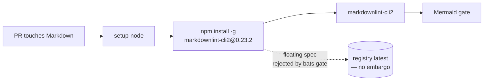

# PR Summary — Issue #581

## Summary

`.github/workflows/markdown-lint.yml` installed the linter with a floating
`npm install -g markdownlint-cli2`, so the job resolved whatever the registry
served at that instant: a hijacked release would have executed on the runner —
with the workflow `GITHUB_TOKEN` in scope — the moment it was published, with no
embargo. Dependabot's 7-day cooldown only covers manifests it can manage and a
`run:` block is not a manifest, so nothing quarantined this install.

The install is now pinned to the exact version `markdownlint-cli2@0.23.2`
(latest on npm, published 2026-07-27, well outside the 24h quarantine window),
mirroring the `GITLEAKS_VERSION` / `WASM_PACK_VERSION` pins already used by
`gitleaks.yml` and `wasm-bundle.yml`. A new bats assertion keeps the pin from
regressing. This repository has no Renovate configuration, so the issue's
suggested `customManagers` entry has nothing to attach to; the pin is bumped
deliberately, as the workflow comment states.

Closes #581.

## Evidence

No web interface is involved — this is a CI workflow and shell-test change, so
there is nothing to screenshot. The evidence is the test run below.

- `bats tests/scripts` — 394 tests, 0 failures (was 393 before this change).
- Mutation evidence for the new assertion — it was run against each spec form,
  with the workflow otherwise identical:

  | install line                                        | result |
  | --------------------------------------------------- | ------ |
  | `npm install -g markdownlint-cli2`                   | red    |
  | `npm install -g markdownlint-cli2@latest`            | red    |
  | `npm install -g markdownlint-cli2@^0.23.2`           | red    |
  | `npm install -g markdownlint-cli2@0.23`              | red    |
  | `npm install -g markdownlint-cli2@0.23.2`            | green  |
  | `npm i -g markdownlint-cli2@0.23.2`                  | green  |
  | `npm install -g "markdownlint-cli2@${MDL_VERSION}"`  | green  |

  The last row is the env-var pin form (`env: MDL_VERSION: "0.23.2"`), resolved
  by the assertion so a future move to that style is not a false positive.
- The new test was observed failing against the unfixed workflow
  (`AssertionError: npm install without an exact version pin:
  ['npm install -g markdownlint-cli2']`) and passing after the pin.
- `npm install markdownlint-cli2@0.23.2` resolves and reports
  `markdownlint-cli2 v0.23.2 (markdownlint v0.41.1)`; `markdownlint-cli2` at
  that version passes clean against the current tree.

## Quality gate

`./quality.sh` was run and stopped at the `cargo fmt` stage: this container's
`cargo-fmt` and `cargo-clippy` are rustup proxies with no default toolchain
configured (`error: rustup could not choose a version of cargo-fmt to run`),
and `rustup` itself is not installed, so those two stages cannot run here. Every
other stage was run and passed:

- bash syntax + shellcheck, `bats tests/scripts` (394 passed),
  `scripts/typescript-check.sh`, the Mermaid gate, `codespell`,
  `cargo deny check`, `cargo build --workspace`;
- `cargo check --workspace --all-targets --all-features` (clean) and
  `cargo test --workspace --lib --tests --all-features` — 811 passed, 0 failed.

This change touches no Rust source, so `cargo fmt`/`cargo clippy` have nothing
new to report; CI runs both on the PR.

## Test Plan

- Added `tests/scripts/markdown_lint_workflow.bats::markdown-lint workflow pins
  every npm install to an exact version` — parses the workflow, resolves any
  version held in a step's own `env:` block, and fails on any `npm install`/`i`/
  `add` package spec that is unpinned, a dist-tag, a range, or a partial version.
