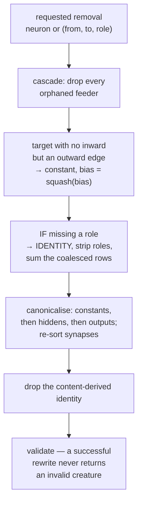

## Summary

Step 1 of the canonical pruning rewrite engine (Issue #587): NEAT-AI's
battle-tested TypeScript removal semantics are captured as Rust fixtures
against `CreatureExport`, so the shared helpers that follow have a recorded
"before" to be graded on. Closes #588.

- `neat-core/src/prune_fixtures.rs` — eight `(before, request, after)` triples
  where the `after` half is the creature NEAT-AI's own `SubNeuron` /
  `SubConnection` operators produced, each carrying its provenance (`rule`,
  `ts_source`, `ts_test`) as data.
- `neat-core/tests/prune_parity.rs` — 19 tests pinning every rule those
  captures encode, plus the four that hold across all eight.
- `docs/research/pruning-parity-matrix.md` — the parity matrix, the capture
  harness, and what is deliberately not captured.
- README gains a "Pruning parity fixtures (Issue #588)" section.

Nothing in this change prunes. `PruneCase::after` is the acceptance oracle the
helpers in Issues #590 / #591 are graded against —
`prune(case.before(), case.request) == case.after()`.

## Evidence

Backend/library change with no web interface to screenshot. The evidence is the
capture provenance and the test run.

**Captures are TypeScript's own output**, not hand-derived: each `before` was
loaded with `Creature.fromJSON`, the real operator run 400 times from a fresh
copy, the distinct outcomes grouped by which neuron or synapse the operator
picked, and the outcome matching the case's `request` recorded. Both halves
were `creatureValidate`d TypeScript-side. NEAT-AI `7.0.25`. The harness is
committed in the matrix doc so the captures can be re-derived.

**Test run** — `cargo test -p neat-core --test prune_parity`: 19 passed, 0
failed. Full `./quality.sh` gate passed (fmt, clippy `-D warnings`, check,
`cargo test --workspace`, doctests, `cargo doc -D warnings`, release build,
`cargo deny`, shellcheck, bats, deno TypeScript and Mermaid gates).

**Mutation evidence** (AGENTS.md oracle rule 2) — each fixture mutated one at a
time, suite re-run, mutation reverted. No blind spots:

| Mutation | Result |
|---|---|
| cascade leaves the orphaned feeder `h-a` behind | RED — `no_orphan_neuron_survives_a_rewrite`, `removing_a_neuron_cascades_through_every_orphaned_feeder`, `every_captured_pair_is_a_creature_the_shared_validator_accepts` |
| converted constant keeps its unfolded bias (`0.5986… → 0.4`) | RED — `a_target_that_loses_its_last_inward_edge_folds_its_squash_into_a_constant` |
| removing one role takes the whole pair | RED — `removing_one_role_keeps_the_other_role_of_the_same_pair`, `the_other_roles_of_the_requested_pair_are_left_alone`, plus 2 |
| IF repair leaves the coalesced rows apart | RED — `an_if_that_loses_a_role_is_downgraded_and_its_rows_are_summed`, `every_captured_pair_is_a_creature_the_shared_validator_accepts` |
| converted constant left after the hidden | RED — `a_converted_constant_moves_ahead_of_the_hidden_neurons`, `the_computational_slice_stays_constants_then_hiddens_then_outputs`, plus 2 |
| bias fold short (`0.35 → 0.30`) | RED — `the_constant_bias_fold_leaves_the_creature_scoring_identically` |
| memetic record survives the removal | RED — `a_rewrite_sheds_the_content_derived_memetic_record`, `a_memetic_record_naming_removed_structure_is_dropped_whole` |
| synapses left out of canonical order | RED — `synapses_come_back_in_canonical_from_to_role_order`, `a_source_left_with_nothing_to_feed_is_removed`, plus 1 |
| a capture arrives with no TypeScript provenance | RED — `every_case_names_the_typescript_behaviour_it_captures` |
| the memetic capture's topology drifts from the cascade it reuses | RED — `the_memetic_capture_differs_from_the_cascade_capture_only_by_the_record` |
| no captured case keeps an `IF` neuron (vacuity guard) | RED — `every_surviving_if_neuron_still_carries_its_three_roles`, plus 2 |

The two case-specific oracles are independent derivations, not fixture
restatements (AGENTS.md oracle rules 1 and 3): the hidden→constant fold is
checked against the documented logistic computed in `f64` and cross-checked
against this crate's `apply_squash` at `f32` precision; the constant bias fold
is checked by activating **both** halves through `compile_creature` and
asserting the outputs agree.

## Acceptance Criteria

<!-- vibe-spec-review inputs="diff+issue-body" -->

- **partial** — Tests come first and should fail until the shared Rust pruning helpers exist — evidence: `neat-core/tests/prune_parity.rs` (19 tests, all green) — reviewer: missing — reason: the reviewer is right that no test is red today, and I departed deliberately: AGENTS.md makes a green `cargo test --workspace` and `./quality.sh` the merge gate, so a committed red suite cannot land here. The captured `after` halves are the red-capable oracle the helpers meet in #590 / #591; the departure is stated in `prune_fixtures.rs:12-16` and the matrix doc rather than left implicit.
- **met** — remove hidden neuron + orphan cascade — evidence: `neat-core/src/prune_fixtures.rs::CASCADE_ORPHAN_FEEDERS`, `prune_parity.rs::removing_a_neuron_cascades_through_every_orphaned_feeder` — reviewer: met
- **met** — remove edge + target becomes constant — evidence: `EDGE_TARGET_BECOMES_CONSTANT`, `prune_parity.rs::a_target_that_loses_its_last_inward_edge_folds_its_squash_into_a_constant` — reviewer: met
- **met** — remove edge + source becomes dead — evidence: `EDGE_SOURCE_BECOMES_DEAD`, `prune_parity.rs::a_source_left_with_nothing_to_feed_is_removed` — reviewer: met
- **met** — typed edge identity (remove only the requested role) — evidence: `EDGE_ROLE_IDENTITY`, `prune_parity.rs::removing_one_role_keeps_the_other_role_of_the_same_pair` and the generic `the_other_roles_of_the_requested_pair_are_left_alone` with its non-vacuity guard — reviewer: met
- **partial** — IF structural repair — evidence: `IF_REPAIR_COALESCES_ROLES`, `prune_parity.rs::an_if_that_loses_a_role_is_downgraded_and_its_rows_are_summed` — reviewer: partial — reason: the downgrade-and-coalesce branch is captured; the refusal path (`#wouldBreakIfNeuron`) and the `indx <= 2` exclusion need a request the helper must *reject*, which `PruneRequest` cannot express until the synapse rewrites land — now recorded under "Not captured" in the matrix.
- **met** — stable canonical ordering after topology changes — evidence: `CONSTANT_MOVES_INTO_PREFIX`, `prune_parity.rs::the_computational_slice_stays_constants_then_hiddens_then_outputs` and `synapses_come_back_in_canonical_from_to_role_order` — reviewer: met
- **partial** — content identity / memetic invalidation semantics where represented in core — evidence: `MEMETIC_DROPPED_ON_REMOVAL`, `prune_parity.rs::a_rewrite_sheds_the_content_derived_memetic_record` — reviewer: partial — reason: `CreatureExport` carries no creature-level `uuid`, so only the memetic half is representable; the docs previously claimed both and now say so explicitly.
- **partial** — validation after every successful rewrite — evidence: `prune_parity.rs::every_captured_pair_is_a_creature_the_shared_validator_accepts` (`creature_validate`, `validate_creature_topology`, `validate_no_duplicate_synapses`, `compile_creature` over both halves of all eight cases) — reviewer: partial — reason: with no rewrite to run yet, the rule is asserted on the captured output rather than on a helper's return value.
- **partial** — capture source behaviour including the discovery removal/compensation paths — evidence: `CONSTANT_BIAS_FOLD` from `DiscoveryNeuronRemoval.ts::applyMeanBiasFold` — reviewer: partial — reason: the variance-aware weight redistribution needs Discovery statistics no `CreatureExport` carries, so it is deferred to #590 and listed under "Not captured".
- **met** — Acceptance: a documented parity matrix maps each TypeScript behaviour/test to a Rust fixture — evidence: `docs/research/pruning-parity-matrix.md` — reviewer: met — reason: the reviewer found one wrong row (`CompactKeepOrder.ts` does not exercise the constant-prefix move); corrected here to `ForwardOnlyTopologyAfterBulkRemap.ts` / `CreatureValidate.ts`, in both the doc and the fixture data.
- **unrequested** — a JSON round-trip test over both halves of every fixture (`prune_parity.rs::every_captured_creature_round_trips_through_its_json`) — reviewer: unrequested — reason: kept — a fixture that does not survive `creature_to_json` → `parse_creature_json` is not a usable oracle for the helpers, and it costs three lines.
- **unrequested** — `PruneCase::output_preserving` and the activation sweep in `the_constant_bias_fold_leaves_the_creature_scoring_identically` — reviewer: unrequested — reason: kept — this is the independent oracle for the compensation case; without it that fixture's numbers would only be restated, not derived.
- **unrequested** — new public crate API (`PRUNE_PARITY_CASES`, `PruneCase`, `PruneRequest` re-exported from `lib.rs`) — reviewer: unrequested — reason: kept — the fixtures must be reachable from the consumers that will grade the helpers, exactly as `decision_tree.rs` is re-exported for Issue #555.

## Standards Review

<!-- vibe-standards-review inputs="diff+CODING-STANDARDS.md" -->

- **violation** — the Issue #588 comment labelled the wrong re-export block — evidence: `neat-core/src/lib.rs:99` — reason: fixed here; the comment now sits on `pub use prune_fixtures::{…}`.
- **violation** — the matrix claimed its table was "generated from the fixtures" when it is hand-maintained, and `rule` / `ts_source` / `ts_test` were written but never read — evidence: `docs/research/pruning-parity-matrix.md:22`, `neat-core/src/prune_fixtures.rs:102-108` — reason: fixed here — the wording now says the fixture data is authoritative and the table restates it, and `every_case_names_the_typescript_behaviour_it_captures` makes those fields load-bearing (mutation-checked red).
- **violation** — `every_surviving_if_neuron_still_carries_its_three_roles` had no non-vacuity guard, unlike the two guarded tests beside it — evidence: `neat-core/tests/prune_parity.rs:348` — reason: fixed here; the guard is mutation-checked (removing the last `IF` turns it red).
- **violation** — the `uuid` half of the identity rule was stated as captured but is not representable in `CreatureExport` — evidence: `neat-core/src/prune_fixtures.rs:44`, `:453`, `docs/research/pruning-parity-matrix.md:36` — reason: fixed here; all three now say core represents only `memetic`, and the omission is listed under "Not captured".
- **violation** — "`exportJSON()` verbatim" over-described a transcription, and the capture harness was not committed, so the captures could not be re-derived — evidence: `docs/research/pruning-parity-matrix.md:57`, `neat-core/src/prune_fixtures.rs:29` — reason: fixed here; the wording is now "transcribed … re-indented, `forwardOnly` added, everything else unchanged" and the harness is committed in the matrix doc.
- **violation** — `MEMETIC_DROPPED_ON_REMOVAL` duplicates `CASCADE_ORPHAN_FEEDERS` and could drift — evidence: `neat-core/src/prune_fixtures.rs:451-494` — reason: the duplication is deliberate (it isolates the record as the only variable) and is now both documented and pinned by `the_memetic_capture_differs_from_the_cascade_capture_only_by_the_record`, which goes red on a one-digit drift.
- **violation** — no red-first run is possible and the named oracle `prune(before, request) == after` is nowhere exercised — evidence: `neat-core/tests/prune_parity.rs` (whole file) — reason: stands, and is stated in the Acceptance block above rather than left implicit; a committed red suite cannot land under this repo's own merge gate, and the helper it would call does not exist until #590 / #591.
- **clean** — Australian English throughout (no `behavior` / `normalize` / `analyze` hits); no hidden paths staged; tests drive real code (`parse_creature_json`, `creature_validate`, `validate_creature_topology`, `compile_creature`, `CompiledNetwork::activate`, `apply_squash`) with no source greps or private-field pokes; oracle rule 1 respected (the logistic oracle and the wire-index derivation are independent of the kernels they check); oracle rule 3 respected (every expected value derived and documented, no `is_finite()` or magic lengths); every public item documented and `cargo doc -D warnings` clean; docs updated alongside the code; fixtures-in-`src` follows the `decision_tree.rs` precedent and touches no `Cargo.toml`, profile, wasm, `unsafe` or SIMD surface.

## Test Plan

Added `neat-core/tests/prune_parity.rs` (19 tests):

Rules every capture obeys — `every_captured_pair_is_a_creature_the_shared_validator_accepts`,
`every_captured_creature_round_trips_through_its_json`,
`the_requested_structure_is_present_before_and_gone_after`,
`the_other_roles_of_the_requested_pair_are_left_alone`,
`no_orphan_neuron_survives_a_rewrite`,
`the_computational_slice_stays_constants_then_hiddens_then_outputs`,
`synapses_come_back_in_canonical_from_to_role_order`,
`every_surviving_if_neuron_still_carries_its_three_roles`,
`a_rewrite_sheds_the_content_derived_memetic_record`,
`every_case_names_the_typescript_behaviour_it_captures`,
`the_memetic_capture_differs_from_the_cascade_capture_only_by_the_record`.

The rule each case was captured for — `removing_a_neuron_cascades_through_every_orphaned_feeder`,
`a_target_that_loses_its_last_inward_edge_folds_its_squash_into_a_constant`,
`a_source_left_with_nothing_to_feed_is_removed`,
`removing_one_role_keeps_the_other_role_of_the_same_pair`,
`an_if_that_loses_a_role_is_downgraded_and_its_rows_are_summed`,
`a_converted_constant_moves_ahead_of_the_hidden_neurons`,
`a_memetic_record_naming_removed_structure_is_dropped_whole`,
`the_constant_bias_fold_leaves_the_creature_scoring_identically`.

No existing test was modified or removed.
