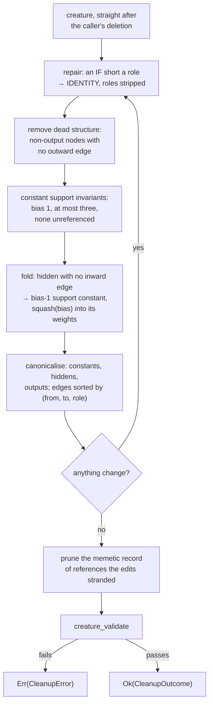

# Canonical fixed-point cleanup and constant support invariants (Issue #589)

## Summary

`neat-core/src/prune_cleanup.rs` adds `cleanup_creature` — the one deterministic
cleanup entry point every prune operation (Issues #590 / #591) calls after its
requested deletion. It takes the creature **as the caller left it**, repairs it
to a fixed point, and validates the stable result before returning it, so a
successful call can never hand a caller an invalid creature. Closes #589.

What one call does, repeated until nothing changes:

| Pass | Rule |
|------|------|
| repair | an `IF` short a required role is downgraded to `IDENTITY` and its inward roles stripped |
| dead structure | every non-output hidden/constant node with no outward edge goes, recursively |
| constant support | bias exactly `1`, at most three constants, none unreferenced |
| fold | a hidden node with no inward edge becomes a bias-1 support constant, its `squash(bias)` folded into its outward **weights** |
| canonicalise | constants, then hiddens, then outputs; roles stripped where unreadable; duplicate rows coalesced; synapses sorted by `(from, to, role)` |

Observation (input) and output neurons are never removed, rewritten or
reordered. The memetic record is pruned of exactly the references the edits
stranded (rule 31's inverse, `prune_memetic`), rather than dropped wholesale, so
the fine-tuning history survives.

**Every rewrite is exact.** A constant of value `b` on an edge of weight `w` is
the bias-1 constant on weight `w · b`; a hidden node that sums nothing activates
to a fixed value on every record — `squash(bias)` for a point-wise squash, and
what `zero_inward_activation` spells out arm by arm for the aggregates — so that
value belongs in its outward weights.
Merging two edges from one constant is exact where the target **sums** its
inward terms, and at `MINIMUM`/`MAXIMUM` where a constant term *is* its weight —
but a `MEAN` divides by its inward count and a `HYPOT` squares each term, so
cleanup refuses to merge there and keeps the constants apart. Correctness
outranks the constant budget.

Where the budget of three constants cannot be reached **exactly** — five
constants reading one `MEAN` cannot merge without moving the divisor —
`CleanupOutcome::surplus_constants` names what is left over rather than cleanup
forcing the quota and changing the creature's output.

**Deliberate divergence from the TypeScript captures.** NEAT-AI writes the
folded value into the constant's *bias* (`prune_fixtures.rs`); the canonical
Rust form holds the constant support invariants instead (Ockham #180). The two
are the same function of the inputs, which is what the tests assert — see
Evidence.

## Evidence

Backend library change; there is no web interface to screenshot. The evidence is
the test suite, the activation oracle and the mutation sweep below.

### The oracles

Neither oracle is a second copy of the implementation:

- **the function itself** — a creature with a stranded hidden neuron still
  computes a well-defined number for every record, so
  `assert_same_function` compiles and activates the *pre-cleanup* creature and
  the cleaned one and asserts they agree on five probes. Only an exact rewrite
  passes.
- **the TypeScript captures** (Issue #588) — `CASCADE_ORPHAN_FEEDERS` and
  `IF_REPAIR_COALESCES_ROLES` are reproduced **byte for byte**
  (`assert_eq!(outcome.creature, case.after())`); the two capture pairs that
  carry a folded constant are graded on activation equality, because the
  canonical form deliberately differs. The folded weight itself is checked
  against the documented logistic computed in `f64` **in the test**, not read
  back out of the squash kernel the fold uses.

### Mutation evidence (AGENTS.md rule 2)

**33 mutations**, applied one at a time to `prune_cleanup.rs` (one to
`if_graft.rs`, for the shared sort key it now reuses) and reverted after each
run. **31 were killed**; the two survivors are named below with why. The first
test listed is the one that caught it.

| Mutation | Killed by |
|---|---|
| M1 dead-structure removal disabled | `a_multi_level_cascade_removes_every_orphaned_feeder` |
| M2 zero-inward fold disabled | `a_folded_constant_moves_ahead_of_the_hidden_neurons` |
| M3 fold uses the raw bias, not the squashed one | `a_hidden_neuron_with_no_inward_edge_folds_its_value_into_its_outward_weights` |
| M4 `IF` repair disabled | `an_if_that_loses_a_required_role_is_downgraded_and_its_rows_are_summed` |
| M5 duplicate-edge coalescing disabled | `an_if_that_loses_a_required_role_is_downgraded_and_its_rows_are_summed` |
| M6 constants-then-hiddens ordering disabled | `a_fold_behind_a_surviving_hidden_neuron_moves_into_the_constant_prefix` |
| M7 synapse sort disabled | `a_surplus_of_constants_is_merged_down_to_the_budget` |
| M8 constant rescale keeps the old weights | `a_constant_carrying_its_value_in_its_bias_is_rescaled_into_its_weights` |
| M9 constant budget not enforced | `no_creature_comes_back_with_more_than_three_constants` |
| M10 support-constant reuse disabled | `a_fold_reuses_an_existing_support_constant_rather_than_adding_one` |
| M11 `MEAN` treated as a summing target | `a_mean_target_keeps_one_edge_per_folded_source` |
| M12 `MINIMUM` merge sums instead of taking the smaller term | `a_minimum_target_merges_two_constant_terms_to_the_smaller_weight` |
| M13 role stripping at non-`IF` targets disabled | `roles_are_stripped_and_summed_at_a_target_that_cannot_read_them` |
| M14 memetic record left dangling | `the_memetic_record_is_pruned_of_the_structure_the_cleanup_removed` |
| M15 constant-with-inward check removed | `a_constant_with_an_inward_edge_is_refused_rather_than_repaired` |
| M16 final validation skipped | `a_creature_cleanup_cannot_make_valid_is_reported_not_returned` |
| M17 fixed point after a single pass | `a_multi_level_cascade_removes_every_orphaned_feeder` |
| R1 constant budget raised to four | `the_constant_budget_is_three` |
| R2 `MAXIMUM` merge rule removed | `a_maximum_target_merges_two_constant_terms_to_the_larger_weight` |
| R3 `HYPOT` dropped from the never-merge set | `a_hypotenuse_target_keeps_one_edge_per_folded_source` |
| R4 constant-source guard dropped from the `MIN`/`MAX` merge | `a_merge_that_could_not_be_exact_is_refused_rather_than_guessed` |
| R5 `canonical_role` ignores the target squash | `a_fold_will_not_reuse_a_constant_the_target_cannot_tell_it_apart_from` |
| R6 synapse-targets-input guard removed | `a_synapse_pointing_at_an_observation_neuron_is_refused` |
| R7 duplicate-UUID guard removed | `a_canonical_creature_comes_back_untouched` |
| R8 non-finite weight guard removed | `a_non_finite_weight_is_refused` |
| R9 `IF` repair stops consulting the shared invariant | `an_if_that_loses_a_required_role_is_downgraded_and_its_rows_are_summed` |
| R10 role dropped from the shared canonical sort key (`if_graft.rs`) | `a_surviving_if_comes_back_with_its_roles_in_canonical_order` |
| S1 fold trusts `apply_squash` again — **the bug the spec review found** | `a_fold_reproduces_the_forward_pass_for_every_squash` |
| S2 `HYPOTv2` folds the bias instead of zero | `a_fold_reproduces_the_forward_pass_for_every_squash` |
| S3 the aggregate arm dropped, falling back to `apply_squash` | `a_fold_reproduces_the_forward_pass_for_every_squash` |
| S5 the surplus over budget is never reported | `a_budget_the_maths_will_not_allow_is_reported_rather_than_forced` |

**The two survivors, and why they stay.** Both are guards restating an
invariant at the point it is relied on, unreachable while the passes run in
their documented order:

- **S4** — dropping `apply_limit_range` from the fold. `apply_squash` already
  bounds its own outputs and a finite bias is in range for every aggregate arm,
  so the clamp is a no-op for any bias `check_references` admits. It stays so
  the mirror of `CompiledNetwork::activate` is complete rather than
  approximately complete, and it is documented as such at the call site.
- **S6** — dropping the `bias == 1` half of `is_support_constant`.
  `normalise_constants` runs before any merge in every pass, so the check does
  not reject anything today; it stays so a future pass reorder cannot silently
  make `min(w1, w2)` the wrong term, and it says so in its doc comment.

Both surviving mutations are **safety belts, not untested behaviour** — the
behaviour each protects is covered by R4 and the exactness sweep.

Every mutation was reverted before the commit; `git status` is clean.

### Gate

`./quality.sh` passes in full (fmt, clippy `-D warnings`, `cargo check`,
**878** workspace tests, 9 doctests, `cargo doc -D warnings`, `cargo deny`,
bats, Mermaid, release build).

## Acceptance Criteria

<!-- vibe-spec-review inputs="diff+issue-body" -->

- **met** — recursively remove non-output hidden/constant nodes with no outward references — evidence: `neat-core/src/prune_cleanup.rs::Engine::remove_dead_structure`, tests `a_multi_level_cascade_removes_every_orphaned_feeder`, `a_long_chain_of_orphaned_feeders_is_cleaned_in_one_call` — reviewer: met — reason: the reviewer qualified this "met (literal)" — a *recurrent* island whose members all feed each other has outward references and survives. In a `forwardOnly` creature (every creature this fleet trains) "no outward edge" and "no output can read it" are the same statement, so the sweep is complete there; the limitation is now stated in the module docs under "Two boundaries worth naming" rather than left implicit.
- **met** — convert hidden nodes with no inward references into mathematically exact constants using `squash(bias)` — evidence: `neat-core/src/prune_cleanup.rs::zero_inward_activation`, test `a_fold_reproduces_the_forward_pass_for_every_squash` — reviewer: partial — reason: the reviewer was right and this was a **real bug**: the fold used `apply_squash`, which documents itself as a single-value *fallback* for the aggregate squashes, so a stranded `HYPOT` (activates to `bias`) and `HYPOTv2` (activates to `0`) folded to `|bias|`. Fixed in `26a9a86`; the new sweep over all 38 squashes × 7 biases fails against the old code.
- **met** — all constants bias = 1 — evidence: `every_surviving_constant_is_a_bias_one_support_node`, `a_constant_carrying_its_value_in_its_bias_is_rescaled_into_its_weights` — reviewer: met
- **met** — reuse compatible constants — evidence: `a_fold_reuses_an_existing_support_constant_rather_than_adding_one`, `many_stranded_hidden_neurons_share_a_single_support_constant` (50 folds, one constant) — reviewer: met
- **met** — remove unreferenced constants — evidence: `a_constant_the_cut_left_unreferenced_is_removed`, `a_constant_another_branch_still_reads_is_kept` — reviewer: met
- **partial** — at most three constants per creature — evidence: `the_constant_budget_is_three`, `a_budget_the_maths_will_not_allow_is_reported_rather_than_forced` — reviewer: partial — reason: the cap holds wherever a merge is exact, but five constants reading one `MEAN` cannot merge without moving the divisor, and no weight can compensate for that. The reviewer's objection was that the diff "neither enforces it nor reports that it was abandoned" — the second half is now fixed: `CleanupOutcome::surplus_constants` names every constant left over budget. Cleanup will not change what a creature computes to reach a structural quota.
- **met** — preserve observation/input and output nodes — evidence: `observation_and_output_neurons_are_never_removed` — reviewer: met
- **met** — canonicalise ordering/edge representation after topology edits — evidence: `the_computational_slice_comes_back_constants_then_hiddens_then_outputs`, `synapses_come_back_in_canonical_from_to_role_order`, `a_surviving_if_comes_back_with_its_roles_in_canonical_order` — reviewer: met
- **met** — repeat until no further change occurs — evidence: `cleanup_reaches_a_fixed_point_and_stays_there`, `cleanup_is_deterministic`, `a_canonical_creature_comes_back_untouched` — reviewer: met
- **met** — validate the stable result before returning — evidence: `cleanup_never_returns_an_invalid_creature`, `a_creature_cleanup_cannot_make_valid_is_reported_not_returned` — reviewer: met — reason: the result now passes `validate_creature_topology` as well as `creature_validate`, which is what the sibling `if_graft::validated` does.
- **met** — TDD from the #588 parity fixtures, with cascades, shared subgraphs, zero-input hidden nodes, unreferenced constants and repeated cleanup — evidence: the eleven-scenario table plus the case tests listed under Test Plan — reviewer: partial — reason: the reviewer's objection was depth, not coverage — the exactness oracle exercised only `LOGISTIC`/`TANH`/`IDENTITY` folds and no scenario reached the cap refusal, which is exactly why the `HYPOT` bug and the silent surplus survived. Both gaps now have tests.
- **met** — one deterministic cleanup entry point in `neat-core` that never returns an invalid creature — evidence: `neat-core/src/lib.rs` exports `cleanup_creature`; `cleanup_is_deterministic`, `cleanup_never_returns_an_invalid_creature` — reviewer: met
- **unrequested** — `IF` repair: an `IF` short a required role is downgraded to `IDENTITY` and its inward roles stripped — reviewer: unrequested — reason: kept. It is the only inexact rewrite here, but without it a cascade that takes an `IF`'s last condition leaves a creature the structural gate rejects, so "never returns an invalid creature" cannot hold without it. It reproduces the `IF_REPAIR_COALESCES_ROLES` capture byte for byte.
- **unrequested** — role stripping and edge coalescing at non-`IF` targets, with the `MergeRule` arithmetic — reviewer: unrequested — reason: kept as "canonicalise edge representation". A role is unreadable outside an `IF`, so two roles of one pair are one edge written twice — the shape `compile_creature` refuses; the merge arithmetic is what makes coalescing exact instead of approximate.
- **unrequested** — memetic pruning (`result.prune_memetic()`) — reviewer: unrequested — reason: kept. Validation rule 31 refuses a creature whose memetic record names structure that is gone, so a cleanup that removes structure must prune it or return something invalid. It reuses the crate's own fine-grained prune (NEAT-AI-Lamarck#197) rather than dropping the record.
- **unrequested** — `CleanupOutcome` telemetry (`changed`, `passes`, the removal/fold/merge/surplus lists) — reviewer: unrequested — reason: kept. Issue #587's ownership boundary requires a structured result describing "requested removal, cascade, compensations"; #590 / #591 report it to their callers.
- **unrequested** — input pre-validation with seven typed `CleanupError` variants — reviewer: unrequested — reason: kept. These are defects in the creature as supplied (an edge naming a neuron that never existed, a bias that is not a number), not wreckage a removal left, and failing loudly beats folding a `NaN`.
- **unrequested** — the README section and the parity-matrix note — reviewer: unrequested — reason: kept; a code change owes a docs change, and the divergence from two #588 captures needs a written home.
- **unrequested** — byte-level divergence from two of the #588 captures, graded on activation instead — reviewer: unrequested — reason: kept, and it is forced: a capture carrying a folded value in a constant's *bias* cannot also satisfy "every constant has bias 1". The two forms are the same function, which is what the tests assert; the cascade and `IF` captures still match byte for byte.

## Standards Review

<!-- vibe-standards-review inputs="diff+CODING-STANDARDS.md" -->

- **violation** — the documented budget of three was pinned by tests that imported `MAX_SUPPORT_CONSTANTS` as their own expected value, so raising it to four kept the suite green (oracle rule 1 / rule 3) — evidence: `neat-core/tests/prune_cleanup.rs::the_constant_budget_is_three` — reason: fixed here; the test now asserts the literal `3` and a four-constant creature coming back with three.
- **violation** — the `MAXIMUM` merge rule, the `HYPOT` never-merge rule, the `MIN`/`MAX` constant-source guard, `canonical_role` and the role leg of the canonical sort were reachable by no test (rule 2) — evidence: `neat-core/src/prune_cleanup.rs::merge_rule`, `::canonical_role` — reason: fixed here; `a_maximum_target_merges_two_constant_terms_to_the_larger_weight`, `a_hypotenuse_target_keeps_one_edge_per_folded_source`, `a_merge_that_could_not_be_exact_is_refused_rather_than_guessed`, `a_fold_will_not_reuse_a_constant_the_target_cannot_tell_it_apart_from` and `a_surviving_if_comes_back_with_its_roles_in_canonical_order` each kill their mutation.
- **violation** — five typed `CleanupError` variants had no test at all, against the neighbouring convention that every typed rejection is pinned — evidence: `neat-core/src/prune_cleanup.rs::CleanupError` — reason: fixed here; `SynapseTargetsInput`, `DuplicateUuid`, `UnknownNeuronType`, `NonFiniteWeight` and `InexactMerge` now each have a test. `NotStable` remains untested: it is the fixed-point cap, unreachable unless this module has a defect, and it is documented as such.
- **violation** — a vacuous `assert!(!failure.message.is_empty())` (rule 3), which passes against any validation failure whatsoever — evidence: `neat-core/tests/prune_cleanup.rs::a_creature_cleanup_cannot_make_valid_is_reported_not_returned` — reason: fixed here; it now asserts the failure names `RECURSIVE_SYNAPSE`, the rule the backward edge actually breaks.
- **violation** — `repair_if_neurons` restated `topology_invariants::IfRoles::tally` verbatim and hard-coded `3` instead of `IF_MINIMUM_INWARD`, a third copy of a rule whose single home is documented — evidence: `neat-core/src/prune_cleanup.rs::Engine::repair_if_neurons` — reason: fixed here; it calls `IfRoles::tally` and `if_neuron_fault`.
- **violation** — `sort_synapses` re-implemented `if_graft::sort_synapses_canonically` and its `input-N` index map — evidence: `neat-core/src/prune_cleanup.rs::Engine::sort_synapses` — reason: fixed here; it calls the shared helper and only compares before/after to report whether the order moved.
- **violation** — the production path gated on `creature_validate` only, while the test file added `validate_creature_topology` itself, so the suite was stricter than the shipped function — evidence: `neat-core/src/prune_cleanup.rs::cleanup_creature` — reason: fixed here; both gates run before any creature is returned, with a `CleanupError::MalformedResult` for the second.
- **violation** — the first PR summary claimed seventeen mutations, all killed, and that no rule was pinned by a test that cannot fail; the review found ten more that were — evidence: this file — reason: fixed here; the mutation record below is the full 33, including the two that survive and why.
- **clean** — Australian English throughout code, comments and docs; every public item documented with `# Errors` and a runnable doctest on the entry point; no `unwrap`/`expect`/`panic!`/`unsafe` in the module and every error path returns without a creature; tests drive the public API and never grep source; `assert_same_function` and the `f64` logistic are independent oracles rather than the kernel under test; behaviour-named tests; no hidden files staged; the width contract reuses `validate_creature_width`.

## Test Plan

`neat-core/tests/prune_cleanup.rs` — 48 tests, all new:

- **rules over a ten-scenario table** (multi-level cascade, shared subgraph,
  zero-input hidden, unreferenced constant, five constants, constant prefix,
  aggregate targets, `IF` missing a condition, unfed output, a fold behind a
  hidden, and an already-canonical creature):
  `cleanup_never_returns_an_invalid_creature`,
  `an_exact_cleanup_computes_the_same_numbers_as_the_creature_it_was_given`,
  `every_surviving_constant_is_a_bias_one_support_node`,
  `no_creature_comes_back_with_more_than_three_constants`,
  `no_orphan_survives_cleanup`,
  `the_computational_slice_comes_back_constants_then_hiddens_then_outputs`,
  `synapses_come_back_in_canonical_from_to_role_order`,
  `cleanup_reaches_a_fixed_point_and_stays_there`, `cleanup_is_deterministic`,
  `observation_and_output_neurons_are_never_removed`,
  `every_captured_typescript_result_settles_into_the_canonical_form`
- **cascade and shared structure**:
  `a_multi_level_cascade_removes_every_orphaned_feeder` (byte-equal to the
  TypeScript capture), `a_shared_subgraph_keeps_the_branch_that_is_still_read`
- **the constant fold**: `a_fold_reproduces_the_forward_pass_for_every_squash`
  (all 38 squashes × 7 biases, graded by activating the network),
  `a_hidden_neuron_with_no_inward_edge_folds_its_value_into_its_outward_weights`,
  `a_fold_reuses_an_existing_support_constant_rather_than_adding_one`,
  `a_fold_behind_a_surviving_hidden_neuron_moves_into_the_constant_prefix`,
  `a_folded_constant_moves_ahead_of_the_hidden_neurons`,
  `a_fold_will_not_reuse_a_constant_the_target_cannot_tell_it_apart_from`
- **constant support invariants**:
  `a_constant_the_cut_left_unreferenced_is_removed`,
  `a_constant_another_branch_still_reads_is_kept`,
  `a_surplus_of_constants_is_merged_down_to_the_budget`,
  `a_constant_carrying_its_value_in_its_bias_is_rescaled_into_its_weights`,
  `the_constant_budget_is_three`,
  `a_budget_the_maths_will_not_allow_is_reported_rather_than_forced`
- **aggregate targets**: `a_mean_target_keeps_one_edge_per_folded_source`,
  `a_minimum_target_merges_two_constant_terms_to_the_smaller_weight`,
  `a_maximum_target_merges_two_constant_terms_to_the_larger_weight`,
  `a_hypotenuse_target_keeps_one_edge_per_folded_source`,
  `two_roles_into_an_aggregate_target_are_never_folded_together`
- **`IF` repair and roles**:
  `an_if_that_loses_a_required_role_is_downgraded_and_its_rows_are_summed`
  (byte-equal to the TypeScript capture),
  `an_if_that_still_has_all_three_roles_is_left_alone`,
  `roles_are_stripped_and_summed_at_a_target_that_cannot_read_them`
- **the record and the report**:
  `the_memetic_record_is_pruned_of_the_structure_the_cleanup_removed`,
  `cleanup_reports_the_structure_it_removed`,
  `a_canonical_creature_comes_back_untouched`
- **failing closed**: `a_synapse_naming_a_neuron_that_does_not_exist_fails_loudly`,
  `a_non_finite_bias_is_never_folded`,
  `a_constant_with_an_inward_edge_is_refused_rather_than_repaired`,
  `a_creature_cleanup_cannot_make_valid_is_reported_not_returned`,
  `a_synapse_pointing_at_an_observation_neuron_is_refused`,
  `two_neurons_sharing_a_uuid_are_refused`, `a_neuron_of_an_unknown_type_is_refused`,
  `a_non_finite_weight_is_refused`,
  `a_merge_that_could_not_be_exact_is_refused_rather_than_guessed`
- **scale**: `a_long_chain_of_orphaned_feeders_is_cleaned_in_one_call` (100-node
  chain), `many_stranded_hidden_neurons_share_a_single_support_constant`
  (50 folds, one support constant), `a_surviving_if_comes_back_with_its_roles_in_canonical_order`

Plus one doctest on `cleanup_creature`. No existing test was modified or
removed; `prune_parity.rs` (Issue #588) still passes unchanged.
