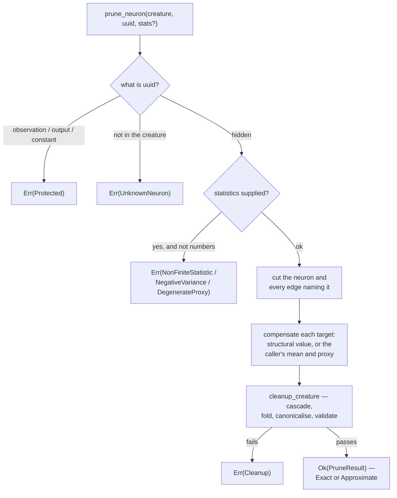

# Hidden-neuron pruning with optional statistical compensation (Issue #590)

## Summary

`neat-core/src/prune_neuron.rs` adds `prune_neuron` — step 3 of the canonical
pruning rewrite engine (Issue #587), and the first helper the Issue #588
`RemoveNeuron` captures can be run against end to end. Closes #590.

```rust
pub fn prune_neuron(
    creature: &CreatureExport,
    neuron_uuid: &str,
    stats: Option<&PruneStats>,
) -> Result<PruneResult, PruneError>;
```

One call cuts the requested hidden neuron out, compensates the targets that read
it with the **caller's** own statistics, runs the Issue #589 `cleanup_creature`
fixed point over the wreckage, and validates the stable result before returning
it. A successful call never returns an invalid creature.

| Rule | Where |
|---|---|
| direct targets are hidden neurons only; observation, output and constant nodes are refused | `PruneError::Protected` |
| without stats the exact structural rewrites still run, and every bare target is named | `PruneResult::uncompensated`, reason `NoStatistics` |
| with stats, mean-activation bias folding | `bias += W · μ` |
| with richer stats, the variance-aware correlated-survivor remedy | `weight(s → t) += β · W`, `bias += W · (μ − β μₛ)`, `β = cov / σₛ²`, refused unless `cov² <= σ² σₛ²` |
| #589 cleanup to a fixed point, then both shared validation gates | `cleanup_creature` |
| structured result: requested removal, cascade, compensations, `Exact` \| `Approximate` | `PruneResult` |

**`Exact` is earned, never assumed.** It is claimed only where the creature
itself proves the removal changed nothing — nothing read the neuron, or the
neuron had no inward edge so it activated to one value on every record and that
value folds into each target's bias exactly. A supplied mean never buys the
label and never overrides the structural value; an `IF` that lost a role can no
longer branch, so it is always `Approximate`.

**Where a bias fold means nothing, it is not attempted.** A point-wise squash
computes `squash(bias + Σ w·a)`, so `W · μ` in the bias stands where the removed
term was. An aggregate does not — `MINIMUM` takes the smallest inward term,
`MEAN` divides by its inward count, `HYPOT` squares each term, an `IF` reads its
condition sum to pick a branch — so those targets are reported on
`PruneResult::uncompensated` rather than given a number the caller could not
justify. Reported, never silent.

**Two decisions the parity matrix left to this issue.**

- *The memetic record is pruned, not dropped.* TypeScript sheds `memetic`
  wholesale; this crate applies rule 31's inverse through cleanup
  (`prune_memetic`, NEAT-AI-Lamarck#197), so every entry naming live structure
  survives and exactly the dangling ones go.
- *Variance-aware compensation is supplied data, not a fixture.*
  `removeNeuronCompensation` needs statistics no `CreatureExport` carries, so it
  landed as `PruneStats::proxy` with the regression spelled out in the docs and
  derived from the formula in the tests.

## Evidence

Backend library change; there is no web interface to screenshot. The evidence is
the test suite, the activation oracle, the TypeScript captures and the mutation
sweep below.



### The oracles

None of them shares the code path under test:

- **the function itself** — every `Exact` claim is checked by compiling and
  activating the pre-prune creature and the pruned one and asserting they agree
  on five probes (`an_exact_prune_is_always_the_same_function_of_the_inputs`).
  Only a genuinely exact rewrite passes.
- **arithmetic derived in the test** — every fold, share and residual variance
  is computed in the test from the documented formula
  (`β = 0.3/0.5`, `4·(0.25 − 0.09/0.5) = 0.28`, `LOGISTIC(0.4)` in `f64`), never
  read back out of the code under test.
- **the TypeScript captures** (Issue #588) — `CASCADE_ORPHAN_FEEDERS` and
  `IF_REPAIR_COALESCES_ROLES` are reproduced **byte for byte** by
  `prune_neuron(before, uuid)`; `MEMETIC_DROPPED_ON_REMOVAL` matches on neurons
  and synapses, with the pruned-not-dropped record asserted explicitly; and
  `CONSTANT_BIAS_FOLD` — whose request removes a *constant*, which this API
  protects — is graded on its hidden-neuron twin, an `IDENTITY` neuron that sums
  nothing and is therefore worth `0.5` on every record just as that constant is.

### Mutation evidence (AGENTS.md rule 2)

**35 mutations**, applied one at a time to `prune_neuron.rs` (one to
`prune_cleanup.rs`, for the memetic decision it carries) and reverted after each
run. **32 were killed**; the three survivors are named with why. The test listed
is the first one that caught it.

| Mutation | Killed by |
|---|---|
| M1 constants are not protected | `a_constant_cannot_be_removed_directly` |
| M2 outputs are not protected | `an_output_neuron_cannot_be_removed` |
| M3 observation guard removed | `an_observation_neuron_cannot_be_removed` |
| M4 mean bias fold disabled | `an_aggregate_target_is_reported_uncompensated_rather_than_folded` |
| M5 only the first target is compensated | `the_supplied_mean_is_folded_into_every_target_that_read_the_neuron` |
| M6 aggregate targets folded like point-wise ones | `an_aggregate_target_is_reported_uncompensated_rather_than_folded` |
| M7 structural activation never detected | `a_neuron_that_sums_nothing_is_removed_exactly_without_statistics` |
| M8 structural fold uses the raw bias, not the squashed value | `a_neuron_that_sums_nothing_is_removed_exactly_without_statistics` |
| M9 every prune reported `Exact` | `a_correlated_survivor_carries_the_part_of_the_neuron_it_predicts` |
| M11 an uncompensated target no longer blocks `Exact` | `an_exact_prune_is_always_the_same_function_of_the_inputs` |
| M12 regression slope is the covariance, undivided | `a_correlated_survivor_carries_the_part_of_the_neuron_it_predicts` |
| M13 the share is reported but never applied | `a_correlated_survivor_carries_the_part_of_the_neuron_it_predicts` |
| M14 the proxy's mean is not taken out of the bias fold | `a_correlated_survivor_carries_the_part_of_the_neuron_it_predicts` |
| M15 residual variance ignores what the proxy carried | `a_correlated_survivor_carries_the_part_of_the_neuron_it_predicts` |
| M16 a proxy that does not feed a target is ignored | `a_proxy_that_does_not_already_feed_a_target_is_refused` |
| M17 a zero-variance proxy is accepted | `a_proxy_that_never_varied_is_refused_rather_than_divided_by_zero` |
| M18 non-finite statistics are accepted | `a_non_finite_mean_is_refused_before_anything_is_rewritten` |
| M19 a negative variance is accepted | `a_negative_variance_is_refused` |
| M20 the un-cleaned cut creature is returned | `an_if_left_short_of_a_role_is_downgraded_by_the_prune` |
| M21 the target's weight sum is the first edge only | `two_roles_into_one_target_report_the_weight_they_summed_to` |
| M22 inward edges are not reported as removed | `a_correlated_survivor_carries_the_part_of_the_neuron_it_predicts` |
| M23 an unknown proxy is accepted | `a_proxy_that_is_the_neuron_being_removed_is_refused` |
| M24 a supplied mean overrides the structural value | `a_structurally_constant_activation_outranks_a_supplied_mean` |
| M26 a zero share still demands the proxy edge | `an_uncorrelated_proxy_moves_no_weight_and_needs_no_edge` |
| M27 the Cauchy–Schwarz guard is dropped | `a_covariance_larger_than_the_variances_allow_is_refused` |
| M28 the guard also refuses a perfectly correlated sample | `a_perfectly_correlated_survivor_is_accepted_and_carries_it_all` |
| M29 the proxy is only checked when the compensation uses it | `a_bad_proxy_is_refused_even_where_the_compensation_would_not_use_it` |
| M30 an `IF` target's roles are summed into one term | `two_roles_into_one_if_target_are_reported_role_by_role` |
| M31 every target is keyed by its role, readable or not | `two_edges_into_one_summing_target_are_reported_as_one_term` |
| M32 the unknown-neuron-type guard is dropped | `a_neuron_declaring_an_unknown_type_is_refused` |
| M34 a target the creature does not carry is treated as `IDENTITY` | `a_synapse_naming_a_target_that_does_not_exist_is_refused` |
| M35 the memetic record is dropped wholesale instead of pruned (`prune_cleanup.rs`) | `a_memetic_entry_the_removal_does_not_strand_survives_the_prune` |

**The three survivors.**

- **M10 — an `IF` downgrade no longer blocks `Exact`.** Every route to a
  downgrade runs through an `IF` the removed neuron fed, and an `IF` is an
  aggregate, so `uncompensated` is already non-empty and the earlier clause
  refuses `Exact` first. The clause stays as defence in depth — the two rules are
  independent, and widening what counts as compensable must not quietly start
  calling a downgraded creature exact — and the code says so at
  `neat-core/src/prune_neuron.rs`.
- **M25 — an unknown neuron is treated as prunable.** Removing the guard in
  `classify_target` is an *equivalent mutant*: `structural_activation` looks the
  same neuron up on the next line and returns the identical
  `PruneError::UnknownNeuron`, so no observable behaviour changes and
  `a_uuid_the_creature_does_not_carry_is_refused` still passes.
- **M33 — an unknown squash name defaults to `IDENTITY`.** Also an *equivalent
  mutant*: cleanup parses every squash itself and refuses the creature, so the
  call still fails with a `PruneError::Cleanup` and returns nothing. The guard
  stays because it fails at the point of the fault rather than several passes
  later, which is what makes the error message name the neuron.

### Red first

`neat-core/tests/prune_neuron.rs` was written and run **before** any of
`prune_neuron.rs` existed: the first run failed to compile with
`no `prune_neuron` in the root` / `no `TransformClass` in the root`, and the two
tests that went red on their first *executed* run
(`a_neuron_that_sums_nothing_is_removed_exactly_without_statistics`,
`a_creature_carrying_a_value_that_is_not_a_number_is_refused`) exposed real
defects in the test's own oracle — an `f64` logistic compared against the `f32`
the forward pass actually computes, and a non-finite weight planted on an edge
the removal took with it, so it never reached the gate under test. Both were
corrected rather than the implementation bent to them.

### Gate

`./quality.sh` run in the foreground after the final edit (and again after the
review fixes below): fmt, clippy with
`-D warnings`, `cargo test --workspace`, doc tests, docs build and the release
build all pass, plus the shellcheck, TypeScript and Mermaid stages.

## Acceptance Criteria

<!-- vibe-spec-review inputs="diff+issue-body" -->

- **met** — `prune_neuron(creature, neuron_uuid, stats?) -> Result<PruneResult, PruneError>` — evidence: `neat-core/src/prune_neuron.rs::prune_neuron` — reviewer: met
- **met** — direct targets are hidden neurons only — evidence: `neat-core/src/prune_neuron.rs::classify_target`, `a_uuid_the_creature_does_not_carry_is_refused` — reviewer: met
- **met** — observation/input, output and constant nodes are protected from direct deletion — evidence: `an_observation_neuron_cannot_be_removed`, `an_output_neuron_cannot_be_removed`, `a_constant_cannot_be_removed_directly` — reviewer: met
- **met** — without stats, exact structural/canonical rewrites still run — evidence: `without_statistics_no_bias_moves_and_the_shortfall_is_named` — reviewer: met
- **met** — with stats, mathematically explicit approximate compensation (mean-activation bias folding and richer supplied compensation data) — evidence: `a_correlated_survivor_carries_the_part_of_the_neuron_it_predicts`, `a_covariance_larger_than_the_variances_allow_is_refused` — reviewer: partial — reason: the reviewer found nothing enforcing `cov² <= σ² σₛ²`, so an inconsistent sample could yield a negative `residual_variance`; `PruneError::InconsistentCovariance` and its two boundary tests were added in response, and the departure from `partial` is that fix
- **met** — run #589 cleanup to fixed point — evidence: `neat-core/src/prune_neuron.rs` calls `cleanup_creature`; `removing_a_hidden_neuron_cascades_through_every_orphaned_feeder` — reviewer: met
- **met** — validate before returning success — evidence: `every_successful_prune_returns_a_creature_both_shared_gates_accept` — reviewer: met
- **met** — structured result: requested removal, cascade, compensations, `Exact|Approximate` — evidence: `PruneResult` in `neat-core/src/prune_neuron.rs`; `the_result_names_the_requested_removal_and_every_edge_it_took` — reviewer: met
- **partial** — port/parity-test the TypeScript removal paths in `DiscoveryNeuronRemoval.ts`, including mean bias fold and variance-aware compensation — evidence: `removing_a_hidden_neuron_cascades_through_every_orphaned_feeder`, `an_if_left_short_of_a_role_is_downgraded_by_the_prune`, `the_discovery_bias_fold_reproduces_the_typescript_capture` — reviewer: partial — reason: two captures are reproduced byte for byte, but `CONSTANT_BIAS_FOLD` removes a *constant* this API protects, so it is graded on a hidden-neuron twin, and the variance-aware remedy has no TypeScript capture at all — Issue #588 recorded it as un-captured supplied data, so the oracle is the derived formula
- **met** — TDD: start with failing parity fixtures from #588 — evidence: the **Red first** section above — reviewer: partial — reason: the reviewer saw one squashed commit and no red-then-green history; the red run did happen (the suite would not compile, then two tests failed on their first executed run) and is recorded rather than inferred
- **met** — tests for multiple downstream targets, shared targets, missing/finite stats, cascade cleanup, exact-vs-approximate metadata — evidence: the Test Plan below — reviewer: met
- **met** — any successful call returns a valid creature — evidence: `every_successful_prune_returns_a_creature_both_shared_gates_accept` — reviewer: met
- **met** — unsupported/invalid requests fail before any caller can screen/score them — evidence: `a_prune_that_cannot_be_made_valid_is_reported_not_returned`, `a_creature_carrying_a_value_that_is_not_a_number_is_refused` — reviewer: met
- **unrequested** — the memetic record is **pruned**, not dropped, and the parity matrix's open question is closed — reviewer: unrequested — reason: `docs/research/pruning-parity-matrix.md` named this "Issue #590's decision", so the call was delegated; both halves are now pinned by tests
- **unrequested** — `PruneError::MissingProxyEdge` refuses the whole request rather than falling back to the plain mean fold per target — reviewer: unrequested — reason: deliberate, and the acceptance line "unsupported/invalid requests fail" is what it serves — a half-applied remedy is a creature the caller would score believing it compensated
- **unrequested** — `PruneError::UnknownNeuronType` and the two malformed-creature refusals — reviewer: unrequested — reason: fail-loud paths for a creature that reached this API unvalidated; each is now exercised by a synthetic fixture rather than left as untestable public API
- **unrequested** — `PruneResult::passes` — reviewer: unrequested — reason: one `usize` passed straight through from `CleanupOutcome`, so a caller can see the cascade depth the removal cost without re-running cleanup
- **unrequested** — the 76-line README section — reviewer: unrequested — reason: repo convention is that every shared module is documented there (`prune_cleanup`, `prune_fixtures` both are), so omitting it would be the departure

## Standards Review

<!-- vibe-standards-review inputs="diff+CODING-STANDARDS.md" -->

This repository has no `CODING-STANDARDS.md`; its documented standards live in
`AGENTS.md`, which is what the reviewer was given alongside the diff.

- **violation** — oracle rule 3: the memetic *retention* half was never armed, because the only fixture's record named nothing that survived — evidence: `neat-core/tests/prune_neuron.rs::the_memetic_record_is_pruned_of_the_structure_the_prune_removed` — reason: fixed here — `MIXED_MEMETIC_JSON` carries one dangling and one live entry, and `a_memetic_entry_the_removal_does_not_strand_survives_the_prune` pins the survivor; mutation M35 (drop the record wholesale) now dies
- **violation** — oracle rule 5: three error paths had no test and could not be reached from a fixture, one of them public API — evidence: `neat-core/src/prune_neuron.rs::classify_target` (`UnknownNeuronType`), `::target_squash`, `::squash_of` — reason: fixed here — three synthetic creatures now drive them (`a_neuron_declaring_an_unknown_type_is_refused`, `a_target_declaring_an_unknown_squash_is_refused`, `a_synapse_naming_a_target_that_does_not_exist_is_refused`), and M32/M34 die
- **violation** — no silent failure: a supplied proxy was discarded unchecked when the structural fold short-circuited the statistics — evidence: `neat-core/src/prune_neuron.rs::prune_neuron` — reason: fixed here — the proxy is validated from the caller's own statistics whichever branch runs, pinned by `a_bad_proxy_is_refused_even_where_the_compensation_would_not_use_it` (M29)
- **violation** — documented contract overstated what `check_proxy` enforces, in both the README and the helper's own doc comment — evidence: `neat-core/src/prune_neuron.rs::check_proxy` — reason: fixed here — both now say the edge is settled per target, and that a survivor predicting nothing needs no edge
- **violation** — a reported statistic a caller could not act on: `residual_variance` could come back negative from statistics no sample could produce — evidence: `neat-core/src/prune_neuron.rs::compensate` — reason: fixed here — `PruneError::InconsistentCovariance` refuses them, with the `|ρ| = 1` boundary pinned so the guard cannot over-reach (M27/M28)
- **violation** — the mutation record and the PR summary were not committed with the diff — evidence: `docs/archive/pr-summaries/pr-summary-590.md` — reason: fixed here — this file is committed with the change, and its counts are the ones the final sweep produced
- **clean** — Australian English throughout; no hidden files or config drift; tests call real functions and assert on returned creatures, biases, weights and typed errors, never on source text
- **clean** — oracle rule 1: three independent oracles (activation equality, arithmetic derived in the test, the Issue #588 captures), none reusing the code under test
- **clean** — fail-closed error surface: typed `PruneError` with `Display` and `Error::source`, every variant returning no creature, and no `unwrap`/`expect`/`panic!` in the library code
- **clean** — single-home reuse: `zero_inward_activation` widened to `pub(crate)` rather than restated, `SquashType::is_aggregate` rather than a second membership list, cleanup and validation delegated
- **clean** — ownership fence (Issue #544), build profiles, wasm cfg and `unsafe` untouched; README and the parity matrix updated in step with the code

## Test Plan

All new, in `neat-core/tests/prune_neuron.rs` (40 tests). No existing test was
modified, commented out or removed.

**Protected targets and unknown requests**

- `an_observation_neuron_cannot_be_removed`
- `an_output_neuron_cannot_be_removed`
- `a_constant_cannot_be_removed_directly`
- `a_uuid_the_creature_does_not_carry_is_refused`

**The requested removal and its cascade (parity with Issue #588)**

- `the_result_names_the_requested_removal_and_every_edge_it_took`
- `removing_a_hidden_neuron_cascades_through_every_orphaned_feeder` — byte-for-byte against `CASCADE_ORPHAN_FEEDERS.after()`
- `an_if_left_short_of_a_role_is_downgraded_by_the_prune` — byte-for-byte against `IF_REPAIR_COALESCES_ROLES.after()`
- `the_memetic_record_is_pruned_of_the_structure_the_prune_removed`
- `a_memetic_entry_the_removal_does_not_strand_survives_the_prune` — the retention half of the same decision

**Compensation — the mean bias fold**

- `the_supplied_mean_is_folded_into_every_target_that_read_the_neuron` (multiple downstream targets)
- `a_target_shared_with_a_survivor_keeps_the_survivors_own_edge` (shared target)
- `two_roles_into_one_if_target_are_reported_role_by_role` (an `IF` never sums its arms)
- `two_edges_into_one_summing_target_are_reported_as_one_term` (every other squash does)
- `an_aggregate_target_is_reported_uncompensated_rather_than_folded`
- `without_statistics_no_bias_moves_and_the_shortfall_is_named`

**Compensation — the exact case**

- `a_neuron_that_sums_nothing_is_removed_exactly_without_statistics`
- `a_structurally_constant_activation_outranks_a_supplied_mean`
- `a_neuron_nothing_reads_is_removed_exactly_and_compensates_nothing`
- `the_discovery_bias_fold_reproduces_the_typescript_capture`

**Compensation — the correlated-survivor remedy**

- `a_correlated_survivor_carries_the_part_of_the_neuron_it_predicts`
- `the_mean_only_residual_is_the_whole_variance_the_neuron_carried`
- `an_uncorrelated_proxy_moves_no_weight_and_needs_no_edge`
- `a_proxy_that_does_not_already_feed_a_target_is_refused`
- `a_proxy_that_never_varied_is_refused_rather_than_divided_by_zero`
- `a_proxy_the_creature_does_not_carry_is_refused`
- `a_proxy_that_is_the_neuron_being_removed_is_refused`
- `a_bad_proxy_is_refused_even_where_the_compensation_would_not_use_it`
- `a_perfectly_correlated_survivor_is_accepted_and_carries_it_all`

**Statistics that are not numbers**

- `a_non_finite_mean_is_refused_before_anything_is_rewritten`
- `a_negative_variance_is_refused`
- `a_non_finite_proxy_statistic_is_refused`
- `a_covariance_larger_than_the_variances_allow_is_refused`

**Fail closed, and the shared invariants**

- `a_prune_that_cannot_be_made_valid_is_reported_not_returned`
- `a_creature_carrying_a_value_that_is_not_a_number_is_refused`
- `a_neuron_declaring_an_unknown_type_is_refused`
- `a_target_declaring_an_unknown_squash_is_refused`
- `a_synapse_naming_a_target_that_does_not_exist_is_refused`
- `every_successful_prune_returns_a_creature_both_shared_gates_accept`
- `pruning_the_same_creature_twice_gives_the_same_creature`
- `an_exact_prune_is_always_the_same_function_of_the_inputs`

Plus the `prune_neuron` doc example, run as a doc test by `./quality.sh`.
