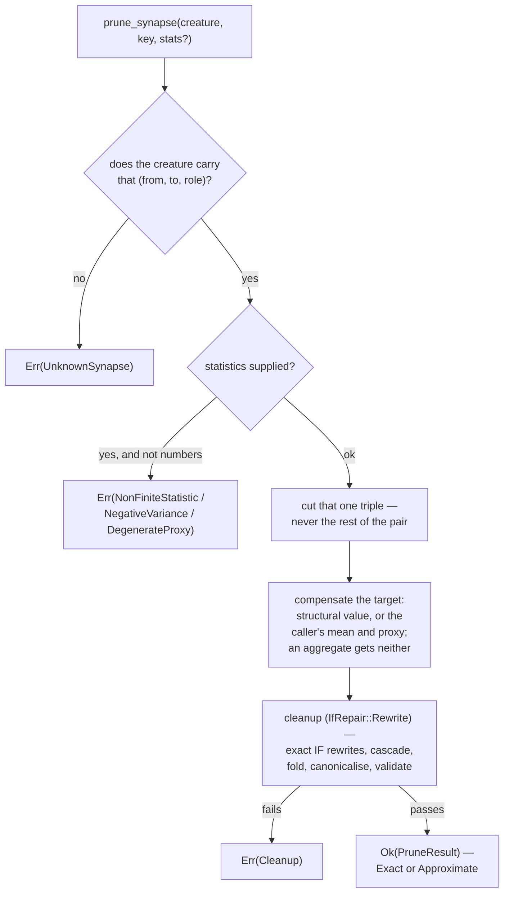

# Synapse pruning with typed-role identity and `IF`-aware rewrites (Issue #591)

## Summary

`neat-core/src/prune_synapse.rs` lands the shared answer to "remove this one
typed edge and give me back something I can score". `prune_synapse(creature,
key, stats?)` cuts exactly the requested `(from, to, role)` triple, compensates
the target that read it with the **caller's** statistics where a bias fold means
anything, rewrites whatever `IF` structure the removal made statically decidable,
runs the Issue #589 cleanup fixed point over the wreckage, and validates the
stable result before returning it. Closes #591.

The headline decision is the one the issue asked for: NEAT-AI's
`SubConnection.ts::#wouldBreakIfNeuron()` **declines** to remove an edge that
would leave an `IF` short a role, so a whole class of typed structure is
unprunable TypeScript-side. This crate rewrites instead, and both rewrites are
exact — they compute the same number on every record:

| What the removal left | Rewrite | Why it is exact |
|---|---|---|
| no condition edge, or every condition source structurally fixed | `IDENTITY` over the branch the condition always takes; the condition edges and the unreachable branch go, and their feeders cascade | the forward pass could never have taken the other branch |
| a `positive` / `negative` branch with nothing left in it, condition still varying | a **zero-weight** edge from a support constant into that role | an empty branch sum is `0`, and so is `0 · 1` |

The policy is opt-in on the Issue #589 engine —
`cleanup_creature_with(&creature, CleanupOptions { if_repair: IfRepair::Rewrite })`
— so `cleanup_creature` and `prune_neuron` (Issue #590) keep the TypeScript-parity
`IfRepair::Downgrade` default unchanged.

**Breaking change**, signalled by the `feat(prune)!:` commit and its
`BREAKING CHANGE:` footer so `version-increment` bumps the minor: `PruneResult`
is now shared by both prune operations, so `removed_neuron` is
`Option<String>`; `PruneResult` and `CleanupOutcome` carry new public fields
(`static_if_neurons`, `restored_if_roles`); and `PruneError` gains
`UnknownSynapse`.

## Evidence

Backend library change — no web interface to screenshot. What was tested
instead:

- `./quality.sh` — **passes** end to end (fmt, clippy `-D warnings`, shellcheck,
  bats, `deno check`, the Mermaid gate, markdownlint, `cargo test --workspace`,
  12 doctests, `cargo doc -D warnings`, release build).
- `cargo test -p neat-core --test prune_synapse` — **36 passed**, plus the
  pre-existing 48 in `prune_cleanup.rs`, 40 in `prune_neuron.rs` and the
  `prune_parity.rs` capture suite, all green.

### Oracles

None of the three is a second copy of the implementation:

- **the zero-weight twin, run through the forward pass.** An `IF` rewrite cannot
  be graded against a captured creature — TypeScript refuses those removals — so
  the oracle is what the removal *means*: the same creature with that edge's
  weight set to `0`, compiled and activated by `compile_creature`. A zeroed row
  contributes nothing to its role's sum, which is exactly what removing it does,
  and the twin stays valid so it can be run. Both sides share only
  `activate`, which is not the path under test.
- **arithmetic derived in the test.** Every fold, share and residual is computed
  from the documented formula and the fixture's own numbers —
  `0.3 + 2.0 · 0.6`, `β = cov/σₛ²`, `W²(σ² − cov²/σₛ²)` — never read back out of
  the code under test.
- **the TypeScript captures** in `PRUNE_PARITY_CASES` (Issue #588):
  `EDGE_ROLE_IDENTITY` and `EDGE_SOURCE_BECOMES_DEAD` are graded by structural
  equality with `after`; `EDGE_TARGET_BECOMES_CONSTANT` and
  `CONSTANT_MOVES_INTO_PREFIX` by activation equality, because the Rust
  canonical form holds the bias-1 support-constant invariant the captures do not
  (the documented Issue #589 divergence).

### Mutation evidence

AGENTS.md makes this the merge gate, so each site was mutated one at a time and
the suite re-run. Every mutation was reverted before commit.

| # | Mutation | Result | First killer |
|---|---|---|---|
| M1 | `matched_weight` ignores the requested role | **killed** | `a_role_the_pair_does_not_carry_is_refused` |
| M2 | a zero condition sum takes the positive branch | **killed** | `losing_the_last_condition_leaves_the_negative_branch_and_drops_the_positive` |
| M3 | a flattened positive branch drops untyped edges | **killed** | `a_flattened_positive_branch_keeps_the_untyped_edges_that_feed_it` |
| M4 | no static `IF` is ever flattened | **killed** | `a_statically_true_condition_drops_the_unreachable_branch_and_cascades` |
| M5 | an emptied branch role is never restored | **killed** | `losing_the_last_positive_keeps_the_branch_and_stays_valid` |
| M6 | the restored branch edge carries weight `1` | **killed** | `losing_the_last_negative_keeps_the_branch_and_stays_valid` |
| M7 | an aggregate target is given a bias fold | **killed** | `an_aggregate_target_is_never_given_a_bias_fold` |
| M8 | a structurally fixed source is not folded | **killed** | `a_constant_source_folds_exactly_without_any_statistic` |
| M9 | a supplied mean overrides the structural value | **survived — equivalent** | see below |
| M10 | a downgraded `IF` is still called exact | **survived — equivalent** | see below |
| M11 | a flattened `IF` keeps its condition edges | **killed** | `a_statically_true_condition_drops_the_unreachable_branch_and_cascades` |
| M12 | the rewrite policy falls back to the downgrade | **killed** | `losing_the_last_condition_leaves_the_negative_branch_and_drops_the_positive` |
| M13 | an inexact mean fold is still called exact | **killed** | `a_supplied_mean_folds_the_removed_term_into_the_targets_bias` |
| M14 | a restored role mints a constant instead of reusing one | **killed** | `a_restored_branch_role_reuses_the_support_constant_already_there` |
| M15 | `canonical_role` reads `Standard` and `Positive` apart at an `IF` | **killed** | `a_standard_request_names_the_positive_row_of_an_if` |

Two survivors, and both are **equivalent mutants** rather than gaps — neither
can change what the function returns:

- **M9** — `compensate` returns on the `invariant_value` arm before it looks at
  `stats`, and sets `share = 0.0`, which the proxy block is guarded on. Zeroing
  `effective_stats` is therefore belt-and-braces over a decision already taken
  one level down.
- **M10** — under `IfRepair::Rewrite` cleanup never downgrades, so
  `downgraded_if_neurons` is always empty and the clause is always `true`
  already. The source says so: it is there as defence in depth against a future
  policy change quietly calling a flattened creature exact.

Three mutations found real gaps and the tests were tightened until they died:
**M3** and **M14** (each has its own commit — `39a557e`, `1ba9710`) and **M15**,
which was a genuine defect and not merely an untested one (below).

### Defect found by review and fixed here

The independent spec review found the refusal this issue exists to remove,
reintroduced from the other side. `canonical_role` returned the role verbatim at
an `IF` target, so `SynapseType::Standard` and `SynapseType::Positive` read as
two different edges — but the compiled forward pass adds an untyped inward edge
to the **positive** accumulator (`network.rs:527`) and `IfRoles::tally` counts it
as positive. A creature that wrote its positive arm untyped therefore answered
`prune_synapse(c, key(src, if, Positive), None)` with `Err(UnknownSynapse)`: a
blanket refusal of exactly the removal this issue says must be rewritten.
`canonical_role` now folds the two spellings to one answer — which is what the
module doc already claimed — pinned by
`an_untyped_if_arm_answers_to_the_positive_role` and
`a_standard_request_names_the_positive_row_of_an_if`.

## Acceptance Criteria

<!-- vibe-spec-review inputs="diff+issue-body" -->

- **met** — remove only the requested typed edge/role, never every same-pair edge — evidence: `neat-core/tests/prune_synapse.rs::only_the_requested_role_of_a_repeated_pair_is_removed`, `::a_standard_request_names_the_positive_row_of_an_if` — reviewer: partial — reason: the reviewer's `partial` rested on two findings; the load-bearing one (an `IF` request missing an untyped row) was a real defect and is fixed in this diff with two new tests. The remainder — one request taking two rows of a *non-`IF`* pair — stands by design: those two rows are one summed term, and a creature carrying them is already a `TypedDuplicateSynapse` the shared validator rejects. The doc claim the reviewer correctly called false ("cleanup would coalesce them anyway") is corrected.
- **met** — input-sourced and output-target edges are valid candidates — evidence: `::an_input_sourced_edge_into_an_output_is_a_candidate`, `::an_input_sourced_edge_into_a_hidden_neuron_is_a_candidate`, `::a_hidden_to_output_edge_is_a_candidate` — reviewer: met
- **met** — last incoming edge to hidden → exact constant/static rewrite + #589 cleanup — evidence: `::an_input_sourced_edge_into_a_hidden_neuron_is_a_candidate`, graded activation-equal against `EDGE_TARGET_BECOMES_CONSTANT.after()` — reviewer: met
- **met** — last outgoing edge from hidden/constant → recursive dead-structure cleanup — evidence: `::losing_a_hidden_neurons_last_outgoing_edge_removes_it_and_its_feeders`, `::a_source_left_with_nothing_to_feed_is_removed_with_its_feeders` — reviewer: met
- **met** — ordinary summing targets may use explicit supplied statistical compensation — evidence: `::a_supplied_mean_folds_the_removed_term_into_the_targets_bias`, `::a_correlated_survivor_carries_the_part_it_predicts`, `::a_supplied_variance_reports_the_residual_the_fold_could_not_carry` — reviewer: met
- **met** — aggregate/typed targets must use role-aware semantics, not sum-bias assumptions — evidence: `neat-core/src/prune_synapse.rs` short-circuits every `is_aggregate()` squash (`IF` included) to an `UncompensatedTarget` carrying the role; `::an_aggregate_target_is_never_given_a_bias_fold`, `::an_if_target_is_reported_per_role_rather_than_as_a_sum` — reviewer: met — reason: the reviewer's caveat that an untyped `IF` arm was reported as `Standard` rather than its branch is resolved by the `canonical_role` fix.
- **met** — `IF` last-condition/positive/negative removal rewritten mathematically rather than blanket-refused — evidence: `::losing_the_last_condition_leaves_the_negative_branch_and_drops_the_positive`, `::losing_the_last_positive_keeps_the_branch_and_stays_valid`, `::losing_the_last_negative_keeps_the_branch_and_stays_valid`, each graded against the zero-weight twin — reviewer: partial — reason: the reviewer's `partial` was the untyped-arm refusal, which is fixed in this diff.
- **met** — static `IF` choices remove unreachable branches and cascade cleanup — evidence: `::a_statically_true_condition_drops_the_unreachable_branch_and_cascades`, `::dropping_an_unreachable_branch_cascades_through_every_level_it_strands` — reviewer: met
- **met** — validate before returning — evidence: `cleanup_creature_with` gates on both `creature_validate` and `validate_creature_topology`, and is the only exit that returns a creature; every test calls `assert_valid` — reviewer: met
- **met** — TDD case: ordinary — evidence: `::without_statistics_an_ordinary_target_is_reported_uncompensated` — reviewer: met
- **met** — TDD case: input→hidden — evidence: `::an_input_sourced_edge_into_a_hidden_neuron_is_a_candidate` — reviewer: met
- **met** — TDD case: input→output — evidence: `::an_input_sourced_edge_into_an_output_is_a_candidate` — reviewer: met
- **met** — TDD case: hidden→output — evidence: `::a_hidden_to_output_edge_is_a_candidate` — reviewer: met
- **met** — TDD case: last-input — evidence: `::an_input_sourced_edge_into_a_hidden_neuron_is_a_candidate` — reviewer: met — reason: the reviewer noted it doubles as the input→hidden case rather than having a dedicated test; it asserts the fold outcome specifically, so the case is covered.
- **met** — TDD case: last-output — evidence: `::losing_a_hidden_neurons_last_outgoing_edge_removes_it_and_its_feeders` — reviewer: met
- **met** — TDD case: each `IF` role — evidence: the three `losing_the_last_*` tests, plus `::an_untyped_if_arm_answers_to_the_positive_role` — reviewer: partial — reason: the reviewer's gap was the untyped request form, now covered by a dedicated test.
- **met** — TDD case: same-pair multiple typed roles — evidence: `::only_the_requested_role_of_a_repeated_pair_is_removed`, `::a_standard_request_names_the_positive_row_of_an_if` — reviewer: partial — reason: the reviewer wanted the non-`IF` same-pair case too; that input is `TypedDuplicateSynapse`-invalid, so a test would pin behaviour on a creature the crate's own validator rejects.
- **partial** — TDD: failing tests first — evidence: `39a557e`, `1ba9710` and the M15 fix are test-first within this run; the mutation table above is the evidence the suite can fail — reviewer: partial — reason: the bulk of the suite landed in one commit with the implementation on an earlier, interrupted attempt, so there is no red-then-green history for it. The 15-mutation sweep is the substitute AGENTS.md names.
- **met** — acceptance: a successful synapse prune always returns a valid canonical creature — evidence: the single validated exit through `cleanup_creature_with`; `assert_valid` in every test — reviewer: met
- **met** — acceptance: `IF`/typed structure is never skipped merely because the old TS mutation path refused it — evidence: `::the_default_cleanup_policy_still_downgrades_an_if_short_a_role` proves the two policies diverge; `wouldBreakIfNeuron` is not ported — reviewer: met — reason: the reviewer qualified this with the untyped-arm refusal it found, which is fixed here.
- **unrequested** — `CleanupOptions`, `IfRepair`, `StaticIfRewrite` and `cleanup_creature_with` are new **public** surface on the Issue #589 module — reviewer: unrequested — reason: the exact `IF` rewrites need a home inside the cleanup fixed point, because flattening one `IF` can strand structure only the cascade can find; making the policy a parameter is what keeps `prune_neuron`'s TypeScript parity provably unmoved rather than silently changed.
- **unrequested** — `PruneResult::removed_neuron` narrowed to `Option<String>`, and `static_if_neurons` / `restored_if_roles` added to `PruneResult` and `CleanupOutcome` — reviewer: unrequested — reason: the issue's contract returns `PruneResult`, so one result type now serves both prune operations; signalled as a breaking change so the version gate bumps the minor.
- **unrequested** — `prune_neuron` internals (`is_observation_uuid`, `structural_activation` → `prune_cleanup::fixed_activation`, and `compensate` / `check_stats` / `check_proxy` / `add_to_edge` promoted to `pub(crate)`) — reviewer: unrequested — reason: reuse rather than a second copy; "what does the creature fix" now has one home shared by the source fold, the structural fold and the static-condition rewrite.
- **unrequested** — `SUPPORT_CONSTANT_PREFIX` / `mint_support_constant` invent a support constant — reviewer: unrequested — reason: the zero-weight branch restore needs a constant to hang off, and a creature carrying none has to be given one; it reuses an existing constant wherever there is one, which `::a_restored_branch_role_reuses_the_support_constant_already_there` pins.
- **unrequested** — `rewrite_if_neurons` flattens every statically-conditioned `IF`, not only ones the removal made static — reviewer: unrequested — reason: the rewrite is exact, so a creature that carries a foregone `IF` comes back computing the same numbers either way; scoping it to the request would need a second reading of "what the prune touched" that could drift from the first.
- **unrequested** — `docs/archive/handover/issue-591.md`, a mid-run interruption note — reviewer: unrequested — reason: removed in this diff; it described as outstanding the work this branch finishes.

## Standards Review

<!-- vibe-standards-review inputs="diff+CODING-STANDARDS.md" -->

- **violation** — the mutation sweep had no home in the repo, which AGENTS.md's oracle-and-mutation gate requires — evidence: `docs/archive/pr-summaries/` carried no `pr-summary-591.md` — reason: fixed here; the 15-row table above is the sweep, with both survivors argued as equivalent mutants.
- **violation** — TDD red-first is unevidenced for the bulk of the suite — evidence: `neat-core/tests/prune_synapse.rs:1` landed with the implementation in one commit on the earlier attempt — reason: stands, and is recorded as `partial` above rather than papered over; the mutation sweep is the evidence the suite can fail, and the three tests added this run were each written against a failing state.
- **violation** — a breaking public API change carried no breaking signal, so `version-gate` would have let a patch-only bump through — evidence: `neat-core/src/prune_neuron.rs` (`removed_neuron: String → Option<String>`, new public fields, new `PruneError` variant) — reason: fixed here; the `feat(prune)!:` commit carries a `BREAKING CHANGE:` footer and `scripts/detect-breaking.sh origin/milestone/pruning..HEAD` now reports `true`.
- **violation** — `rewrite_if_neurons` reads `IfRoles` directly instead of asking `if_neuron_fault`, the single home of "does this `IF` carry all three roles" (Issue #560) — evidence: `neat-core/src/prune_cleanup.rs`, in `rewrite_if_neurons` — reason: partly fixed. `if_neuron_fault` reports only the *first* fault, so it cannot say which arms to restore when both are empty; a cross-reference comment now names the home, says why the fault helper cannot drive a two-arm restore, and records that restoring every empty arm satisfies it by construction.
- **violation** — the `IF` branch threshold and the untyped-counts-as-positive mapping are re-inlined away from the forward pass — evidence: `neat-core/src/prune_cleanup.rs`, in `rewrite_if_neurons` and `flatten_static_if` — reason: cross-reference comment added naming `CompiledNetwork::activate` as the source of truth; the helper itself reasons over a compiled synapse range and cannot be called on an exported creature, and the twin oracle is what keeps the two honest.
- **violation** — `docs/archive/handover/issue-591.md` shipped a WIP artefact as documentation, contradicting the finished prose in the same diff — evidence: `docs/archive/handover/issue-591.md:1` — reason: fixed here; the file is deleted.
- **clean** — Australian English throughout the added lines (*canonicalise*, *behaviour*, *favour*); no American spellings introduced.
- **clean** — oracle independence (AGENTS.md rule 1): the zero-weight twin is built from the *input* creature, the captures come from `PRUNE_PARITY_CASES`, and every fold is recomputed from the documented formula; both sides of `assert_same_function` share only `activate`, which is not the path under test.
- **clean** — no vacuous oracles (rule 3): no `is_finite()` or magic-length assertions; `assert_different_function` is an explicit anti-vacuity guard; each tolerance constant is documented with the reason for its slack.
- **clean** — "what" not "how" tests and outcome-shaped naming: every assertion is on a returned creature, returned metadata or a typed error through the public API.
- **clean** — genuine de-duplication: `is_observation_uuid` and `fixed_activation` collapsed to one home, with `prune_neuron` and `prune_synapse` both routed through it.
- **clean** — gates: rustfmt, clippy `--all-targets -D warnings`, `cargo test --workspace` including 12 doctests, `cargo doc -D warnings`, the Mermaid gate and markdownlint all pass.
- **clean** — default behaviour preserved: `cleanup_creature` keeps `IfRepair::Downgrade` and is pinned differentially against the new policy by `::the_default_cleanup_policy_still_downgrades_an_if_short_a_role`, so Issue #590's parity path is provably unmoved.

## Test Plan

`neat-core/tests/prune_synapse.rs` — 36 tests, new in this branch:

- **the requested edge, and only it** — `only_the_requested_role_of_a_repeated_pair_is_removed`,
  `a_standard_request_names_the_positive_row_of_an_if`,
  `an_untyped_if_arm_answers_to_the_positive_role`,
  `the_result_names_the_edge_it_removed_and_no_neuron`,
  `a_role_the_pair_does_not_carry_is_refused`,
  `a_pair_the_creature_does_not_carry_is_refused`,
  `a_target_the_creature_does_not_carry_is_refused`.
- **candidates the issue names** — `an_input_sourced_edge_into_an_output_is_a_candidate`,
  `an_input_sourced_edge_into_a_hidden_neuron_is_a_candidate`,
  `a_hidden_to_output_edge_is_a_candidate`,
  `an_output_left_with_nothing_to_sum_still_comes_back_valid`.
- **cascades** — `losing_a_hidden_neurons_last_outgoing_edge_removes_it_and_its_feeders`,
  `a_source_left_with_nothing_to_feed_is_removed_with_its_feeders`,
  `a_dead_source_cascades_through_every_level_it_orphans`,
  `a_converted_constant_moves_into_the_constant_prefix`.
- **compensation** — `without_statistics_an_ordinary_target_is_reported_uncompensated`,
  `a_supplied_mean_folds_the_removed_term_into_the_targets_bias`,
  `a_supplied_variance_reports_the_residual_the_fold_could_not_carry`,
  `a_correlated_survivor_carries_the_part_it_predicts`,
  `a_constant_source_folds_exactly_without_any_statistic`,
  `a_supplied_mean_never_overrides_the_structural_value`,
  `an_aggregate_target_is_never_given_a_bias_fold`,
  `an_if_target_is_reported_per_role_rather_than_as_a_sum`,
  `statistics_that_are_not_numbers_are_refused_before_anything_is_cut`,
  `a_proxy_that_does_not_feed_the_target_is_refused`,
  `a_proxy_that_is_the_removed_edges_own_source_is_refused`.
- **`IF` rewrites** — `losing_the_last_condition_leaves_the_negative_branch_and_drops_the_positive`,
  `losing_the_last_positive_keeps_the_branch_and_stays_valid`,
  `losing_the_last_negative_keeps_the_branch_and_stays_valid`,
  `a_restored_branch_role_reuses_the_support_constant_already_there`,
  `a_shared_branch_keeps_the_if_untouched`,
  `a_statically_true_condition_drops_the_unreachable_branch_and_cascades`,
  `a_flattened_positive_branch_keeps_the_untyped_edges_that_feed_it`,
  `dropping_an_unreachable_branch_cascades_through_every_level_it_strands`,
  `the_result_names_every_if_neuron_the_rewrite_touched`,
  `the_default_cleanup_policy_still_downgrades_an_if_short_a_role`.

Modified: `neat-core/tests/prune_neuron.rs` — one assertion updated for
`removed_neuron: Option<String>`. `neat-core/tests/prune_parity.rs` — module doc
only, recording that both helpers now exist. No test was removed or disabled.

Docs: `README.md` (the synapse-pruning section and the two `IF` repair
policies), `docs/research/pruning-parity-matrix.md` (how Issue #591 is graded
against the captures, and the refusal path resolved),
`neat-core/src/prune_fixtures.rs` module doc.
