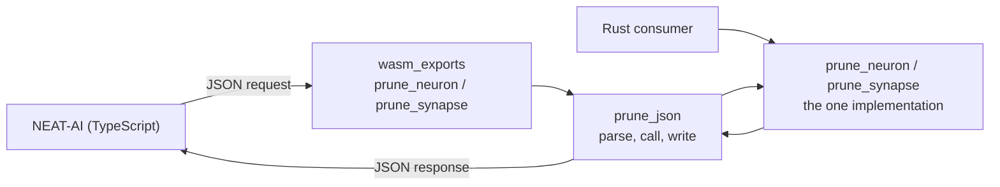

# TDD 5: expose the pruning rewrite APIs through WASM with native/WASM parity

## Summary

The Issue #590 / #591 pruning rewrites now have a second entry surface without a
second implementation. `neat-core/src/prune_json.rs` is the only wire form over
`prune_neuron` / `prune_synapse`: it parses a JSON request, calls the native
function, and writes the answer down — no rule, fold or cascade is decided
there. `wasm_exports.rs` is a `#[wasm_bindgen]` rename over it, so the ABI is
covered by `cargo test` rather than only in a browser.

Parity is graded off a committed golden record — the Issue #588 captures, plus
the request shapes only a boundary has — holding each request and the answer the
**native** ABI gives it. Closes #592.

## Evidence

Backend/WASM change with no web interface to screenshot. What was run:

| Check | Result |
|---|---|
| `cargo test --workspace --lib --tests --all-features` | 971 passed, 0 failed |
| `cargo test --workspace --doc --all-features` | 14 passed, 0 failed |
| `cargo clippy --workspace --all-targets --all-features -- -D warnings` | clean |
| `RUSTDOCFLAGS="-D warnings" cargo doc --workspace --no-deps` | clean |
| `deno test --allow-read tests/wasm_prune_parity_test.ts` | 15 passed, 0 failed |
| `./scripts/typescript-check.sh`, `check_mermaid.ts`, `markdownlint-cli2`, `codespell`, `shellcheck`, `cargo deny check`, `cargo build --release` | all clean |

<!-- vibe-quality-gate-skipped reason="bats stage cannot run in this container" -->
`./quality.sh` aborts at its `bats tests/scripts` stage: 109 of 393 bats cases
fail because the container has no Python `yaml` module, which the workflow test
helpers import. **That failure is identical on the unmodified base branch** (109
before and 109 after, measured by stashing the change), so it is an environment
gap rather than a regression — but it means the gate could not be run to
completion here. Every other stage of `quality.sh` was run individually and
passes, as tabled above; CI runs the same checks on this PR.

The end-to-end parity check needs a built bundle, which this container cannot
produce (no `wasm32-unknown-unknown` std, no `rustup`), so `wasm_exports.rs` and
the published-bytes comparison are exercised by `wasm-bundle.yml`, which is the
only place a built `pkg/` exists. That is the repository's existing arrangement,
not a new one: `tests/scripts/docs_ci_blind_spots.bats` asserts that no
pull-request workflow builds wasm32.

## Acceptance Criteria

<!-- vibe-spec-review inputs="diff+issue-body" -->

- **met** — WASM wrappers for the same native `prune_neuron` / `prune_synapse`
  logic and structured `PruneResult` / `PruneError` contract — evidence:
  `neat-core/src/wasm_exports.rs:254-263` (two `js_name` shims that decide
  nothing), `neat-core/src/prune_json.rs` `PruneResponse` mirroring all 14
  `PruneResult` fields and `reason` covering all 11 `PruneError` variants —
  reviewer: met — reason: the reviewer flagged that `from_result` read fields by
  name, so a new `PruneResult` field would silently stop crossing the wire; it
  now destructures `PruneResult { .. }`, making that a compile error.
- **partial** — identical semantics native vs WASM — evidence:
  `neat-core/tests/prune_json.rs::every_neuron_fixture_answers_exactly_what_the_native_call_answers`
  and its synapse twin, `scripts/check_wasm_prune_parity.ts` —
  reviewer: partial — reason: nothing on this branch executes wasm bytes before
  merge; the published-bytes comparison runs in `wasm-bundle.yml`, which
  triggers on push to Develop. Running it earlier would mean building wasm32 in
  a PR lane, which `docs_ci_blind_spots.bats` explicitly forbids, so the gate is
  placed where the repository allows it.
- **partial** — `CreatureExport` in/out compatibility with NEAT-AI — evidence:
  the shared `CreatureExport` is the request and the response type
  (`neat-core/src/prune_json.rs`), and every golden case round-trips one —
  reviewer: partial — reason: `CreatureExport` models a fixed key set, so a
  NEAT-AI key it does not model (e.g. `tags`) is dropped from the creature
  handed back. That is a property of the shared struct, not of this boundary,
  and it is already owned by in-flight work on the struct itself
  (`origin/issue-3747-creature-export-tags-uuid-memetic`,
  `origin/issue-3748-creature-unknown-field-passthrough`); fixing it here would
  change a type every entry point shares.
- **met** — optional stats/compensation payloads serialise cleanly — evidence:
  `neat-core/tests/prune_json.rs::the_optional_statistics_payload_reaches_the_compensation`
  (proxy share `1.0`, fold `0.6`, residual variance reported) and
  `::an_aggregate_target_is_reported_uncompensated_rather_than_folded` —
  reviewer: met — reason: the reviewer noted `restoredIfRoles` was the one
  payload no case reached; the `restored_if_role` case was added, and the
  coverage test now requires every response array to be non-empty somewhere.
- **met** — exact vs approximate transform metadata preserved — evidence:
  `neat-core/tests/prune_json.rs::the_transform_label_crosses_the_boundary_unchanged`,
  and both labels required in the record by
  `::the_golden_record_covers_the_shapes_the_wasm_bundle_is_graded_on` —
  reviewer: met
- **met** — malformed requests fail cleanly — evidence:
  `neat-core/tests/prune_json.rs::a_payload_that_is_not_a_request_is_malformed_and_never_a_verdict`,
  `::an_unusable_statistic_is_refused_before_anything_is_rewritten`,
  `::a_creature_larger_than_the_boundary_walks_is_refused_before_it_allocates` —
  reviewer: met — reason: the reviewer flagged that a declared width past `u32`
  is refused by serde on wasm32 and by the ceiling natively, so the *message*
  differs; both still answer `malformed: true` and neither reaches a rewrite,
  and the module doc now says so rather than leaving it implied.
- **met** — successful calls always return a creature the same core validator
  accepts — evidence:
  `neat-core/tests/prune_json.rs::a_successful_answer_always_carries_a_creature_the_core_validator_accepts`,
  which runs `creature_validate` over every golden case that answered `ok` —
  reviewer: met
- **met** — no scorer/acceptance policy in core or WASM — evidence: no scoring
  symbol is imported or added in `prune_json.rs` or the new `wasm_exports.rs`
  block; the boundary is stated in `README.md` and `wasm_exports.rs:243-247` —
  reviewer: met
- **partial** — TDD: native-vs-WASM golden/parity tests on the #588-#591
  fixtures, including IF/typed edge cases and cascades — evidence:
  `neat-core/tests/golden/prune_wasm_parity.json` (all eight
  `PRUNE_PARITY_CASES` plus `static_if_rewrite`, `restored_if_role`,
  `constant_edge_folds_exactly`, `proxy_compensation`, two refusals and two
  boundary faults), coverage asserted by name in both
  `neat-core/tests/prune_json.rs` and `tests/wasm_prune_parity_test.ts` —
  reviewer: partial — reason: the fixture half is complete; the
  native-**vs-WASM** comparison itself runs only in `wasm-bundle.yml`, for the
  reason given under "identical semantics" above.
- **partial** — Acceptance: one Rust implementation and two entry surfaces with
  byte/semantic parity where representation allows — evidence: the shim is a
  pure rename (`wasm_exports.rs:254-263`) and no pruning rule is duplicated;
  `scripts/check_wasm_prune_parity.ts` compares keys, lengths, uuids, roles,
  squash names, reason codes, messages, booleans and integers exactly —
  reviewer: partial — reason: floats are compared to
  `1e-9 · max(1, |native|)` rather than bit for bit, because folding a fixed
  neuron's activation runs its squash and the transcendental is resolved by a
  different libm on each side. That is the "where representation allows"
  qualifier, and it is documented rather than assumed.
- **unrequested** — the `MAX_REQUEST_NEURONS` oversize guard on the new
  boundary — reviewer: unrequested — reason: a per-neuron allocation happens
  before the rewrite, so a declared `17179869180` would abort the module; the
  ceiling now lives once, on `creature_validate_json::oversized_detail`, and
  both boundaries ask there.
- **unrequested** — `README.md` (+87) and
  `docs/research/pruning-parity-matrix.md` (+26) — reviewer: unrequested —
  reason: a code change owes a docs change, and the matrix is the milestone's
  tracking doc that #590 and #591 each updated.
- **unrequested** — new gate steps in `quality.sh`, `ci.yml` and
  `wasm-bundle.yml` — reviewer: unrequested — reason: a parity record nothing
  runs is a record that rots; these are where the repository already runs its
  bundle gates.
- **unrequested** — running the parity check on **both** arches in
  `wasm-bundle.yml` — reviewer: unrequested — reason: the workflow ships two
  bundles, and a surface that answers correctly on wasm32 and not on wasm64 is
  exactly the pointer-width failure the sibling arch gate exists to catch.

## Standards Review

<!-- vibe-standards-review inputs="diff+CODING-STANDARDS.md" -->

The repository has no `CODING-STANDARDS.md`; the reviewer used `AGENTS.md` plus
the fleet standards.

- **violation** — DRY: the oversize guard duplicated `creature_validate_json`'s
  comparison, threshold and message verbatim — evidence:
  `neat-core/src/prune_json.rs:509-517` — reason: fixed here. The ceiling and
  its wording now live once on
  `creature_validate_json::oversized_detail`, which both boundaries call.
- **violation** — three copies of the golden record's path, one of them
  load-bearing — evidence: `neat-core/src/prune_json.rs:828` — reason: fixed
  here. `golden_file()` derives from `GOLDEN_PATH`, so the constant can no
  longer name one file while the reader opens another. The TypeScript copy
  remains, because a Deno gate cannot read a Rust `const`.
- **violation** — swallowed errors in the golden helpers: an unserialisable
  request became `{}` and an unreadable answer became `null` — evidence:
  `neat-core/src/prune_json.rs:811`, `:854` — reason: fixed (commit `12675c3`).
  Both now fail loudly; the record cannot be written down gutted.
- **violation** — vacuous-pass risk: the fixture loops `continue` past the wrong
  request kind with no count assertion — evidence:
  `neat-core/tests/prune_json.rs:34-75`, `:78-120`, `:123-137` — reason: fixed
  here. Each loop now asserts it graded something.
- **violation** — truthiness probes: `[]` is truthy, so the coverage gates would
  pass on present-but-empty payloads — evidence:
  `tests/wasm_prune_parity_test.ts:52-56` — reason: fixed here. They test
  `length > 0`, and the Rust twin now requires every response array to be
  non-empty in some case.
- **violation** — test scaffolding on the shipped public API and compiled into
  the wasm bundle — evidence: `neat-core/src/lib.rs:123-127`,
  `neat-core/src/prune_json.rs:822` — reason: fixed here. The record builder
  lives in a `#[cfg(not(target_family = "wasm"))]` module and its re-export is
  gated to match; the wasm surface is the two shims and nothing else.
- **violation** — README overstated the float tolerance as purely relative —
  evidence: `README.md:960-961` — reason: fixed here. Both the README and the
  comparator's own doc now state `1e-9 · max(1, |native|)`.
- **violation** — milestone documentation not updated, unlike the sibling PRs —
  evidence: `docs/research/pruning-parity-matrix.md` — reason: fixed here. A
  section records which captures the golden record carries and how to
  regenerate it.
- **violation** — DRY: `loadBundle` copied from `check_wasm_arch_parity.ts` —
  evidence: `scripts/check_wasm_prune_parity.ts:133-140` — reason: **stands.**
  De-duplicating it means editing a gate on the publish path that cannot be run
  without a built bundle, to remove eight lines; the risk of breaking the
  working arch-parity gate outweighs the duplication. Recorded here rather than
  fixed blind.
- **violation** — KISS: `wasm-bundle.yml` re-extracts both tarballs the previous
  step already extracted — evidence: `.github/workflows/wasm-bundle.yml:181-190`
  — reason: **stands.** The preceding step deletes its own working directory,
  and merging the two would rename a step that `tests/scripts/*.bats` asserts on
  by name and order; a second `tar -xzf` of an already-built artefact is the
  cheaper trade.
- **clean** — Australian English throughout the new prose; `deny_unknown_fields`
  on every request struct and allowlist role parsing; no `unwrap`/panic on the
  wasm-reachable path; error text carries no filesystem paths or internals;
  tests call real functions and assert on parsed values with no source
  grepping; no sleeps or wall-clock thresholds (12 Rust cases in 0.01s, 15 Deno
  cases in 7ms); no hidden files staged beyond the allowlisted
  `.github/workflows/`; the boundary tests use a genuinely independent oracle
  (the direct native call).

## Test Plan

Added:

- `neat-core/tests/prune_json.rs` — 12 cases: every `RemoveNeuron` and
  `RemoveSynapse` fixture answered identically through JSON and through the
  native call (including the protected-constant refusal); every golden case that
  answers `ok` re-validated with `creature_validate`; the transform label; the
  mean fold, the correlated-survivor share and the residual it leaves; an
  aggregate target reported uncompensated; refusals with no creature; an
  unusable statistic; four malformed payloads and an unknown role spelling; an
  oversized creature; the golden record's contents and its coverage.
- `neat-core/src/prune_json.rs` unit tests — 5 cases: the response omits every
  empty list; an unknown role never defaults to `standard`; every role round
  trips through its wire spelling; a refusal and a boundary fault are told
  apart; golden case names are unique.
- `tests/wasm_prune_parity_test.ts` — 15 cases: the record's shape and its
  coverage of both entry points, both answer shapes, both transform labels and
  every payload array; the comparator catching a changed uuid, reason, array
  length, absent key and type change; the tolerance floor accepting an ulp and
  refusing a changed weight; the driver reporting agreement, differences, a
  missing pruning surface, a non-JSON answer and a record naming no entry point.
- `neat-core/tests/golden/prune_wasm_parity.json` — the record itself,
  regenerated with `UPDATE_PRUNE_GOLDEN=1 cargo test -p neat-core --test prune_json`.

Not modified or removed: no existing test was changed.
