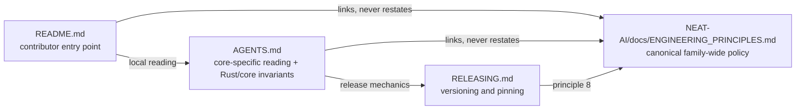

## Summary

NEAT-AI-core now works from the same engineering song sheet as the rest of the
family instead of maintaining a parallel, agent-only policy copy. Family-wide
policy stays in `stSoftwareAU/NEAT-AI/docs/ENGINEERING_PRINCIPLES.md`
(NEAT-AI#3978) and is **linked**, never restated; what stays here is the
core-specific reading of those rules plus the Rust/core invariants.

- `AGENTS.md` opens with a callout naming the canonical document as the single
  home of family-wide policy, followed by a `## Family-wide engineering
  principles` section that states only what those rules mean in the shared
  native core: core is the receiving end of a TypeScript → Rust migration
  (parity or a deliberate, tested improvement proven first, ownership to
  `neat-core`, the superseded TypeScript implementation deleted in the same
  migration, no runtime fallback, shadow execution or long-lived dual path); a
  defect found after a migration starts with the smallest reproducing test in
  `neat-core` and is fixed in the canonical implementation; rollback is a
  version move, never a duplicate implementation; and the ownership fence is
  principle 10 in local form.
- The local `## TDD (required)` and `## Testing: "what" not "how"` sections
  keep only the crate-specific mechanics (`cargo test --workspace`,
  `./quality.sh`, the characterisation-test exception, the local list of "how"
  shapes) and defer the rule itself to principles 1 and 3.
- `README.md`'s contributor-facing TDD section links the canonical principles
  and points at `AGENTS.md` for their local reading.
- `RELEASING.md`'s versioning policy names principle 8 — rollback is versioning
  and pinning, not duplicate code — so a releaser meets the rule where the
  pinning decision is actually made.
- The Rust/core invariants are untouched and remain locally discoverable:
  oracles and mutation evidence, build profiles, the ownership fence, the
  unsafe/SIMD invariants, and CI/secrets.

Closes #593.

## Evidence

This is a documentation change with no web interface to screenshot. The
evidence is the test suite below plus two checks run against live artefacts.

**Every deep link resolves.** The canonical document is 9432 bytes on
`NEAT-AI@Develop` (`gh api repos/stSoftwareAU/NEAT-AI/contents/docs/ENGINEERING_PRINCIPLES.md`).
All 7 canonical anchors used here (`#1-…`, `#2-…`, `#3-…`, `#6-…`, `#7-…`,
`#8-…`, `#10-…`) plus the in-repo anchors
(`AGENTS.md#family-wide-engineering-principles`,
`README.md#neat-ai-scorer-rust--path-dependency`,
`README.md#build-profiles-issue-546`) were slugified from the real headings
with GitHub's rules and matched exactly — no broken link.

**`bats tests/scripts/engineering_principles_link.bats` — 13/13 green.**
Against the base branch's documents, 9 of the 13 go red. Every assertion was
then mutation-tested individually (scratch worktree, reverted after each).
The six rows below are the mutations that defeated the **first** version of
these oracles — reported by the independent reviewers and each now caught:

| Mutation | Before | Now |
|---|---|---|
| migration bullet rewritten to say the migration **keeps** the old TypeScript implementation | green | red — "the migration rule names parity, ownership, deletion and no fallback" |
| deletion clause deleted outright (was satisfied by "revive the deleted TypeScript path" three bullets away) | green | red — same test |
| rollback bullet's body gutted ("Consumers do whatever they like"), bold title left intact | green | red — "rollback is documented as re-pinning a revision, not duplicate code" |
| "never a second, parallel implementation" replaced by "keep whatever you like alive", title intact | green | red — same test |
| four canonical principles pasted back into the section verbatim | green | red — "every rule in the deferral section defers by link" |
| the section emptied of its rules | green | red — same test |

Earlier mutations, all still red: the pre-change documents (9 tests); the
canonical URL rewritten to a relative path in `README.md` and in `RELEASING.md`;
a canonical principle title or the family pre-PR checklist added as a local
heading; `## Ownership fence (Issue #544)` renamed; `cargo test --workspace`
weakened to `cargo test`; the `RELEASING.md` deferral removed, and removed
while its link was left in place.

**`./quality.sh` passed** in the foreground — bash syntax, shellcheck, the
TypeScript gate, the Mermaid gate, the JSR supply-chain gate, `cargo fmt`,
Clippy under `-D warnings`, `cargo test --workspace`, doctests, docs and the
release build. `bats` is not installed in this container, so the gate skips the
shell suites; the new suite was run directly with a local `bats-core` checkout
(13/13) and CI runs it on the PR (`ci.yml` → `bats tests/scripts`).
`markdownlint-cli2@0.23.2` — the version CI pins — reports **0 issues** over the
changed documents.

## Acceptance Criteria

<!-- vibe-spec-review inputs="diff+issue-body" -->

- **met** — link to the canonical document prominently from `AGENTS.md` — evidence: `AGENTS.md:3-10` (`> [!IMPORTANT]` callout) and `AGENTS.md:12-49` — reviewer: met
- **met** — link from any contributor-facing guidance in this repository — evidence: `README.md:22-24`, `RELEASING.md:12-21`; the reviewer confirmed there is no `CONTRIBUTING.md` and that `SECURITY.md`, the benches READMEs and the issue templates carry no engineering policy — reviewer: met
- **met** — retain repository-specific Rust/core invariants here — evidence: `AGENTS.md` `## Unsafe & SIMD invariants`, `## Ownership fence (Issue #544)`, `## Build profiles (Issue #546)`, `## Oracles and mutation evidence`, `## CI / secrets`, all pinned by `tests/scripts/engineering_principles_link.bats::the Rust/core invariants remain in AGENTS.md` — reviewer: met
- **partial** — remove or shorten duplicated family-wide policy text — evidence: `AGENTS.md:50-62` (the TDD rule and the "same rule as NEAT-AI `CONTRIBUTING.md`" parenthetical now defer to principles 1 and 3) — reviewer: partial — reason: the reviewer diffed the base `AGENTS.md` and found almost no family-wide policy text to remove, so the shortening is small and net content grew; nothing was left wrongly duplicated
- **partial** — keep agent-specific operational instructions only where genuinely agent-specific — evidence: `AGENTS.md:6-8`, `README.md:24` — reviewer: partial — reason: the file now states it carries no agent-only dialect and routes humans in, but no content was reclassified or moved out, and with no `CONTRIBUTING.md` in this repo there is nowhere to move it; splitting `AGENTS.md` was not asked for
- **met** — TS → Rust migration rule explicit by reference: parity/superiority, ownership transfer, delete the old implementation, no fallback/dual path — evidence: `AGENTS.md:20-33`, pinned by `engineering_principles_link.bats::the migration rule names parity, ownership, deletion and no fallback` — reviewer: met
- **met** — post-migration defects get a regression test first and are fixed in the canonical implementation — evidence: `AGENTS.md:31-35`, pinned by `engineering_principles_link.bats::a post-migration defect starts with the smallest reproducing test` — reviewer: met
- **met** — version/revision pinning documented as the rollback mechanism, not duplicate implementations — evidence: `AGENTS.md:36-46`, `RELEASING.md:12-21` — reviewer: met — reason: the reviewer marked it "met but factually wrong in part" — it said NEAT-AI-scorer pins the crate version, when `README.md:961-968` and `RELEASING.md:3-6` state that it takes no pin and tracks the path dependency at head; corrected in commit `ee2b851` to state each consumer's real recovery path
- **met** — DRY: link the shared policy, do not copy it — evidence: no principle text is copied; `engineering_principles_link.bats::every rule in the deferral section defers by link` and `::the family checklist and principle titles are not restated here` — reviewer: met
- **met** — acceptance: both audiences reach the shared principles, core rules stay locally discoverable — evidence: humans via `README.md:22-24`, agents via `AGENTS.md:3-10`; core rules pinned by the invariants test — reviewer: met
- **unrequested** — `tests/scripts/engineering_principles_link.bats` (13 tests) — reviewer: unrequested — reason: the issue asked only for documentation, but this repo's TDD rule and this run's instructions require a failing test first; kept because it is what makes the deferral enforceable, and rebuilt after review so each assertion can fail
- **unrequested** — `RELEASING.md` is a third file for a two-file requirement — reviewer: unrequested — reason: the reviewer judged it defensible under the version/revision-pinning criterion — the pinning decision is made in that document, so the rule belongs where a releaser reads it
- **unrequested** — the test forbids a local `docs/ENGINEERING_PRINCIPLES.md` and blacklists the canonical principle titles as local headings — reviewer: unrequested — reason: both are the enforcement of "do not copy the shared policy"; the path guard exists because a relative link there would 404 for every reader

## Standards Review

<!-- vibe-standards-review inputs="diff+CODING-STANDARDS.md" -->

This repo has no `CODING-STANDARDS.md`; the reviewer was given the diff and the
repo's documented standards — `AGENTS.md`'s "Testing: 'what' not 'how'" and the
five "Oracles and mutation evidence" rules — plus the fleet standards.

- **violation** — vacuous sub-assertion: the deletion clause was satisfied by unrelated prose three bullets away, so the migration bullet could state the opposite and stay green (oracle rule 3) — evidence: `tests/scripts/engineering_principles_link.bats:157` (pre-fix) — reason: fixed in `ee2b851` — assertions are now scoped to the owning bullet via `bullet_body`, and the reviewer's own mutation now goes red
- **violation** — the rollback assertions were satisfied by the bullet's bold title, so the body could contradict it — evidence: `tests/scripts/engineering_principles_link.bats:171-172` (pre-fix) — reason: fixed in `ee2b851` — `bullet_body` strips the leading bold label, so only the body can satisfy a body assertion
- **violation** — line-count oracle with a bare magic number (`-le 45`), which `AGENTS.md` lists among the discouraged "how" shapes and oracle rule 3 forbids; it also failed to test its contract — four principles pasted in verbatim stayed under the budget — evidence: `tests/scripts/engineering_principles_link.bats:184` (pre-fix) — reason: fixed in `ee2b851` — replaced by "every rule in the deferral section defers by link", which is the property that actually separates a pointer from a copy
- **violation** (nit, fail-quiet) — `[ "$status" -ne 0 ]` after `grep -qiE` accepted grep's exit 2 (unreadable file) as a pass — evidence: `tests/scripts/engineering_principles_link.bats:192-193` (pre-fix) — reason: fixed in `ee2b851` — now asserts `-eq 1`, the "no match" code
- **violation** (nit, diagnostics lost) — `run` captured the helpers' `section is missing: <label>` output and a bare status assertion never printed it — evidence: `tests/scripts/engineering_principles_link.bats:154,163,170` (pre-fix) — reason: fixed in `ee2b851` — `assert_ok` prints `$output` on failure; the diagnostics were observed reaching the reviewer during this run
- **violation** (nit) — the PR summary was untracked while the two preceding PRs each committed one — evidence: `docs/archive/pr-summaries/pr-summary-593.md` — reason: fixed — committed with this change, and its mutation table now records the assertions that could not fail rather than claiming they all could
- **clean** — Australian English across all added lines (`behaviour`, `artefacts`, `characterisation`, `optimised`, `licence`); no US spellings in the `-ize`/`-or`/`artifact`/`center` families
- **clean** — every Python assertion uses a **quoted** heredoc (`<<'PY'` with `os.environ[…]`), per oracle rule 4, so the shell cannot interpolate the document text or run the backticks in it
- **clean** — regexes are anchored to prose, not to link URLs: `](…)` destinations and bare URLs are stripped before matching, verified by mutation — an anchor slug that spells a rule out cannot satisfy an assertion on its own
- **clean** — doc-grepping is the contract here, not a forbidden source grep: the documents *are* the deliverable, matching the established `docs_single_source.bats` convention
- **clean** — no hidden or secret files staged; no regressions in the doc-adjacent bats suites (`docs_single_source`, `docs_pipeline_accuracy`, `readme_glossary`, `agents_oracle_mutation_evidence`, `core_ownership_fence`); the new suite is enforced by both `quality.sh` and `ci.yml`

## Test Plan

- Added `tests/scripts/engineering_principles_link.bats` — 13 tests over the
  published documents:
  - the canonical document is reachable from `AGENTS.md`, from `README.md`, and
    from `README.md`'s own contributor-facing TDD section;
  - every link to it is an absolute URL on the NEAT-AI repository — a relative
    path would 404 here, because the document does not live in this repo;
  - `RELEASING.md`'s versioning policy names the canonical rollback rule and
    states rollback as a repin rather than a revived implementation;
  - the migration rule, the smallest-reproducing-test rule and the rollback rule
    are each asserted against the prose of the bullet that owns them, with the
    bullet's bold title stripped first;
  - DRY: every rule in the section cites the canonical principle it localises,
    and neither the canonical principle titles nor the family pre-PR checklist
    is restated as a heading in `AGENTS.md`, `README.md` or `RELEASING.md`;
  - the Rust/core invariants and the crate-specific TDD mechanics stay local.
- Helpers: `bullet_body` (bullet-scoped, title-stripped extraction),
  `assert_matches` (URL-stripped, whitespace-flattened regex matching) and
  `assert_ok` (prints the failing helper's diagnostics).
- No Rust behaviour changed, so no crate tests were added; `cargo test
  --workspace` stays green via `./quality.sh`.
