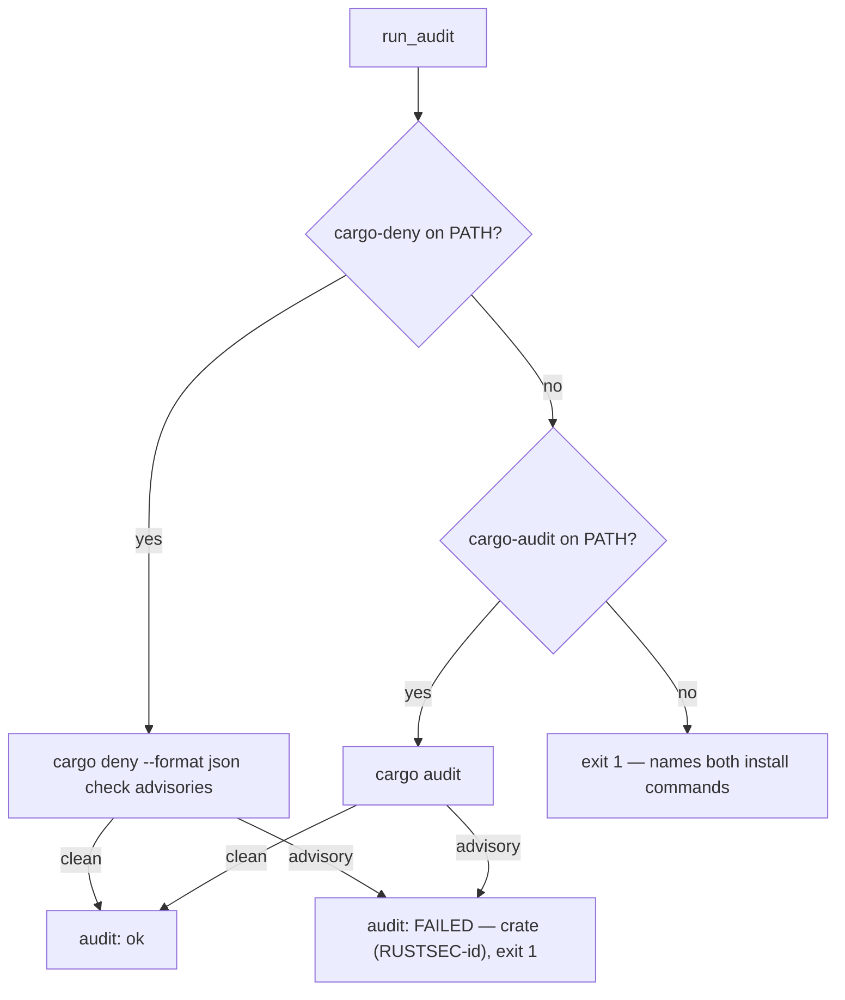
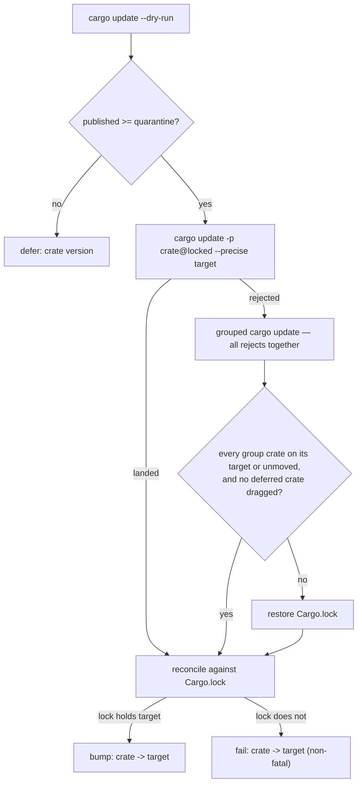

## Summary

`bump-deps.sh` accepted only `cargo audit` as its advisory scanner. The worker
host carries **cargo-deny 0.20.2 and no cargo-audit**, so the audit stage exited
1 on every unattended run, the worker reverted the bump each time, and
dependency bumps were silently disabled for this repository. Six of the
thirteen available crate updates also failed on every run: `syn` because it is
locked at two majors (2.0.119 and 3.0.3) so a bare `-p syn` is ambiguous, and
the js-sys / wasm-bindgen family because those crates only resolve when moved
together.

This change:

- **Advisory scan** — runs `cargo deny check advisories` when `cargo-deny` is on
  `PATH`, falls back to `cargo audit`, and exits 1 naming **both** install
  commands only when neither is installed. Either tool reports the offending
  crate and RustSec id in the same shape:
  `audit: FAILED — smallvec (RUSTSEC-2021-0003)`. cargo-deny's advisory details
  are read from its `--format json` diagnostics; the existing text parser is
  kept for cargo-audit.
- **Versioned package spec** — the per-crate `cargo update` pins the spec to the
  version the dry run planned to replace (`-p syn@3.0.3 --precise 3.0.5`), so a
  crate locked at two majors is no longer ambiguous.
- **Grouped retry** — crates the per-crate pass cannot land are retried together
  in one `cargo update`. Only quarantine-approved crates join the group; because
  cargo accepts a single `--precise`, the quarantine is re-enforced afterwards
  against the lockfile. Every crate in the group must end on its approved target
  or on the version it started from, and no crate the quarantine **deferred**
  may have been dragged forward — otherwise the whole group is reverted. Movement
  of out-of-group transitive crates is expected (cargo must be free to move a
  dependency to satisfy the versions the group asked for) and does not trip the
  check.
- **Reconciliation against `Cargo.lock`** — a crate is reported `bump:` only when
  the lock actually holds its approved target, so a crate dragged to its target
  by another crate's update is no longer mis-reported as `fail:`.

CI is unchanged: `ci.yml` and `upgrade-dependencies.yml` install cargo-audit and
not cargo-deny, so those jobs keep running `cargo audit` exactly as today —
through the same fallback.

Closes #598.

## Evidence

Backend/CLI change — no web interface to screenshot. Evidence is command output
from the worker host itself (cargo 1.98.0, cargo-deny 0.20.2, **no** cargo-audit,
no rustup).

**Before** — the exact failure the issue reports:

```console
$ bash bump-deps.sh --skip-external --skip-build
Error: cargo audit not available — install with 'cargo install cargo-audit --locked'
EXIT=1
```

**After** — same host, same command:

```console
$ bash bump-deps.sh --skip-external --skip-build
  audit tool: cargo deny check advisories
audit: ok
bump-deps: no bumps (external=skipped; audit=ok; build=skipped)
EXIT=0
```

**After** — full external bump against the `Cargo.lock` of 2026-09-08, run on a
scratch copy of the tree so the committed lockfile is untouched. All thirteen
crates land and the summary reports **0 failed** (was `7 bumped, 0 deferred,
6 failed`):

```console
$ bash bump-deps.sh --skip-build
  bump: cc -> 1.4.5
  bump: crossbeam-deque -> 0.8.8
  bump: crossbeam-epoch -> 0.9.21
  bump: crossbeam-utils -> 0.8.23
  bump: either -> 1.18.0
  bump: find-msvc-tools -> 0.1.12
  bump: js-sys -> 0.3.105
  bump: syn -> 3.0.5
  bump: wasm-bindgen -> 0.2.128
  bump: wasm-bindgen-macro -> 0.2.128
  bump: wasm-bindgen-macro-support -> 0.2.128
  bump: wasm-bindgen-shared -> 0.2.128
  bump: web-sys -> 0.3.105
external: 13 bumped, 0 deferred, 0 failed
  audit tool: cargo deny check advisories
audit: ok
bump-deps: external=13 bumped, 0 deferred, 0 failed; audit=ok; build=skipped
EXIT=0
```

**After** — the whole script including the native build (WASM skipped, no
rustup on this host, as before):

```console
$ bash bump-deps.sh
external: no updates
  audit tool: cargo deny check advisories
audit: ok
build: native ok, wasm SKIPPED (rustup missing)
bump-deps: no bumps (external=no updates; audit=ok; build=wasm SKIPPED (rustup missing))
EXIT=0
```

The cargo-deny JSON the parser reads is not invented — it was captured from a
real `cargo deny --format json check advisories` run against a scratch crate
pinned to `smallvec =1.6.0`, and that captured shape is what the stub in
`bump_deps.bats` replays.

### Audit-stage flow



### External bump flow



## Reproduction

- **symptom** — `bump-deps.sh` exits 1 with
  `Error: cargo audit not available` on the worker host, so every dependency
  bump is reverted; six of thirteen crates additionally report
  `fail: … (cargo update rejected)`
- **status** — `verified` — `bash bump-deps.sh --skip-external --skip-build`
  exited 1 against the unfixed script on this host and exits 0 after the fix,
  and the new bats tests were run red before the implementation and green after
- **regression test** —
  `tests/scripts/bump_deps.bats::audit: cargo-deny present and cargo-audit absent passes`
  (with `::external: crates the per-crate pass rejects are retried as one group`
  covering the `cargo update rejected` half of the symptom)

## Mutation evidence

A green test is not evidence. Each new behaviour was mutated one at a time and
the covering test observed going red; every mutation was reverted before commit
(`bump-deps.sh` is byte-identical to its pre-mutation copy each time).

| Mutation in `bump-deps.sh` | Test that died |
|---|---|
| `elif command -v cargo-audit …` → `elif false` | `audit: cargo-audit present and cargo-deny absent passes` |
| tool selection order inverted (cargo-audit first) | `audit: cargo-deny is preferred when both scanners are installed` |
| `crate = crate or krate.get("name")` → `crate = crate` | `audit: a cargo-deny advisory with no package field names the graph crate` |
| `crate_pkg_spec` emits a bare `crate` instead of `crate@version` | `external: per-crate update pins the package spec to the locked version` |
| `crate_pkg_spec` returns a bare `crate` instead of failing on ambiguity | `external: a crate with no unambiguous package spec fails loud` |
| `grouped_retry()` returns 0 immediately | `external: crates the per-crate pass rejects are retried as one group` |
| grouped-retry deferred-crate check disabled (`if false`) | `external: grouped retry dragging a quarantined crate is reverted` |
| grouped-retry verdict forced to revert (`approved=0`) | `external: grouped retry keeps a group that also moves a transitive crate` |
| grouped-retry member check gutted (an earlier `lock_change_approved` → `return 0`) | `external: grouped retry landing an unapproved version is reverted` |
| reconciliation `crate_locked_at …` → `false` | `external: a crate landed by another crate's update counts as bumped` |

Before the implementation the first ten tests ran red as a set (8 red, 1 green on
the pre-existing cargo-audit path, 1 vacuously green — that one was tightened
with a grouped-invocation assertion and then died under the `grouped_retry()`
mutation above). The five later tests were added in response to the independent
reviews below and each was mutation-checked on arrival.

## Test Plan

Fifteen tests added to `tests/scripts/bump_deps.bats`. They drive the real script
against a stub `PATH` — a stub `cargo` that records its argv, serves a canned
`update --dry-run`, edits a fake `Cargo.lock` (including crates it drags along
that the `-p` spec never named) and replays captured audit output — and assert on
observable outcomes (exit code, reported lines, the argv the script handed cargo,
the resulting lockfile), never on source text:

Audit stage:

- `cargo-deny present and cargo-audit absent passes` — exit 0, `audit: ok`, and
  the scan went through `cargo deny … check advisories`.
- `cargo-audit present and cargo-deny absent passes` — the fallback still works.
- `cargo-deny is preferred when both scanners are installed` — pins the
  documented preference order.
- `neither scanner installed fails loud naming both installs` — exit 1, the error
  names both `cargo install` commands.
- `a cargo-deny advisory names the crate and RUSTSEC id` — real captured
  cargo-deny JSON → exit 1, `audit: FAILED — smallvec (RUSTSEC-2021-0003)`.
- `a cargo-deny advisory with no package field names the graph crate` — the
  inclusion-graph fallback for diagnostics that omit `advisory.package`.
- `a cargo-audit advisory names the crate and RUSTSEC id` — the same line from
  cargo-audit's text output.

External bump:

- `per-crate update pins the package spec to the locked version` — a crate locked
  at two majors is updated with `-p syn@3.0.3 --precise 3.0.5`.
- `a crate with no unambiguous package spec fails loud` — a crate locked at two
  majors, neither matching the dry-run version, is reported and never handed to
  cargo as a bare ambiguous `-p syn`.
- `crates the per-crate pass rejects are retried as one group` — both crates land
  through one grouped invocation carrying both specs.
- `grouped retry excludes crates still inside quarantine` — a quarantined crate is
  never handed to `cargo update` and its locked version is unchanged.
- `grouped retry dragging a quarantined crate is reverted` — the group lands its
  own target but drags a deferred crate past the release-age window; the lock is
  restored and the group reported `fail:`.
- `grouped retry keeps a group that also moves a transitive crate` — an
  out-of-group dependency moving does **not** revert a group whose own crates all
  landed on target.
- `grouped retry landing an unapproved version is reverted` — a group member
  landing off-target restores the lock and reports both crates `fail:`.
- `a crate landed by another crate's update counts as bumped` — the reconciliation
  pass reports `bump:`, not `fail:`.

Gates run:

- `./quality.sh < /dev/null` — passes on this host, as the worker runs it.
- Full `bats tests/scripts` (409 tests) under `bats-core` 1.14.0. All fifteen new
  tests pass. The 109 pre-existing failures on this host are an environment gap,
  not a regression: those suites parse workflow YAML through python's `yaml`
  module, which is not installed here. The failure set is **identical** to a clean
  `Develop` checkout run in the same container (`diff` of the two failure lists is
  empty); CI, which has `pyyaml`, runs them green.
- `shellcheck -s bash bump-deps.sh` and `bash -n bump-deps.sh` — clean.
- `markdownlint-cli2` and the repo Mermaid gate — clean.

## Documentation

- `bump-deps.sh` header and `--help` text now name `cargo deny check advisories`
  (with `cargo audit` as the fallback) and the grouped retry.
- `README.md` — the `bump-deps.sh` repository-layout row and the "Dependency
  updates: two channels" description.
- `AGENTS.md` — the CI/secrets PR-pipeline line. Kept to the one phrase that
  named `cargo audit`, to avoid conflicting with the `AGENTS.md` rewrite in #593.
- `ci.yml` / `upgrade-dependencies.yml` — comment and generated-PR-body text only.
  Neither runner installs cargo-deny, so both keep running `cargo audit` through
  the new fallback exactly as before; what changed is that they no longer claim
  cargo-audit is *required* by the script, and the PR body the scheduled workflow
  writes no longer asserts the bumps "passed `cargo audit`" when a future runner
  might have run cargo-deny instead.

## Acceptance Criteria

<!-- vibe-spec-review inputs="diff+issue-body" -->

- **met** — the audit stage runs `cargo deny check advisories` when cargo-deny is
  on PATH, otherwise `cargo audit`; with neither it errors naming both install
  commands and exits 1 — evidence: `bump-deps.sh:run_audit`,
  `tests/scripts/bump_deps.bats::audit: neither scanner installed fails loud naming both installs`
  — reviewer: met
- **met** — `audit: ok` on success; `audit: FAILED — <crate> (<RUSTSEC id>)` and
  exit 1 on an advisory, whichever tool ran — evidence:
  `tests/scripts/bump_deps.bats::audit: a cargo-deny advisory names the crate and RUSTSEC id`
  and `::audit: a cargo-audit advisory names the crate and RUSTSEC id` — reviewer:
  met (the reviewer injected a fake `RUSTSEC-2099-0001` advisory into the real
  advisory DB and confirmed the live script printed
  `audit: FAILED — libc (RUSTSEC-2099-0001)` and exited 1)
- **met** — the per-crate `cargo update` uses the locked version as the package
  spec — evidence:
  `tests/scripts/bump_deps.bats::external: per-crate update pins the package spec to the locked version`
  — reviewer: met
- **met** — rejects are retried together in one grouped `cargo update`; landed
  crates report `bump:`, unlanded ones `fail:`, exit 0 — evidence:
  `tests/scripts/bump_deps.bats::external: crates the per-crate pass rejects are retried as one group`
  — reviewer: met
- **met** — the grouped retry includes only quarantine-approved crates and
  reverts anything else — evidence:
  `tests/scripts/bump_deps.bats::external: grouped retry dragging a quarantined crate is reverted`
  and `::external: grouped retry landing an unapproved version is reverted` —
  reviewer: partial — reason: the reviewer proved the original check reverted the
  whole group on **any** lockfile churn, including a benign new transitive
  package, which would have kept the real wasm-bindgen family at `fail:`. The
  check was narrowed in this diff to "every group crate on its approved target or
  unmoved, and no deferred crate dragged", and two tests were added for the two
  halves.
- **met** — a clean-checkout run on the worker host exits 0 and the `external:`
  summary reports 0 failed against the 2026-09-08 lock — evidence: the three
  command transcripts under **Evidence** (`13 bumped, 0 deferred, 0 failed`,
  `audit: ok`, `build: native ok`, exit 0) — reviewer: partial — reason: the
  reviewer verified the audit half but could not reach crates.io from its
  sandbox; the external half was run here against the real registry, output
  quoted above.
- **met** — regression tests in `tests/scripts/bump_deps.bats` using the stub-PATH
  pattern cover all six named cases — evidence: the fifteen tests listed under
  **Test Plan** — reviewer: met
- **met** — `README.md`, `AGENTS.md`, the script header and the usage text name
  `cargo deny check advisories` with `cargo audit` as the fallback — evidence:
  `README.md:117`, `README.md:1020`, `AGENTS.md:657`, `bump-deps.sh:14-17`,
  `bump-deps.sh:37-39` — reviewer: met
- **unrequested** — the stdout line `  audit tool: cargo deny check advisories` —
  reviewer: unrequested — reason: one line naming which scanner ran; the issue's
  whole premise is that nobody could tell why the audit stage failed on the
  worker, so the log now says which tool it used.
- **unrequested** — `cargo deny --format json` plus a JSON parser rather than
  cargo-deny's human output — reviewer: unrequested — reason: the criterion
  demands the exact `audit: FAILED — <crate> (<id>)` line, and the JSON
  diagnostics are the only stable place cargo-deny exposes the crate and RustSec
  id. The reviewer noted the raw JSON blob replaced the human diagnostic in the
  log, so the failure path now renders one readable
  `  advisory: <crate> <version> — <title> (<id>)` line per advisory instead.
- **unrequested** — reporting the per-crate pass from the lockfile rather than
  cargo's exit status — reviewer: unrequested — reason: required by the criterion
  "0 failed" — six of the thirteen crates land as a side effect of another
  crate's update, and exit-status reporting is exactly what mislabelled them
  `fail:` in the issue's log.
- **unrequested** — `crate_pkg_spec` falls back to the sole locked version when
  the dry-run "from" has already moved — reviewer: unrequested — reason: without
  it, a crate an earlier bump partially moved has no spec at all; the ambiguous
  case still fails loud rather than guessing (`external: a crate with no
  unambiguous package spec fails loud`).
- **unrequested** — the cargo-audit text parser was rewritten — reviewer:
  unrequested — reason: the old awk required `ID:` before `Crate:`, but cargo
  audit prints `Crate:` first, so the fallback path could never produce the line
  the criterion demands. Fixing it is load-bearing for "whichever tool ran".
- **unrequested** — comment/PR-body text in `ci.yml` and
  `upgrade-dependencies.yml` — reviewer: unrequested — reason: those files
  asserted cargo-audit "is required by bump-deps.sh" and that bumps "passed
  `cargo audit`"; both became inaccurate with this change. No workflow behaviour
  changed.

## Standards Review

<!-- vibe-standards-review inputs="diff+CODING-STANDARDS.md" -->

- **violation** — the cargo-deny-over-cargo-audit preference had no oracle: the
  reviewer inverted the order in place and all tests stayed green — evidence:
  `bump-deps.sh:run_audit` — reason: fixed here — added
  `tests/scripts/bump_deps.bats::audit: cargo-deny is preferred when both scanners are installed`,
  which dies under that exact mutation.
- **violation** — `lock_change_approved` failed open: `comm` ran inside a process
  substitution, so a `comm` failure read as "approved" and let an unapproved
  version through with exit 0 — evidence: the former `lock_change_approved` —
  reason: fixed here — `comm` and the whole snapshot-diff were removed; the check
  is now direct `crate_locked_at` assertions per group member and per deferred
  crate.
- **violation** — `LC_ALL=C sort` output fed a `comm` running under the ambient
  locale, which mis-collates `serde` / `serde-wasm-bindgen` / `serde_derive` and
  truncates — evidence: the former `lock_change_approved` — reason: fixed here —
  same removal; no `comm` remains.
- **violation** — bare `mktemp` is a usage error on macOS/BSD and would abort the
  bump under `set -e` — evidence: `bump-deps.sh:grouped_retry` — reason: fixed
  here — now `mktemp "${TMPDIR:-/tmp}/bump-deps-lock.XXXXXX"`.
- **violation** — the grouped `cargo update` failure path discarded cargo's
  diagnostics to `/dev/null`, so a failed retry left no cause in the worker log —
  evidence: `bump-deps.sh:grouped_retry` — reason: fixed here — cargo's output
  goes to stderr and the path prints
  `  retry: grouped cargo update rejected N crate(s)`.
- **violation** — the revert message blamed the quarantine for any lockfile
  churn, and the branch was unreachable from the test stub — evidence:
  `bump-deps.sh:grouped_retry` — reason: fixed here — two distinct messages name
  the actual cause (`moved <crate> off its approved target` /
  `moved quarantined <crate> off <version>`), and the stub now models drag-along
  so both branches are exercised.
- **violation** — untested branches: the `graphs[0].Krate.name` fallback, the
  ambiguous-spec `return 1`, and the silent `crate_pkg_spec` failure — evidence:
  `bump-deps.sh:crate_pkg_spec`, `bump-deps.sh:deny_advisories` — reason: fixed
  here — two tests added, and the ambiguous case now prints a `skip:` line rather
  than dropping the crate silently.
- **violation** — `lock_snapshot | grep -q` can SIGPIPE the upstream `sort`, and
  under `pipefail` a locked crate would then read as unlocked — evidence:
  `bump-deps.sh:crate_locked_at` — reason: fixed here — the snapshot is
  materialised into a variable and matched with a here-string.
- **violation** — one output format built three ways (Python literal em dash, awk
  octal escape, a third fallback) — evidence: the former `deny_first_advisory` /
  `audit_first_advisory` — reason: fixed here — both parsers now emit a
  `<crate>|<version>|<id>|<title>` record and `run_audit` owns the single copy of
  the format.
- **violation** — the embedded Python used `python3 -c '<multi-line>'`, which
  AGENTS.md §4 says should be a quoted heredoc — evidence: the former
  `deny_first_advisory` — reason: fixed here — now
  `python3 -c "$(cat <<'PY' … PY)"`, which keeps the quoted-heredoc form while
  leaving stdin free for the diagnostics being parsed.
- **violation** — five statements in `ci.yml` / `upgrade-dependencies.yml`
  contradicted the change, including a generated PR body asserting the bumps
  "passed `cargo audit`" — evidence: `.github/workflows/ci.yml:84`,
  `.github/workflows/upgrade-dependencies.yml:88` — reason: fixed here, comment
  and body text only.
- **violation** — `local -a idx=("$@")` with an empty `$@` is the pattern the
  bash-3.2 `set -u` rule names, even though the call site guards it — evidence:
  `bump-deps.sh:grouped_retry` — reason: fixed here — `[[ $# -gt 0 ]] || return 0`
  precedes the array assignment.
- **violation** — KISS: `bump-deps.sh` now mixes argument parsing, date maths,
  crates.io HTTP, lockfile parsing, two output parsers and two builds in one
  ~500-line file; the reviewer proposed splitting the lockfile helpers into a
  sourced `scripts/lockfile.sh` — evidence: `bump-deps.sh` — reason: stands. The
  issue's accepted scope names the versioned spec and the grouped retry as part
  of this fix, and splitting the script would move `bump-deps.sh` off the single
  self-contained entry point every CI workflow and the worker invoke by path.
  Recorded rather than actioned.
- **clean** — Australian English throughout the added lines ("honouring",
  "behaviour"); no `timeout` usage; every `"${arr[@]}"` / `${!arr[@]}` expansion
  length-guarded for bash 3.2 `set -u`; no `local x=$(cmd)` exit-status traps;
  every `grouped_retry` return path removes its temp file; tests exercise real
  code with no source-text greps; `shellcheck` and `markdownlint-cli2` clean; no
  hidden files or secrets staged; the two advisory parsers reach their result by
  routes independent of the tool under test (AGENTS.md oracle rule 1).

## Follow-up filed

The reviewers found a **pre-existing** quarantine gap this change does not close:
the *per-crate* `cargo update -p X --precise T` can drag an unrelated crate Y —
including one the run just printed `defer:` for — to a version that never passed
the release-age check, and nothing reverts or reports it. The grouped retry now
guards against exactly that, but the per-crate pass has behaved this way since
Issue #38 and closing it is a separate change. Filed as its own issue rather than
folded in here: **#614**.
