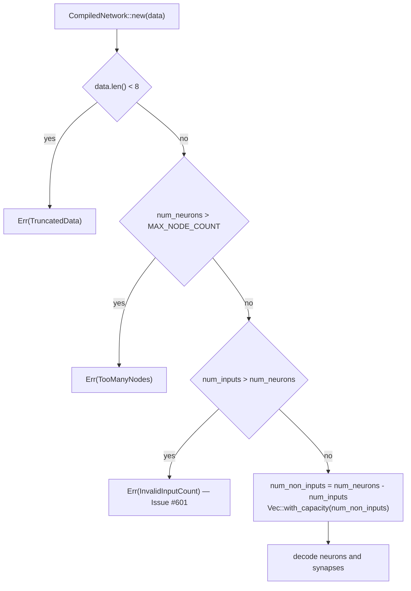

# PR Summary — Issue #601

## Summary

`CompiledNetwork::new` — the `#[wasm_bindgen(constructor)]` entry point that
decodes a serialised network from a host-supplied byte buffer — read
`num_neurons` and `num_inputs` from the 8-byte header and computed
`num_neurons - num_inputs` without comparing them. That is a `usize`
subtraction, so a header declaring more inputs than nodes (minimally
`num_neurons = 0`, `num_inputs = 1`) wrapped to a value near `usize::MAX` under
the release profile's Cargo-default `overflow-checks = false`, and the following
`Vec::with_capacity` aborted with "capacity overflow". WASM has no
`catch_unwind`, so a malformed buffer took the whole module — and the host
session's state — with it.

The loader now validates `num_inputs <= num_neurons` alongside the existing
`num_neurons > MAX_NODE_COUNT` check and returns a new
`NetworkError::InvalidInputCount { num_inputs, num_neurons }`, matching how
`TruncatedData`, `TooManyNodes` and `InvalidSynapseIndex` already reject
malformed buffers gracefully. Closes #601.

`NetworkError` is not `#[non_exhaustive]`, so the new variant breaks a
downstream exhaustive `match` — the same shape as `GraftError::CountNotRepresentable`
in `0.13.0`. The commit therefore carries a `BREAKING CHANGE:` footer, the crate
moves to `0.15.0`, and `RELEASING.md` gains the matching breaking-change entry.

## Evidence

Backend/library change with no web interface to screenshot — the evidence is the
regression tests below plus the load-time decision path:

**The original trigger is closed, with no trivial bypass.** The 8-byte header
`[0,0,0,0, 1,0,0,0]` from the report now returns `Err(InvalidInputCount)` before
any allocation. The guard is `num_inputs > num_neurons` on the two `usize`
values the subtraction itself consumes, placed on the only path that reaches it,
so every input that could underflow `num_neurons - num_inputs` is rejected
first — the remaining domain (`num_inputs <= num_neurons`) makes the subtraction
total. Both fields are decoded from `u32`, so no header value can exceed the
`usize` range or alias past the comparison, and the `num_neurons > MAX_NODE_COUNT`
guard still runs first for oversized node counts. `CompiledNetwork::from_parts`,
the only other constructor, derives `num_neurons = num_inputs + neurons.len()`
and so cannot express the malformed relation at all.

## Reproduction

- **symptom** — an 8-byte buffer with `num_neurons = 0`, `num_inputs = 1`
  panicked inside `CompiledNetwork::new` instead of returning an error, aborting
  the WASM module
- **status** — `verified` — the committed regression test was run with the guard
  removed and failed with
  `panicked at neat-core/src/network.rs:617:30: attempt to subtract with overflow`,
  then passed with the guard restored
- **regression test** —
  `neat-core/tests/network_header_input_count.rs::rejects_one_input_declared_against_zero_neurons`

## Test Plan

- Added `neat-core/tests/network_header_input_count.rs::rejects_one_input_declared_against_zero_neurons`
  — the minimal malicious header from the report, driven from the case table by
  `every_header_declaring_more_inputs_than_neurons_is_refused`. It reproduces
  the flaw: it fails against the unfixed code (`attempt to subtract with
  overflow`) and passes after the fix.
- Added `neat-core/tests/network_header_input_count.rs::rejects_one_more_input_than_neurons`
  — the smallest off-by-one (`num_neurons = 8`, `num_inputs = 9`), so the guard
  is pinned at its boundary rather than only at the extreme.
- Added `neat-core/tests/network_header_input_count.rs::rejects_an_input_count_at_the_top_of_the_u32_range`
  — `num_inputs = u32::MAX` against a `MAX_NODE_COUNT` network, covering the top
  of the attacker-controllable range.
- Added `neat-core/tests/network_header_input_count.rs::a_header_declaring_every_node_an_input_still_loads`
  — the accepting edge (`num_inputs == num_neurons`), proving the guard refuses
  only the underflowing case rather than tightening what a valid buffer may
  declare.
- Added `neat-core/tests/typed_errors.rs::compiled_network_new_rejects_more_inputs_than_neurons`
  — the typed-error contract: the refusal is a matchable variant carrying both
  counts and implementing `std::error::Error`.
- Added three unit tests in `neat-core/src/network.rs` covering the same three
  headers at the module level.

**Quality gate.** `./quality.sh` was run in the foreground. All 535 bats tests,
the Deno TypeScript and supply-chain suites, Mermaid validation, codespell and
`cargo deny check` pass; it then stops in the auto-format stage because this
container has no `rustup` shim to dispatch `cargo fmt`
(`error: rustup could not choose a version of cargo-fmt to run`). The remaining
stages were therefore run directly through the `cargo-fmt` / `cargo-clippy`
binaries and all pass: `cargo-fmt --all -- --check`,
`cargo-clippy --workspace --all-targets --all-features -- -D warnings`,
`cargo test --workspace --lib --tests --all-features -- --test-threads=2` (all
suites green), `cargo test --workspace --doc --all-features`,
`RUSTDOCFLAGS="-D warnings" cargo doc --workspace --no-deps` and
`cargo build --workspace --release`. CI runs the same gate on a runner that has
the toolchain shim.

## Documentation

- `SECURITY.md` — the memory-safety section on compiled-network loading now
  records the header input-count check beside the existing `from_index`
  invariant.
- `RELEASING.md` — a `0.15.0` breaking-change entry for
  `NetworkError::InvalidInputCount`, with the downstream `match` migration.
  The `0.14.0` entry (Issue #622, which shipped with a `BREAKING CHANGE:`
  footer) was never logged; the log's completeness rule only exposes a gap
  *between* its oldest and newest entries, so adding `0.15.0` is what makes
  that omission visible and `tests/scripts/releasing_breaking_change_log.bats`
  red. It is recorded here in the same change rather than left to fail the gate.

## Rebase note

The branch's checkpointed work predated 40+ commits on `Develop` and its own
merged-in `Develop` commits had since been squash-merged upstream, so a PR from
it would have reverted ~12k lines. The fix commit was replayed onto the current
`Develop` tip and the branch force-pushed; the previous head is preserved on the
`wip-601-old-head` tag locally.
