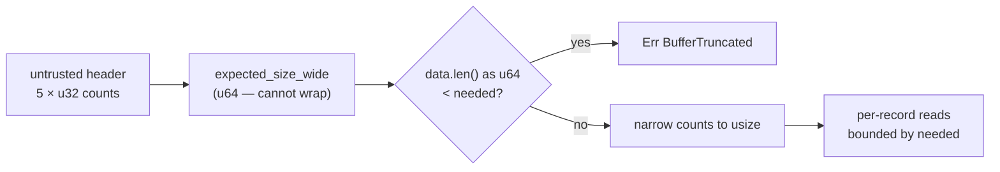

## Summary

`decode_propagate_buffer` gated every subsequent read on a buffer-size sum
computed in `usize`. The five count fields it sums come straight out of an
untrusted header, and on the shipped `wasm32-unknown-unknown` target `usize`
is 32 bits with no `overflow-checks` in the release profile — so a crafted
header wrapped the total below the buffer's real requirement, `data.len() <
needed` agreed, and the per-record loops indexed off the end of a short
buffer. A panic there aborts the whole module (`catch_unwind` is unavailable
on wasm).

The size gate now computes in `u64` from the raw `u32` header fields
(`expected_size_wide`, replacing `expected_size`), compares against
`data.len() as u64`, and only narrows the counts to `usize` once that wide
comparison has proven the buffer covers every declared section. This mirrors
`packed_request_len_wide` in `creature_validate_packed.rs`, which the issue
names as the fixed sibling of the same ABI class.

Closes #602.

## Evidence

Backend/codec change with no web interface to screenshot. The evidence is the
regression tests, observed red then green.

**Red against the unfixed arithmetic.** The native test host is 64-bit, where
the pre-fix `usize` sum does not wrap, so the fault is unreachable natively as
written. To observe the original symptom, `expected_size_wide`'s body was
temporarily replaced with the pre-fix sum evaluated at the shipped wasm32
width (`u32` wrapping arithmetic — the same expression, the same operand
order). Against that, all three boundary tests failed — each with the exact
reported symptom, an out-of-bounds index off the end of the short buffer
rather than a `BufferTruncated` error:

```
---- a_neuron_count_whose_size_wraps_a_32_bit_usize_is_refused stdout ----
thread '...' panicked at neat-core/src/propagate_codec.rs:215:26:
index out of bounds: the len is 36 but the index is 36
---- a_synapse_count_no_buffer_could_hold_is_refused stdout ----
thread '...' panicked at neat-core/src/propagate_codec.rs:108:9:
index out of bounds: the len is 36 but the index is 36
---- flat_section_counts_no_buffer_could_hold_are_refused stdout ----
thread '...' panicked at neat-core/src/propagate_codec.rs:118:9:
index out of bounds: the len is 36 but the index is 36

test result: FAILED. 0 passed; 3 failed
```

The two in-module unit tests fail against the same simulation on their
`expected_size_wide` width assertions, which is what pins the arithmetic
itself rather than only the boundary behaviour.

The simulation was reverted before committing; the committed tree contains
only the `u64` gate.

**Green after the fix.**

```
running 3 tests
test a_synapse_count_no_buffer_could_hold_is_refused ... ok
test a_neuron_count_whose_size_wraps_a_32_bit_usize_is_refused ... ok
test flat_section_counts_no_buffer_could_hold_are_refused ... ok
test result: ok. 3 passed; 0 failed
```

`./quality.sh` passes in full (fmt, clippy `-D warnings`, `cargo check`,
workspace tests, doctests, docs, release build, `cargo deny`).

**Original trigger closed, no trivial bypass.** The trigger is a header whose
declared counts require more bytes than a 32-bit `usize` can express.
`expected_size_wide` takes the five counts as the `u32`s the ABI declares and
widens each with `u64::from` before any multiply; the largest total five
`u32::MAX` counts can express is under 2^38, so the `u64` sum cannot overflow
for any header the ABI admits — there is no input that makes `needed` smaller
than the truth. No `usize` value is derived from the header before that
comparison: the narrowing casts sit *after* the `return Err(BufferTruncated)`,
so every offset built later is bounded by a `needed` the buffer was proven to
cover. The equivalent bypass through a different count field is closed by the
same arithmetic and covered by
`neat-core/tests/propagate_codec_header_bounds.rs::flat_section_counts_no_buffer_could_hold_are_refused`,
which exercises the `output_count`, `order_length` and `total_inward_entries`
paths as well as the neuron and synapse ones.



## Test Plan

Added (all fail against the pre-fix arithmetic, pass after the fix):

- `neat-core/tests/propagate_codec_header_bounds.rs::a_neuron_count_whose_size_wraps_a_32_bit_usize_is_refused`
  — public-boundary test: `2^27` neurons × 32 bytes is exactly `2^32`, so the
  32-bit sum wrapped to the header size and a header-only buffer was accepted.
  Now refused with `BufferTruncated`.
- `neat-core/tests/propagate_codec_header_bounds.rs::a_synapse_count_no_buffer_could_hold_is_refused`
  — `u32::MAX × 20` wraps *below* the header size, so the pre-fix gate was
  satisfied by a buffer of any length.
- `neat-core/tests/propagate_codec_header_bounds.rs::flat_section_counts_no_buffer_could_hold_are_refused`
  — the same class through `output_count`, `order_length` and
  `total_inward_entries`, so the fix is not neuron/synapse-shaped.
- `neat-core/src/propagate_codec.rs::a_neuron_count_whose_size_wraps_a_32_bit_usize_is_refused`
  and `::a_synapse_count_no_buffer_could_hold_is_refused` — unit tests pinning
  the width itself: an independent `u32` wrapping oracle (sharing no code with
  the decoder) reproduces the pre-fix 32-bit result, and the assertions show
  `expected_size_wide` returning a length no 32-bit width can hold
  (`4_294_967_332` and `85_899_345_936`).

Unchanged: no existing test was modified or removed.
