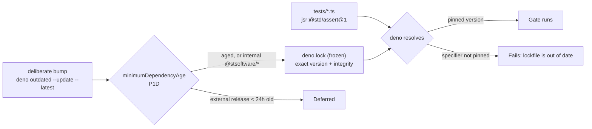

## Summary

This repository quarantines and pins its **Cargo** dependencies (`bump-deps.sh`
honours `VIBE_BUMP_QUARANTINE_HOURS`, `Cargo.lock` pins the graph, Dependabot
adds a 7-day cooldown) but pulled a second, uncovered ecosystem: **JSR**, via
floating `jsr:@std/assert@1` / `@^1` specifiers in six `.ts` gate files. With no
`deno.json` and no committed `deno.lock`, the CI `typescript-gate` job and the
markdown-lint Mermaid-gate step re-resolved that range on every run — no
release-age embargo, no integrity pin. A compromised `@std/assert` 1.x release
would have executed on the runner the moment it was published.

This PR closes that gap with Deno-native tooling:

- **`deno.json`** — `minimumDependencyAge` `P1D` (24h, matching the
  `VIBE_BUMP_QUARANTINE_HOURS` default) for external JSR/npm specifiers, with
  internal `jsr:@stsoftware/*` / `npm:@stsoftware/*` scopes excluded so they
  still bump at 0h; `lock: { path: "deno.lock", frozen: true }`.
- **`deno.lock`** — committed, pinning `@std/assert@1.0.19` and
  `@std/internal@1.0.14` with SHA-256 integrity hashes. Frozen, so a specifier
  the lockfile does not pin fails the run (`The lockfile is out of date`)
  instead of being silently re-resolved.
- **`tests/deno_supply_chain_test.ts`** — the regression gate, wired into
  `quality.sh` and a new CI `typescript-gate` step.
- **`README.md`** — a "JSR (Deno) dependencies" subsection under *Dependency
  updates*, plus `deno.json` / `deno.lock` rows in the Layout table and a
  Mermaid diagram of the resolve/quarantine path.

No Cargo behaviour, no `bump-deps.sh` behaviour and no Rust code changed. This
is a per-repo gate committed to this repo — no cross-repo Action.

Closes #603.

## Evidence

Backend/CLI change with no web interface to screenshot. The evidence is the
executed gate, the mutation sweep, and the red/green transition below.

**Regression test — red against the unfixed code, green after the fix.** Added
`tests/deno_supply_chain_test.ts::a JSR resolution outside the committed
lockfile fails the frozen gate`, which builds a throwaway workspace from the
repository's *own* `deno.json` and `deno.lock`, checks a module importing
`jsr:@std/assert@1`, then removes the `@std/assert` entries from the lockfile
copy and re-checks.

With `deno.json` and `deno.lock` moved aside (the pre-fix state), four of the
five tests fail:

```text
FAILURES
deno.json quarantines external JSR and npm releases for at least 24 hours
deno.json freezes the lockfile so CI cannot re-resolve a floating range
deno.lock pins every JSR dependency with an integrity hash
a JSR resolution outside the committed lockfile fails the frozen gate
FAILED | 1 passed | 4 failed (8ms)
```

With the fix in place:

```text
deno test --allow-read --allow-write --allow-run=deno tests/deno_supply_chain_test.ts
ok | 5 passed | 0 failed (528ms)
```

**Original trigger is closed, with no trivial bypass.** The trigger was a CI run
of `typescript-gate` or the Mermaid-gate step after a new `@std/assert` 1.x
release is published. Both jobs run `deno check` / `deno test` from the
repository root, so Deno now discovers the committed `deno.json` and resolves
against the frozen `deno.lock`: the newly published version is never fetched,
because resolution stops at the pinned `1.0.19` and its integrity hash. The
obvious bypasses are all closed or loud: a *new* floating specifier fails the
frozen check (`The lockfile is out of date`) rather than resolving; a
hand-edited lockfile entry fails integrity verification; deleting or weakening
either artefact fails `tests/deno_supply_chain_test.ts`, which runs in
`quality.sh` and in CI on every PR. Bypassing the age gate needs an explicit
`--frozen=false` / `--min-dep-age` on the command line, which is a reviewable
diff to a committed workflow, not something a publisher on JSR can trigger.

**Mutation evidence** — each mutation applied alone, run, then reverted:

| Mutation | Result |
|----------|--------|
| `"frozen": true` → `false` | 2 failed (`deno check accepted a JSR resolution the lockfile does not pin`) |
| `"age": "P1D"` → `"PT1H"` | 1 failed (under the 24h floor) |
| `exclude` emptied | 1 failed (internal scopes no longer exempt) |
| `deno.json` + `deno.lock` removed | 4 failed |

**Resolution path:**



## Test Plan

Added `tests/deno_supply_chain_test.ts` (5 tests, 0.5s):

- `::a JSR resolution outside the committed lockfile fails the frozen gate` —
  the regression test for this issue. Fails against the unfixed code (no
  `deno.json`/`deno.lock` to build the fixture from) and passes after the fix.
  Carries a positive control (`deno check` must exit 0 against the intact
  committed lockfile) so a network or cache failure cannot masquerade as the
  quarantine working, and asserts on Deno's actual diagnostic rather than on a
  bare non-zero exit.
- `::deno.json quarantines external JSR and npm releases for at least 24 hours`
  — the declared age is parsed to hours and compared against the 24h floor, and
  the internal `@stsoftware/*` exclusions must be present.
- `::deno.json freezes the lockfile so CI cannot re-resolve a floating range`.
- `::deno.lock pins every JSR dependency with an integrity hash` — every JSR
  entry needs a 64-hex SHA-256 and every specifier must resolve to an exact
  version; guarded against a vacuous pass on an empty lockfile.
- `::isoDurationHours converts the durations the quarantine floor uses` — the
  test's own duration oracle is tested, per AGENTS.md oracle rule 5.

Existing suites re-run green under the frozen lockfile: `check_mermaid_test.ts`
(14), `wasm64_memory64_smoke_test.ts` + `wasm64_bundle_gate_test.ts` +
`wasm_arch_parity_test.ts` (30), `tests/perf/*_test.ts` (26),
`scripts/typescript-check.sh` (14 files), `scripts/check_mermaid.ts`,
`markdownlint-cli2`, `actionlint`, `shellcheck quality.sh`. `bats` is not
installed in this container, so the shell suites run in CI
(`scripts-and-spelling`) rather than locally.
