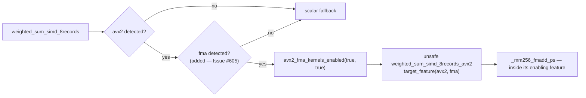

# Security sweep chunk 4a — SIMD `unsafe`-block SAFETY coverage

## Summary

Swept all 94 `unsafe { … }` blocks in `neat-core/src/simd_native.rs`,
`neat-core/src/simd.rs` and `neat-core/src/simd/scalar.rs` against the load-time
index invariant, the chunk-loop bounds and the `#[target_feature]` guards, then
made the code, the AGENTS.md rule and a new live-source gate agree.

The sweep found one genuine soundness fault. The two AVX2 record kernels issue
`_mm256_fmadd_ps` — an **FMA** intrinsic — but were declared
`#[target_feature(enable = "avx2")]` and dispatched behind an `avx2`-only
`is_x86_feature_detected!` guard. AVX2 does **not** imply FMA, so on a CPU (or
under a hypervisor) that exposes AVX2 with FMA masked, the dispatcher would call
an `unsafe fn` whose `#[target_feature]` precondition was never established and
execute an FMA instruction outside its enabling feature: undefined behaviour, and
an illegal instruction in practice.

Fixed by enabling both features on the kernels and detecting both at dispatch,
through a pure predicate so the gate is testable on a host that cannot present
one feature without the other.

Closes #605.



## What changed

- `neat-core/src/simd_native.rs`
  - `weighted_sum_simd_8records_avx2` and `weighted_sum_interleaved_avx2` now
    carry `#[target_feature(enable = "avx2", enable = "fma")]`, and their
    `# Safety` docs require **both** features of the caller. With `fma` enabled
    the `_mm256_fmadd_ps` calls are safe, so their `unsafe { … }` wrappers were
    removed (keeping them trips `unused_unsafe` under `-D warnings`).
  - New `avx2_fma_kernels_enabled(avx2_detected, fma_detected)` — the pure
    dispatch decision — used by `weighted_sum_simd_8records` and
    `weighted_sum_interleaved`; re-exported from `neat_core::simd`.
  - Six dispatcher `// SAFETY:` notes that said "the FMA guard" / "the NEON
    guard" now name `is_x86_feature_detected!("fma")` /
    `is_aarch64_feature_detected!("neon")` explicitly, which is what the
    AGENTS.md rule has always required.
- `AGENTS.md` — the "Unsafe & SIMD invariants" bullet now states the convention
  the code actually follows: a `# Safety` doc on an `unsafe fn` covers every
  `unsafe {` block in its body; a per-block `// SAFETY:` note is required in a
  *safe* fn, and must name the `is_*_feature_detected!` guard when the block sits
  under a runtime feature check. A second bullet records the AVX2-does-not-imply-FMA
  rule.
- `tests/scripts/unsafe_block_safety_notes.bats` — the live-source gate, with
  five rules: block coverage, the per-block note in a safe fn, the note naming
  its guard, a `# Safety` doc on every `unsafe fn`, and the guard detecting every
  feature the callee's `#[target_feature]` list enables.
- `tests/scripts/unsafe_simd_invariants.bats` — three assertions that AGENTS.md
  states the rule the new gate enforces (prose checks stay in the prose gate).
- `neat-core/tests/simd_avx2_fma_gate.rs` — the regression test for the fix.

## Sweep table — file → block → discharging guard/invariant → verdict

Blocks are grouped by their enclosing function; the line range spans that
function's blocks. Every row is **sound**; the AVX2 rows are sound **after** the
fix in this PR.

### `neat-core/src/simd_native.rs` — 62 blocks

| Function | Kind | Blocks | Lines | What discharges them | Verdict |
| --- | --- | --- | --- | --- | --- |
| `weighted_sum_simd_8records_avx2` | `unsafe fn` | 3 | 183–203 | `# Safety`: caller proves `avx2` **and** `fma` (fixed here) + load-time `InvalidSynapseIndex`; single index `i` from `start..end` | sound after fix |
| `weighted_sum_interleaved_avx2` | `unsafe fn` | 4 | 248–262 | `# Safety`: `avx2` **and** `fma` (fixed here); `inter.len() == num_neurons * R` and `from < num_neurons` ⇒ `base + R <= inter.len()`; `o < R / 8` | sound after fix |
| `weighted_sum_simd_4records_fma` | `unsafe fn` | 3 | 287–302 | `# Safety`: `fma` guard + load-time index validation; single index `i` | sound |
| `weighted_sum_fma` | `unsafe fn` | 7 | 331–352 | `# Safety`: `fma` + load-time validation; `chunk_end = start + (count / 4) * 4 <= end`, so `i + 3 < end`; 0..3 remainder via `scalar::tail_sum` | sound |
| `weighted_sum_of_squares_fma` | `unsafe fn` | 7 | 373–395 | as above, remainder via `tail_sum_of_squares` | sound |
| `weighted_sum_of_squares_v2_fma` | `unsafe fn` | 7 | 418–440 | as above, remainder via `tail_sum_of_squares_v2` | sound |
| `weighted_sum_simd_8records_neon` | `unsafe fn` | 6 | 476–498 | `# Safety`: NEON + load-time validation; single index `i`; `vld1q_f32`/`vst1q_f32` over local `[f32; 4]` arrays | sound |
| `weighted_sum_interleaved_neon` | `unsafe fn` | 4 | 542–555 | `# Safety`: NEON; `base + R <= inter.len()`; `q < R / 4` | sound |
| `weighted_sum_simd_4records_neon` | `unsafe fn` | 4 | 581–595 | `# Safety`: NEON + load-time validation; single index `i` | sound |
| `weighted_sum_neon` | `unsafe fn` | 8 | 625–647 | `# Safety`: NEON + load-time validation; `chunk_end` bound ⇒ `i + 3 < end`; remainder via `tail_sum` | sound |
| `weighted_sum_of_squares_neon` | `unsafe fn` | 8 | 670–693 | as above, remainder via `tail_sum_of_squares` | sound |
| `weighted_sum_of_squares_v2_neon` | `unsafe fn` | 8 | 718–741 | as above, remainder via `tail_sum_of_squares_v2` | sound |
| `weighted_sum_simd_8records` | safe fn | 2 | 777–791 | per-block notes naming `is_x86_feature_detected!("avx2")` **and** `("fma")` (fixed here) / `is_aarch64_feature_detected!("neon")` | sound after fix |
| `weighted_sum_interleaved` | safe fn | 2 | 846–865 | same pair of guards (fixed here) | sound after fix |
| `weighted_sum_simd_4records` | safe fn | 2 | 918–932 | notes naming `is_x86_feature_detected!("fma")` / `is_aarch64_feature_detected!("neon")` | sound |
| `weighted_sum_simd` | safe fn | 2 | 980–989 | as above | sound |
| `weighted_sum_of_squares_simd` | safe fn | 2 | 1016–1027 | as above (notes reworded here to name the guard) | sound |
| `weighted_sum_no_bias_simd` | safe fn | 2 | 1054–1063 | as above (notes reworded here) | sound |
| `weighted_sum_of_squares_v2_simd` | safe fn | 2 | 1092–1103 | as above (notes reworded here) | sound |

### `neat-core/src/simd.rs` — 5 blocks (the wasm half)

| Function | Kind | Blocks | Lines | What discharges them | Verdict |
| --- | --- | --- | --- | --- | --- |
| `gather4` | safe fn | 1 | 131 | per-block note: chunk loops never advance past `end` (`chunks_of_8 = count / 8`, then a `synapse_count(i, end) >= 4` guard) + load-time `InvalidSynapseIndex` | sound today; carries a `# Safety` doc on a **safe** fn — recorded on #613 |
| `weighted_sum_simd` | safe fn | 1 | 241 | per-block note on the `scalar::tail_sum` call — `i..end` remainder under load-time validation | sound |
| `weighted_sum_of_squares_simd` | safe fn | 1 | 282 | `chunks = count / 4` ⇒ `remainder_start = start + chunks * 4 <= end`; note on `tail_sum_of_squares` | sound |
| `weighted_sum_no_bias_simd` | safe fn | 1 | 323 | as above, `tail_sum` | sound |
| `weighted_sum_of_squares_v2_simd` | safe fn | 1 | 367 | as above, `tail_sum_of_squares_v2` | sound |

The wasm multi-record kernels (`weighted_sum_simd_4records`,
`..._8records`, `weighted_sum_interleaved`) index safely and contain no `unsafe`.

### `neat-core/src/simd/scalar.rs` — 3 functions, 6 blocks

| Function | Kind | Blocks | Lines | What discharges them | Verdict |
| --- | --- | --- | --- | --- | --- |
| `tail_sum` | `unsafe fn` | 2 | 134–135 | `# Safety`: `end <= synapses.len()` and every `from_index` in `i..end` valid; loop walks `idx < end` | sound |
| `tail_sum_of_squares` | `unsafe fn` | 2 | 160–161 | same contract | sound |
| `tail_sum_of_squares_v2` | `unsafe fn` | 2 | 189–190 | same contract | sound |

### Stride and remainder check

Every 4-wide and 8-wide stride keeps `i + lanes - 1 < end`:

- native single-record kernels: `chunk_end = start + (synapse_count(start, end) / 4) * 4 <= end`, loop runs `while i < chunk_end` reading `i..=i + 3`, so the last read is `chunk_end - 1 < end`; the 0..3 remainder goes through the seed-taking `scalar::tail_*` helpers, which walk `idx < end`.
- wasm `weighted_sum_simd`: `chunks_of_8 = count / 8` reads `i..=i + 7` and leaves `i = start + 8 * chunks_of_8 <= end`; the optional extra 4-wide chunk is guarded by `synapse_count(i, end) >= 4`.
- other wasm single-record kernels: `chunks = count / 4`, last read `start + chunks * 4 - 1 < end`.
- record kernels (`4records`, `8records`, `interleaved`): stride 1 over `start..end`; the width is across *records*, not synapses, and the `R`-wide `inter` read is bounded by `inter.len() == num_neurons * R` with `from < num_neurons`.

### Unresolved finding — one linked issue

The blocks are internally sound, but the *safe* `pub fn` wrappers re-exported
from `neat_core::simd` (`weighted_sum_simd`, `weighted_sum_simd_8records`,
`weighted_sum_interleaved`, …) let safe caller code pass an arbitrary
`&[SynapseData]` / `&[f32]` pair and reach those unchecked reads. For a caller
holding a loaded `CompiledNetwork` the load-time check covers it; nothing covers
a caller that does not. Fixing that is an API break or a hot-path cost, so it is
filed as its own `security` issue rather than folded in here:
**stSoftwareAU/NEAT-AI-core#613**.

A second instance of the same root cause is recorded as a comment on #613 rather
than as a second issue: `simd.rs`'s unchecked `gather4` is declared `fn`, not
`unsafe fn`, yet carries a two-obligation `# Safety` doc. It is module-private
and both call sites are the kernels' own bounded chunk loops, so it is sound
today; making it `unsafe fn` is awkward because the `checked-gather4` control
variant shares the name and is genuinely safe, so the call sites would need
`cfg`-dependent `unsafe` blocks. Its row in the table below records the verdict.

## Evidence

Backend/CLI change — no web interface to screenshot. Evidence is test output and
compiler output.

### The regression test, red then green

`neat-core/tests/simd_avx2_fma_gate.rs::avx2_without_fma_does_not_enable_the_avx2_kernels`
reproduces the flaw and was observed failing before the fix and passing after it.

Against the unfixed sources (`git stash push -- neat-core/src/simd_native.rs
neat-core/src/simd.rs`, then `cargo test -p neat-core --test
simd_avx2_fma_gate`) — the gate the fix introduces does not exist, so the test
cannot even compile:

```text
error[E0432]: unresolved import `neat_core::simd::avx2_fma_kernels_enabled`
  --> neat-core/tests/simd_avx2_fma_gate.rs:13:5
   |
13 | use neat_core::simd::avx2_fma_kernels_enabled;
   |     ^^^^^^^^^^^^^^^^^------------------------
   |                      |
   |                      no `avx2_fma_kernels_enabled` in `simd`
```

Behavioural red, mutating the fixed predicate back to the old `avx2`-only
semantics (`avx2_detected && (fma_detected || true)`):

```text
test avx2_without_fma_does_not_enable_the_avx2_kernels ... FAILED
thread 'avx2_without_fma_does_not_enable_the_avx2_kernels' panicked at
neat-core/tests/simd_avx2_fma_gate.rs:17:5:
an AVX2-only CPU must fall back to the scalar path: the AVX2 kernels issue
`_mm256_fmadd_ps`, which needs FMA
test result: FAILED. 4 passed; 1 failed
```

Green on the committed tree:

```text
running 5 tests
test avx2_without_fma_does_not_enable_the_avx2_kernels ... ok
test both_features_enable_the_avx2_kernels ... ok
test fma_without_avx2_does_not_enable_the_avx2_kernels ... ok
test neither_feature_does_not_enable_the_avx2_kernels ... ok
test the_dispatched_eight_record_sum_matches_the_scalar_reference ... ok
test result: ok. 5 passed; 0 failed
```

The mutation was reverted before commit (`git diff` clean on the predicate).

### Original trigger closed, no trivial bypass

The trigger was: a CPU reporting `avx2` but not `fma` reaches
`x86::weighted_sum_simd_8records_avx2` / `weighted_sum_interleaved_avx2`, whose
bodies execute `_mm256_fmadd_ps`. Both call sites now evaluate
`avx2_fma_kernels_enabled(is_x86_feature_detected!("avx2"),
is_x86_feature_detected!("fma"))`, which is `false` unless **both** are detected,
and both fall through to the scalar path otherwise. There is no third call site:
`grep -n "weighted_sum_simd_8records_avx2\|weighted_sum_interleaved_avx2"` finds
only the definitions and those two guarded calls, and both are `pub unsafe fn` in
a **private** `mod x86`, so no external caller can reach them at all. The
kernels' `#[target_feature]` list now names `fma`, so the intrinsic is inside its
enabling feature by construction and the previous form no longer compiles as
"safe within the fn". An equivalent bypass would need a new unguarded call
site, and all three ways of reintroducing the fault are now caught:

| Reintroduction | Caught by |
| --- | --- |
| narrow `#[target_feature]` back to `avx2` alone | the compiler — `error[E0133]: call to function \`_mm256_fmadd_ps\` with \`#[target_feature]\` is unsafe and requires unsafe block` (verified by applying the mutation and running `cargo check --target x86_64-unknown-linux-gnu`) |
| drop `fma` from a dispatch guard, or delete the guard | `unsafe_block_safety_notes.bats` — `unguarded-feature: calls \`weighted_sum_simd_8records_avx2\`, which enables avx2/fma, but only avx2 is detected before this block` |
| change the gate's own semantics | `simd_avx2_fma_gate.rs::avx2_without_fma_does_not_enable_the_avx2_kernels` |

That first row matters: the `unsafe { … }` wrapper the old code used around
`_mm256_fmadd_ps` is exactly what silenced the compiler, so removing the wrapper
(possible only because `fma` is now enabled) is what turns the type system into
the primary gate.

### Live-source gate mutation evidence

`tests/scripts/unsafe_block_safety_notes.bats` carries the mutations as its own
tests, so the evidence re-runs on every CI job rather than living only here. The
two note/doc mutations are **exhaustive** — every load-bearing line in all three
files, not one hand-picked line:

| Mutation | Scope | Result |
| --- | --- | --- |
| delete each `// SAFETY:` note the sweep reports as covering a block | every such note in all three files | red — `uncovered`, every one |
| delete each `# Safety` doc on an `unsafe fn` | every `unsafe fn` in all three files | red — `no-safety-doc`, every one |
| drop the `is_x86_feature_detected!("fma")` line from a dispatch guard | `simd_native.rs` | red — `unguarded-feature` |
| none | committed tree | green — `swept 94 unsafe block(s), 0 uncovered` |

A `// SAFETY:` note **inside an `unsafe fn`** can be deleted without turning the
sweep red, and that is the convention this issue chose, not a hole: rule 1 says
the function-level `# Safety` doc covers those blocks, so the note is commentary.
Delete the doc instead and the sweep goes red for every block in the body.

Full run:

```text
1..17
ok 1 the three SIMD sources this gate sweeps all exist
ok 2 every unsafe block in the live SIMD sources carries the agreed SAFETY coverage
ok 3 the live sweep reaches every one of the three sources
ok 4 deleting any load-bearing SAFETY note from a live source turns the sweep red
ok 5 deleting any # Safety doc from a live unsafe fn turns the sweep red
ok 6 weakening a dispatch guard to one of the kernel's two features turns the sweep red
ok 7 a # Safety doc on an unsafe fn covers the unsafe blocks in its body
ok 8 a per-block note naming the feature guard is accepted in a safe fn
ok 9 one note covers a contiguous run of unsafe blocks
ok 10 an unsafe block in a safe fn with no note is rejected
ok 11 an unsafe fn with no # Safety doc does not cover its blocks
ok 12 a note that does not name the feature guard is rejected in a safe fn
ok 13 an unsafe fn with no # Safety doc is rejected even when its blocks are annotated
ok 14 a guard that detects only one of the callee's two features is rejected
ok 15 a guard that detects both of the callee's features is accepted
ok 16 a note naming the guard does not stand in for the guard itself
ok 17 a sweep over no source at all fails loud rather than passing
```

The three AGENTS.md doc-agreement assertions live in the existing prose gate
`tests/scripts/unsafe_simd_invariants.bats` (tests 26–28), which is where this
repo keeps prose checks — the new suite reads only Rust.

### Cross-target and gate output

The host is `aarch64-unknown-linux-gnu`, so the `x86` module and the wasm half of
`simd.rs` are not compiled by a plain `cargo test`. Both were compiled explicitly
for this PR, with the matching `rust-std` components installed into a scratch
sysroot:

```text
$ cargo check -p neat-core --target wasm32-unknown-unknown
    Finished `dev` profile [unoptimized + debuginfo] target(s)
$ cargo check -p neat-core --target x86_64-unknown-linux-gnu   # RUSTFLAGS="-D warnings"
    Finished `dev` profile [unoptimized + debuginfo] target(s)
$ cargo clippy -p neat-core --lib --target x86_64-unknown-linux-gnu
    Finished `dev` profile [unoptimized + debuginfo] target(s)
$ ./quality.sh
✅ All quality checks passed!
```

`./quality.sh` ran the full 408-test bats suite green (PyYAML had to be provided
locally for the workflow-parsing suites; without it 109 pre-existing tests skip
into failure on this container, identically on the base commit).

## Reproduction

- **symptom** — the AVX2 record kernels execute `_mm256_fmadd_ps` while gated
  only on `is_x86_feature_detected!("avx2")` and declared
  `#[target_feature(enable = "avx2")]`; on an AVX2-without-FMA host that is an
  intrinsic used outside its enabling feature (UB, SIGILL in practice)
- **status** — `partial` — reason: the *decision* that admits such a host was
  reproduced and is covered by a test observed red before the fix and green
  after; executing the faulting instruction needs an AVX2-without-FMA x86_64 CPU,
  which this aarch64 container is not and which cannot be emulated here
- **regression test** — `neat-core/tests/simd_avx2_fma_gate.rs::avx2_without_fma_does_not_enable_the_avx2_kernels`

## Acceptance Criteria

<!-- vibe-spec-review inputs="diff+issue-body" -->

- **met** — every `unsafe {` block in the three files has the agreed coverage, and the AGENTS.md "Unsafe & SIMD invariants" bullet states the same rule the code follows — evidence: `tests/scripts/unsafe_block_safety_notes.bats::every unsafe block in the live SIMD sources carries the agreed SAFETY coverage` (`swept 94 unsafe block(s), 0 uncovered`) and `tests/scripts/unsafe_simd_invariants.bats::AGENTS.md states that a # Safety doc covers the unsafe blocks in its body` — reviewer: partial — reason: the reviewer found AGENTS.md self-contradictory, its old bullet still endorsing "intrinsics needing a feature the enclosing fn does not enable" as a legitimate `unsafe`-block category — that bullet was rewritten after the review, so the contradiction is gone; the reviewer also noted the sweep cannot tell whether a `# Safety` doc *states* a given block's precondition, which is true and is why the per-block reading is recorded in the sweep table above rather than left to the gate
- **met** — the bats gate goes red when a SAFETY note or `# Safety` doc is deleted from a live file, with mutation evidence recorded, and is green on the committed tree — evidence: `tests/scripts/unsafe_block_safety_notes.bats::deleting any load-bearing SAFETY note from a live source turns the sweep red` and `::deleting any # Safety doc from a live unsafe fn turns the sweep red` — reviewer: partial — reason: the reviewer ran an exhaustive mutation and found 21 of ~44 deletions survived; both mutation tests were replaced after the review with exhaustive loops, and rule 4 (`no-safety-doc`) was added, so every `# Safety` doc and every load-bearing note is now red — the survivors that remain are `// SAFETY:` notes *inside* `unsafe fn`s, which rule 1 deliberately makes commentary
- **met** — the sweep table is in the PR summary and every unresolved finding has a linked issue — evidence: the three per-file tables above, and stSoftwareAU/NEAT-AI-core#613 for the two unresolved findings — reviewer: missing — reason: the reviewer judged the diff before this file existed and said so explicitly; the table and the linked issue are in this summary
- **met** — `./quality.sh` green; `cargo check -p neat-core --target wasm32-unknown-unknown` green — evidence: the command output quoted under "Cross-target and gate output" — reviewer: partial — reason: the reviewer's container had neither the wasm32 target nor `bats` installed; both were installed here and both commands were run to completion
- **unrequested** — `avx2_fma_kernels_enabled` is `pub` and re-exported from `neat_core::simd` — reviewer: unrequested — reason: an integration test in `neat-core/tests/` can only reach the public API, so `pub` is what makes the fix testable at all; it is a two-line `const fn` over two booleans, not new behaviour
- **unrequested** — a second AGENTS.md bullet on `#[target_feature]` lists and dispatch guards — reviewer: unrequested — reason: the issue asked for code and doc to agree; the fix changes what the doc must say about feature guards, so leaving that unwritten would have left the next author with the rule this PR just broke
- **unrequested** — six existing `// SAFETY:` notes reworded from "the FMA guard" to name `is_x86_feature_detected!("fma")` — reviewer: unrequested — reason: consequential, not gratuitous — the AGENTS.md rule already required the note to name the guard, and the gate enforces it

## Standards Review

<!-- vibe-standards-review inputs="diff+CODING-STANDARDS.md" -->

- **violation** — AGENTS.md contradicts itself: the surviving bullet endorsed the exact `unsafe`-wrapped cross-feature intrinsic this PR removes — evidence: `AGENTS.md:241` — reason: fixed here; that bullet now says adding the feature to the `#[target_feature]` list is the answer and that an `unsafe` wrapper does not make it sound
- **violation** — the fix had no test that could fail: reverting both `#[target_feature]` lists and both dispatch guards left every test green — evidence: `neat-core/src/simd_native.rs:768` — reason: fixed here by rule 5 of the gate (`unguarded-feature`), verified against the reviewer's own mutation; narrowing the `#[target_feature]` list is separately caught by the compiler (`E0133`), verified by applying that mutation and compiling for `x86_64-unknown-linux-gnu`
- **violation** — vacuous oracle: `if avx2_fma_kernels_enabled(avx2, fma) { assert!(fma) }` cannot fail on any host (AGENTS.md oracle rule 3) — evidence: `neat-core/tests/simd_avx2_fma_gate.rs:57` — reason: fixed here, the test was deleted; it was fully subsumed by `avx2_without_fma_does_not_enable_the_avx2_kernels`
- **violation** — DRY: `require_python3` was re-implemented instead of `load helpers` — evidence: `tests/scripts/unsafe_block_safety_notes.bats:52` — reason: fixed here, the suite now loads the shared helper
- **violation** — prose-grep tests in a source-sweep suite duplicate the role of the existing prose gate — evidence: `tests/scripts/unsafe_block_safety_notes.bats:347` — reason: fixed here, the AGENTS.md assertions moved to `unsafe_simd_invariants.bats` where this repo keeps prose checks
- **violation** — inaccurate doc claim: "`unsafe_simd_invariants.bats` reads only this file" — it also greps SECURITY.md — evidence: `AGENTS.md:260` — reason: fixed here
- **violation** — stale sibling comment still justifying an `unsafe` wrapper that no longer exists — evidence: `neat-core/src/simd_native.rs:255` — reason: fixed here, reworded to match the 8-records kernel
- **violation** — `teardown()` returns non-zero if `WORK` is ever unset — evidence: `tests/scripts/unsafe_block_safety_notes.bats:49` — reason: fixed here, now an `if` block
- **violation** — gate coverage gap: `neat-core/src/training_bin_stream.rs` has 21 `unsafe {` blocks and is not swept — evidence: `tests/scripts/unsafe_block_safety_notes.bats:25` — reason: stands, deliberately — this issue scopes chunk 4a to the three SIMD files, and the reviewer confirmed that file passes the checker unmodified, so widening the sweep is a clean follow-up rather than scope creep here
- **clean** — Australian English throughout the added lines; oracle rule 4 compliance (one definition per pattern, exported from `setup()`, compiled by both the live sweep and the literals, read via a quoted `<<'PY'` heredoc with `os.environ[...]`); the mutation tests genuinely go red and the empty-input paths fail loud; the 8-record parity test uses an independent oracle rather than the kernel itself; no sleeps, no network, no wall-clock dependence; no hidden paths staged; `cargo clippy -p neat-core --all-targets` clean; markdownlint clean on AGENTS.md; the new suite is auto-discovered by both `quality.sh` and `bats tests/scripts` in CI with no registration

## Test Plan

- Added `neat-core/tests/simd_avx2_fma_gate.rs` — 5 tests: the four-way truth
  table of the dispatch gate, and a parity check that the dispatched 8-record sum
  matches an independently derived reference on every lane.
- Added `tests/scripts/unsafe_block_safety_notes.bats` — 17 tests: the live sweep
  over the three sources, three live-source mutation tests (two of them
  exhaustive), four good literals, five bad literals, and a fail-loud
  empty-input test.
- Extended `tests/scripts/unsafe_simd_invariants.bats` — three assertions that
  AGENTS.md states the rule the new gate enforces.
- Unchanged and re-run: `cargo test --workspace` (all green) and the full
  `tests/scripts` bats suite.
