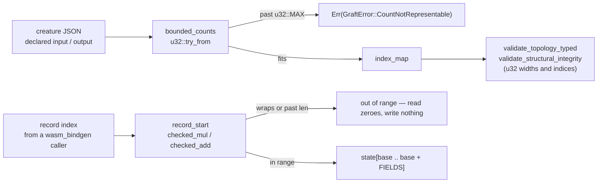

# Security sweep chunk 4b — integer narrowing and size arithmetic

## Summary

Swept the 23 non-`unsafe` chunk-4 modules for `usize → u32` narrowing,
release-mode wrapping size arithmetic and slice-range construction. Two real
faults were found and fixed; the other 21 files are bounded and carry a verdict
row below. Closes #606.

**1. `if_graft.rs` — a declared width was truncated into the index gates.**
`validate_creature_topology` passed `creature.input` / `creature.output` to
`validate_structural_integrity` through `as u32`, so a creature declaring
`"output": 4294967297` arrived as `output_count = 1` and **passed the gate** —
a creature no compiler could accept, validated as sound. The counts now go
through `bounded_counts`, which refuses anything past `u32::MAX` with the typed
`GraftError::CountNotRepresentable` and returns the node count that makes the
`from as u32` / `to as u32` edge casts lossless.

**2. `training_state.rs` — packed-record indexing wrapped in release.** Every
entry point multiplies a caller-supplied record index by the record width
(`index * SYNAPSE_FIELDS`). `[profile.release]` does not enable
`overflow-checks`, so that multiply wraps, and a wrapped start lands *inside*
the buffer where the `base + FIELDS <= len` guard waves it through. Measured,
not theorised — against the unfixed code in `--release`:

```text
read_synapse_state(2_635_249_153_387_078_803)   // = usize::MAX / 7 + 1
  → [2.0, 0.0, 1.0, 0.5, 0.0, 1.0, 0.0]         // synapse 0/1 data at offset 5
accumulate_weight_persistent_4way(same index, …)
  → buffer became [0,0,0,0,0, 1,1,0,1,0,2,0, 0,0]   // live records corrupted
```

Every record start is now `checked_mul` / `checked_add` (`record_start`), so an
index past the buffer is out of range instead of aliasing a live record, and
`init_training_state` refuses a count whose buffer size would wrap rather than
silently allocating a three-element buffer and dropping every later
accumulation.

**Original trigger closed, no trivial bypass.** The truncating `as u32` casts
are gone from the path: `validate_creature_topology` reaches
`validate_structural_integrity` only through `bounded_counts`, which is a total
function over the declared counts — any value past `u32::MAX` returns `Err`
before `index_map` is built, and no other route into that gate exists in the
module. The same holds for the packed buffers: `record_start` is the only
producer of a record offset in `training_state.rs` (all six former sites call
it), and it is checked, so no index can reach `state[base]` by wrapping.
`init_training_state` is the only allocator of those buffers and now uses
`packed_len`. Both fixes bound the *general* quantity, not the test's value.

### Not fixed here — filed

A declared width that **fits** `u32` but far exceeds `MAX_NODE_COUNT` (65 536)
is still walked one entry at a time: `index_map` (and `compile_creature`)
allocate one `format!("input-{i}")` map entry per declared input before any
gate bounds the count, so a sub-100-byte creature declaring `"input":
100000000` costs several GB. That is a different root cause — unbounded
allocation, not narrowing — and where its ceiling belongs is a decision about
the shared `validate_creature_width` contract, so it is filed as **#622** and
linked from the table.

## Evidence

Backend/library change — no web interface to screenshot. Evidence is the test
runs above and below, plus the per-file sweep.



### Per-file verdict table (all 23 chunk-4 modules)

`src` line numbers are the production halves only; every module below carries no
`unsafe`.

| File | Cast / range / arithmetic sites | Bounding check | Verdict |
|---|---|---|---|
| `if_graft.rs` | `creature.input as u32`, `creature.output as u32` (structural gate args); `from as u32`, `to as u32` (edge list) | none — the widths were unbounded | **fixed here** — `bounded_counts` (`u32::try_from` → `GraftError::CountNotRepresentable`); the node count it returns bounds the edge casts. Residual allocation walk **filed as #622** |
| `topology_export.rs` | `(network.num_inputs + offset) as u32` (213), `synapse.from_index as u32` (220, `u16 → u32` widening); `synapses[start..end]` (216, 294) | `CompiledNetwork::new` — `num_neurons > MAX_NODE_COUNT` → `NetworkError::TooManyNodes`, and `MAX_NODE_COUNT` is 65 536 (`network.rs:328`) | bounded — the index fits `u32` with 16 bits to spare; `start_synapse` (`u32`) + `num_synapses` (`u16`) cannot wrap a 64-bit `usize`, and a bad range panics on the bounds-checked slice rather than reading out of bounds |
| `topology_invariants.rs` | `i as u32` (87, synapse index); `from[i] as usize` / `to[i] as usize` (widening); `inward_synapses[start..end]` (130) | every caller passes live `&[u32]` endpoint slices (`topology_ops::validate_structural_integrity`, `creature_validate`), and creature JSON is capped at `MAX_REQUEST_NEURONS` = 65 536 neurons at the boundary | bounded — narrowing `i` needs 2³² synapses, i.e. ≥ 16 GiB of endpoints per slice; every write is guarded by `target < num_neurons` and every read is bounds-checked |
| `topological_backprop.rs` | `input_count as usize`, `output_count as usize`, `neuron_index_u32 as usize`, `syn.from as usize` (all `u32 → usize` widening); `d_count as u32` (596) | `d_count` is the `f64` count from `accumulate_bias_single` (0.0 or 1.0), and `f64 → u32` saturates in Rust; indices are re-checked (`>= neuron_count → continue`) | bounded — no `usize → u32` narrowing in the module; it already uses `saturating_sub` (273) and `saturating_add` (540) |
| `batch_scoring.rs` | `s.from_index as usize`, `neuron.num_synapses as usize` (widening); `synapses[start..end]` (252, 266, 282), `act[in_len..num_inputs]` (339) | `CompiledNetwork::new` (as above) | bounded — no narrowing cast at all; ranges are bounds-checked slices |
| `decision_tree.rs` | none | — | bounded — canonical fixtures only, no casts, no size arithmetic |
| `elastic_distribution.rs` | `activations[base + k]` over a 4-lane walk (40–48) | `base = chunk * 4` with `chunks = count / 4` over live slices | bounded — no casts; every index is bounds-checked |
| `prune_cleanup.rs` | `8 + 4 * (neurons.len() + synapses.len())` (480, the fixed-point pass cap) | live `Vec` lengths | bounded — no casts; the sum cannot approach `usize::MAX / 4` for vectors that exist |
| `prune_neuron.rs` | none | — | bounded — no casts, no size arithmetic |
| `prune_synapse.rs` | none | — | bounded — no casts, no size arithmetic |
| `parallel_scoring.rs` | `batch.len() * num_outputs` (123, 134) | `batch.len()` is a live-slice length; `num_outputs` is a Rust caller argument, not decoded input | bounded — a mismatch fails the `assert_eq!` loudly (123) rather than sizing a buffer wrongly |
| `score_scan.rs` | `weights.len() + biases.len()` (39) | two live slice lengths | bounded — no casts |
| `safe_zone.rs` | none | — | bounded — pure float kernel |
| `squash.rs` | none | — | bounded — pure float kernel |
| `squash_simd.rs` | `fx as i32` (99), `(n + 127) as u32` (100), `(FOPI * xa) as i32` (181) | `exp_approx` clamps to `[-87.33, 88.72]` (78–79) and `sin_approx` clamps `xa` to `1.0e9` (180) **before** each reduction | bounded — `f32 → int` casts saturate in Rust and `NaN` maps to 0, so `n + 127` (max ≈ 255) and `FOPI * xa` (max ≈ 1.27e9 < `i32::MAX`) cannot overflow |
| `unsquash.rs` | none | — | bounded — pure float kernel |
| `derivative.rs` | none | — | bounded — pure float kernel |
| `fused_error.rs` | none | — | bounded — pure float kernel |
| `accumulate.rs` | `result[base + k]` with `base = i * 7`, `i in 0..4` (331–336) | fixed 28-element buffer allocated in the same function | bounded — no casts; the loop bound is a literal |
| `range.rs` | none | — | bounded — no casts, no size arithmetic |
| `synapse_type.rs` | none | — | bounded — enum mapping only |
| `training_data.rs` | `record_size as u64` (164, `usize → u64` widening) | the modulo is guarded by `record_size > 0` | bounded — already uses `checked_*` for its file arithmetic, as the issue notes |
| `training_state.rs` | `index * SYNAPSE_FIELDS` (109), `index * NEURON_FIELDS` (126), `(start_index + i) * FIELDS` (×4 accumulators), `num_synapses * SYNAPSE_FIELDS` / `num_neurons * NEURON_FIELDS` (58, 64) | none — the index comes straight from a `wasm_bindgen` caller | **fixed here** — `record_start` (`checked_mul` / `checked_add`) and `packed_len` (fail loud). Release-mode aliasing reproduced before the fix |

`[profile.release]` and `Cargo.toml` are untouched, as the issue requires.

## Acceptance Criteria

<!-- vibe-spec-review inputs="diff+issue-body" -->

- **met** — no `usize → u32` `as` cast remains in the five priority files without a `try_from` or a table row naming its bounding check — evidence: `neat-core/src/if_graft.rs::bounded_counts` for the two width casts, and the four table rows above naming `CompiledNetwork::new` / `MAX_REQUEST_NEURONS` / the saturating `f64 → u32` for the rest — reviewer: partial — reason: the reviewer judged the diff without this summary and recorded the four other priority files as "genuinely bounded, but the criterion turns on the table, which was not in the diff"; the table is above.
- **met** — verdict table for all 23 files (file → sites → bounding check → verdict) is in the PR summary — evidence: the table above, 23 rows — reviewer: missing — reason: same — the summary file did not exist when the reviewer read the diff. The reviewer's correction that `squash_simd.rs` and `training_data.rs` do carry casts (the issue's premise said none of the 18 do) is adopted: both have their own rows with the clamp / guard that bounds them.
- **met** — every fix has a regression test whose fail-before/pass-after linkage is stated — evidence: `neat-core/tests/if_graft.rs::gate_rejects_an_output_width_past_the_u32_index_space` and `neat-core/tests/training_state_index_bounds.rs::a_synapse_index_whose_record_start_wraps_reads_as_out_of_range`, both observed red before and green after (see Test Plan) — reviewer: partial — reason: the reviewer noted the linkage statement was absent from the (then non-existent) summary, and that two of the three `if_graft` tests would have aborted on allocation rather than shown a truncation pre-fix. That is accurate and is stated plainly in the Test Plan below: the *output* test is the truncation oracle; the input and node tests pin the ordering of the check.
- **partial** — `./quality.sh` green — evidence: every stage green except `bats tests/scripts`, which fails 110 workflow-YAML tests in this container with `ModuleNotFoundError: No module named 'yaml'` (no `pip` available to install it); all 110 parse `.github/workflows/*.yml`, which this branch does not touch — reviewer: partial — reason: the reviewer could not run the gate either (`cargo fmt` / `cargo clippy` need a rustup default toolchain that is not configured here; `rustfmt --check` and the `cargo-clippy` binary were run directly instead, both clean). CI runs the same gate on the PR.
- **unrequested** — `AGENTS.md` and `README.md` gained a sentence each describing the new bound — reviewer: unrequested — reason: the repo's standing rule is that a code change owes a docs change, and both files document `validate_creature_topology`'s contract; the sentences state the rule without restating the reused gates.
- **unrequested** — `RELEASING.md` gained a `0.12.0` breaking-change entry, and the second commit carries a `BREAKING CHANGE:` footer — reviewer: unrequested — reason: both reviewers flagged that `GraftError` is public and not `#[non_exhaustive]`, so the new variant breaks a downstream exhaustive `match`; `RELEASING.md` requires the signal and the log entry, and the `version-gate` job would otherwise fail the PR on a patch-only bump.
- **unrequested** — `training_state.rs` was fixed although the issue lists it among the 18 "grep-clear" modules — reviewer: unrequested — reason: it is one of the 23 files in scope and the fault is the issue's own third bullet (release-mode wrapping size arithmetic); the issue's premise was that the file had no *casts*, which is true — the fault is a multiply.

## Standards Review

<!-- vibe-standards-review inputs="diff+CODING-STANDARDS.md" -->

This repo has no `CODING-STANDARDS.md`; the reviewer was given `AGENTS.md` (the
repo's documented standards) plus the fleet-wide rules, and that substitution is
recorded here.

- **violation** — public `GraftError` gains a variant with no breaking signal and no `RELEASING.md` entry — evidence: `neat-core/src/if_graft.rs:441` — reason: fixed in this diff — `RELEASING.md` gains the `0.12.0` entry with a migration snippet, and the second commit carries a `BREAKING CHANGE:` footer (`scripts/detect-breaking.sh` on the PR range now returns `true`).
- **violation** — the bound's *accepting* edge was untested: mutating `>` to `>=` left all 49 `if_graft` tests green — evidence: `neat-core/src/if_graft.rs:621` (pre-refactor) — reason: fixed in this diff — the rule moved into `bounded_counts` and is exercised at both edges by five unit tests; the same mutation now kills `if_graft::tests::the_largest_representable_node_count_is_accepted` (verified, mutation reverted).
- **violation** — the same quantity computed twice (`node_count` as `u64`, `num_neurons` as `usize`) — evidence: `neat-core/src/if_graft.rs:620`/`:630` (pre-refactor) — reason: fixed in this diff — `bounded_counts` returns `DeclaredCounts::nodes` and `num_neurons` is `counts.nodes as usize` (`u32 → usize` is lossless on every supported target).
- **violation** — the test helper's derivation was wrong ("one past" a value that is two past `u32::MAX`) — evidence: `neat-core/tests/if_graft.rs:579` — reason: fixed in this diff — the doc now names the real reason for the value: its low 32 bits hold `1`, `base_creature`'s true output width.
- **violation** — the comment claimed the width is bounded before `index_map` walks it, which overstates what the fix does — evidence: `neat-core/src/if_graft.rs:604` (pre-refactor) — reason: fixed in this diff — the `bounded_counts` doc now says it bounds *representability* only and names #622 for the allocation walk.
- **violation** — a second home for "is this declared width valid", when `AGENTS.md` names `validate_creature_width` the single home — evidence: `neat-core/src/if_graft.rs:609` vs `neat-core/src/creature.rs:621` — reason: stands, deliberately. The rule added here is not the width contract (`input >= 1`) but the *index space the topology gates read*, which is a property of those gates; the other three width boundaries already refuse these creatures by their own front doors (`compile_creature` returns `CreatureError::OutputCountMismatch` for a declared output that no neuron backs). Moving an upper bound into `validate_creature_width` changes the contract at all four of its call sites, which is exactly the decision #622 exists to make.
- **violation** — the error payload is produced by an unchecked `as` (`found: value as u64`) in a change about unchecked casts — evidence: `neat-core/src/if_graft.rs::fits_index_space` — reason: stands. `usize → u64` is a **widening** conversion on every target Rust supports (`usize` is at most 64 bits), so the reported value is exactly the one the caller declared; the rule being enforced is about narrowing. The cast now carries that reasoning in its doc comment.
- **violation** — stringly-typed discriminator (`field: &'static str`) in a typed error — evidence: `neat-core/src/if_graft.rs:447` — reason: stands. The reviewer marked this its lowest-confidence item and noted the module's existing variants carry `String` payloads; a new public `CountField` enum would enlarge the API surface of an already-breaking change for no behaviour gain.
- **clean** — Australian English throughout the new prose; every public item (and the new private helpers) documented, with `cargo doc -D warnings` green; docs updated alongside the code in both documented homes; tests call real code and assert observable outcomes with no source greps, named for behaviour; fail-loud honoured (typed error, no creature produced; a wrapped index is refused, never aliased); no hidden paths staged; `SECURITY.md` scope unaffected.

## Test Plan

**Added** — `neat-core/tests/if_graft.rs` (3 tests):

- `gate_rejects_an_output_width_past_the_u32_index_space` — **the truncation
  oracle**, and the fail-before/pass-after regression test for fault 1. Against
  the unfixed code it fails: `validate_creature_topology` returns `Ok` for a
  creature declaring `output: 4_294_967_297`, because the low 32 bits are `1` —
  exactly the fixture's real output width, so the gate cannot tell them apart.
  After the fix it returns `GraftError::CountNotRepresentable { field: "output",
  found: 4_294_967_297 }`.
- `gate_rejects_an_input_width_past_the_u32_index_space` and
  `gate_rejects_a_node_count_past_the_u32_index_space` — pin that the bound runs
  **before** `index_map`. Stated plainly: against the unfixed code these two do
  not demonstrate a truncation, they exhaust memory building the map; they are
  ordering tests, not truncation oracles.

**Added** — `neat-core/src/if_graft.rs` `mod tests` (5 unit tests) — the bound at
both edges, which no creature-level test can reach (AGENTS.md oracle rule 5):
`the_largest_representable_node_count_is_accepted`,
`the_largest_representable_output_width_is_accepted`,
`a_node_count_one_past_the_index_space_is_refused`,
`an_output_width_past_the_index_space_is_refused`,
`an_input_width_past_the_index_space_is_refused`.
Mutation evidence: rejecting `u32::MAX` instead of accepting it (`>` → `>=`)
kills `the_largest_representable_node_count_is_accepted`; before the refactor the
same mutation left all 49 `if_graft` tests green. Mutation reverted.

**Added** — `neat-core/tests/training_state_index_bounds.rs` (6 tests) — the
regression tests for fault 2, all six observed **red against the unfixed code in
both profiles** and green after:

- debug: `panicked at training_state.rs:109: attempt to multiply with overflow`;
- `--release` (where the fault actually bites): the wrapped index returned
  `[2.0, 0.0, 1.0, 0.5, 0.0, 1.0, 0.0]` from offset 5 and the accumulator
  corrupted a live record — the values quoted in the Summary.

Expected values are derived, not magic: `usize::MAX / 7 + 1` is the smallest
index whose record start overflows, and `(usize::MAX / 7 + 1) * 7 mod 2^64 == 5`
— a live offset in a two-synapse buffer. Each aliasing test first asserts that
the aliased window holds real data, so it cannot pass by reading zeroes that were
never written.

**Gate runs** (this container has no `pip`, and `cargo fmt` / `cargo clippy` need
a rustup default toolchain that is not configured, so the shim commands were
replaced by the underlying binaries):

| Stage | Result |
|---|---|
| `bash -n`, `shellcheck` | pass |
| `bats tests/scripts` | **110 failures, all `ModuleNotFoundError: No module named 'yaml'`** in the workflow-YAML suites; unrelated to this branch, which touches no `.yml` or `.sh` |
| `deno` gates (typescript-check, mermaid, wasm prune parity, supply chain) | pass |
| `codespell` | pass |
| `cargo deny check` | `advisories ok, bans ok, licenses ok, sources ok` |
| `rustfmt --edition 2024 --check` (for `cargo fmt`) | pass |
| `cargo-clippy --workspace --all-targets --all-features -- -D warnings` | pass |
| `cargo check --workspace --all-targets --all-features` | pass |
| `cargo test --workspace --lib --tests --all-features` | pass — 67 suites, 0 failures |
| `cargo test --workspace --doc` | pass — 14 doctests |
| `RUSTDOCFLAGS="-D warnings" cargo doc` | pass |
| `cargo build --workspace --release` | pass |
| `cargo test --release` (if_graft, training_state_index_bounds) | pass |
| `cargo check --target wasm32-unknown-unknown` | not run — the target's `core` is not installed in this container; CI's wasm bundle workflow covers it |
