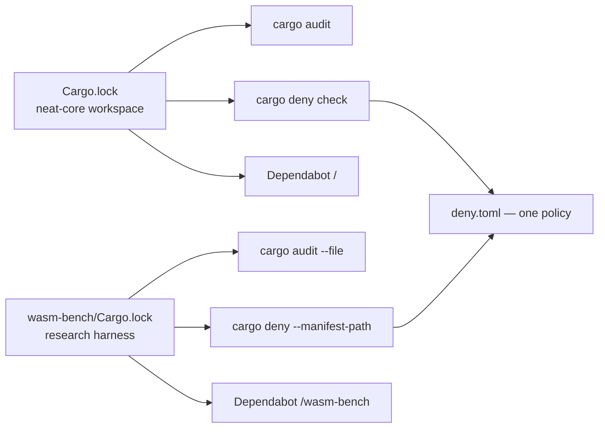

# Bring `wasm-bench` under `cargo audit`, `cargo deny` and Dependabot

## Summary

The `wasm-bench` research harness is `exclude`d from the root virtual
workspace, so it resolves its **own** `Cargo.lock`. Nothing read it:
`security.yml` audited only the root lock, `quality.sh` and the CI `quality`
job denied only the root manifest, and `.github/dependabot.yml` carried a
single `directory: "/"` entry. An advisory, a banned source or a disallowed
licence reaching a crate only the harness depends on was invisible to every
gate, and its pins never received a bump.

This change brings that lockfile under all three channels and states the audit
scope in `SECURITY.md`. Closes #607.

| Wiring | Where |
| --- | --- |
| `cargo audit --file wasm-bench/Cargo.lock` | `.github/workflows/security.yml` (after the root fallback audit, same job) |
| `cargo deny --manifest-path wasm-bench/Cargo.toml check` | `quality.sh` beside the root `cargo deny check`, and the CI `quality` job in `ci.yml` |
| Dependabot `directory: "/wasm-bench"` | `.github/dependabot.yml` — same weekly schedule, `cooldown.default-days: 7`, labels and `chore(deps)` prefix |

Both `cargo deny` passes read the one root `deny.toml`, so the licence
allow-list and `unknown-registry = "deny"` apply identically to each graph.

Docs owed by the change: `SECURITY.md` gains a **Supply-chain audit scope**
section tabulating both lockfiles; `wasm-bench/Cargo.toml` and
`wasm-bench/README.md` no longer claim the harness sits outside `cargo deny`
(they now say it is outside the *build*/version workspace only); and
`README.md`'s dependency-channel section stops describing a single Dependabot
cargo entry.

## Evidence

Backend/CI configuration change — no web interface to screenshot. The evidence
is the gate behaviour below.

### Mutation evidence

Each wiring was deleted in turn and the suite re-run (`bats`, all mutations
reverted afterwards):

| Mutation | Result |
| --- | --- |
| `cargo audit --file wasm-bench/Cargo.lock` step removed from `security.yml` | red — `::security.yml audits the wasm-bench lockfile`, `::every lockfile SECURITY.md scopes exists and is audited by security.yml` |
| the same step's `run:` gutted to `true`, step **name** left quoting the command | red — same two tests: the sweep reads `run:` bodies, never step names |
| the root `run: cargo audit` gutted to `true`, step name left in place | red — `::security.yml still audits the root lockfile` |
| `cargo deny --manifest-path wasm-bench/Cargo.toml check` removed from `quality.sh` | red — `::quality.sh runs cargo deny over the wasm-bench manifest` |
| the same call removed from the CI `quality` job | red — `::the CI quality job runs cargo deny over both manifests` |
| `SECURITY.md` scope table given a `neat-core/Cargo.lock` row nothing audits | red — `::every lockfile SECURITY.md scopes exists and is audited by security.yml` |
| the whole "Supply-chain audit scope" section deleted | red — both SECURITY.md assertions |
| the `/wasm-bench` entry removed from `dependabot.yml` | red — `dependabot_config.bats::dependabot covers the excluded wasm-bench crate directory` |
| the live `AUDIT_LOCKFILE_RE` gutted to `(.*)` (AGENTS.md oracle rule 4) | red — `::the audit patterns accept the live commands and reject their near misses`, i.e. no private copy keeps the literal check passing |

The suite is red against the unfixed tree and green after the fix: written
first, it failed on `::security.yml audits the wasm-bench lockfile`,
`::quality.sh runs cargo deny over the wasm-bench manifest` and both SECURITY.md
assertions; after the wiring landed all 10 pass, and the full
`bats tests/scripts` suite (449 tests) is green.

### Audit result for the committed lockfile

`cargo audit` is not installed on this worker (Issue #598), so the advisory
check was run through `cargo deny --manifest-path wasm-bench/Cargo.toml check`,
which reads the same RustSec database: **`advisories ok, bans ok, licenses ok,
sources ok`**. Cross-checking the committed pins against the fetched
advisory-db by hand, the only two crates in the graph with any advisory —
`bumpalo` (RUSTSEC-2020-0006, RUSTSEC-2022-0078) and `once_cell`
(RUSTSEC-2019-0017) — are pinned at `3.20.3` and `1.21.4`, both far above the
patched floors (`>= 3.2.1` / `>= 3.11.1` and `>= 1.0.1`). No advisory, so no
bump was made for one.

### `wasm-bench/src/lib.rs` — how each export bounds its input

Eight `#[unsafe(no_mangle)] extern "C"` exports; only `setup` takes caller
data. No export can index out of range on a hostile `u32`, so **no code change
was made**.

| Export | Caller input | Bound |
| --- | --- | --- |
| `setup(shape, records)` | `shape: u32` | `NETWORKS[shape as usize]` indexes `pub const NETWORKS: [NetSpec; 6]` (`neat-core/benches/common/mod.rs:148`) — a checked array index, so `shape >= 6` panics (a wasm trap) rather than reading out of range |
| `setup(shape, records)` | `records: u32` | used only as a count: `build_records(stride, records as usize)` maps over `0..count` (`common/mod.rs:314`) and never indexes; a hostile value exhausts the allocator (trap), it does not overrun |
| `neuron_count`, `input_count`, `record_count` | none | read the thread-local fixture; `with_fixture` `expect`s a built fixture and fails loud otherwise |
| `seed_activations` | none | `f.records[0]` is a checked index — after `setup(_, 0)` it panics rather than reading past the empty `Vec` |
| `bench_kernel` | none | the `start`/`end` synapse span comes from the compiled network's own neuron table, not from any caller value; `CompiledNetwork::new`/`compile_creature` validated every `from_index < num_neurons` at load time, which is the standing precondition for the `get_unchecked` reads in `weighted_sum_simd` |
| `bench_activate`, `bench_score` | none | iterate the fixture's own records / flat buffer, whose stride and output count were computed from the compiled network in `setup` |

**Original trigger closed, no trivial bypass.** The trigger was structural: a
lockfile no gate named. It is closed by naming it explicitly in each of the
three channels — `--file wasm-bench/Cargo.lock`, `--manifest-path
wasm-bench/Cargo.toml`, `directory: "/wasm-bench"` — each of which exits
non-zero (Dependabot: raises a PR) on its own. The bypass a reader would look
for is a *fourth* lockfile appearing later and going unnamed again; that is
closed by `wasm_bench_supply_chain.bats::every lockfile in the tree is named in
SECURITY.md's audit scope`, which sweeps the tree for `Cargo.lock` files and
fails while any one is missing from the SECURITY.md scope table, and by its
companion assertion that every scoped lockfile is actually audited by
`security.yml`. Deleting a wiring is caught by the mutation table above;
weakening a live pattern is caught by the good/bad literal checks that compile
that same pattern; and replacing a command with a no-op while leaving its step
*name* in place — the one bypass the first draft of this gate did admit — is
caught because every sweep reads a workflow's `run:` bodies only.

## Acceptance Criteria

<!-- vibe-spec-review inputs="diff+issue-body" -->

- **met** — `security.yml` runs `cargo audit --file wasm-bench/Cargo.lock` and `quality.sh` runs `cargo deny --manifest-path wasm-bench/Cargo.toml check`; both exit non-zero on failure — evidence: `.github/workflows/security.yml:59-60` (unconditional step in the same `security` job) and `quality.sh:102` under `set -euo pipefail` — reviewer: met
- **met** — `dependabot.yml` has a `/wasm-bench` cargo entry with cooldown >= 7; `dependabot_config.bats` fails if it is removed — evidence: `.github/dependabot.yml:31-41`; the reviewer independently deleted the entry (`not ok 6`) and lowered the cooldown to 3 (`not ok 5`) — reviewer: met
- **met** — `wasm_bench_supply_chain.bats` fails if either the audit step or the deny call is removed, or if SECURITY.md lists a lockfile `security.yml` does not audit — evidence: the mutation table above, reproduced independently by the Spec reviewer — reviewer: met
- **met** — `wasm-bench/Cargo.toml` and `wasm-bench/README.md` no longer claim the crate is outside `cargo deny`; SECURITY.md carries the audit-scope subsection — evidence: `wasm-bench/Cargo.toml:3-9`, `wasm-bench/README.md:7-15`, `SECURITY.md` "Supply-chain audit scope" — reviewer: met
- **met** — `./quality.sh` green — evidence: full gate run in this working tree after the final edit, exit 0 ("All quality checks passed!") — reviewer: partial — reason: the reviewer could not run the gate (this container has no PyYAML, so 109 pre-existing YAML-parsing bats tests fail for it); the gate was run here with PyYAML available and passed, and the reviewer confirmed the only suite delta it saw was the new test, not a regression
- **unrequested** — `cargo deny (wasm-bench)` step added to the CI `quality` job (`.github/workflows/ci.yml:363-368`) and its assertion `::the CI quality job runs cargo deny over both manifests` — reviewer: unrequested — reason: the issue names `quality.sh`, but no workflow runs `quality.sh` (`docs_pipeline_accuracy.bats::no workflow invokes quality.sh`), so without this the issue's own Failure Detection line "CI `cargo deny` fails on a banned source or licence there" would be false
- **unrequested** — `wasm-bench/Cargo.lock` refreshed (`wasm-bindgen` 0.2.126 to 0.2.127, `neat-core` 0.8.6 to 0.11.1) — reviewer: unrequested — reason: forced, not chosen — `neat-core/Cargo.toml:50` requires `wasm-bindgen = "0.2.127"`, which 0.2.126 does not satisfy, so every cargo call re-resolved it; the versions now match the root lockfile exactly, so no crate is newer than the root tree
- **unrequested** — the Mermaid flowchart in the SECURITY.md subsection — reviewer: unrequested — reason: the repository's documentation standard asks for a diagram where it aids understanding; the table alone would satisfy the issue
- **unrequested** — the second SECURITY.md assertion `::every lockfile in the tree is named in SECURITY.md's audit scope` — reviewer: unrequested — reason: the issue asked for the listed-implies-audited direction only; the converse is what stops the *next* excluded crate reopening this exact blind spot
- **unrequested** — `README.md` dependency-channel rewording — reviewer: unrequested — reason: it described a single Dependabot cargo entry and a single audited lockfile, both now false; "a code change owes a docs change"
- **unrequested** — `open-pull-requests-limit: 10` on the new dependabot entry — reviewer: unrequested — reason: the pre-existing `dependabot_config.bats` sweep requires a positive limit on *every* cargo entry, so the entry cannot be added without it

## Standards Review

<!-- vibe-standards-review inputs="diff+CODING-STANDARDS.md" -->

- **violation** — vacuous oracle: `ROOT_AUDIT_RE` swept the whole workflow file, so the step **name** `- name: Run cargo audit (fallback)` satisfied it and gutting `run: cargo audit` to `run: true` left all tests green (AGENTS.md oracle rule 3) — evidence: `tests/scripts/wasm_bench_supply_chain.bats:33` (as reviewed) — reason: **fixed here** — every sweep now runs over `command_text`, which yields a workflow's `run:` bodies only; the reviewer's own mutation (`run: true`, step name kept) is now red on `::security.yml still audits the root lockfile`, and `::command_text reads run: bodies and ignores step names` pins the rule directly
- **violation** — the fourth pattern (bare `cargo deny check`) was an inline private copy with no good/bad literal check, contradicting oracle rule 4 — evidence: `tests/scripts/wasm_bench_supply_chain.bats:70` (as reviewed) — reason: **fixed here** — exported as `ROOT_DENY_RE` from `setup()` and compiled by `::the deny patterns accept the live commands and reject their near misses`
- **violation** — the suite hard-failed instead of skipping where `python3`/PyYAML is absent, unlike every neighbouring suite — evidence: `tests/scripts/wasm_bench_supply_chain.bats:18` (as reviewed) — reason: **fixed here** — `setup()` calls `require_python3` and skips when PyYAML is unavailable
- **violation** — the three-channel wiring was restated verbatim in `wasm-bench/Cargo.toml` and `wasm-bench/README.md` although SECURITY.md is declared its single home (the `docs_single_source.bats` shape) — evidence: `wasm-bench/README.md:12-18`, `wasm-bench/Cargo.toml:7-14` (as reviewed) — reason: **fixed here** — both now state the scope in one sentence and link to SECURITY.md for the wiring
- **violation** — the summary claimed the working tree is "stable across a deny run", which the next `version-increment` bump falsifies (the lock records the path dependency's version) — evidence: `docs/archive/pr-summaries/pr-summary-607.md:140` (as reviewed) — reason: **fixed here** — the claim is now scoped to today's churn and names the future re-resolve explicitly
- **clean** — Australian English throughout the added lines ("licence", "artefact"; `licenses ok` is quoted cargo-deny output); no hidden paths staged beyond the `.github/**` allowlist; bash 3.2-safe shell in the new bats (no arrays, `local`, `printf | grep -Fxq`, stderr reason + `return 1`); quoted heredocs (`<<'PY'`) with `os.environ` for every pattern-carrying block; mutation evidence holds for every wiring; the "one root `deny.toml`" claim verified by moving `deny.toml` aside and watching cargo-deny fall back to its default config; the dependabot entry mirrors the root one; the lockfile refresh matches the root tree; markdownlint and the Mermaid gate pass

## Test Plan

- **Added** `tests/scripts/wasm_bench_supply_chain.bats` (10 tests). One pattern
  definition per rule, exported from `setup()` and compiled both by the sweep
  over the live files and by the good/bad literal check (AGENTS.md oracle rule
  4); `helpers.bash` supplies `require_python3` and `strip_comments`.
  - `::security.yml audits the wasm-bench lockfile`
  - `::security.yml still audits the root lockfile`
  - `::the audit patterns accept the live commands and reject their near misses`
  - `::quality.sh runs cargo deny over the wasm-bench manifest`
  - `::quality.sh still runs cargo deny over the root manifest`
  - `::the CI quality job runs cargo deny over both manifests`
  - `::the deny patterns accept the live commands and reject their near misses`
  - `::command_text reads run: bodies and ignores step names`
  - `::every lockfile SECURITY.md scopes exists and is audited by security.yml`
  - `::every lockfile in the tree is named in SECURITY.md's audit scope`
- **Added** `tests/scripts/dependabot_config.bats::dependabot covers the
  excluded wasm-bench crate directory`. The existing cooldown assertion already
  sweeps *every* cargo entry, so the new entry's `cooldown.default-days: 7` is
  covered by it.
- **Regression linkage.** Added `tests/scripts/wasm_bench_supply_chain.bats::security.yml audits the wasm-bench lockfile`, which reproduces the flaw — it fails against the unfixed code (no gate named the harness lockfile) and passes after the fix. The same holds for `tests/scripts/wasm_bench_supply_chain.bats::quality.sh runs cargo deny over the wasm-bench manifest` and `tests/scripts/dependabot_config.bats::dependabot covers the excluded wasm-bench crate directory`.
- `./quality.sh` green (full gate, run after the final edit).

### Lockfile refresh

`wasm-bench/Cargo.lock` pinned `wasm-bindgen 0.2.126`, which no longer
satisfies `neat-core`'s `wasm-bindgen = "0.2.127"`, so *every* cargo invocation
in that directory re-resolved and rewrote the lock — including the new
`cargo deny` pass. The lock is refreshed to the versions the **root**
`Cargo.lock` already pins (`wasm-bindgen 0.2.127`, `neat-core 0.11.1`); no
crate is newer than the root tree, so the 24h bump quarantine is unaffected.

That removes today's churn, not every future re-resolve: the lock records the
path dependency's version (`neat-core 0.11.1`), and the `version-increment` job
bumps `[workspace.package].version` without touching this lockfile, so the next
bump makes a local `cargo deny` rewrite it again until Dependabot's
`/wasm-bench` channel or a manual `cargo update` refreshes it. CI is unaffected
— the `quality` job never pushes.
