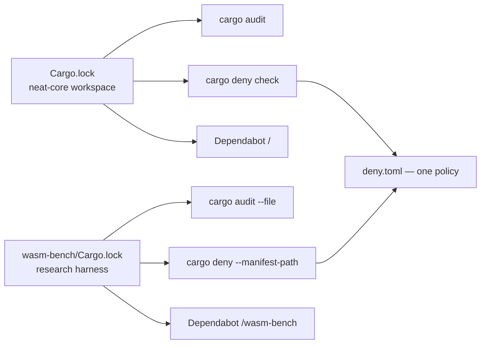

# Bring `wasm-bench` under `cargo audit`, `cargo deny` and Dependabot

## Summary

The `wasm-bench` research harness is `exclude`d from the root virtual
workspace, so it resolves its **own** `Cargo.lock`. Nothing read it:
`security.yml` audited only the root lock, `quality.sh` and the CI `quality`
job denied only the root manifest, and `.github/dependabot.yml` carried a
single `directory: "/"` entry. An advisory, a banned source or a disallowed
licence reaching a crate only the harness depends on was invisible to every
gate, and its pins never received a bump.

This change brings that lockfile under all three channels and states the audit
scope in `SECURITY.md`. Closes #607.

| Wiring | Where |
| --- | --- |
| `cargo audit --file wasm-bench/Cargo.lock` | `.github/workflows/security.yml` (after the root fallback audit, same job) |
| `cargo deny --manifest-path wasm-bench/Cargo.toml check` | `quality.sh` beside the root `cargo deny check`, and the CI `quality` job in `ci.yml` |
| Dependabot `directory: "/wasm-bench"` | `.github/dependabot.yml` — same weekly schedule, `cooldown.default-days: 7`, labels and `chore(deps)` prefix |

Both `cargo deny` passes read the one root `deny.toml`, so the licence
allow-list and `unknown-registry = "deny"` apply identically to each graph.

Docs owed by the change: `SECURITY.md` gains a **Supply-chain audit scope**
section tabulating both lockfiles; `wasm-bench/Cargo.toml` and
`wasm-bench/README.md` no longer claim the harness sits outside `cargo deny`
(they now say it is outside the *build*/version workspace only); and
`README.md`'s dependency-channel section stops describing a single Dependabot
cargo entry.

## Evidence

Backend/CI configuration change — no web interface to screenshot. The evidence
is the gate behaviour below.

### Mutation evidence

Each wiring was deleted in turn and the suite re-run (`bats`, all mutations
reverted afterwards):

| Mutation | Result |
| --- | --- |
| `cargo audit --file wasm-bench/Cargo.lock` step removed from `security.yml` | red — `wasm_bench_supply_chain.bats::security.yml audits the wasm-bench lockfile` and `::every lockfile SECURITY.md scopes exists and is audited by security.yml` |
| `cargo deny --manifest-path wasm-bench/Cargo.toml check` removed from `quality.sh` | red — `::quality.sh runs cargo deny over the wasm-bench manifest` |
| the same call removed from the CI `quality` job | red — `::the CI quality job runs cargo deny over both manifests` |
| `SECURITY.md` scope table given a `neat-core/Cargo.lock` row nothing audits | red — `::every lockfile SECURITY.md scopes exists and is audited by security.yml` |
| the whole "Supply-chain audit scope" section deleted | red — both SECURITY.md assertions |
| the `/wasm-bench` entry removed from `dependabot.yml` | red — `dependabot_config.bats::dependabot covers the excluded wasm-bench crate directory` |
| the live `AUDIT_LOCKFILE_RE` gutted to `(.*)` (AGENTS.md oracle rule 4) | red — `::the audit pattern accepts a --file audit and rejects a root-only one`, i.e. no private copy keeps the literal check passing |

The suite is red against the unfixed tree and green after the fix: before the
wiring landed, tests 1, 4, 7 and 8 of `wasm_bench_supply_chain.bats` failed;
after it, all 9 pass, and the full `bats tests/scripts` suite (448 tests) is
green.

### Audit result for the committed lockfile

`cargo audit` is not installed on this worker (Issue #598), so the advisory
check was run through `cargo deny --manifest-path wasm-bench/Cargo.toml check`,
which reads the same RustSec database: **`advisories ok, bans ok, licenses ok,
sources ok`**. Cross-checking the committed pins against the fetched
advisory-db by hand, the only two crates in the graph with any advisory —
`bumpalo` (RUSTSEC-2020-0006, RUSTSEC-2022-0078) and `once_cell`
(RUSTSEC-2019-0017) — are pinned at `3.20.3` and `1.21.4`, both far above the
patched floors (`>= 3.2.1` / `>= 3.11.1` and `>= 1.0.1`). No advisory, so no
bump was made for one.

### `wasm-bench/src/lib.rs` — how each export bounds its input

Eight `#[unsafe(no_mangle)] extern "C"` exports; only `setup` takes caller
data. No export can index out of range on a hostile `u32`, so **no code change
was made**.

| Export | Caller input | Bound |
| --- | --- | --- |
| `setup(shape, records)` | `shape: u32` | `NETWORKS[shape as usize]` indexes `pub const NETWORKS: [NetSpec; 6]` (`neat-core/benches/common/mod.rs:148`) — a checked array index, so `shape >= 6` panics (a wasm trap) rather than reading out of range |
| `setup(shape, records)` | `records: u32` | used only as a count: `build_records(stride, records as usize)` maps over `0..count` (`common/mod.rs:314`) and never indexes; a hostile value exhausts the allocator (trap), it does not overrun |
| `neuron_count`, `input_count`, `record_count` | none | read the thread-local fixture; `with_fixture` `expect`s a built fixture and fails loud otherwise |
| `seed_activations` | none | `f.records[0]` is a checked index — after `setup(_, 0)` it panics rather than reading past the empty `Vec` |
| `bench_kernel` | none | the `start`/`end` synapse span comes from the compiled network's own neuron table, not from any caller value; `CompiledNetwork::new`/`compile_creature` validated every `from_index < num_neurons` at load time, which is the standing precondition for the `get_unchecked` reads in `weighted_sum_simd` |
| `bench_activate`, `bench_score` | none | iterate the fixture's own records / flat buffer, whose stride and output count were computed from the compiled network in `setup` |

**Original trigger closed, no trivial bypass.** The trigger was structural: a
lockfile no gate named. It is closed by naming it explicitly in each of the
three channels — `--file wasm-bench/Cargo.lock`, `--manifest-path
wasm-bench/Cargo.toml`, `directory: "/wasm-bench"` — each of which exits
non-zero (Dependabot: raises a PR) on its own. The bypass a reader would look
for is a *fourth* lockfile appearing later and going unnamed again; that is
closed by `wasm_bench_supply_chain.bats::every lockfile in the tree is named in
SECURITY.md's audit scope`, which sweeps the tree for `Cargo.lock` files and
fails while any one is missing from the SECURITY.md scope table, and by its
companion assertion that every scoped lockfile is actually audited by
`security.yml`. Deleting a wiring is caught by the mutation table above;
weakening a live pattern is caught by the good/bad literal checks that compile
that same pattern.

## Test Plan

- **Added** `tests/scripts/wasm_bench_supply_chain.bats` (9 tests). One pattern
  definition per rule, exported from `setup()` and compiled both by the sweep
  over the live files and by the good/bad literal check (AGENTS.md oracle rule
  4); reads `helpers.bash` for `strip_comments`.
  - `::security.yml audits the wasm-bench lockfile`
  - `::security.yml still audits the root lockfile`
  - `::the audit pattern accepts a --file audit and rejects a root-only one`
  - `::quality.sh runs cargo deny over the wasm-bench manifest`
  - `::quality.sh still runs cargo deny over the root manifest`
  - `::the CI quality job runs cargo deny over both manifests`
  - `::the deny pattern accepts a --manifest-path check and rejects a bare deny`
  - `::every lockfile SECURITY.md scopes exists and is audited by security.yml`
  - `::every lockfile in the tree is named in SECURITY.md's audit scope`
- **Added** `tests/scripts/dependabot_config.bats::dependabot covers the
  excluded wasm-bench crate directory`. The existing cooldown assertion already
  sweeps *every* cargo entry, so the new entry's `cooldown.default-days: 7` is
  covered by it.
- **Regression linkage.** `tests/scripts/wasm_bench_supply_chain.bats::security.yml
  audits the wasm-bench lockfile` reproduces the flaw: it fails against the
  unfixed tree (no step named the harness lockfile) and passes after the fix.
  The same holds for `::quality.sh runs cargo deny over the wasm-bench
  manifest`.
- `./quality.sh` green (full gate, run after the final edit).

### Lockfile refresh

`wasm-bench/Cargo.lock` pinned `wasm-bindgen 0.2.126`, which no longer
satisfies `neat-core`'s `wasm-bindgen = "0.2.127"`, so *every* cargo invocation
in that directory re-resolved and rewrote the lock — including the new
`cargo deny` pass. The lock is refreshed to the versions the **root**
`Cargo.lock` already pins (`wasm-bindgen 0.2.127`, `neat-core 0.11.1`); no
crate is newer than the root tree, so the 24h bump quarantine is unaffected,
and the working tree is now stable across a deny run.
