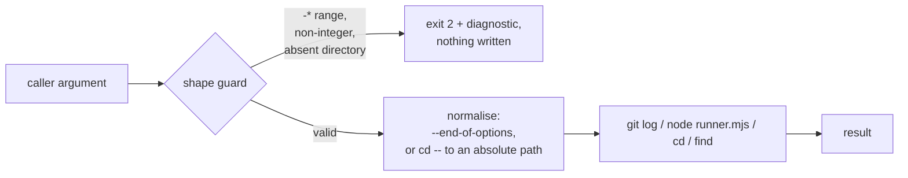

## Summary

Closes #608.

Chunk 6 of the #604 security sweep: the two argument-handling gaps the literal
`eval` / `child_process` grep could not see are closed, two more of the same class
that the read-through surfaced are closed with them, two separate root causes are
filed as follow-ups, and every file in the shell / TS / bats / `.mjs` harness now
has a recorded per-script verdict.

- **`scripts/detect-breaking.sh`** — `range="$1"` went straight to
  `git log --format=… "$range"`, so a `-`-prefixed value was parsed as a git
  option rather than a revision range. `--output=<path>` wrote a file of the
  caller's choosing (confirmed: `git log --format='%s' --output=/tmp/x <range>`
  exits 0 and creates the file), and `--all` widened the scan past the range
  asked about, so the script could answer `true` from a commit no caller had
  named. A `-*` range is now rejected with a usage error and exit 2, and
  `--end-of-options` is passed before the range so git refuses one anyway
  (verified: `git log --end-of-options --output=/tmp/x` → `fatal: option
  '--output=/tmp/x' must come before non-option arguments`, exit 128, no file).
- **`wasm-bench/run.sh`** — `SAMPLES` / `SHAPE` / `RECORDS` / `SESSIONS`
  (`${1:-15}` … `${4:-3}`) reached `node runner.mjs` unvalidated, and `SHAPE`
  also built the `results/shape$SHAPE.csv` path, so a path-bearing value wrote
  outside `results/`. Each now passes the same `^[0-9]+$` guard
  `build-wasm-bundle.sh` uses for `--min-size-bytes`, placed **before** the
  cargo/node toolchain check so the rejection is reachable — and testable — on a
  host with neither installed.
- **`bump-deps.sh`** (finding from the read-through, fixed here) — `--repo`
  reached `cd "$REPO_DIR"` unvalidated. `cd` accepts options, and `cd -P` takes no
  operand and lands in `$HOME`, so every cargo pass would have run outside the
  repository; because the dry-run capture is wrapped in `|| true`, that was then
  reconciled as `external=no updates` rather than surfacing.
- **`scripts/typescript-check.sh`** (same root cause, also fixed here) — `find
  "$root"` parsed a `-`-prefixed root as find's own `-P` option and walked the cwd
  instead of the named tree, silently checking the wrong files.

For the last two, an existence test is **not** enough, and the first attempt at
this branch got that wrong: `[[ -d "-P" ]]` is *true* whenever a directory of that
name exists, and `cd "-P"` still consumes it as an option. Both now resolve the
value to an absolute path once, through a `cd --` that cannot be optioned, so
every later use inherits a safe path rather than repeating a `--` six times.

Docs moved with the contracts: `RELEASING.md`, `wasm-bench/README.md`, and the
`usage()` / `Usage:` text in `bump-deps.sh` and `run.sh`.

Split out rather than fixed here, one follow-up per root cause:

- **#631** — `quality.sh` lines 41–47 skip the entire bats suite with a warning
  when `bats` is absent and still print "All quality checks passed". A fail-loud
  concern, not injection; #608 scoped it out explicitly.
- **#634** — both CI callers capture `detect-breaking.sh`'s stdout inside
  `[ … ]`, so its exit status is discarded and a failed detector reads as "not
  breaking". Surfaced by the independent review; a caller-side fault in a CI
  workflow, so it is filed rather than folded in, and cross-linked from
  `RELEASING.md`.



## Evidence

Backend/CLI only — no web interface to screenshot. The evidence is the bats
suites, run against the unfixed and the fixed scripts.

Red against the unfixed code, green after the fix (same commands, `bats … <
/dev/null`):

```text
# before — tests/scripts/detect_breaking.bats
not ok 5 an option-shaped range is rejected and writes no file
not ok 6 an option-shaped range cannot widen the scan to the whole history
not ok 7 the range is handed to git behind --end-of-options
# before — tests/scripts/wasm_bench_run.bats
not ok 1 a non-integer samples argument is rejected without cargo or node
not ok 2 an option-shaped samples argument is rejected
not ok 3 a path-bearing shape index is rejected before it can build a CSV path
not ok 4 a non-integer records argument is rejected
not ok 5 a non-integer sessions argument is rejected
ok   6 valid integer arguments are accepted on a host without cargo
# before — tests/scripts/bump_deps.bats
not ok 14 rejects a --repo that does not exist, whatever its shape
not ok 15 an option-shaped --repo that does exist is still handed to cd as a path
# before — tests/scripts/typescript_check.bats
not ok  9 an option-shaped root directory checks the named tree, not the cwd
not ok 10 an option-shaped root directory that does not exist is rejected

# after — every one passes; whole suite 462/462
```

`shellcheck -s bash` and `bash -n` pass on all three changed scripts.
`markdownlint-cli2` and `deno run --allow-read scripts/check_mermaid.ts .` pass
on the two changed docs.

The original triggers are closed with no trivial bypass:

- `detect-breaking.sh` — `git log` only ever parses an argument as an option
  when it begins with `-`, and the `case "$range" in -*)` guard rejects the whole
  class before git is invoked; `--end-of-options` then makes even a bypassed
  guard non-exploitable, because git refuses an option after it. There is no
  second spelling: `git log` has no `+option` form, and an argument not starting
  with `-` is parsed as a revision or a path, never as `--output`.
- `wasm-bench/run.sh` — `^[0-9]+$` is anchored at both ends and admits only
  ASCII digits, so no `-` prefix, `/`, `..`, `;`, `$`, newline or whitespace can
  reach `node runner.mjs` or the `results/shape<N>.csv` path. The guard runs
  before every consumer of the four values, so there is no earlier sink to reach.
- `bump-deps.sh` and `scripts/typescript-check.sh` — the existence test rejects a
  path that is not there, and the `cd -- "$…" && pwd` resolution that follows it
  turns whatever survives into an absolute path beginning with `/`. Nothing after
  that point can be read as an option by `cd`, `find` or anything else, because the
  value no longer starts with `-`. This is the bypass the first version of the fix
  missed: `[[ -d "-P" ]]` is true when such a directory exists, so the existence
  test alone left the hole open — the resolution is what closes it, and it closes
  it for every consumer at once rather than per call site.

## Reproduction

- **symptom** — `scripts/detect-breaking.sh --output=/tmp/x` exited 0, printed
  `false`, and created `/tmp/x`; `detect-breaking.sh --all` answered from the
  whole history rather than the range asked about; `wasm-bench/run.sh` forwarded
  any string as `samples`/`shape`/`records`/`sessions` and let `shape` steer the
  results path; `bump-deps.sh --repo -P` ran cargo in `$HOME` and reported
  `external=no updates`; `typescript-check.sh -P` type-checked the cwd instead of
  the named tree.
- **status** — `verified` — each regression test was observed failing against the
  unfixed code (the `not ok` lines quoted above) and passing after the fix, and
  every guard site was then re-killed one at a time in the mutation matrix below.
- **regression test** — `tests/scripts/detect_breaking.bats::an option-shaped range is rejected and writes no file`

## Verdict table

Script → untrusted inputs → guard → verdict. Every `scripts/*.sh`,
`scripts/*.ts`, `wasm-bench/*.mjs`, `wasm-bench/run.sh` and
`tests/scripts/*.bats` file is covered. "Untrusted input" means anything the
file does not itself produce: positional arguments, options, environment
variables and file contents. No file anywhere in the harness uses `eval`, and
none spawns a shell from an argument.

### `scripts/*.sh` and the root shell scripts

| file | untrusted inputs | guard | verdict |
|---|---|---|---|
| `scripts/detect-breaking.sh` | `$1` revision range | **fixed here** — `-*` rejected with exit 2, and `--end-of-options` before the range | **fixed** |
| `wasm-bench/run.sh` | `$1`–`$4` (samples, shape-index, records, sessions) | **fixed here** — `^[0-9]+$` on each, before the toolchain check | **fixed** |
| `bump-deps.sh` | `--quarantine-hours`, `--repo`, `--check-published <ts> <hours>`, `VIBE_BUMP_QUARANTINE_HOURS`, `BUMP_DEPS_PUBLISH_FIXTURE` | `^[0-9]+$` on the hours (line 129); `--check-published` operands validated non-empty then parsed by a quoted-heredoc Python; unknown options rejected; **`--repo` fixed here** — existence check, then resolved to an absolute path through `cd --` | **fixed** |
| `scripts/build-wasm-bundle.sh` | `--arch`, `--rev`, `--out`, `--min-size-bytes`, `--pkg-dir`, `$GITHUB_SHA` | `set -euo pipefail`; explicit option loop with `*)` → exit 2; `--arch` allowlisted to `wasm32`/`wasm64`; `--min-size-bytes` `^[0-9]+$`; `--rev` required; `--skip-build` requires `--pkg-dir`; covered by `build_wasm_bundle.bats` + `build_wasm_bundle_wasm64.bats` | clean |
| `scripts/verify-wasm-bundle.sh` | `--archive`, `--rev`, `--min-size-bytes` | same option-loop shape with `*)` → exit 2; `--archive` required; values quoted at every use; covered by `verify_wasm_bundle.bats` | clean |
| `scripts/next-version.sh` | `$1` version, `$2` breaking flag | strict `^[0-9]+\.[0-9]+\.[0-9]+$` on the version and a `true`/`false` allowlist on the flag, both before any arithmetic — a `-*` value dies on the regex; covered by `next_version.bats` | clean |
| `scripts/check-version-bump.sh` | `$1`/`$2` versions, `$3` breaking flag | same strict semver regex on both versions and the same `true`/`false` allowlist; comparisons are `[ … -gt … ]` on regex-checked digits; covered by `check_version_bump.bats` | clean |
| `scripts/version-bump-needed.sh` | `$1`/`$2` versions, `$3` breaking flag | `true`/`false` allowlist; empty/equal handled explicitly; delegates the semver check to `check-version-bump.sh` rather than re-implementing it; covered by `version_bump_needed.bats` | clean |
| `scripts/typescript-check.sh` | `$1` root directory | fails loud on a missing `deno` first, then `[ ! -d "$root" ]` → exit 2; `deno check "${files[@]}"` is argv, never a string. **Fixed here**: the existence test alone did *not* reject the `-*` class — `[ -d "-P" ]` is true whenever a directory of that name exists, and `find "-P"` then parsed it as find's own `-P` option and walked the cwd instead of the named tree, silently checking the wrong files. The root is now resolved to an absolute path through `cd --` | **fixed** |
| `quality.sh` | none (no arguments read) | — | **out of scope, filed as #631** — the bats block skips the whole shell gate with a warning when `bats` is absent. Fail-loud, not injection; #608 scoped it out explicitly |

### `scripts/*.ts`

| file | untrusted inputs | guard | verdict |
|---|---|---|---|
| `scripts/check_wasm64_bundle.ts` | `Deno.args`: `<pkg-dir>` and `--arch` | own `parseArgs` throws on any unknown `-`-prefixed argument and on an extra positional; `--arch` allowlisted to `wasm32`/`wasm64`; paths only ever reach `Deno.realPath` / dynamic `import` — no shell | clean |
| `scripts/check_mermaid.ts` | `Deno.args[0]` tree root (default `.`) | path only, walked with the Deno FS API; no `Deno.Command`, no shell, no `eval` | clean |
| `scripts/check_wasm_arch_parity.ts` | `Deno.args`: two pkg directories | both required or it throws with a usage message; paths only, read through the FS API; no shell | clean |
| `scripts/check_wasm_prune_parity.ts` | `Deno.args`: pkg directory and optional golden JSON path | `pkgDir` required or exit 2; both are paths read through the FS API; no shell | clean |
| `scripts/wasm64_bundle_gate.ts` | none — library module, no `Deno.args`, no I/O by design | inputs are typed byte buffers passed by its CLI; every check throws with the offending symbol | clean |

### `wasm-bench/*.mjs`

| file | untrusted inputs | guard | verdict |
|---|---|---|---|
| `wasm-bench/runner.mjs` | `process.argv`: two wasm paths + samples/shape/records/session | the two paths are required or exit 2, and are only ever handed to `readFile` → `WebAssembly.compile`; the four numerics go through `Number(…)`, never into a path or a command. A non-numeric would yield `NaN` and zero samples, but that is not silent: the empty CSV makes `analyse.mjs` exit 1 with `analyse: no samples in <path>`, and its only caller now validates the four values | clean |
| `wasm-bench/analyse.mjs` | `process.argv[2]` CSV path | required or exit 2; `readFileSync` only; empty/rowless input exits 1 rather than reporting a vacuous table | clean |
| `wasm-bench/wasi-test-runner.mjs` | `process.argv`: module path + passthrough args | module path required or exit 2, then `readFile` → `WebAssembly.compile`; the remaining args become WASI `args` inside the sandbox, never a host command; unresolved imports throw rather than no-op | clean |

### `tests/scripts/*.bats` and `helpers.bash`

Three mechanical checks were run over all 61 files (60 `.bats` + `helpers.bash`):
`eval` usage, an unquoted `$var` word-splitting inside a `run` line, and an
unquoted heredoc that interpolates.

- **`eval`: zero occurrences in all 61 files.**
- **Unquoted `$var` inside `run`: none.** Twelve files interpolate a variable
  into a `run` line, but always inside a double-quoted string with the value
  single-quoted at the Python/bash sink (e.g.
  `run python3 -c "import yaml; yaml.safe_load(open('$WORKFLOW'))"`), and every
  such value is a repo path derived from `BATS_TEST_DIRNAME` or
  `BATS_TEST_TMPDIR`. No word splitting is possible and no value is caller-supplied.
- **Unquoted heredocs: 18 files, none of them a rule-4 violation.** AGENTS.md
  oracle rule 4 forbids reading a *pattern* through an unquoted `<<PY`, because
  the shell would re-escape the pattern text. What the 18 files interpolate is
  test-owned paths and literals (`$WORKFLOW`, `$WORKFLOWS_DIR`,
  `$DEPENDABOT_FILE`, `$SIDECAR`, `$WF`, `$SEMGREP_IMAGE`, `$CALLED`, `$HELPERS`,
  `$PATH`, `${BATS_TEST_TMPDIR}`, and locals in the two stub generators) — every
  regex in those suites is written as an inline literal *inside* the heredoc
  body, so no pattern crosses the shell. The two shared models that *are*
  interpolated, `$(github_glob_py)` and `$(header_images_py)`, both emit their
  body from a **quoted** `<<'PY'` and a command substitution is not re-expanded,
  so the text arrives verbatim — and that is behaviourally pinned rather than
  argued: `helpers_shared.bats::glob model: a single star does not cross a slash`,
  `…: a double star crosses slashes` and
  `…: non-glob characters are literal and the match is anchored` exercise the
  interpolated model and pass. Rule 4's actual requirement — one definition,
  compiled by both the real-file sweep and the good/bad literal check — holds.
  Nothing was duplicated into `oracle_mutation_evidence.bats`, which is a prose
  gate over AGENTS.md and already pins the `<<'PY'` rule there.

Per-file verdicts:

| file | untrusted inputs | guard | verdict |
|---|---|---|---|
| `actionlint_workflow.bats` | as above + `$WORKFLOW` interpolated into an unquoted heredoc | no `eval`; interpolated values are test-owned paths/literals, quoted at the Python sink; regex literals stay inside the heredoc body | clean |
| `agents_oracle_mutation_evidence.bats` | repo paths from `BATS_TEST_DIRNAME` / `BATS_TEST_TMPDIR` | no `eval`; no unquoted heredoc interpolation | clean |
| `archive_pr_summaries_private_repo_reference.bats` | repo paths from `BATS_TEST_DIRNAME` / `BATS_TEST_TMPDIR` | no `eval`; no unquoted heredoc interpolation | clean |
| `branch_protection_ruleset.bats` | repo paths from `BATS_TEST_DIRNAME` / `BATS_TEST_TMPDIR` | no `eval`; no unquoted heredoc interpolation | clean |
| `build_wasm_bundle.bats` | repo paths from `BATS_TEST_DIRNAME` / `BATS_TEST_TMPDIR` | no `eval`; no unquoted heredoc interpolation | clean |
| `build_wasm_bundle_wasm64.bats` | as above + `$arg,$out_dir,$prev` interpolated into an unquoted heredoc | no `eval`; interpolated values are test-owned paths/literals, quoted at the Python sink; regex literals stay inside the heredoc body | clean |
| `bump_deps.bats` | as above + `$PATH,$fake_home` interpolated into an unquoted heredoc | no `eval`; interpolated values are test-owned paths/literals, quoted at the Python sink; regex literals stay inside the heredoc body | clean |
| `bump_deps_private_repo_reference.bats` | repo paths from `BATS_TEST_DIRNAME` / `BATS_TEST_TMPDIR` | no `eval`; no unquoted heredoc interpolation | clean |
| `check_version_bump.bats` | repo paths from `BATS_TEST_DIRNAME` / `BATS_TEST_TMPDIR` | no `eval`; no unquoted heredoc interpolation | clean |
| `ci_job_permissions.bats` | as above + `$CALLED,$WORKFLOW` interpolated into an unquoted heredoc | no `eval`; interpolated values are test-owned paths/literals, quoted at the Python sink; regex literals stay inside the heredoc body | clean |
| `ci_push_credential_persistence.bats` | repo paths from `BATS_TEST_DIRNAME` / `BATS_TEST_TMPDIR` | no `eval`; no unquoted heredoc interpolation | clean |
| `ci_typescript_gate_permissions.bats` | as above + `$WORKFLOW` interpolated into an unquoted heredoc | no `eval`; interpolated values are test-owned paths/literals, quoted at the Python sink; regex literals stay inside the heredoc body | clean |
| `ci_workflow.bats` | as above + `$WORKFLOW` interpolated into an unquoted heredoc | no `eval`; interpolated values are test-owned paths/literals, quoted at the Python sink; regex literals stay inside the heredoc body | clean |
| `ci_workflow_quarantine.bats` | repo paths from `BATS_TEST_DIRNAME` / `BATS_TEST_TMPDIR` | no `eval`; no unquoted heredoc interpolation | clean |
| `codeowners_coverage.bats` | repo paths from `BATS_TEST_DIRNAME` / `BATS_TEST_TMPDIR` | no `eval`; no unquoted heredoc interpolation | clean |
| `core_ownership_fence.bats` | repo paths from `BATS_TEST_DIRNAME` / `BATS_TEST_TMPDIR` | no `eval`; no unquoted heredoc interpolation | clean |
| `dependabot_config.bats` | as above + `$DEPENDABOT_FILE` interpolated into an unquoted heredoc | no `eval`; interpolated values are test-owned paths/literals, quoted at the Python sink; regex literals stay inside the heredoc body | clean |
| `detect_breaking.bats` | repo paths from `BATS_TEST_DIRNAME` / `BATS_TEST_TMPDIR` | no `eval`; no unquoted heredoc interpolation | clean |
| `docs_ci_blind_spots.bats` | repo paths from `BATS_TEST_DIRNAME` / `BATS_TEST_TMPDIR` | no `eval`; no unquoted heredoc interpolation | clean |
| `docs_pipeline_accuracy.bats` | repo paths from `BATS_TEST_DIRNAME` / `BATS_TEST_TMPDIR` | no `eval`; no unquoted heredoc interpolation | clean |
| `docs_single_source.bats` | repo paths from `BATS_TEST_DIRNAME` / `BATS_TEST_TMPDIR` | no `eval`; no unquoted heredoc interpolation | clean |
| `engineering_principles_link.bats` | repo paths from `BATS_TEST_DIRNAME` / `BATS_TEST_TMPDIR` | no `eval`; no unquoted heredoc interpolation | clean |
| `gitleaks_pinned_install.bats` | repo paths from `BATS_TEST_DIRNAME` / `BATS_TEST_TMPDIR` | no `eval`; no unquoted heredoc interpolation | clean |
| `helpers_shared.bats` | repo paths from `BATS_TEST_DIRNAME` / `BATS_TEST_TMPDIR` | no `eval`; no unquoted heredoc interpolation | clean |
| `markdown_lint_workflow.bats` | as above + `$WORKFLOW` interpolated into an unquoted heredoc | no `eval`; interpolated values are test-owned paths/literals, quoted at the Python sink; regex literals stay inside the heredoc body | clean |
| `next_version.bats` | repo paths from `BATS_TEST_DIRNAME` / `BATS_TEST_TMPDIR` | no `eval`; no unquoted heredoc interpolation | clean |
| `oracle_mutation_evidence.bats` | repo paths from `BATS_TEST_DIRNAME` / `BATS_TEST_TMPDIR` | no `eval`; no unquoted heredoc interpolation | clean |
| `perf_private_repo_reference.bats` | repo paths from `BATS_TEST_DIRNAME` / `BATS_TEST_TMPDIR` | no `eval`; no unquoted heredoc interpolation | clean |
| `pr_creator_token.bats` | repo paths from `BATS_TEST_DIRNAME` / `BATS_TEST_TMPDIR` | no `eval`; no unquoted heredoc interpolation | clean |
| `private_repo_reference.bats` | repo paths from `BATS_TEST_DIRNAME` / `BATS_TEST_TMPDIR` | no `eval`; no unquoted heredoc interpolation | clean |
| `readme_brand_banner.bats` | as above + `$(header_images_py)` interpolated into an unquoted heredoc | no `eval`; interpolated values are test-owned paths/literals, quoted at the Python sink; regex literals stay inside the heredoc body | clean |
| `readme_glossary.bats` | repo paths from `BATS_TEST_DIRNAME` / `BATS_TEST_TMPDIR` | no `eval`; no unquoted heredoc interpolation | clean |
| `readme_private_repo_reference.bats` | repo paths from `BATS_TEST_DIRNAME` / `BATS_TEST_TMPDIR` | no `eval`; no unquoted heredoc interpolation | clean |
| `release_sbom.bats` | repo paths from `BATS_TEST_DIRNAME` / `BATS_TEST_TMPDIR` | no `eval`; no unquoted heredoc interpolation | clean |
| `releasing_breaking_change_log.bats` | repo paths from `BATS_TEST_DIRNAME` / `BATS_TEST_TMPDIR` | no `eval`; no unquoted heredoc interpolation | clean |
| `research_docs_removed_modules.bats` | repo paths from `BATS_TEST_DIRNAME` / `BATS_TEST_TMPDIR` | no `eval`; no unquoted heredoc interpolation | clean |
| `rust_build_profiles.bats` | repo paths from `BATS_TEST_DIRNAME` / `BATS_TEST_TMPDIR` | no `eval`; no unquoted heredoc interpolation | clean |
| `rust_gates_workflow.bats` | as above + `$HELPERS,$WORKFLOW` interpolated into an unquoted heredoc | no `eval`; interpolated values are test-owned paths/literals, quoted at the Python sink; regex literals stay inside the heredoc body | clean |
| `security_quarantine_override.bats` | repo paths from `BATS_TEST_DIRNAME` / `BATS_TEST_TMPDIR` | no `eval`; no unquoted heredoc interpolation | clean |
| `security_runbook.bats` | repo paths from `BATS_TEST_DIRNAME` / `BATS_TEST_TMPDIR` | no `eval`; no unquoted heredoc interpolation | clean |
| `semgrep_workflow.bats` | as above + `$((calls + 1),$(cat "${BATS_TEST_TMPDIR}/calls"),$SEMGREP_IMAGE,$WF,$calls,${BATS_TEST_TMPDIR},${fail_count},${pipx_status}` interpolated into an unquoted heredoc | no `eval`; interpolated values are test-owned paths/literals, quoted at the Python sink; regex literals stay inside the heredoc body | clean |
| `typescript_check.bats` | repo paths from `BATS_TEST_DIRNAME` / `BATS_TEST_TMPDIR` | no `eval`; no unquoted heredoc interpolation | clean |
| `unsafe_block_safety_notes.bats` | repo paths from `BATS_TEST_DIRNAME` / `BATS_TEST_TMPDIR` | no `eval`; no unquoted heredoc interpolation | clean |
| `unsafe_simd_invariants.bats` | repo paths from `BATS_TEST_DIRNAME` / `BATS_TEST_TMPDIR` | no `eval`; no unquoted heredoc interpolation | clean |
| `verify_wasm_bundle.bats` | repo paths from `BATS_TEST_DIRNAME` / `BATS_TEST_TMPDIR` | no `eval`; no unquoted heredoc interpolation | clean |
| `version_bump_needed.bats` | repo paths from `BATS_TEST_DIRNAME` / `BATS_TEST_TMPDIR` | no `eval`; no unquoted heredoc interpolation | clean |
| `wasm_bench_run.bats` | repo paths from `BATS_TEST_DIRNAME` / `BATS_TEST_TMPDIR` | no `eval`; no unquoted heredoc interpolation | clean |
| `wasm_bench_supply_chain.bats` | repo paths from `BATS_TEST_DIRNAME` / `BATS_TEST_TMPDIR` | no `eval`; no unquoted heredoc interpolation | clean |
| `wasm_bundle_provenance.bats` | as above + `$WORKFLOW` interpolated into an unquoted heredoc | no `eval`; interpolated values are test-owned paths/literals, quoted at the Python sink; regex literals stay inside the heredoc body | clean |
| `wasm_bundle_sbom.bats` | repo paths from `BATS_TEST_DIRNAME` / `BATS_TEST_TMPDIR` | no `eval`; no unquoted heredoc interpolation | clean |
| `wasm_bundle_sha256_sidecar.bats` | as above + `$SIDECAR,$WORKFLOW` interpolated into an unquoted heredoc | no `eval`; interpolated values are test-owned paths/literals, quoted at the Python sink; regex literals stay inside the heredoc body | clean |
| `wasm_bundle_wasm64_dual_ship.bats` | repo paths from `BATS_TEST_DIRNAME` / `BATS_TEST_TMPDIR` | no `eval`; no unquoted heredoc interpolation | clean |
| `wasm_pack_pinned_install.bats` | repo paths from `BATS_TEST_DIRNAME` / `BATS_TEST_TMPDIR` | no `eval`; no unquoted heredoc interpolation | clean |
| `workflow_checkout_credentials.bats` | as above + `$WORKFLOWS_DIR` interpolated into an unquoted heredoc | no `eval`; interpolated values are test-owned paths/literals, quoted at the Python sink; regex literals stay inside the heredoc body | clean |
| `workflow_concurrency_groups.bats` | repo paths from `BATS_TEST_DIRNAME` / `BATS_TEST_TMPDIR` | no `eval`; no unquoted heredoc interpolation | clean |
| `workflow_container_pinning.bats` | as above + `$WORKFLOWS_DIR` interpolated into an unquoted heredoc | no `eval`; interpolated values are test-owned paths/literals, quoted at the Python sink; regex literals stay inside the heredoc body | clean |
| `workflow_job_timeouts.bats` | as above + `$WORKFLOWS_DIR` interpolated into an unquoted heredoc | no `eval`; interpolated values are test-owned paths/literals, quoted at the Python sink; regex literals stay inside the heredoc body | clean |
| `workflow_pipefail.bats` | repo paths from `BATS_TEST_DIRNAME` / `BATS_TEST_TMPDIR` | no `eval`; no unquoted heredoc interpolation | clean |
| `workflow_script_injection.bats` | repo paths from `BATS_TEST_DIRNAME` / `BATS_TEST_TMPDIR` | no `eval`; no unquoted heredoc interpolation | clean |
| `workflow_sha_pinning.bats` | as above + `$WORKFLOWS_DIR` interpolated into an unquoted heredoc | no `eval`; interpolated values are test-owned paths/literals, quoted at the Python sink; regex literals stay inside the heredoc body | clean |
| `helpers.bash` | as above + `$(github_glob_py)` interpolated into an unquoted heredoc | no `eval`; interpolated values are test-owned paths/literals, quoted at the Python sink; regex literals stay inside the heredoc body | clean |

## Mutation evidence (AGENTS.md oracle rule 2)

Every guard site was mutated one at a time and the suite re-run. All mutations
were reverted before commit; `git status` is clean.

| # | site | mutation | tests that went red |
|---|---|---|---|
| 1 | `detect-breaking.sh:22` `case "$range" in -*)` | removed | `detect_breaking.bats` 5, 6 |
| 2 | `detect-breaking.sh:29`, `:33` `--end-of-options` | removed from both sites | `detect_breaking.bats` 7 |
| 3 | `run.sh:35` `=~ ^[0-9]+$` | → `=~ .*` (accept everything) | `wasm_bench_run.bats` 1, 2, 3, 4, 5 |
| 4 | `run.sh:35` `=~ ^[0-9]+$` | → `=~ ^$` (reject everything) | `wasm_bench_run.bats` 3, 4, 5, **6** — the negative control dies, so a reject-everything guard cannot pass the suite |
| 5 | `run.sh:41` `require_integer samples` | removed | `wasm_bench_run.bats` 1, 2 |
| 6 | `run.sh:42` `require_integer "shape-index"` | removed | `wasm_bench_run.bats` 3 |
| 7 | `run.sh:43` `require_integer records` | removed | `wasm_bench_run.bats` 4 |
| 8 | `run.sh:44` `require_integer sessions` | removed | `wasm_bench_run.bats` 5 |
| 9 | `bump-deps.sh:151` `REPO_DIR="$(cd -- … && pwd)"` | removed | `bump_deps.bats` 15 |
| 10 | `bump-deps.sh:147` `[[ ! -d "$REPO_DIR" ]]` | removed | `bump_deps.bats` 14 |
| 11 | `typescript-check.sh:33` `root="$(cd -- … && pwd)"` | removed | `typescript_check.bats` 9 |

Every site is individually killed — including `--end-of-options` (row 2), which
was **not** covered in the first version of this branch. Review found that
deleting it from both call sites left all seven cases green, and that the case
claiming to cover it ran a hand-written copy of the command line rather than the
one the script builds — the private-copy failure oracle rule 4 names. It now
observes the argv the script actually produces, through a `git` shim that records
`"$*"` and execs the real git.

Pre-change behaviour was measured, not assumed:

- `git log --format='%s' --output=<path> <range>` exits 0 and creates the file
  (8 bytes on the fixture), which is what makes `[ ! -e "$leak" ]` falsifiable.
- On the side-branch fixture, `--all` really does flip the answer to `true` while
  `${BASE}..HEAD` says `false` — so the widening case discriminates rather than
  duplicating the status check.
- `[[ -d "-P" ]]` is **true** when a directory of that name exists, and
  `(cd "-P" && pwd)` prints `/home/vibe` while `(cd -- "-P" && pwd)` prints the
  directory. This is why the first version of the `bump-deps.sh` guard was wrong.

Two vacuous assertions were found by review and deleted rather than shipped:
`[ ! -e "$leak" ]` and `[ ! -e "${RESULTS}/shape5.csv" ]` in
`wasm_bench_run.bats`. The suite empties `PATH`, so `run.sh` dies at the toolchain
check long before `mkdir -p results`, and both assertions passed identically
against completely unguarded code. `$RESULTS` also pointed at the real gitignored
`wasm-bench/results/`, so on a host that had ever run the bench the test would
have failed for a reason unrelated to the guard. What discriminates here is the
exit status: 2 from the guard, 1 from the toolchain check an unguarded script
falls through to.

## Test Plan

Added:

- `tests/scripts/detect_breaking.bats::an option-shaped range is rejected and writes no file`
  — the acceptance-criterion case: `--output=<path>` exits 2 with the guard
  message and creates no file.
- `tests/scripts/detect_breaking.bats::an option-shaped range cannot widen the scan to the whole history`
  — a breaking commit on a side branch unreachable from HEAD; the asked-for range
  must answer `false` and `--all` must be refused.
- `tests/scripts/detect_breaking.bats::the range is handed to git behind --end-of-options`
  — pins the live argv via a recording `git` shim, and that git honours the flag.
- `tests/scripts/wasm_bench_run.bats` (new file, 6 cases) — non-integer,
  option-shaped and path-bearing values rejected with exit 2 and the exact guard
  message for each of the four positionals, plus a negative control proving valid
  values are accepted. Every case runs under `env -i HOME=<tmp> PATH=<empty>`, so
  the suite passes with neither cargo nor node installed.
- `tests/scripts/bump_deps.bats::an option-shaped --repo that does exist is still handed to cd as a path`
  — a `cargo` stub records its own `$PWD` on every call; the test asserts every
  invocation ran inside the `-P` directory, never `$HOME`.
- `tests/scripts/bump_deps.bats::rejects a --repo that does not exist, whatever its shape`
  — both shapes, one branch, one test.
- `tests/scripts/typescript_check.bats::an option-shaped root directory checks the named tree, not the cwd`
  — a deliberately broken `.ts` file in the cwd, so a walked-cwd regression fails
  the gate — plus `::an option-shaped root directory that does not exist is rejected`.

No test was commented out, weakened or removed. The only deletions are the two
vacuous assertions above (a strengthening) and the fold of two `bump_deps.bats`
tests that exercised one branch into a single loop over both shapes — the
mislabelled one claimed to prove the option-shaped case but passed only because
`-P` happened not to exist in the test's cwd. It also now passes
`--skip-external`, so a mutation run cannot launch cargo outside its temp dir.

Full gate: `./quality.sh < /dev/null` → **`✅ All quality checks passed!`**,
including `bats tests/scripts` at **462/462**, `shellcheck` on every `.sh`,
`cargo deny` on both manifests, clippy/check/test/doctests under `-D warnings`,
`cargo fmt`, rustdoc and the release build.

> Reproducing locally: `bats tests/scripts` needs python3 `PyYAML` for the
> workflow-parsing suites, and `cargo fmt`/`cargo clippy` need a rustup default
> toolchain. Without them 110 pre-existing suites error out and the gate stops at
> `cargo fmt` — neither is related to this change, and both were resolved in this
> container before the green run above.

## Acceptance Criteria

<!-- vibe-spec-review inputs="diff+issue-body" -->

The Spec reviewer was run twice: once on the first complete branch and again on
the reworked diff at `a98dbe9`. Verdicts below are from the second run, and where
a finding of either run was acted on, the fix and the commit are named.

- **met** — `detect-breaking.sh`: reject a `-*` argument with a usage error **and**
  pass `--end-of-options` before the range — evidence: `scripts/detect-breaking.sh:22-27`
  and `:29`/`:33`; mutation rows 1–2 — reviewer: met — reason: the reviewer added
  the caveat that the `--end-of-options` layer was pinned by nothing running the
  script. Confirmed and fixed in `87c0bed`; row 2 now kills it.
- **met** — a `detect_breaking.bats` case proving `--output=/tmp/x`-style input
  exits non-zero and creates no file — evidence: `tests/scripts/detect_breaking.bats::an option-shaped range is rejected and writes no file`
  — reviewer: met.
- **met** — `wasm-bench/run.sh`: validate all four positionals with the
  `^[0-9]+$` guard, **before** the cargo/node toolchain check — evidence:
  `wasm-bench/run.sh:34-44` ahead of the toolchain loop at `:52`; mutation rows
  3–8 — reviewer: met.
- **partial** — read-through of `scripts/*.sh`, `*.ts`, `wasm-bench/*.mjs`,
  `tests/scripts/*.bats` + `helpers.bash`, with any finding fixed here or filed —
  evidence: the `## Verdict table` above; `bump-deps.sh` and
  `scripts/typescript-check.sh` fixed in `136b58d`; `quality.sh` filed as #631;
  the `ci.yml` caller filed as #634 — reviewer: partial — reason: the reviewer's
  ground for `partial` was that the per-file record lives in this summary, which
  was out of the diff by design; it also noted three files the issue's own list
  omitted (`version-bump-needed.sh`, `check_wasm_prune_parity.ts`,
  `wasm64_bundle_gate.ts`) and independently cleared them. All three now have rows.
- **met** — AC1: a `-`-prefixed-range case that fails before and passes after,
  with linkage in the PR summary — evidence: the linkage statement under
  `## Reproduction` and mutation row 1 — reviewer: met.
- **met** — AC2: `run.sh` exits non-zero on a non-integer positional, pinned by
  `wasm_bench_run.bats`, which runs without cargo or node — evidence: all 6 cases
  pass under `env -i PATH=<empty>`; removing the four guard calls fails 5 of them
  — reviewer: met.
- **partial** — AC3: the verdict table covers every `scripts/*.sh`, `scripts/*.ts`,
  `wasm-bench/*.mjs`, `wasm-bench/run.sh` and `tests/scripts/*.bats` file —
  evidence: the `## Verdict table` above; its 61-row bats list was diffed against
  `ls tests/scripts/` and matches exactly — reviewer: partial — reason: the
  reviewer judged only the diff, where the table does not appear; it is in this
  summary, which is the location the issue asked for.
- **partial** — AC4: `shellcheck` and `./quality.sh` green — evidence:
  `./quality.sh < /dev/null` → `✅ All quality checks passed!`, bats 462/462 —
  reviewer: partial — reason: the reviewer could not run the full gate
  non-destructively (it runs `cargo upgrade --incompatible`), so it verified
  `shellcheck` and bats only. The gate was run here, and its one lockfile effect
  is declared below.
- **unrequested** — `wasm-bench/Cargo.lock`: `neat-core` 0.11.1 → 0.12.0 —
  reviewer: unrequested — reason: the gate's own `cargo update` step resynced the
  path dependency to the workspace version, stale since the previous release bump;
  it matches `Cargo.toml` and the root lockfile. Kept because the gate produces it
  on every run, so dropping it only defers the same one-line diff.
- **unrequested** — `RELEASING.md` and `wasm-bench/README.md` prose, plus the
  `--repo` and `Usage:` header text in `bump-deps.sh` / `run.sh` — reviewer:
  unrequested — reason: all four guards change a documented CLI contract, and the
  project standard "A Code Change Owes a Docs Change" requires the documenting
  surfaces to move with it. I depart from the reviewer here deliberately.
- **unrequested** — `detect_breaking.bats`'s widening case and the
  `--end-of-options` case — reviewer: unrequested — reason: the second was
  demanded by oracle rule 2 once review showed that layer was unpinned, and the
  first is what makes `--all` a distinct fault from `--output=`; the issue asked
  for one case, so both are genuinely beyond it and are listed as such.
- **unrequested** — `scripts/typescript-check.sh` and its two new cases —
  reviewer: unrequested — reason: not named in the issue's fix list, but the
  read-through it *did* ask for surfaced the identical `-d`-bypass defect there;
  the issue's own rule is that a finding is "fixed here or filed as one issue per
  root cause", and it is the same root cause as the `bump-deps.sh` one.

## Standards Review

<!-- vibe-standards-review inputs="diff+CODING-STANDARDS.md" -->

This repo has no `CODING-STANDARDS.md`; the Standards reviewer was given the diff
and `AGENTS.md`, which is where the equivalent documented standards live (TDD,
"what not how", the five oracle rules). It too was run on both the first and the
reworked diff.

- **violation** — the `bump-deps.sh --repo` guard did not close the hole its own
  comment described: `[[ -d "-P" ]]` is true whenever a directory of that name
  exists, so `cd "-P"` still landed in `$HOME` — evidence: `bump-deps.sh:147` as
  first written — reason: **fixed in `136b58d`**. The value is now resolved once to
  an absolute path through a `cd --` that cannot be optioned; mutation row 9 kills
  it. Both reviewers found this independently, and it is the finding that mattered
  most — the first fix was pinned to the test's value rather than the general case.
- **violation** — `--end-of-options` was unpinned, and the test claiming to cover
  it compiled a private copy of the invocation rather than the live one (oracle
  rule 4) — evidence: `scripts/detect-breaking.sh:29`, `:33` and the old
  `detect_breaking.bats` case — reason: **fixed in `87c0bed`** with a recording
  `git` shim; mutation row 2 now kills both sites.
- **violation** — two vacuous assertions in `wasm_bench_run.bats` that passed
  identically against unguarded code (oracle rule 3), one of them reading the real
  gitignored `wasm-bench/results/` — evidence: `tests/scripts/wasm_bench_run.bats`
  as first written — reason: **fixed in `a98dbe9`**; deleted, with the file header
  now stating why such an assertion is absent.
- **violation** — the widening fixture committed its breaking marker on `HEAD`, so
  the test could not tell `--all` widening from a default `HEAD` scan; and
  `!= "true"` was dead weight after the status check — evidence:
  `tests/scripts/detect_breaking.bats` as first written — reason: **fixed in
  `a98dbe9`**; the commit now sits on an unreachable side branch and both cases
  assert the exact status and message.
- **violation** — `bump_deps.bats` carried two tests on one branch, the
  option-shaped one passing only because `-P` did not exist in the cwd, and it
  omitted `--skip-external` so a mutation run could launch cargo from `$HOME` —
  evidence: `tests/scripts/bump_deps.bats` as first written — reason: **fixed in
  `87c0bed`**; folded into one loop over both shapes, named after what it proves.
- **violation** — the third guard was documented nowhere and `bump-deps.sh`'s own
  `usage()` still read `--repo DIR  Repository root (default: cwd)`; `run.sh`'s
  `Usage:` header did not state the integer contract — evidence: `bump-deps.sh:43`,
  `wasm-bench/run.sh:5` — reason: **fixed in `e199bab` and `87c0bed`**.
- **violation** — `RELEASING.md` claimed a protection the wiring does not deliver:
  both CI callers capture stdout inside `[ … ]`, so the exit 2 is discarded and the
  lane reads "not breaking" — evidence: `.github/workflows/ci.yml:128`, `:233` —
  reason: the doc now states what is and is not guaranteed and cross-links the
  caller-side fail-quiet as **#634**. Not fixed here: it is a separate root cause
  in a CI workflow, and the issue's rule is one follow-up per root cause.
- **violation** — the `^[0-9]+$` "non-negative integer" rule is now inline in a
  fourth script rather than extracted to a shared helper (DRY) — evidence:
  `wasm-bench/run.sh:34-38` alongside `bump-deps.sh:129`,
  `build-wasm-bundle.sh:121`, `verify-wasm-bundle.sh:95` — reason: **stands, and I
  depart from the reviewer here.** The issue specified this guard by name ("the
  `^[0-9]+$` guard `build-wasm-bundle.sh` already uses"), extraction would edit
  three scripts the issue scoped as read-through-only, and `wasm-bench/` is a
  separate crate outside the root workspace that `cd`s to its own directory — a
  cross-directory `source` is the fragility that caused the FLEET Discovery silent
  failure. Recorded rather than silently dismissed.
- **violation** (reviewer's own low-confidence entry) — a test named after a
  mechanism ("passes the guard and reach the toolchain check") rather than an
  outcome — evidence: `tests/scripts/wasm_bench_run.bats` as first written —
  reason: **fixed in `a98dbe9`**; renamed to "valid integer arguments are accepted
  on a host without cargo", with the ordering dependence reasoned in the header.
- **clean** — per-site mutation coverage of the four `require_integer` calls and
  the negative control; the `detect_breaking.bats` leak-file assertion, confirmed
  falsifiable against the pre-fix script; oracle rule 4 (both suites invoke the
  real scripts, no second copy of a validation regex lives in a test); gate wiring
  (`quality.sh` and `ci.yml` both run `bats tests/scripts`, so the new file needs
  no registration); no `helpers.bash` duplication (it is YAML-shaped and covers
  nothing this needs); Australian English throughout, `codespell` clean;
  `shellcheck -s bash` clean on all modified scripts; markdownlint and the
  `docs_pipeline_accuracy` / `docs_single_source` / `releasing_breaking_change_log`
  gates green; no Rust touched, so the `cargo test --workspace` clause is not
  implicated; every assertion is on an exit status or stderr text, not a source grep.
