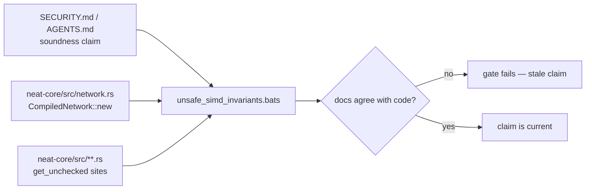

## Summary

`SECURITY.md` ("Memory safety of compiled-network loading") and `AGENTS.md`
("Unsafe & SIMD invariants") both cited `neat-core/src/network.rs:326` for the
load-time guard that makes the SIMD `get_unchecked` reads sound. The guard has
moved — `CompiledNetwork::new` raises `NetworkError::InvalidSynapseIndex` at
line 407 today — so an engineer following the citation lands on unrelated code
and can conclude the check is gone. `SECURITY.md` also named `simd_native.rs`
as the only unchecked-read site, while `simd.rs` (`gather4`) and
`simd/scalar.rs` (`tail_*`) rely on exactly the same invariant.

Both claims now cite symbols instead of line numbers, `SECURITY.md` lists all
three unchecked-read sites, and `tests/scripts/unsafe_simd_invariants.bats`
gates the doc against the code so neither can drift back silently. Closes #609.

## Evidence

Backend/docs change — no web interface to screenshot. The evidence is the bats
gate, its mutation runs, and the doc-vs-code sweep below.

### Docs verdict table

| Doc | Claim checked | Outcome |
| --- | --- | --- |
| `SECURITY.md` — Memory safety of compiled-network loading | `NetworkError::InvalidSynapseIndex` is raised at `network.rs:326` | ❌ **stale, corrected** — the guard is in `CompiledNetwork::new`, `network.rs:407` today; the citation is now the symbol |
| `SECURITY.md` — same section | `simd_native.rs` is the only `get_unchecked` site | ❌ **incomplete, corrected** — `simd.rs` (`gather4`, 8 code sites) and `simd/scalar.rs` (`tail_*`, 6) read unchecked on the same invariant; all three now listed and gated |
| `AGENTS.md` — Unsafe & SIMD invariants | same `network.rs:326` citation | ❌ **stale, corrected** — line number dropped, `CompiledNetwork::new` / `NetworkError::InvalidSynapseIndex` retained (one line; #593's prose untouched) |
| `AGENTS.md` — same section | wasm `gather4` rests on the same invariant, pinned by `neat-core/tests/unchecked_gather_invariant.rs` | ✅ accurate — the test file exists |
| `RELEASING.md` — breaking-change log `0.3.0`–`0.12.0` | every logged removal is really gone; every symbol claimed live still resolves | ✅ accurate — `apply_calculate_error_batch_4way`, `calculate_error_batch_4way`, `apply_derivative_simd_4way`, `derivative_batch_4way`, `wasm_dataset`, `PredictiveCodingEngine` absent from `neat-core/src`; `get_training_state_num_{neurons,synapses}` survive only as `#[cfg(test)]` helpers, exactly as the `0.8.0` entry records; `GraftError::CountNotRepresentable` live at `if_graft.rs:447`. Already gated by `releasing_breaking_change_log.bats` |
| `docs/research/wasm-gather4-unchecked-loads.md` | unchecked gather is sound under the load-time invariant; `checked-gather4` restores the checked control | ✅ accurate — feature declared at `neat-core/Cargo.toml:40`, cfg gates at `simd.rs:80,122`, `neat-core/tests/unchecked_gather_invariant.rs` present |
| `docs/research/aggregate-unchecked-kernels-2026-08-05.md` | prototype reverted; aggregate paths still index checked; `InvalidSynapseIndex` still rejects at load | ✅ accurate — no `aggregate_*_unchecked` / `experimental-aggregate-unchecked` in the tree; aggregates index `self.activations[…]` checked (`network.rs:487,646,855`) |
| `docs/research/exact-size-inference-entry-point.md` | prototype "rejected and removed"; no `unsafe`, no unchecked indexing | ✅ accurate — `activate_into_exact`, `activate_into_validated`, `InputLengthMismatch`, `OutputLengthMismatch`, `experimental-exact-inference` all absent from the tree |
| `docs/research/ikaruga-neat-ai-comparison.md` | predictive coding "removed in Issue #414"; scope claims name `compile_creature`, `validate_structural_integrity`, `validate_topology` | ✅ accurate — removal record present (already pinned by `research_docs_removed_modules.bats`); all three symbols resolve in `neat-core/src` |
| `docs/research/{pruning-parity-matrix,dead-code-audit-2026-07-29,wasm64-lane-a,-b,-d}.md` | soundness/security claims about removed or changed modules | ✅ none stale — every cited path (`prune_*.rs`, `wasm_arch.rs`, `topology_export.rs`, `creature.rs`) exists; the lane (d) removal record is already pinned |
| `docs/archive/pr-summaries/` (189 files) | historical; only the summary AGENTS.md cites (`pr-summary-442.md`) was checked | ✅ present and not rewritten — the archive is explicitly exempt from the new line-citation gate |

No research doc carried a new stale removal claim, so
`research_docs_removed_modules.bats` was **not** extended — the issue asks for an
extension only on a new finding, never a duplicate of what it already pins.

### Mutation evidence

Each new assertion was run against a deliberately broken tree and observed
failing, then reverted:

| Mutation | Assertion | Result |
| --- | --- | --- |
| Reintroduce `network.rs:326` in `SECURITY.md` | `no tracked Markdown cites a bare network.rs line number` | `not ok` ✅ |
| Reintroduce `network.rs:326` in `AGENTS.md` | same | `not ok` ✅ |
| Append `network.rs:999` to `README.md` | same | `not ok` ✅ |
| Rename `NetworkError::InvalidSynapseIndex` → `RenamedAway` | `the symbols the soundness docs cite still exist in network.rs` | `not ok` ✅ |
| Rename `CompiledNetwork::new` → `from_bytes` | same | `not ok` ✅ |
| Move the guard out of the constructor (`TooManyNodes` at `network.rs:407`) | same | `not ok` ✅ |
| Delete the `simd/scalar.rs` bullet from `SECURITY.md` | `SECURITY.md names every unchecked-read site in neat-core/src` | `not ok` ✅ |
| Add an undocumented `get_unchecked` read to `neat-core/src/loss.rs` | same | `not ok` ✅ |

All three assertions are green on the finished tree
(`bats tests/scripts/unsafe_simd_invariants.bats` — 16/16 ok).

**Original trigger closed, no trivial bypass.** The trigger was a soundness
claim citing a line number that the code had moved away from. Any tracked
Markdown outside `docs/archive/` that reintroduces `network.rs:<digits>` fails
assertion 14, and there is no bypass by rewording: the assertion matches the
`network.rs:` + digits pattern itself across the whole tracked `*.md` set read
from `git ls-files`, not a fixed file list. Dropping the symbol instead of the
line number fails assertion 15, which reads `neat-core/src/network.rs` and
requires `pub fn new` inside an `impl CompiledNetwork` block whose body still
raises `NetworkError::InvalidSynapseIndex` — so renaming the constructor,
renaming the variant, or moving the guard elsewhere all fail. Adding a new
unchecked read without documenting it fails assertion 16, which derives the
site set from the sources (comment-stripped) rather than from a hard-coded
list, so a new file is caught the same way an existing one is.

### Gate results

- `markdownlint-cli2` — `Summary: 0 issues in 0 files` ✅
- `deno run --allow-read scripts/check_mermaid.ts .` — `all Mermaid blocks passed` ✅
- `deno test tests/check_mermaid_test.ts` (14 passed), `tests/wasm_prune_parity_test.ts` (15 passed), `./scripts/typescript-check.sh` (17 files) ✅
- `bats tests/scripts/unsafe_simd_invariants.bats` — 16/16 ok ✅
- `./quality.sh` — stops in its bats step on **110 pre-existing environment
  failures**, every one a `ModuleNotFoundError: No module named 'yaml'` from the
  workflow/YAML suites. The identical failures occur on the base branch
  (`git archive origin/milestone/604-… | bats tests/scripts` → same set), the
  container has no `pip`/`apt` route to install PyYAML, and this change adds no
  Rust and no workflow YAML. CI, which has PyYAML, runs the same checks on the PR.

## Acceptance Criteria

<!-- vibe-spec-review inputs="diff+issue-body" -->

- **met** — No tracked Markdown cites a bare `network.rs:<line>`; the bats gate fails if one is reintroduced or a cited symbol disappears — evidence: `tests/scripts/unsafe_simd_invariants.bats::no tracked Markdown cites a bare network.rs line number` and `::the symbols the soundness docs cite still exist in network.rs`, with the mutation table above — reviewer: met
- **met** — `SECURITY.md` lists `simd_native.rs`, `simd.rs` and `simd/scalar.rs` as the unchecked-read sites — evidence: `SECURITY.md:35-41` (the three bullets), gated by `tests/scripts/unsafe_simd_invariants.bats::SECURITY.md names every unchecked-read site in neat-core/src` — reviewer: met
- **met** — Docs verdict table (file → claim → outcome) in the PR summary — evidence: the "Docs verdict table" section above — reviewer: missing — reason: the reviewer read the diff before this summary file existed and recorded the criterion as unverifiable in-repo; the table is in this file, which is committed in the same branch
- **partial** — `markdownlint`, `check_mermaid.ts` and `./quality.sh` green — evidence: gate results above — reviewer: partial — reason: markdownlint and the mermaid gate are green; `./quality.sh` cannot complete in this container because 110 workflow/YAML bats tests fail on a missing PyYAML module, identically on the base branch and unrelated to this diff
- **unrequested** — the `SECURITY.md` paragraph describing what `unsafe_simd_invariants.bats` enforces — reviewer: unrequested — reason: kept deliberately — the issue's fence is on *claim* sentences, and the next engineer to add an unchecked read needs to know a gate will stop them; it adds no new security claim
- **unrequested** — the third assertion (`SECURITY.md names every unchecked-read site in neat-core/src`), set-equality in both directions — reviewer: unrequested — reason: departing from the reviewer here — the issue asks for the three-site list "gated by the same bats file", and a one-directional check would let a new unchecked read ship undocumented

## Standards Review

<!-- vibe-standards-review inputs="diff+CODING-STANDARDS.md" -->

- **violation** — python-backed assertions discarded their own diagnostics, against the suite convention (`tests/scripts/helpers.bash:10`) — evidence: `tests/scripts/unsafe_simd_invariants.bats:183,235` — reason: fixed here — both now `echo "$output"` before asserting the status
- **violation** — new hard dependency on `python3` with no portability guard — evidence: `tests/scripts/unsafe_simd_invariants.bats:127,188` — reason: fixed here — the file now `load helpers` and both tests call `require_python3`, so a python-less runner skips rather than fails
- **violation** — `SECURITY.md` described the exemption as "the PR-summary archive" while the gate exempts all of `docs/archive/`, and described the site scan without its `neat-core/src` scope — evidence: `SECURITY.md:59-66` — reason: fixed here — the prose now states exactly what the gate checks (the same doc-vs-code drift this PR is closing)
- **violation** — the `impl CompiledNetwork` lookup searched forward from the first impl block, so a deleted `CompiledNetwork::new` could latch onto a later `pub fn new` — evidence: `tests/scripts/unsafe_simd_invariants.bats:157` — reason: fixed here — the search is now confined to the braces of each `impl CompiledNetwork` block; mutation M6 (rename to `from_bytes`) confirms it goes red
- **violation** — comment stripping missed `/* … */` blocks in the unchecked-site scan — evidence: `tests/scripts/unsafe_simd_invariants.bats:210` — reason: fixed here — block comments are stripped before the line-comment split
- **violation** — the `simd.rs` bullet did not note that the unchecked `gather4` is the default-build arm — evidence: `SECURITY.md:36-39` — reason: fixed here — the bullet now names the `checked-gather4` control
- **violation** — no in-suite self-mutation harness, unlike `unsafe_block_safety_notes.bats:340-376` — evidence: `tests/scripts/unsafe_simd_invariants.bats:99` — reason: stands — the issue asks for mutation evidence in the PR summary, which the table above supplies; adding a mutant-copy harness to a docs gate is beyond this issue's fence
- **violation** — `AGENTS.md` still frames the invariant around `simd_native.rs` and never names `simd/scalar.rs` — evidence: `AGENTS.md:242` — reason: stands — the issue's scope fence reserves AGENTS.md prose for #593 and asks only that the line citation be replaced there; the site list is `SECURITY.md`'s, and it is gated
- **violation** — the site scan walks only `neat-core/src`, so a `get_unchecked` added under `neat-core/tests` is ungated — evidence: `tests/scripts/unsafe_simd_invariants.bats:203` — reason: stands — the security claim is about the crate's shipped hot path; the scope is now stated in `SECURITY.md` rather than implied
- **clean** — Australian English throughout the additions; no hidden or secret paths staged; tests assert doc-vs-code agreement rather than bare source greps; quoted heredocs with `sys.argv`, no shell interpolation; behaviour-named `@test` blocks matching the file's existing style; `markdownlint-cli2` clean

## Test Plan

Added to `tests/scripts/unsafe_simd_invariants.bats` (run by `./quality.sh` and
the CI bats step):

- `no tracked Markdown cites a bare network.rs line number` — sweeps every
  `git ls-files '*.md'` outside `docs/archive/` for `network.rs:<digits>`.
- `the symbols the soundness docs cite still exist in network.rs` — requires
  `pub fn new` inside an `impl CompiledNetwork` block whose body raises
  `NetworkError::InvalidSynapseIndex`, and the variant to be declared.
- `SECURITY.md names every unchecked-read site in neat-core/src` — set equality
  between the documented bullet list and the `.rs` files that read
  `get_unchecked` outside comments.

No Rust source changed, so the crate's own test suite is unaffected.
