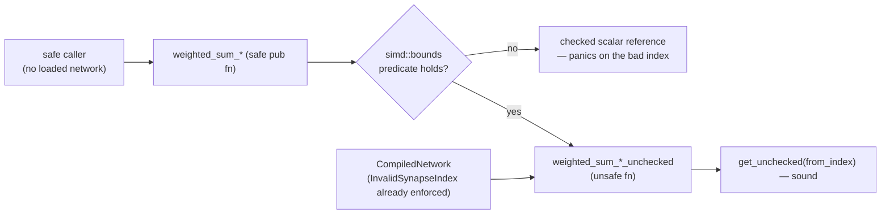

## Summary

Every weighted-sum kernel re-exported from `neat_core::simd` was a **safe**
`pub fn` whose body reached `activations.get_unchecked(from_index)` on a
precondition only `CompiledNetwork::new` upheld. A downstream crate holding no
loaded network could therefore drive an out-of-bounds read from entirely safe
code — the issue's four-synapse reproducer aborts the process on the unfixed
build.

Each kernel is now split in two:

- the **existing name** stays a safe `pub fn` with an unchanged signature. It
  runs the matching predicate from the new `neat_core::simd::bounds` module over
  the span and, when the precondition does not hold, falls through to the
  fully-checked scalar reference instead of an unchecked read;
- a **`*_unchecked` twin** is an `unsafe fn` carrying the index precondition as
  a `# Safety` contract. `CompiledNetwork`'s forward pass, batched scoring and
  loss paths call these, discharging the contract from the load-time
  `NetworkError::InvalidSynapseIndex` validation.

That is the issue's **option 1 applied to the hot path only**: the obligation
moves onto the already-validating callers, while the public safe names keep
working for downstream consumers (NEAT-AI-scorer, NEAT-AI-Backpropagation) and
become sound rather than disappearing. Option 2 — validating on every call — was
prototyped and **measured**, not assumed: it cost **+33% to +64%** on
`forward_pass`, so it was rejected (numbers below). Option 3 (`ValidatedSpan`)
was ruled out because `CompiledNetwork::activate` writes `self.activations` while
the loop reads it, so a borrow-carrying validated view cannot live across the
neuron loop.

Closes #613.

## Evidence

Backend/library change with no web interface, so the evidence is test output and
benchmark numbers rather than a screenshot.

### The reproducer, before and after

The issue's reproducer is `neat-core/tests/simd_public_bounds.rs`. Run against
the **unfixed** sources (`git stash push -- neat-core/src`), the safe kernels do
not merely return a wrong number — they take the process down:

```
running 1 test
thread caused non-unwinding panic. aborting.
… (signal: 6, SIGABRT: process abort signal)      # weighted_sum_simd
… (signal: 6, SIGABRT: process abort signal)      # weighted_sum_simd_8records
… (signal: 11, SIGSEGV: invalid memory reference) # weighted_sum_interleaved_8
```

After the fix the same twelve tests pass:

```
running 12 tests
test weighted_sum_simd_rejects_out_of_range_from_index ... ok
test weighted_sum_no_bias_simd_rejects_out_of_range_from_index ... ok
test weighted_sum_of_squares_simd_rejects_out_of_range_from_index ... ok
test weighted_sum_of_squares_v2_simd_rejects_out_of_range_from_index ... ok
test weighted_sum_simd_4records_rejects_out_of_range_from_index ... ok
test weighted_sum_simd_8records_rejects_out_of_range_from_index ... ok
test weighted_sum_interleaved_8_rejects_out_of_range_from_index ... ok
test span_past_the_end_of_the_synapse_slice_is_rejected ... ok
test in_range_spans_stay_on_the_simd_path ... ok
test empty_and_reversed_spans_are_in_bounds ... ok
test multi_record_predicate_binds_on_the_shortest_buffer ... ok
test interleaved_predicate_rejects_partial_and_overflowing_tiles ... ok
test result: ok. 12 passed; 0 failed
```

### Original trigger closed, with no trivial bypass

The issue's trigger is a `from_index` past the end of `activations` reaching an
unchecked read. Every path from a safe caller to an unchecked read now passes a
`simd::bounds` predicate, by construction:

- the four single-record kernels gate on `bounds::span_in_bounds`, which rejects
  both halves of the contract — `end > synapses.len()`, and any `from_index`
  outside `0..activations.len()` — over the whole `start..end` span, not a
  sample of it, so no lane position can slip through;
- the two multi-record kernels gate on `bounds::span_in_bounds_multi`, which
  binds on the **shortest** activation buffer, so passing seven long buffers and
  one short one is not a bypass;
- the interleaved kernels gate on `bounds::interleaved_span_in_bounds`, which
  checks `end` against both hot arrays and computes `from * R + R` with
  `checked_mul`/`checked_add`, so a `from` large enough to wrap `usize` is
  refused rather than wrapping back into range;
- a reversed or empty span (`start >= end`) is accepted because the kernels read
  nothing — the existing saturating `scalar::synapse_count` guard returns before
  the first load, which the `empty_and_reversed_spans_are_in_bounds` test pins.

When a predicate fails the call **fails loud**: the checked scalar reference
panics on the offending index rather than returning a value read from beyond the
buffer. The only remaining unchecked entry points are `unsafe fn`s, which safe
caller code cannot call at all.

### Flow



### Benchmarks — forward-pass hot path

Host: 9-core `aarch64` Linux container, **shared and loaded** (load average 3.9
to 5.4 during the runs), so absolute numbers move between sessions and only
paired comparisons are meaningful. Method: both variants built `--release` once,
the two `hot_paths` binaries kept side by side, and runs **alternated**
`before, after, before, after …` (Criterion `--measurement-time 2
--warm-up-time 1 --sample-size 20`). Medians of the per-run medians:

| `forward_pass` shape | before (median of runs) | after (median of runs) | change |
| --- | ---: | ---: | ---: |
| `production_exact` | 13.311 µs | 13.425 µs | +0.9% |
| `production_2x` | 28.942 µs | 28.957 µs | +0.1% |
| `large_5000` | 58.800 µs | 60.343 µs | +2.6% |

Within-variant spread on this host was 4–8% (`large_5000` "before" alone ranged
56.1–60.6 µs), so every difference above is inside the noise floor. That is the
expected result: the hot path calls the same kernel bodies it always did, only
spelled `*_unchecked`.

The isolated `weighted_sum_simd` bench group now measures the `*_unchecked`
kernels, which is what the forward pass runs, so it stays comparable with
`neat-core/benches/BASELINE.md`:

| kernel | before | after |
| --- | ---: | ---: |
| `single` | 18.949 ns | 19.115 ns |
| `no_bias` | 19.099 ns | 18.750 ns |
| `of_squares` | 19.490 ns | 18.691 ns |
| `batch_4records` | 43.624 ns | 43.211 ns |
| `batch_8records` | 65.636 ns | 61.779 ns |

### Benchmarks — why option 2 was rejected

Option 2 (validate on every call, hot path included) was implemented as a
prototype and measured on the same host before being discarded:

| bench | committed | option-2 prototype | change |
| --- | ---: | ---: | ---: |
| `weighted_sum_simd/single` | 18.949 ns | 32.036 ns | **+68.0%** |
| `weighted_sum_simd/no_bias` | 19.099 ns | 32.081 ns | **+66.8%** |
| `weighted_sum_simd/of_squares` | 19.490 ns | 32.046 ns | **+65.2%** |
| `forward_pass/small_50` | 434.12 ns | 488.42 ns | +12.6% |
| `forward_pass/medium_500` | 4.2609 µs | 5.7083 µs | +33.2% |
| `forward_pass/large_5000` | 56.173 µs | 79.414 µs | +41.6% |
| `forward_pass/production` | 14.986 µs | 23.284 µs | **+63.6%** |
| `forward_pass/production_2x` | 28.858 µs | 42.997 µs | +53.4% |
| `forward_pass/production_exact` | 14.878 µs | 19.704 µs | +33.3% |

That is the cost a safe caller holding no loaded network now pays per call, and
exactly the cost the split keeps off the forward pass.

## Reproduction

- **symptom** — a safe call such as
  `weighted_sum_simd(&[SynapseData { from_index: 9_999, .. }; 4], &[0.0; 1], 0, 4, 0.0)`
  reads past the end of the activation buffer: undefined behaviour reachable
  from entirely safe downstream code.
- **status** — `verified` — the regression tests were observed **failing against
  the unfixed code** (SIGABRT on `weighted_sum_simd` and
  `weighted_sum_simd_8records`, SIGSEGV on `weighted_sum_interleaved_8`, whole
  binary SIGSEGV when run together) and **passing after the fix** (12 passed, 0
  failed).
- **regression test** — `neat-core/tests/simd_public_bounds.rs::weighted_sum_simd_rejects_out_of_range_from_index`
  (single-record) and
  `neat-core/tests/simd_public_bounds.rs::weighted_sum_simd_8records_rejects_out_of_range_from_index`
  (multi-record).

## Test Plan

New file `neat-core/tests/simd_public_bounds.rs` (12 tests, all calling the real
public kernels and asserting on the outcome):

- `weighted_sum_simd_rejects_out_of_range_from_index` — the issue's reproducer
  on the single-record kernel; **fails against the unfixed code** (out-of-bounds
  read, SIGABRT) and **passes after the fix**.
- `weighted_sum_no_bias_simd_rejects_out_of_range_from_index`,
  `weighted_sum_of_squares_simd_rejects_out_of_range_from_index`,
  `weighted_sum_of_squares_v2_simd_rejects_out_of_range_from_index` — the same
  for the other three single-record kernels.
- `weighted_sum_simd_4records_rejects_out_of_range_from_index`,
  `weighted_sum_simd_8records_rejects_out_of_range_from_index` — the
  multi-record kernels required by the acceptance criteria.
- `weighted_sum_interleaved_8_rejects_out_of_range_from_index` — the
  record-interleaved tile, whose contract is `inter.len() == num_neurons * R`.
- `span_past_the_end_of_the_synapse_slice_is_rejected` — the other half of the
  unchecked contract, `end <= synapses.len()`, and that the checked reference
  still truncates exactly as the scalar path always has.
- `in_range_spans_stay_on_the_simd_path` — happy path: a valid span still
  produces the SIMD answer.
- `empty_and_reversed_spans_are_in_bounds` — edge case: an empty or reversed
  span reads nothing, so it stays in bounds whatever the buffers hold.
- `multi_record_predicate_binds_on_the_shortest_buffer`,
  `interleaved_predicate_rejects_partial_and_overflowing_tiles` — edge cases on
  the two predicates: the shortest buffer binds, a half-covered tile is refused,
  and `from * lanes` is computed with checked arithmetic so it cannot wrap into
  range.

Existing suites are unchanged and still pass, which is the parity evidence that
the safe entry points behave identically for valid input:
`simd_weighted_sums.rs`, `simd_scalar_layer.rs`, `simd_chunk_walk_scaffold.rs`,
`interleaved_scoring_parity.rs`, `unchecked_gather_invariant.rs` and the rest of
`cargo test --workspace --lib --tests --all-features` (all green).

### Gate status

`./quality.sh` was run. Its Rust stages all pass — `cargo fmt --check`,
`cargo clippy --workspace --all-targets --all-features -D warnings`,
`cargo check`, `cargo test --workspace --lib --tests --all-features`,
`cargo test --doc`, `RUSTDOCFLAGS="-D warnings" cargo doc`, `cargo build
--release`, `cargo deny check`, the TypeScript, Mermaid, wasm-prune-parity and
JSR supply-chain gates.

Two environmental caveats, both **pre-existing and unrelated to this change**:

- the `bats tests/scripts` stage reports 109 failures because this container has
  no `python3` `yaml` module and no `pip` to install one. The count is
  **identical on the parent commit** (109 before, 109 after), and every failing
  case is a `.github/workflows` YAML assertion this diff does not touch.
- the wasm half of `simd.rs` could not be compiled here: no `wasm32-unknown-unknown`
  target and no `rustup` in the container, so the `cargo check -p neat-core
  --target wasm32-unknown-unknown` that `AGENTS.md` asks for before merging a
  wasm change must run in CI. The wasm edits mirror the native ones exactly and
  add no new intrinsic usage.
