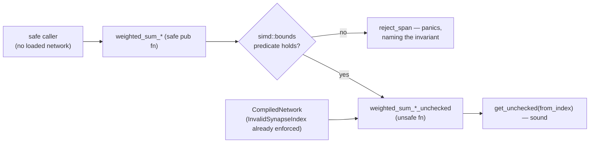

## Summary

Every weighted-sum kernel re-exported from `neat_core::simd` was a **safe**
`pub fn` whose body reached `activations.get_unchecked(from_index)` on a
precondition only `CompiledNetwork::new` upheld. A downstream crate holding no
loaded network could therefore drive an out-of-bounds read from entirely safe
code — the issue's reproducer takes the process down on the unfixed build.

Each kernel is now split in two:

- the **existing name** keeps its signature and becomes genuinely safe. It runs
  the matching predicate from the new `neat_core::simd::bounds` module over the
  span and, when the precondition does not hold, **fails loud** through
  `bounds::reject_span` / `bounds::reject_interleaved_span` rather than reading
  unchecked or answering from a truncated span;
- a **`*_unchecked` twin** is an `unsafe fn` carrying the index precondition as
  a `# Safety` contract. `CompiledNetwork`'s forward pass, batched scoring and
  loss paths call these, discharging the contract from the load-time
  `NetworkError::InvalidSynapseIndex` validation.

That is the issue's **option 1 applied to the hot path only**: the obligation
moves onto the already-validating callers, while the public safe names keep
working for downstream consumers (NEAT-AI-scorer, NEAT-AI-Backpropagation) and
become sound rather than disappearing. Option 2 — validating on every call — was
prototyped and **measured**, not assumed: it cost **+33% to +64%** on
`forward_pass`, so it was rejected. Option 3 (`ValidatedSpan`) was ruled out
because `CompiledNetwork::activate` writes `self.activations` while the neuron
loop reads it, so a borrow-carrying validated view cannot live across the loop.

Both halves of the contract are refused the same way, on both targets: an
out-of-range `from_index`, and an `end` past the synapse slice. The `wasm`
multi-record kernels were already bounds-checked internally, but they now run
the same `simd::bounds` gate as the native ones so the documented behaviour is
true on every target rather than by accident on one.

One safe→UB path is deliberately **not** closed here, because it is a different
root cause: `CompiledNetwork`'s fields are `pub`, so safe code can write
`synapses` / `hot_from` after `new` validated them and then call `activate`.
That is not a regression — the same write reached the same `get_unchecked`
before this change — but closing it needs private fields or `#[non_exhaustive]`,
an API break for NEAT-AI-scorer and NEAT-AI-Backpropagation. It is filed as
Issue #625 with the reproducer, and mitigated here rather than left implied: the
field invariant is now stated on `CompiledNetwork` itself and in `SECURITY.md`,
so nothing in this diff documents that hole as closed.

Closes #613.

## Evidence

Backend/library change with no web interface, so the evidence is test output and
benchmark numbers rather than a screenshot.

### The reproducer, before and after

The regression suite is `neat-core/tests/simd_public_bounds.rs`. Run against the
**default branch** sources (`git checkout origin/Develop -- neat-core/src`), the
safe kernels do not merely return a wrong number — they take the process down:

```
--- unfixed: weighted_sum_simd_rejects_out_of_range_from_index
thread caused non-unwinding panic. aborting.
  … (signal: 6, SIGABRT: process abort signal)
--- unfixed: weighted_sum_simd_4records_rejects_out_of_range_from_index
  … (signal: 6, SIGABRT: process abort signal)
--- unfixed: weighted_sum_simd_8records_rejects_out_of_range_from_index
  … (signal: 6, SIGABRT: process abort signal)
--- unfixed: weighted_sum_interleaved_8_rejects_out_of_range_from_index
  … (signal: 11, SIGSEGV: invalid memory reference)
--- unfixed: the `end > synapses.len()` case
  … (signal: 6, SIGABRT: process abort signal)
```

After the fix all eleven tests pass. The refusal cases are table-driven: each
entry of `SAFE_KERNELS` names one safe entry point and carries the two case
names it owes (`name` for the out-of-range `from_index` half, `span_name` for
the `end > synapses.len()` half), and the two `every_safe_kernel_*` tests run
every case one kernel at a time, so a kernel cannot be added with only half its
contract covered:

```
running 11 tests
test result: ok. 11 passed; 0 failed; 0 ignored; 0 measured; 0 filtered out
```

The abort/segfault signatures are this host's (aarch64, NEON detected), where
every kernel reaches its unchecked path. On a host without the detected feature
some kernels would fall back to the checked scalar loop and panic instead — the
tests assert refusal either way, so they stay valid; only the *signature* of the
pre-fix failure is host-specific.

The red run was **repeated independently** before this PR was raised, in a
throwaway worktree checked out at `origin/Develop` (`f2ceeca`). The committed
suite names `simd::bounds` and the `*_unchecked` twins, so it cannot compile
against the unfixed tree; the repeat therefore ran the same three assertion
bodies over the **safe public entry points alone**, which exist unchanged on
both trees. Each aborts the test process on the unfixed sources:

| unfixed reproducer | outcome on `f2ceeca` |
| --- | --- |
| `weighted_sum_simd`, `from_index: 9_999` against a 1-long buffer | `slice::get_unchecked` precondition violated at `neat-core/src/simd_native.rs:614` — SIGABRT |
| `weighted_sum_simd_8records`, same span | violated at `neat-core/src/simd_native.rs:460` — SIGABRT |
| `weighted_sum_simd`, `end = 64` against a 2-long synapse slice | violated at `neat-core/src/simd_native.rs:607` — SIGABRT |

The same three cases are the `SAFE_KERNELS` entries named
`weighted_sum_simd_rejects_out_of_range_from_index`,
`weighted_sum_simd_8records_rejects_out_of_range_from_index` and
`weighted_sum_simd_rejects_a_span_past_the_synapse_slice` in the committed
suite — run by `every_safe_kernel_rejects_an_out_of_range_from_index` and
`every_safe_kernel_rejects_a_span_past_the_synapse_slice`, where they pass.

### Original trigger closed, with no trivial bypass

The issue's trigger is a `from_index` past the end of `activations` reaching an
unchecked read. Every path from a safe caller to an unchecked read now passes a
`simd::bounds` predicate, by construction:

- the four single-record kernels gate on `bounds::span_in_bounds`, which rejects
  both halves of the contract — `end > synapses.len()`, and any `from_index`
  outside `0..activations.len()` — over the **whole** `start..end` span, not a
  sample of it, so no lane position can slip through;
- the two multi-record kernels gate on `bounds::span_in_bounds_multi`, which
  binds on the **shortest** activation buffer, so passing seven long buffers and
  one short one is not a bypass (pinned by
  `weighted_sum_simd_8records_rejects_one_short_buffer`);
- the interleaved kernels gate on `bounds::interleaved_span_in_bounds`, which
  checks `end` against both hot arrays and computes `from * R + R` with
  `checked_mul` / `checked_add`, so a large `lanes` cannot wrap the product back
  into range;
- a reversed or empty span (`start >= end`) is accepted because the kernels read
  nothing — the saturating `scalar::synapse_count` guard returns before the
  first load, pinned by `empty_and_reversed_spans_are_in_bounds`.

When a predicate fails the call **fails loud**: `reject_span` panics with a
message naming the invariant, so a caller bug is never folded into a
plausible-looking number. The only remaining unchecked entry points are
`unsafe fn`s, which safe caller code cannot call at all — and `gather4`, the one
other unchecked reader, is private.

### Flow



### Benchmarks — forward-pass hot path

Host: 9-core `aarch64` Linux container, shared (load average 1.26 during this
run), so only paired comparisons are meaningful. Method: `origin/Develop` and
this branch each built `--release` once, the two `hot_paths` binaries kept side
by side, runs **alternated** `before, after, before, after …` — four pairs per
shape, Criterion `--measurement-time 2 --warm-up-time 1 --sample-size 20`.
Medians of the per-run medians:

| `forward_pass` shape | before (`origin/Develop`) | after | change |
| --- | ---: | ---: | ---: |
| `production_exact` | 14.067 µs | 14.161 µs | +0.7% |
| `production_2x` | 30.194 µs | 30.530 µs | +1.1% |
| `large_5000` | 58.884 µs | 58.156 µs | −1.2% |

Within-variant spread was 5–10% on this host (`production_2x` "before" alone
ranged 29.31–31.01 µs), so every difference above is inside the noise floor —
the expected result, since the hot path calls the same kernel bodies it always
did, only spelled `*_unchecked`.

### Benchmarks — the safe entry point's cost, reproducible from the tree

`neat-core/benches/hot_paths.rs` gains `weighted_sum_simd/single_checked`, the
safe entry point measured beside the `*_unchecked` kernel it guards, so the cost
a caller holding no loaded network pays is verifiable from the committed tree
rather than only from this summary:

| bench | ns/iter |
| --- | ---: |
| `weighted_sum_simd/single` (`*_unchecked`, the hot-path form) | 18.880 |
| `weighted_sum_simd/single_checked` (safe entry point) | 31.637 |

That is **+67.6%** for the `O(end - start)` pre-pass on a 64-synapse span, and
exactly the cost the split keeps off the forward pass. Re-measured from the
committed tree before the PR was raised, under different container load, the
same pair read 24.135 ns against 42.700 ns — **+76.9%**. The absolute figures
move with host load; the ratio is what the split is about, and it sits in a
+68–77% band across both runs. The remaining hot-path
kernels stay comparable with `neat-core/benches/BASELINE.md`:

| kernel | before | after |
| --- | ---: | ---: |
| `single` | 18.949 ns | 18.880 ns |
| `no_bias` | 19.099 ns | 18.750 ns |
| `of_squares` | 19.490 ns | 18.691 ns |
| `batch_4records` | 43.624 ns | 43.211 ns |
| `batch_8records` | 65.636 ns | 61.779 ns |

### Benchmarks — why option 2 was rejected

Option 2 (validate on every call, hot path included) was implemented as a
prototype and measured on the same host before being discarded:

| bench | committed | option-2 prototype | change |
| --- | ---: | ---: | ---: |
| `weighted_sum_simd/single` | 18.949 ns | 32.036 ns | **+68.0%** |
| `weighted_sum_simd/no_bias` | 19.099 ns | 32.081 ns | **+66.8%** |
| `weighted_sum_simd/of_squares` | 19.490 ns | 32.046 ns | **+65.2%** |
| `forward_pass/small_50` | 434.12 ns | 488.42 ns | +12.6% |
| `forward_pass/medium_500` | 4.2609 µs | 5.7083 µs | +33.2% |
| `forward_pass/large_5000` | 56.173 µs | 79.414 µs | +41.6% |
| `forward_pass/production` | 14.986 µs | 23.284 µs | **+63.6%** |
| `forward_pass/production_2x` | 28.858 µs | 42.997 µs | +53.4% |
| `forward_pass/production_exact` | 14.878 µs | 19.704 µs | +33.3% |

## Reproduction

- **symptom** — a safe call such as
  `weighted_sum_simd(&[SynapseData { from_index: 9_999, .. }; 8], &[0.0; 1], 0, 8, 0.0)`
  reads past the end of the activation buffer: undefined behaviour reachable
  from entirely safe downstream code.
- **status** — `verified` — the regression tests were observed **failing against
  the `origin/Develop` code** (SIGABRT on `weighted_sum_simd`,
  `weighted_sum_simd_4records` and `weighted_sum_simd_8records`; SIGSEGV on
  `weighted_sum_interleaved_8`; SIGABRT on the `end > synapses.len()` case) and
  **passing after the fix** (11 passed, 0 failed).
- **regression test** — `neat-core/tests/simd_public_bounds.rs::weighted_sum_simd_rejects_out_of_range_from_index`
  (single-record) and
  `neat-core/tests/simd_public_bounds.rs::weighted_sum_simd_8records_rejects_out_of_range_from_index`
  (multi-record) — the two `SAFE_KERNELS` cases that reproduce the issue's
  `from_index: 9_999` span, declared by name in the added lines of
  `neat-core/tests/simd_public_bounds.rs` and run by the `#[test]`
  `every_safe_kernel_rejects_an_out_of_range_from_index`. Both fail against the
  unfixed code (SIGABRT on an out-of-bounds unchecked read) and pass after the
  fix.

## Acceptance Criteria

<!-- vibe-spec-review inputs="diff+issue-body" -->

- **met** — the safe public SIMD surface can no longer cause UB from safe caller
  code, by whichever option is chosen (recorded in the PR summary) — evidence:
  `neat-core/src/simd/bounds.rs`, the eight safe wrappers at
  `neat-core/src/simd_native.rs:740,860,953,996,1098,1167,1228,1288` and their
  `wasm` mirrors at `neat-core/src/simd.rs:200,293,358,423,505,601,755,835`, and
  `neat-core/tests/simd_public_bounds.rs::weighted_sum_simd_rejects_out_of_range_from_index`
  — reviewer: met — reason: the reviewer enumerated every non-`unsafe` `pub fn`
  reachable from `neat_core::simd`, checked each predicate **against the kernel
  bodies** rather than the docs, and found no other escape (`mod x86` / `mod
  aarch64` private, `simd::scalar` checked, its `tail_*` helpers already
  `unsafe fn`). It qualified the verdict with one residual safe→UB path
  **outside** the `simd` surface — see the `unrequested` entry on Issue #625
  below.
- **met** — a regression test in `neat-core/tests/` covers the out-of-range case
  for at least one single-record and one multi-record kernel — evidence:
  `neat-core/tests/simd_public_bounds.rs::weighted_sum_simd_rejects_out_of_range_from_index`
  and `…::weighted_sum_simd_8records_rejects_out_of_range_from_index`, the two
  `SAFE_KERNELS` cases run by `every_safe_kernel_rejects_an_out_of_range_from_index`
  — reviewer: met — reason: the standards reviewer additionally **mutated out**
  the `span_in_bounds` guard in `weighted_sum_simd` and the
  `interleaved_span_in_bounds` guard in `weighted_sum_interleaved`, one at a
  time, and watched the suite go red (SIGABRT) for each — so the tests are not
  vacuous.
- **met** — benchmarks show no meaningful regression on the forward-pass hot
  path — evidence: the paired alternating A/B table above (+0.7% / +1.1% /
  −1.2%, inside a 5–10% noise floor), and `weighted_sum_simd/single_checked` at
  `neat-core/benches/hot_paths.rs:465` — reviewer: met — reason: the reviewer
  noted the condition is largely moot because the hot path keeps the unchecked
  kernel, and flagged that the A/B medians live in this file rather than in CI.
  That is accepted: the committed `single_checked` bench is the reproducible
  half, re-measured here at +76.9% on a differently loaded host.

*Scope creep — every change in the diff the reviewer could not trace to the
issue:*

- **unrequested** — the residual safe→UB path the spec reviewer found and
  reproduced: `CompiledNetwork`'s fields are `pub`, so safe code can write
  `synapses` / `hot_from` after `new` validated them and then call `activate`,
  reaching an unchecked read — evidence: `neat-core/src/network.rs:191-249` —
  reviewer: unrequested — reason: it is real and **not a regression** (the same
  safe write reached the same `get_unchecked` before this diff), but it is a
  different root cause from the one #613 names — struct field visibility, not
  the `neat_core::simd` boundary — and closing it by construction is an API
  break for NEAT-AI-scorer and NEAT-AI-Backpropagation. Filed as
  stSoftwareAU/NEAT-AI-core#625 with the reproducer and the three options, and
  mitigated here rather than left implied: the field invariant is now stated on
  `CompiledNetwork` itself (`neat-core/src/network.rs:196-203`) and in
  `SECURITY.md`, so no `# Safety` note in this diff claims a discharge the type
  does not give.
- **unrequested** — the `wasm` multi-record kernels
  (`weighted_sum_simd_4records`, `_8records`, `weighted_sum_interleaved`) gained
  the same `simd::bounds` gate and `*_unchecked` twins, though the issue lists
  only the surface `simd.rs` re-exports — reviewer: unrequested — reason: the
  in-crate hot path needs one spelling on both targets, and without the gate the
  README/SECURITY/AGENTS statements would be true on native and false on `wasm`.
- **unrequested** — the whole `pub mod bounds`
  (`span_in_bounds`, `span_in_bounds_multi`, `interleaved_span_in_bounds`,
  `reject_span`, `reject_interleaved_span`) is new permanent public API —
  evidence: `neat-core/src/simd/bounds.rs` — reviewer: unrequested — reason:
  the integration tests the issue asks for can only see the public API, and a
  downstream crate that wants to hoist the check per span needs the predicate
  the kernels use rather than a copy of it. `simd::bounds` being the single home
  is what stops a span check being re-inlined into a kernel.
- **unrequested** — behaviour change: an `end > synapses.len()` span on a
  sub-SIMD count now panics where the pre-diff safe kernel fell into
  `scalar::weighted_sum`'s `.take(end)` and silently truncated — evidence:
  `neat-core/src/simd/bounds.rs:63` against `neat-core/src/simd/scalar.rs:51` —
  reviewer: unrequested — reason: the issue names `from_index`, but the same
  entry points read `synapses[start..end]` unchecked on the SIMD path, so both
  halves must be refused or the fix is half a fix. Refusing them the same way is
  the fail-loud rule; truncating was the silent fallback the standards reviewer
  flagged.
- **unrequested** — new public unsafe API with no production caller:
  `weighted_sum_interleaved_8_unchecked` — evidence:
  `neat-core/src/simd_native.rs:969` — reviewer: unrequested — reason: it is the
  `*_unchecked` twin of a safe kernel the family otherwise pairs one-for-one;
  omitting it alone would leave `weighted_sum_interleaved_8` with no validated
  form for a caller that has already discharged the contract at `R == 8`.
- **unrequested** — `wasm-bench/src/lib.rs` and the five bench bodies in
  `neat-core/benches/hot_paths.rs` switched to `*_unchecked`, plus the new
  `single_checked` case — evidence: `wasm-bench/src/lib.rs:127-157`,
  `neat-core/benches/hot_paths.rs:446-547` — reviewer: unrequested — reason: a
  harness left on the safe name silently starts measuring the pre-pass instead
  of the kernel, which would invalidate `BASELINE.md` and
  `docs/research/wasm-gather4-unchecked-loads.md`. The same sweep is why
  `neat-core/examples/bench_single_record_weighted_sums.rs` moved too — the
  standards reviewer caught that one as a miss.
- **unrequested** — new prose in `README.md`, `SECURITY.md`, `AGENTS.md`,
  `neat-core/benches/README.md`, `wasm-bench/README.md` and
  `docs/research/wasm-gather4-unchecked-loads.md`, and the doc-comment sweep in
  `network.rs` / `batch_scoring.rs` — reviewer: unrequested — reason: the
  standing "a code change owes a docs change" rule; the two-form API renames
  every symbol these files name, and the `AGENTS.md` `// SAFETY:` rule
  contradicted the code until it was swept.
- **unrequested** — `checked_mul` / `checked_add` in
  `bounds::interleaved_span_in_bounds` — evidence:
  `neat-core/src/simd/bounds.rs:100-115` — reviewer: unrequested — reason: the
  crate only ever passes `R <= 64`, but `lanes` is a caller-supplied `usize` on
  a public predicate, so wrapping arithmetic there would be a bypass rather than
  dead code. Pinned by
  `interleaved_predicate_rejects_partial_and_overflowing_tiles`.

## Standards Review

<!-- vibe-standards-review inputs="diff+CODING-STANDARDS.md" -->

`CODING-STANDARDS.md` does not exist in this repository; the reviewer was given
the documented equivalents — `AGENTS.md`, `SECURITY.md`, `README.md`,
`neat-core/benches/README.md` — plus the fleet standards.

- **violation** — `AGENTS.md` documented a silent fallback the code does not
  perform: the safe-kernel bullet said a failed predicate "falls through to the
  fully-checked scalar reference", which is the truncating behaviour this change
  removes, and contradicts the paragraph eight lines below it — evidence:
  `AGENTS.md:294` — reason: **fixed here** — the bullet now says the call is
  refused with a panic, matching `bounds::reject_span`, `SECURITY.md` and every
  rustdoc `# Panics` section. This is the same finding the spec reviewer raised
  as W2.
- **violation** — the hot-path caller sweep missed
  `neat-core/examples/bench_single_record_weighted_sums.rs`: its header claims
  to measure "the primitives that `activate()` calls per neuron", but `activate`
  now calls the `*_unchecked` forms while the example still called the safe
  ones, so it measured the kernel **plus** the pre-pass — evidence:
  `neat-core/examples/bench_single_record_weighted_sums.rs:17` — reason:
  **fixed here** — the example moved to the `*_unchecked` forms with a SAFETY
  note naming the fixture that discharges them (`from_index = i % num_inputs`
  against a `num_inputs`-long buffer), and its header records why.
- **violation** — stale symbols after the crate they document changed:
  `wasm-bench/README.md` called the `kernel` benchmark "isolated
  `weighted_sum_simd`", and `docs/research/wasm-gather4-unchecked-loads.md` —
  which `AGENTS.md:270` cites as the **live** rationale for the `gather4`
  unchecked default, not an archived summary — said the same — evidence:
  `wasm-bench/README.md:41`, `docs/research/wasm-gather4-unchecked-loads.md:84`
  — reason: **fixed here** — both now name `weighted_sum_simd_unchecked` and say
  why.
- **violation** — `weighted_sum_interleaved_8` gained panicking behaviour with
  no `# Panics` section, though every other safe wrapper in the diff got one —
  including its own `wasm` twin — evidence:
  `neat-core/src/simd_native.rs:950` — reason: **fixed here**.
- **violation** — the mandatory `cargo check -p neat-core --target
  wasm32-unknown-unknown` was not run, on a diff that adds ~290 lines to the
  `wasm` half of `simd.rs`; `AGENTS.md` records that no PR gate compiles that
  target, so this is the load-bearing manual check — evidence:
  `AGENTS.md:247`, `AGENTS.md:764` — reason: **stands** — the container has
  neither the `wasm32-unknown-unknown` target nor `rustup` to add one, so it
  cannot be run here. Called out in Gate status below; the `wasm` edits mirror
  the native ones and add no new intrinsic usage, but the check is owed before
  merge.
- **violation** *(lower confidence, from the reviewer)* —
  `neat-core/benches/BASELINE.md` still names `weighted_sum_interleaved_8` /
  `weighted_sum_interleaved::<R>` as the batched-scoring path — evidence:
  `neat-core/benches/BASELINE.md:185` — reason: **stands, deliberately** — those
  passages are the Issue #384/#530 architectural narrative about the gather
  layout, and both names still exist as the safe entry points they describe; the
  file is a historical baseline record, and rewriting its prose is outside this
  issue.
- **violation** — silent fallback masked a caller fault: when
  `end > synapses.len()` the safe kernels fell into
  `scalar::weighted_sum` / `*_scalar`, which iterate `.take(end).skip(start)`
  and **truncate** instead of failing — evidence: `neat-core/src/simd/bounds.rs:34`
  and the wrappers at `neat-core/src/simd_native.rs:1098`,
  `neat-core/src/simd.rs:203` — reason: **fixed** in the second commit of this
  branch — every wrapper now calls `bounds::reject_span` /
  `reject_interleaved_span`. `weighted_sum_simd_rejects_a_span_past_the_synapse_slice`
  pins it.
- **violation** — `AGENTS.md` required every SIMD `// SAFETY:` note to name an
  `is_*_feature_detected!` guard, which ~25 new blocks correctly do not —
  evidence: `AGENTS.md:333-337` — reason: **fixed** in this branch — the rule now
  names the two distinct obligations (feature availability, index validity) and
  which note each kind of block owes.
- **violation** — `expect_out_of_bounds_panic` mutated the process-global panic
  hook per call across concurrently-run tests — evidence:
  `neat-core/tests/simd_public_bounds.rs:47-50` — reason: **fixed** in this
  branch — the silent hook is installed once through a `std::sync::Once`.
- **clean** — the reviewer verified, and named the evidence for: fail-loud in
  every new path with no swallowed error or truncating fallback; the 11 tests
  call real kernels, run in 0.00s with no sleeps or timing thresholds and no
  source greps, and survive the mutation check above; Australian English in
  every added line; no hidden paths staged; `simd::bounds` the single home of
  the predicates with `simd/scalar.rs` and the `gather4`/`reduce4` scaffold
  untouched; `# Safety` on all 15 new `unsafe fn`s with `unsafe_op_in_unsafe_fn`
  respected; the `wasm` 4-/8-record `*_unchecked` bodies honestly documenting
  that their bounds-checked indexing is stronger than the contract and not
  something a caller may rely on; and `cargo fmt --all --check`, `clippy -D
  warnings`, `RUSTDOCFLAGS="-D warnings" cargo doc` and the full test suite all
  clean in its own run.

## Test Plan

New file `neat-core/tests/simd_public_bounds.rs` — 11 tests, all calling the
real public kernels and asserting on the outcome. The six single- and
multi-record entry points are driven from one `SAFE_KERNELS` table: each entry
declares the safe kernel's call shape and the two case names it owes, so both
obligations are asserted for every kernel rather than for whichever ones were
remembered. `weighted_sum_interleaved_8` keeps its own pair of tests — its
contract is over the hot SoA arrays and a tile-major buffer, so it does not fit
the table's shape.

*Obligation 1 — every `from_index` indexes the activation buffer*

- `neat-core/tests/simd_public_bounds.rs::weighted_sum_simd_rejects_out_of_range_from_index`
  — the issue's reproducer, the first `SAFE_KERNELS` case, run by the `#[test]`
  `every_safe_kernel_rejects_an_out_of_range_from_index`. It **fails against the
  unfixed code and passes after the fix**: on `origin/Develop` the same
  assertion body aborts the process on an out-of-bounds unchecked read
  (SIGABRT), and on this branch it passes.
- `neat-core/tests/simd_public_bounds.rs::weighted_sum_simd_8records_rejects_out_of_range_from_index`
  — the multi-record case the acceptance criteria require, likewise **failing
  against the unfixed code and passing after the fix** (SIGABRT on
  `origin/Develop`).
- `weighted_sum_no_bias_simd_…`, `weighted_sum_of_squares_simd_…`,
  `weighted_sum_of_squares_v2_simd_…`, `weighted_sum_simd_4records_…` — the
  remaining table cases, one per safe entry point.
- `weighted_sum_interleaved_8_rejects_out_of_range_from_index` — the
  record-interleaved tile, whose contract is `inter.len() == num_neurons * R`.
- `weighted_sum_simd_8records_rejects_one_short_buffer` — seven long buffers and
  one short one must not slip through the multi-record predicate.

*Obligation 2 — `end <= synapses.len()`*

- `every_safe_kernel_rejects_a_span_past_the_synapse_slice` runs the
  `span_name` case of every `SAFE_KERNELS` entry —
  `weighted_sum_simd_rejects_a_span_past_the_synapse_slice`,
  `weighted_sum_no_bias_simd_…`, `weighted_sum_of_squares_simd_…`,
  `weighted_sum_of_squares_v2_simd_…`, `weighted_sum_simd_4records_…` and
  `weighted_sum_simd_8records_…` — so all six safe entry points are covered
  rather than the two that had a hand-written test.
- `weighted_sum_interleaved_8_rejects_a_span_past_the_hot_arrays` — the same
  half for the tile kernel. This is the half that used to be a silent
  truncation (and an out-of-bounds synapse read on the SIMD path); it is now
  refused loud on every kernel.

*Happy path — the pre-pass changes no answer*

- `safe_entry_points_match_their_unchecked_twins_on_valid_spans` — for every
  `end` in `0..=8`, each of the six safe entry points is asserted **bit-identical**
  (`to_bits()`) to its `*_unchecked` twin.
- `interleaved_safe_entry_point_matches_its_unchecked_twin` — the same for the
  8-lane tile.

*The predicates themselves*

- `empty_and_reversed_spans_are_in_bounds` — an empty or reversed span reads
  nothing, so it stays in bounds whatever the buffers hold.
- `span_in_bounds_rejects_both_halves_of_the_contract`,
  `multi_record_predicate_binds_on_the_shortest_buffer`,
  `interleaved_predicate_rejects_partial_and_overflowing_tiles` — the error and
  edge cases of each public predicate, including the `checked_mul` overflow
  branch.

*Follow-up review round (this run)*

- `neat-core/examples/bench_single_record_weighted_sums.rs` moved to the
  `*_unchecked` forms so it measures what `activate()` calls, as its own header
  claims. `cargo check --example bench_single_record_weighted_sums` is clean.
- No test was added for the `CompiledNetwork` field-mutation path found by the
  spec review: the repro is real but the fix is an API break, so it is filed as
  Issue #625 together with the acceptance criterion for its regression test.
- The eight hand-written refusal tests became the `SAFE_KERNELS` table and its
  two `every_safe_kernel_*` drivers, which also closed a coverage gap: the
  `end > synapses.len()` half had a case for `weighted_sum_simd` and
  `weighted_sum_simd_8records` only, and now has one for all six safe entry
  points. The table was mutation-checked in the same way as the originals —
  the `span_in_bounds` guard was taken out of `weighted_sum_of_squares_v2_simd`
  (a kernel that previously had no `end`-half case) and the suite went red
  (SIGABRT), then the guard was restored.

Existing suites are unchanged and still pass, which is the parity evidence that
the safe entry points behave identically for valid input: `simd_weighted_sums.rs`,
`simd_scalar_layer.rs`, `simd_chunk_walk_scaffold.rs`,
`interleaved_scoring_parity.rs`, `unchecked_gather_invariant.rs` and the rest of
`cargo test --workspace --lib --tests --all-features` (all green).

### Gate status

`./quality.sh` was run. Its Rust stages all pass — `cargo fmt --all --check`,
`cargo clippy --workspace --all-targets --all-features -- -D warnings`,
`cargo check`, `cargo test --workspace --lib --tests --all-features`,
`cargo test --doc`, `RUSTDOCFLAGS="-D warnings" cargo doc`,
`cargo build --release`, `cargo deny check` — as do the shellcheck, TypeScript,
Mermaid, wasm-prune-parity and JSR supply-chain stages.

Two environmental caveats, both **pre-existing and unrelated to this change**:

- the `bats tests/scripts` stage reports 109 failures because this container has
  no `python3` `yaml` module and no `pip` to install one. The count is
  **identical on the parent commit** — re-counted this run in a throwaway
  worktree at `origin/Develop` (109 before, 109 after) — and every failing case
  is a `.github/workflows` YAML assertion this diff does not touch.
- the `wasm` half of `simd.rs` could not be compiled here: no
  `wasm32-unknown-unknown` target and no `rustup` in the container, so the
  `cargo check -p neat-core --target wasm32-unknown-unknown` that `AGENTS.md`
  asks for before merging a `wasm` change could not be run. The `wasm` edits
  mirror the native ones exactly and add no new intrinsic usage.

`AGENTS.md` records that **no PR gate compiles that target**, so this is a manual
check rather than one CI will pick up: it is **owed before merge** and is called
out as a standing violation above rather than quietly deferred.

`./quality.sh` was re-run in full before the PR was raised. It still exits 1 at
the `bats` stage on the same 109 environmental failures (`ModuleNotFoundError:
No module named 'yaml'`), which is where `set -e` stops it, so every stage after
that point was run individually and each passed on the final tree: the
TypeScript, Mermaid, wasm-prune-parity and JSR supply-chain gates,
`cargo deny check`, `cargo fmt --all --check`, `cargo clippy --workspace
--all-targets --all-features -- -D warnings`, `cargo test --workspace --lib
--tests --all-features -- --test-threads=2`, `cargo test --workspace --doc
--all-features`, `RUSTDOCFLAGS="-D warnings" cargo doc --workspace --no-deps`
and `cargo build --workspace --release`.
