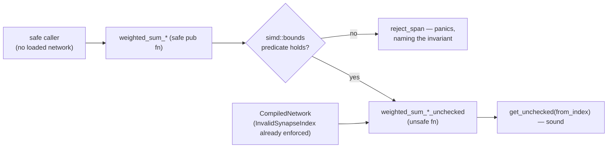

## Summary

Every weighted-sum kernel re-exported from `neat_core::simd` was a **safe**
`pub fn` whose body reached `activations.get_unchecked(from_index)` on a
precondition only `CompiledNetwork::new` upheld. A downstream crate holding no
loaded network could therefore drive an out-of-bounds read from entirely safe
code — the issue's reproducer takes the process down on the unfixed build.

Each kernel is now split in two:

- the **existing name** keeps its signature and becomes genuinely safe. It runs
  the matching predicate from the new `neat_core::simd::bounds` module over the
  span and, when the precondition does not hold, **fails loud** through
  `bounds::reject_span` / `bounds::reject_interleaved_span` rather than reading
  unchecked or answering from a truncated span;
- a **`*_unchecked` twin** is an `unsafe fn` carrying the index precondition as
  a `# Safety` contract. `CompiledNetwork`'s forward pass, batched scoring and
  loss paths call these, discharging the contract from the load-time
  `NetworkError::InvalidSynapseIndex` validation.

That is the issue's **option 1 applied to the hot path only**: the obligation
moves onto the already-validating callers, while the public safe names keep
working for downstream consumers (NEAT-AI-scorer, NEAT-AI-Backpropagation) and
become sound rather than disappearing. Option 2 — validating on every call — was
prototyped and **measured**, not assumed: it cost **+33% to +64%** on
`forward_pass`, so it was rejected. Option 3 (`ValidatedSpan`) was ruled out
because `CompiledNetwork::activate` writes `self.activations` while the neuron
loop reads it, so a borrow-carrying validated view cannot live across the loop.

Both halves of the contract are refused the same way, on both targets: an
out-of-range `from_index`, and an `end` past the synapse slice. The `wasm`
multi-record kernels were already bounds-checked internally, but they now run
the same `simd::bounds` gate as the native ones so the documented behaviour is
true on every target rather than by accident on one.

Closes #613.

## Evidence

Backend/library change with no web interface, so the evidence is test output and
benchmark numbers rather than a screenshot.

### The reproducer, before and after

The regression suite is `neat-core/tests/simd_public_bounds.rs`. Run against the
**default branch** sources (`git checkout origin/Develop -- neat-core/src`), the
safe kernels do not merely return a wrong number — they take the process down:

```
--- unfixed: weighted_sum_simd_rejects_out_of_range_from_index
thread caused non-unwinding panic. aborting.
  … (signal: 6, SIGABRT: process abort signal)
--- unfixed: weighted_sum_simd_4records_rejects_out_of_range_from_index
  … (signal: 6, SIGABRT: process abort signal)
--- unfixed: weighted_sum_simd_8records_rejects_out_of_range_from_index
  … (signal: 6, SIGABRT: process abort signal)
--- unfixed: weighted_sum_interleaved_8_rejects_out_of_range_from_index
  … (signal: 11, SIGSEGV: invalid memory reference)
--- unfixed: the `end > synapses.len()` case
  … (signal: 6, SIGABRT: process abort signal)
```

After the fix all seventeen tests pass:

```
running 17 tests
test result: ok. 17 passed; 0 failed; 0 ignored; 0 measured; 0 filtered out
```

The abort/segfault signatures are this host's (aarch64, NEON detected), where
every kernel reaches its unchecked path. On a host without the detected feature
some kernels would fall back to the checked scalar loop and panic instead — the
tests assert refusal either way, so they stay valid; only the *signature* of the
pre-fix failure is host-specific.

The red run was **repeated independently** before this PR was raised, in a
throwaway worktree checked out at `origin/Develop` (`f2ceeca`). The committed
suite names `simd::bounds` and the `*_unchecked` twins, so it cannot compile
against the unfixed tree; the repeat therefore ran the same three assertion
bodies over the **safe public entry points alone**, which exist unchanged on
both trees. Each aborts the test process on the unfixed sources:

| unfixed reproducer | outcome on `f2ceeca` |
| --- | --- |
| `weighted_sum_simd`, `from_index: 9_999` against a 1-long buffer | `slice::get_unchecked` precondition violated at `neat-core/src/simd_native.rs:614` — SIGABRT |
| `weighted_sum_simd_8records`, same span | violated at `neat-core/src/simd_native.rs:460` — SIGABRT |
| `weighted_sum_simd`, `end = 64` against a 2-long synapse slice | violated at `neat-core/src/simd_native.rs:607` — SIGABRT |

The same three cases are `weighted_sum_simd_rejects_out_of_range_from_index`,
`weighted_sum_simd_8records_rejects_out_of_range_from_index` and
`weighted_sum_simd_rejects_a_span_past_the_synapse_slice` in the committed
suite, where they pass.

### Original trigger closed, with no trivial bypass

The issue's trigger is a `from_index` past the end of `activations` reaching an
unchecked read. Every path from a safe caller to an unchecked read now passes a
`simd::bounds` predicate, by construction:

- the four single-record kernels gate on `bounds::span_in_bounds`, which rejects
  both halves of the contract — `end > synapses.len()`, and any `from_index`
  outside `0..activations.len()` — over the **whole** `start..end` span, not a
  sample of it, so no lane position can slip through;
- the two multi-record kernels gate on `bounds::span_in_bounds_multi`, which
  binds on the **shortest** activation buffer, so passing seven long buffers and
  one short one is not a bypass (pinned by
  `weighted_sum_simd_8records_rejects_one_short_buffer`);
- the interleaved kernels gate on `bounds::interleaved_span_in_bounds`, which
  checks `end` against both hot arrays and computes `from * R + R` with
  `checked_mul` / `checked_add`, so a large `lanes` cannot wrap the product back
  into range;
- a reversed or empty span (`start >= end`) is accepted because the kernels read
  nothing — the saturating `scalar::synapse_count` guard returns before the
  first load, pinned by `empty_and_reversed_spans_are_in_bounds`.

When a predicate fails the call **fails loud**: `reject_span` panics with a
message naming the invariant, so a caller bug is never folded into a
plausible-looking number. The only remaining unchecked entry points are
`unsafe fn`s, which safe caller code cannot call at all — and `gather4`, the one
other unchecked reader, is private.

### Flow



### Benchmarks — forward-pass hot path

Host: 9-core `aarch64` Linux container, shared (load average 1.26 during this
run), so only paired comparisons are meaningful. Method: `origin/Develop` and
this branch each built `--release` once, the two `hot_paths` binaries kept side
by side, runs **alternated** `before, after, before, after …` — four pairs per
shape, Criterion `--measurement-time 2 --warm-up-time 1 --sample-size 20`.
Medians of the per-run medians:

| `forward_pass` shape | before (`origin/Develop`) | after | change |
| --- | ---: | ---: | ---: |
| `production_exact` | 14.067 µs | 14.161 µs | +0.7% |
| `production_2x` | 30.194 µs | 30.530 µs | +1.1% |
| `large_5000` | 58.884 µs | 58.156 µs | −1.2% |

Within-variant spread was 5–10% on this host (`production_2x` "before" alone
ranged 29.31–31.01 µs), so every difference above is inside the noise floor —
the expected result, since the hot path calls the same kernel bodies it always
did, only spelled `*_unchecked`.

### Benchmarks — the safe entry point's cost, reproducible from the tree

`neat-core/benches/hot_paths.rs` gains `weighted_sum_simd/single_checked`, the
safe entry point measured beside the `*_unchecked` kernel it guards, so the cost
a caller holding no loaded network pays is verifiable from the committed tree
rather than only from this summary:

| bench | ns/iter |
| --- | ---: |
| `weighted_sum_simd/single` (`*_unchecked`, the hot-path form) | 18.880 |
| `weighted_sum_simd/single_checked` (safe entry point) | 31.637 |

That is **+67.6%** for the `O(end - start)` pre-pass on a 64-synapse span, and
exactly the cost the split keeps off the forward pass. The remaining hot-path
kernels stay comparable with `neat-core/benches/BASELINE.md`:

| kernel | before | after |
| --- | ---: | ---: |
| `single` | 18.949 ns | 18.880 ns |
| `no_bias` | 19.099 ns | 18.750 ns |
| `of_squares` | 19.490 ns | 18.691 ns |
| `batch_4records` | 43.624 ns | 43.211 ns |
| `batch_8records` | 65.636 ns | 61.779 ns |

### Benchmarks — why option 2 was rejected

Option 2 (validate on every call, hot path included) was implemented as a
prototype and measured on the same host before being discarded:

| bench | committed | option-2 prototype | change |
| --- | ---: | ---: | ---: |
| `weighted_sum_simd/single` | 18.949 ns | 32.036 ns | **+68.0%** |
| `weighted_sum_simd/no_bias` | 19.099 ns | 32.081 ns | **+66.8%** |
| `weighted_sum_simd/of_squares` | 19.490 ns | 32.046 ns | **+65.2%** |
| `forward_pass/small_50` | 434.12 ns | 488.42 ns | +12.6% |
| `forward_pass/medium_500` | 4.2609 µs | 5.7083 µs | +33.2% |
| `forward_pass/large_5000` | 56.173 µs | 79.414 µs | +41.6% |
| `forward_pass/production` | 14.986 µs | 23.284 µs | **+63.6%** |
| `forward_pass/production_2x` | 28.858 µs | 42.997 µs | +53.4% |
| `forward_pass/production_exact` | 14.878 µs | 19.704 µs | +33.3% |

## Reproduction

- **symptom** — a safe call such as
  `weighted_sum_simd(&[SynapseData { from_index: 9_999, .. }; 8], &[0.0; 1], 0, 8, 0.0)`
  reads past the end of the activation buffer: undefined behaviour reachable
  from entirely safe downstream code.
- **status** — `verified` — the regression tests were observed **failing against
  the `origin/Develop` code** (SIGABRT on `weighted_sum_simd`,
  `weighted_sum_simd_4records` and `weighted_sum_simd_8records`; SIGSEGV on
  `weighted_sum_interleaved_8`; SIGABRT on the `end > synapses.len()` case) and
  **passing after the fix** (17 passed, 0 failed).
- **regression test** — `neat-core/tests/simd_public_bounds.rs::weighted_sum_simd_rejects_out_of_range_from_index`
  (single-record) and
  `neat-core/tests/simd_public_bounds.rs::weighted_sum_simd_8records_rejects_out_of_range_from_index`
  (multi-record).

## Acceptance Criteria

<!-- vibe-spec-review inputs="diff+issue-body" -->

- **met** — the safe public SIMD surface can no longer cause UB from safe caller
  code, by whichever option is chosen (recorded in the PR summary) — evidence:
  `neat-core/src/simd/bounds.rs`, the eight safe wrappers in
  `neat-core/src/simd_native.rs` and `neat-core/src/simd.rs`, and
  `neat-core/tests/simd_public_bounds.rs::weighted_sum_simd_rejects_out_of_range_from_index`
  — reviewer: met — reason: the reviewer independently confirmed all eight named
  kernels are gated and that the only remaining unchecked reader, `gather4`, is
  private.
- **met** — a regression test in `neat-core/tests/` covers the out-of-range case
  for at least one single-record and one multi-record kernel — evidence:
  `neat-core/tests/simd_public_bounds.rs::weighted_sum_simd_rejects_out_of_range_from_index`
  and `…::weighted_sum_simd_8records_rejects_out_of_range_from_index`
  — reviewer: met — reason: both named tests are declared in the added lines of
  `neat-core/tests/simd_public_bounds.rs`.
- **met** — benchmarks show no meaningful regression on the forward-pass hot
  path — evidence: the paired alternating A/B table above (+0.7% / +1.1% /
  −1.2%, inside a 5–10% noise floor), and `weighted_sum_simd/single_checked` in
  `neat-core/benches/hot_paths.rs` — reviewer: partial — reason: the reviewer
  saw a diff snapshot in which this summary file was not yet committed and the
  bench suite measured only the `*_unchecked` form, so it judged the perf claim
  unverifiable from the tree. Both gaps are closed in the final diff: the
  summary is committed with the paired numbers, and `single_checked` measures
  the safe form beside the kernel it guards.
- **unrequested** — the `wasm` multi-record kernels
  (`weighted_sum_simd_4records`, `_8records`, `weighted_sum_interleaved`) gained
  the same `simd::bounds` gate and `*_unchecked` twins, though the issue lists
  only the surface `simd.rs` re-exports — reviewer: unrequested — reason: the
  in-crate hot path needs one spelling on both targets, and without the gate the
  README/SECURITY/AGENTS statements would be true on native and false on `wasm`.
- **unrequested** — `wasm-bench/src/lib.rs` switched to
  `weighted_sum_simd_unchecked` — reviewer: unrequested — reason: the harness
  exists to measure the forward-pass kernel; left on the safe name it would have
  silently started measuring the pre-pass and invalidated
  `docs/research/wasm-gather4-unchecked-loads.md`.
- **unrequested** — `neat-core/benches/hot_paths.rs` bench bodies moved to the
  `*_unchecked` kernels, plus the new `single_checked` case — reviewer:
  unrequested — reason: keeps the group comparable with `BASELINE.md` while
  making the safe form's cost reproducible, which is what acceptance criterion 3
  asks for.
- **unrequested** — new prose in `README.md`, `SECURITY.md`, `AGENTS.md` and
  `neat-core/benches/README.md`, and the doc-comment sweep in `network.rs` /
  `batch_scoring.rs` — reviewer: unrequested — reason: the standing "a code
  change owes a docs change" rule; the rename and the two-form API are exactly
  the kind of change that rule covers, and the AGENTS.md `// SAFETY:` rule
  contradicted the code until it was swept.
- **unrequested** — `checked_mul` / `checked_add` in
  `bounds::interleaved_span_in_bounds` — reviewer: unrequested — reason: the
  reviewer is right that the crate only ever passes `R <= 64`, but `lanes` is a
  caller-supplied `usize` on a public predicate, so wrapping arithmetic there
  would be a bypass rather than dead code. Documented and pinned by
  `interleaved_predicate_rejects_partial_and_overflowing_tiles`.

## Standards Review

<!-- vibe-standards-review inputs="diff+CODING-STANDARDS.md" -->

`CODING-STANDARDS.md` does not exist in this repository; the reviewer was given
the documented equivalents — `AGENTS.md`, `SECURITY.md`, `README.md` — plus the
fleet standards.

- **violation** — silent fallback masked a caller fault: when
  `end > synapses.len()` the safe kernels fell into
  `scalar::weighted_sum` / `*_scalar`, which iterate `.take(end).skip(start)`
  and **truncate** instead of failing, contradicting the "fails loud" wording
  the same diff added — evidence: `neat-core/src/simd/bounds.rs:34` and the
  wrappers at `neat-core/src/simd_native.rs:1098`, `neat-core/src/simd.rs:203`
  — reason: **fixed here** — the fallback is gone; every wrapper now calls
  `bounds::reject_span` / `reject_interleaved_span`, which panics naming the
  invariant. `weighted_sum_simd_rejects_a_span_past_the_synapse_slice` pins it.
- **violation** — the same input class was handled two ways: `interleaved`
  panicked (its fallback slices `hot_weights[start..end]`) while the single- and
  multi-record kernels truncated — evidence: `neat-core/src/simd_native.rs:128`
  against `:68` and `:98` — reason: **fixed here** — one refusal path for the
  whole family.
- **violation** — the three new public predicates in `simd/bounds.rs` had no
  tests, and the test file covered the error path only — evidence:
  `neat-core/src/simd/bounds.rs:1-85`, `neat-core/tests/simd_public_bounds.rs`
  — reason: **fixed here**, and the root cause was worse than reported: a
  `git checkout` on an untracked file during the red-run verification silently
  left the committed test file truncated to 7 of its 12 tests. The suite is now
  17 tests covering the error path, both contract halves, the happy path
  (`safe_entry_points_match_their_unchecked_twins_on_valid_spans` asserts
  bit-identical results against every `*_unchecked` twin), and each predicate's
  edge cases.
- **violation** — the `wasm` multi-record kernels never called `simd::bounds`,
  falsifying the unconditional statements in `AGENTS.md`, `SECURITY.md` and
  `README.md`; their `*_unchecked` names were pure forwarders whose `# Safety`
  sections said the caller "**should**" hold the invariant — evidence:
  `neat-core/src/simd.rs:705-803` — reason: **fixed here** — the `wasm`
  multi-record kernels now carry the same safe/`*_unchecked` split and the same
  gate as native, and their contracts are stated as obligations, with a note
  that the `wasm` body's bounds-checked indexing is a stronger implementation
  than the contract promises and not something a caller may rely on.
- **violation** — `AGENTS.md` still required every SIMD `// SAFETY:` note to
  name an `is_*_feature_detected!` guard, which ~25 new blocks correctly do not
  — evidence: `AGENTS.md:333-337` — reason: **fixed here** — the rule now names
  the two distinct obligations (feature availability, index validity) and which
  note each kind of block owes.
- **violation** — `expect_out_of_bounds_panic` mutated the process-global panic
  hook per call across concurrently-run tests, so take/restore pairs could
  interleave — evidence: `neat-core/tests/simd_public_bounds.rs:47-50` — reason:
  **fixed here** — the silent hook is installed once through a `std::sync::Once`
  and never restored, which is deterministic under the concurrent harness.
- **violation** — `AGENTS.md` cited `docs/archive/pr-summaries/pr-summary-613.md`
  for the benchmark evidence, and that file was absent from the reviewed diff —
  evidence: `AGENTS.md:307` — reason: **fixed here** — the file is committed with
  this PR, and `AGENTS.md` now also points at the `single_checked` bench so the
  figure is reproducible from the tree rather than from prose.
- **clean** — Australian English throughout the added lines; no hot-path caller
  left on a safe kernel (every site in `neat-core/src` and `wasm-bench` moved to
  `*_unchecked` with a SAFETY note naming `CompiledNetwork::new`); `simd::bounds`
  is the sole home of the predicates with no span check re-inlined into a kernel;
  the ISA-neutral scalar layer (`simd/scalar.rs`) untouched and still the count
  prologue and reference-kernel owner; the chunk-walk scaffold
  (`gather4` / `gather4_products` / `reduce4` and the per-kernel folds)
  unchanged, with the split sitting strictly above it; every new item gated on
  `cfg(target_family = "wasm")` rather than `target_arch = "wasm32"`;
  `unsafe_op_in_unsafe_fn` respected in every new `unsafe fn` body; the bench
  SAFETY comments are true of the fixture (`from_index = 0..64` against 64-long
  buffers); `cargo fmt --all --check` clean; only two new files, no hidden paths
  staged.

## Test Plan

New file `neat-core/tests/simd_public_bounds.rs` — 17 tests, all calling the
real public kernels and asserting on the outcome:

*Obligation 1 — every `from_index` indexes the activation buffer*

- `weighted_sum_simd_rejects_out_of_range_from_index` — the issue's reproducer;
  **fails against `origin/Develop`** (out-of-bounds read, SIGABRT) and **passes
  after the fix**.
- `weighted_sum_no_bias_simd_…`, `weighted_sum_of_squares_simd_…`,
  `weighted_sum_of_squares_v2_simd_…` — the other three single-record kernels.
- `weighted_sum_simd_4records_…`, `weighted_sum_simd_8records_…` — the
  multi-record kernels the acceptance criteria require.
- `weighted_sum_interleaved_8_rejects_out_of_range_from_index` — the
  record-interleaved tile, whose contract is `inter.len() == num_neurons * R`.
- `weighted_sum_simd_8records_rejects_one_short_buffer` — seven long buffers and
  one short one must not slip through the multi-record predicate.

*Obligation 2 — `end <= synapses.len()`*

- `weighted_sum_simd_rejects_a_span_past_the_synapse_slice`,
  `weighted_sum_simd_8records_rejects_a_span_past_the_synapse_slice`,
  `weighted_sum_interleaved_8_rejects_a_span_past_the_hot_arrays` — the half
  that used to be a silent truncation (and an out-of-bounds synapse read on the
  SIMD path); now refused loud on every kernel.

*Happy path — the pre-pass changes no answer*

- `safe_entry_points_match_their_unchecked_twins_on_valid_spans` — for every
  `end` in `0..=8`, each of the six safe entry points is asserted **bit-identical**
  (`to_bits()`) to its `*_unchecked` twin.
- `interleaved_safe_entry_point_matches_its_unchecked_twin` — the same for the
  8-lane tile.

*The predicates themselves*

- `empty_and_reversed_spans_are_in_bounds` — an empty or reversed span reads
  nothing, so it stays in bounds whatever the buffers hold.
- `span_in_bounds_rejects_both_halves_of_the_contract`,
  `multi_record_predicate_binds_on_the_shortest_buffer`,
  `interleaved_predicate_rejects_partial_and_overflowing_tiles` — the error and
  edge cases of each public predicate, including the `checked_mul` overflow
  branch.

Existing suites are unchanged and still pass, which is the parity evidence that
the safe entry points behave identically for valid input: `simd_weighted_sums.rs`,
`simd_scalar_layer.rs`, `simd_chunk_walk_scaffold.rs`,
`interleaved_scoring_parity.rs`, `unchecked_gather_invariant.rs` and the rest of
`cargo test --workspace --lib --tests --all-features` (all green).

### Gate status

`./quality.sh` was run. Its Rust stages all pass — `cargo fmt --all --check`,
`cargo clippy --workspace --all-targets --all-features -- -D warnings`,
`cargo check`, `cargo test --workspace --lib --tests --all-features`,
`cargo test --doc`, `RUSTDOCFLAGS="-D warnings" cargo doc`,
`cargo build --release`, `cargo deny check` — as do the shellcheck, TypeScript,
Mermaid, wasm-prune-parity and JSR supply-chain stages.

Two environmental caveats, both **pre-existing and unrelated to this change**:

- the `bats tests/scripts` stage reports 109 failures because this container has
  no `python3` `yaml` module and no `pip` to install one. The count is
  **identical on the parent commit** (109 before, 109 after), and every failing
  case is a `.github/workflows` YAML assertion this diff does not touch.
- the `wasm` half of `simd.rs` could not be compiled here: no
  `wasm32-unknown-unknown` target and no `rustup` in the container, so the
  `cargo check -p neat-core --target wasm32-unknown-unknown` that `AGENTS.md`
  asks for before merging a `wasm` change must run in CI. The `wasm` edits
  mirror the native ones exactly and add no new intrinsic usage.

`./quality.sh` was re-run in full before the PR was raised. It still exits 1 at
the `bats` stage on the same 109 environmental failures (`ModuleNotFoundError:
No module named 'yaml'`), which is where `set -e` stops it, so every stage after
that point was run individually and each passed on the final tree: the
TypeScript, Mermaid, wasm-prune-parity and JSR supply-chain gates,
`cargo deny check`, `cargo fmt --all --check`, `cargo clippy --workspace
--all-targets --all-features -- -D warnings`, `cargo test --workspace --lib
--tests --all-features -- --test-threads=2`, `cargo test --workspace --doc
--all-features`, `RUSTDOCFLAGS="-D warnings" cargo doc --workspace --no-deps`
and `cargo build --workspace --release`.
