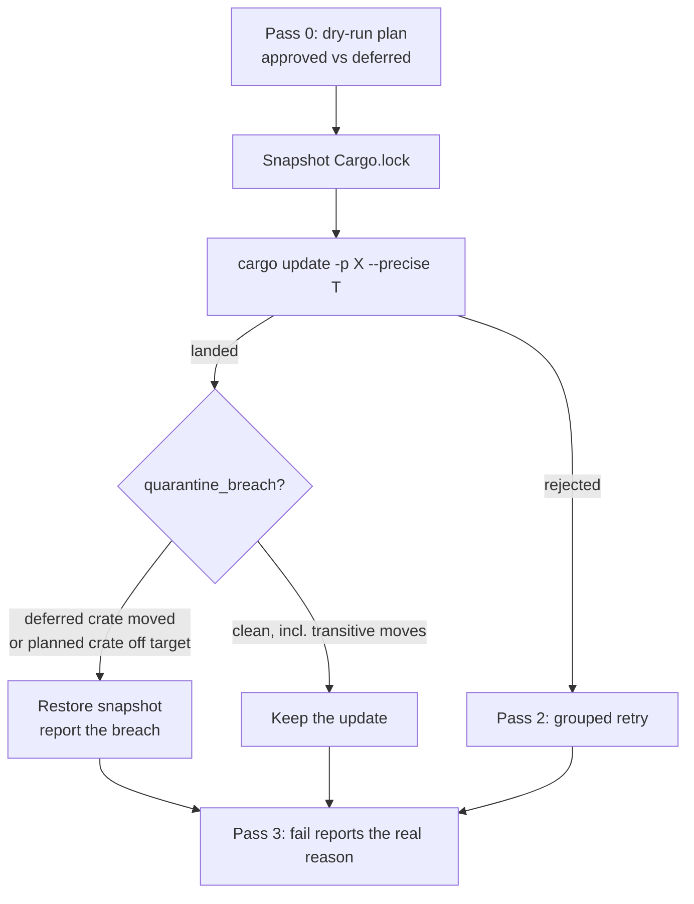

# Per-crate `cargo update` can no longer drag a crate past the quarantine

## Summary

`bump-deps.sh`'s per-crate pass ran `cargo update -p "$crate@$locked"
--precise "$target"` with no before/after lockfile check. `--precise` pins the
named crate, not the resolution: cargo stays free to move *other* crates to
satisfy that pin, so an update could drag crate `Y` — including one the same
run had just printed `defer: Y … (within 24h quarantine …)` for — to a version
the release-age quarantine never approved. Nothing reverted it and nothing
reported it, so the run exited 0 with an unapproved version in `Cargo.lock`,
while the reconciliation pass printed the misleading
`fail: Y -> <target> (cargo update rejected)`.

Each per-crate update now snapshots `Cargo.lock` and verifies it afterwards.
The check lives in one new helper, `quarantine_breach`, which is the single
definition of the contract both update passes are held to: a breach is either a
deferred crate that moved off the version it was held at, or a planned crate
that landed off both its approved target and the version it started from. On a
breach the snapshot is restored, the update is named in the log
(`revert: per-crate update of cc moved quarantined quarantined off 1.0.0`), and
the reconciliation line reports the real reason instead of "cargo update
rejected". `grouped_retry` now reads the same helper rather than its own copy
of the rule, so the two passes cannot drift apart again.

Movement of **out-of-plan transitive** crates is still allowed, deliberately —
cargo must be free to move a dependency to satisfy the version it was asked
for. That is the contract the grouped retry already documents and is covered by
its own test, so the per-crate pass matches it rather than being stricter.

The issue offered one snapshot for the whole pass as a cheaper alternative.
Per-crate was chosen: the copy is of a file cargo has just rewritten anyway
(20 KB today, copied once per attempted bump), and it is what lets the report
name the update that caused the drag and keep the bumps that landed cleanly
before it — the attribution the alternative explicitly cannot give.

Closes #614.

## Evidence

Backend/CLI change with no web interface to screenshot. The evidence is the
`bats` suite driving the real script against a stub `cargo` that models
drag-along through `$STUB_DRAG`:

```text
$ bats tests/scripts/bump_deps.bats
...
ok 29 external: per-crate update dragging a quarantined crate is reverted
ok 30 external: per-crate update dragging a planned crate off its target is reverted
ok 31 external: per-crate update moving an out-of-plan transitive crate is kept
```

All 31 cases in `tests/scripts/bump_deps.bats` pass; `shellcheck -s bash
bump-deps.sh` is clean.



## Reproduction

- **symptom** — a per-crate `cargo update` drags a crate the same run deferred
  past the release-age quarantine; the run exits 0 with the unapproved version
  in `Cargo.lock` and the log claims the bump did not happen
- **status** — `verified` — both new drag regression tests were observed
  failing against the unfixed script (`not ok 2` / `not ok 3` on the first run,
  before any change to `bump-deps.sh`) and pass after the fix
- **regression test** —
  `tests/scripts/bump_deps.bats::external: per-crate update dragging a quarantined crate is reverted`
  and
  `tests/scripts/bump_deps.bats::external: per-crate update dragging a planned crate off its target is reverted`

## Test Plan

Added to `tests/scripts/bump_deps.bats` (all assert on observable outcomes —
exit code, reported lines, the resulting `Cargo.lock`):

- `external: per-crate update dragging a quarantined crate is reverted` — the
  `cc` update drags a `defer:`red crate; asserts the revert line, the honest
  `fail:` reason (not "cargo update rejected"), and that the lock still holds
  both crates at their pre-update versions.
- `external: per-crate update dragging a planned crate off its target is
  reverted` — the `cc` update drags `find-msvc-tools` past its approved target;
  asserts `cc` reverts and that the restored lock then lets `find-msvc-tools`
  land its own approved target.
- `external: per-crate update moving an out-of-plan transitive crate is kept` —
  guards the deliberate allowance so the fix cannot be tightened into reverting
  legitimate transitive resolution.

Unchanged and still green: the eight pre-existing `external:` cases,
including `grouped retry dragging a quarantined crate is reverted` and `grouped
retry keeps a group that also moves a transitive crate`, which pin the shared
contract after `grouped_retry` was re-pointed at `quarantine_breach`.

### Quality gate

`./quality.sh` was run in the foreground and aborts at its `bats tests/scripts`
stage on **109 pre-existing failures** in the workflow-YAML suites, every one of
them `ModuleNotFoundError: No module named 'yaml'` — this container has no
PyYAML and no `pip` to install it. The count is identical on the unmodified
tree (`git stash` → 109, `git stash pop` → 109), so none of it is this change;
CI installs PyYAML and runs those suites. The stages this change can affect
were run individually and all pass.

Also run: `shellcheck -s bash bump-deps.sh`, `bash -n bump-deps.sh`,
`markdownlint-cli2 SECURITY.md`, `codespell`, `scripts/typescript-check.sh`,
`scripts/check_mermaid.ts`.
