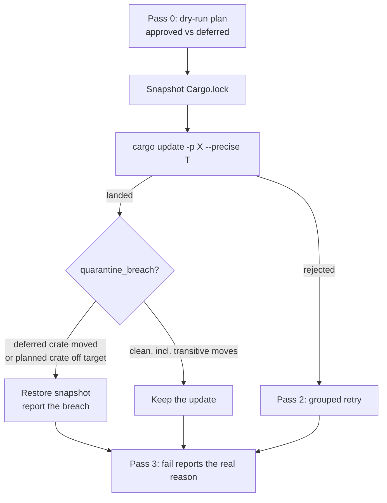

# Per-crate `cargo update` can no longer drag a crate past the quarantine

## Summary

`bump-deps.sh`'s per-crate pass ran `cargo update -p "$crate@$locked"
--precise "$target"` with no before/after lockfile check. `--precise` pins the
named crate, not the resolution: cargo stays free to move *other* crates to
satisfy that pin, so an update could drag crate `Y` — including one the same
run had just printed `defer: Y … (within 24h quarantine …)` for — to a version
the release-age quarantine never approved. Nothing reverted it and nothing
reported it, so the run exited 0 with an unapproved version in `Cargo.lock`,
while the reconciliation pass printed the misleading
`fail: Y -> <target> (cargo update rejected)`.

Each per-crate update now snapshots `Cargo.lock` and verifies it afterwards.
The check lives in one new helper, `quarantine_breach`, which is the single
definition of the contract both update passes are held to: a breach is either a
deferred crate that moved off the version it was held at, or a planned crate
that landed off both its approved target and the version it started from. On a
breach the snapshot is restored, the update is named in the log
(`revert: per-crate update of cc moved quarantined quarantined off 1.0.0`), and
the reconciliation line reports the real reason instead of "cargo update
rejected". `grouped_retry` now reads the same helper rather than its own copy
of the rule, so the two passes cannot drift apart again.

Movement of **out-of-plan transitive** crates is still allowed, deliberately —
cargo must be free to move a dependency to satisfy the version it was asked
for. That is the contract the grouped retry already documents and is covered by
its own test, so the per-crate pass matches it rather than being stricter. It
is also a real, pre-existing hole in both passes (a transitive crate can be
dragged to a version whose release age was never checked); closing it needs an
age check on unplanned crates and overturns that existing test, so it is filed
as **#627** rather than folded in here.

Three defects the independent review found in the first cut are fixed in the
second commit: the planned-crate check compared version sets only when the
approved target was absent, so a crate locked at two majors could land its
target and be dragged on the *other* major unnoticed (it now checks every
locked version against the target plus the versions held before the update); a
missing `Cargo.lock` silently skipped verification (the bump is now refused and
named, since nothing can be verified); and a rejected `cargo update` no longer
leaves an unverified lock behind. A single `LOCK_FILE` definition replaces the
three copies of the lockfile path.

The issue offered one snapshot for the whole pass as a cheaper alternative.
Per-crate was chosen: the copy is of a file cargo has just rewritten anyway
(20 KB today, copied once per attempted bump), and it is what lets the report
name the update that caused the drag and keep the bumps that landed cleanly
before it — the attribution the alternative explicitly cannot give.

Closes #614.

## Evidence

Backend/CLI change with no web interface to screenshot. The evidence is the
`bats` suite driving the real script against a stub `cargo` that models
drag-along through `$STUB_DRAG`:

```text
$ bats tests/scripts/bump_deps.bats
...
ok 29 external: per-crate update dragging a quarantined crate is reverted
ok 30 external: per-crate update dragging a planned crate off its target is reverted
ok 31 external: per-crate update moving an out-of-plan transitive crate is kept
ok 32 external: per-crate update dragging another major of the same crate is reverted
ok 33 external: grouped retry dragging a planned crate it skipped is reverted
ok 34 external: a bump with no lockfile to verify against is refused, not run
```

All 34 cases in `tests/scripts/bump_deps.bats` pass; `shellcheck -s bash
bump-deps.sh` is clean. Each new guard was mutation-checked — deleting it turns
a named case red: dropping the grouped revert reason reddens case 22, dropping
the "unchanged crate is not a breach" allowance reddens five cases, restoring
the old "target present, stop looking" shortcut reddens case 32, and dropping
the no-lockfile refusal reddens case 34.



## Reproduction

- **symptom** — a per-crate `cargo update` drags a crate the same run deferred
  past the release-age quarantine; the run exits 0 with the unapproved version
  in `Cargo.lock` and the log claims the bump did not happen
- **status** — `verified` — both new drag regression tests were observed
  failing against the unfixed script (`not ok 2` / `not ok 3` on the first run,
  before any change to `bump-deps.sh`) and pass after the fix
- **regression test** —
  `tests/scripts/bump_deps.bats::external: per-crate update dragging a quarantined crate is reverted`
  and
  `tests/scripts/bump_deps.bats::external: per-crate update dragging a planned crate off its target is reverted`

## Acceptance Criteria

<!-- vibe-spec-review inputs="diff+issue-body" -->

The issue states no `## Acceptance Criteria` section; the entries below are its
numbered "What a fix looks like" steps, judged by the Spec reviewer against the
diff and the issue body alone.

- **met** — snapshot `Cargo.lock` before each per-crate `cargo update` — evidence: `bump-deps.sh:408-410` (mktemp backup for restore plus a `lock_snapshot` baseline for comparison) — reviewer: met
- **met** — assert no crate the run deferred has moved — evidence: `tests/scripts/bump_deps.bats::external: per-crate update dragging a quarantined crate is reverted` — reviewer: met
- **partial** — assert no crate other than the one being updated landed a version the quarantine has not approved — evidence: `bump-deps.sh:267-285`, `tests/scripts/bump_deps.bats::external: per-crate update dragging a planned crate off its target is reverted` — reviewer: partial — reason: planned and deferred crates are covered, but an out-of-plan transitive crate can still be dragged to a version whose age was never checked; the reviewer reproduced it, and closing it overturns the grouped retry's documented allowance, so it is filed as #627
- **met** — on a breach, restore the snapshot and report it loudly; never exit 0 with an unapproved version in the lock — evidence: `bump-deps.sh:416-421`, `tests/scripts/bump_deps.bats::external: per-crate update dragging a quarantined crate is reverted` — reviewer: met — reason: the run still exits 0, but with a restored lock, a `revert:` line, a non-default `fail:` reason and a non-zero `failed` count
- **met** — a regression test driving `$STUB_DRAG` to move a `defer:`red crate during a per-crate update — evidence: `tests/scripts/bump_deps.bats` cases 29–34 — reviewer: met
- **partial** — measure the "one snapshot for the whole pass" alternative — evidence: Summary above — reviewer: missing — reason: the reviewer observed the cost is "addressed only with a comment ... and no measurement", which is correct — the per-crate snapshot was chosen on the attribution it buys (a 20 KB copy per attempted bump against ~40 `cargo update` invocations), and no benchmark was run
- **unrequested** — `grouped_retry`'s check widened from group members to the whole bump plan when it moved onto the shared `quarantine_breach` helper — reviewer: unrequested — reason: one definition of the contract is the point of the change; the widened case is now covered by `external: grouped retry dragging a planned crate it skipped is reverted`
- **unrequested** — `BUMP_FAIL_REASON` and the reworded `fail: X -> T (reverted — …)` line, on both passes — reviewer: unrequested — reason: the issue names the misleading `(cargo update rejected)` log as part of the fault; the grouped half is covered by an assertion added to case 22
- **unrequested** — the `SECURITY.md` quarantine paragraph — reviewer: unrequested — reason: the guarantee is security-relevant and the repo's standards require the docs to move with the code
- **unrequested** — a rejected per-crate `cargo update` now restores the snapshot, and a missing `Cargo.lock` refuses the bump — reviewer: unrequested — reason: both are the Standards reviewer's fail-loud findings (violations 3 and 4), fixed here; case 34 covers the refusal
- **unrequested** — single `LOCK_FILE` definition replacing three copies of the path — reviewer: unrequested — reason: the Standards reviewer's DRY finding (violation 7), fixed here

## Standards Review

<!-- vibe-standards-review inputs="diff+CODING-STANDARDS.md" -->

This repo has no `CODING-STANDARDS.md`; the reviewer was given the diff and the
repo's documented standards in `AGENTS.md` (TDD, "what not how" tests, oracle
and mutation evidence, Australian English) plus its shell conventions.

- **violation** — untested grouped-retry reason propagation: deleting it left all cases green — evidence: `bump-deps.sh:334-336` — reason: fixed here; case 22 now asserts the reason and reddens when the loop is removed
- **violation** — the "unchanged planned crate is not a breach" allowance was unprotected: replacing it with `:` left the suite green — evidence: `bump-deps.sh:282` — reason: fixed here; case 30 now asserts `find-msvc-tools` lands after the revert, and the mutation reddens five cases
- **violation** — a missing `Cargo.lock` silently skipped the verification, where `grouped_retry` reports it loudly — evidence: `bump-deps.sh:395-401` — reason: fixed here; the bump is refused and named, covered by case 34
- **violation** — a rejected per-crate `cargo update` discarded its backup without restoring the lock — evidence: `bump-deps.sh:411-414` — reason: fixed here; the stub cannot model a partial write, so this one is defensive symmetry with `grouped_retry` rather than test-covered
- **violation** — `SECURITY.md` and the helper comment stated an unconditional "both passes verify" guarantee the per-crate pass did not provide — evidence: `SECURITY.md:89-94` — reason: resolved by the two fixes above; the no-lockfile case is now refused loudly rather than skipped, so the statement holds
- **violation** — a test comment claimed behaviour no assertion checked — evidence: `tests/scripts/bump_deps.bats::external: per-crate update dragging a planned crate off its target is reverted` — reason: fixed here; the claim is now an assertion
- **violation** — a third literal copy of the lockfile path instead of a shared definition (DRY, `AGENTS.md`) — evidence: the old `lock="${REPO_DIR}/Cargo.lock"` in `bump_external` — reason: fixed here; one `LOCK_FILE` at `bump-deps.sh:180`
- **clean** — `shellcheck -s bash` exits 0; bash 3.2 safety (every `${!arr[@]}` under a non-empty guard, `${BUMP_FAIL_REASON[i]:-…}` default-guarded under `set -u`); `quarantine_breach` always returns 0 so no caller assignment trips `set -e`; `mktemp` under `${TMPDIR:-/tmp}` with `rm -f` on every branch; Australian English throughout the added lines; the new cases drive the real script and assert on observable output and the resulting `Cargo.lock`, with no source greps

## Test Plan

Added to `tests/scripts/bump_deps.bats` (all assert on observable outcomes —
exit code, reported lines, the resulting `Cargo.lock`):

- `external: per-crate update dragging a quarantined crate is reverted` — the
  `cc` update drags a `defer:`red crate; asserts the revert line, the honest
  `fail:` reason (not "cargo update rejected"), and that the lock still holds
  both crates at their pre-update versions.
- `external: per-crate update dragging a planned crate off its target is
  reverted` — the `cc` update drags `find-msvc-tools` past its approved target;
  asserts `cc` reverts and that the restored lock then lets `find-msvc-tools`
  land its own approved target.
- `external: per-crate update moving an out-of-plan transitive crate is kept` —
  guards the deliberate allowance so the fix cannot be tightened into reverting
  legitimate transitive resolution.
- `external: per-crate update dragging another major of the same crate is
  reverted` — `syn` lands its 3.x target while the 2.x copy is dragged;
  asserts the crate sitting on its target no longer hides movement on its
  other major.
- `external: grouped retry dragging a planned crate it skipped is reverted` —
  covers the widened grouped contract: a planned crate the group could not
  name must still not be left on an unapproved version.
- `external: a bump with no lockfile to verify against is refused, not run` —
  asserts the refusal message, the matching `fail:` reason, and that no `-p`
  spec ever reached cargo.

Assertions added to two existing cases so the behaviour they describe is
load-bearing: `grouped retry landing an unapproved version is reverted` now
pins the reported revert reason, and `per-crate update dragging a planned crate
off its target is reverted` now asserts `find-msvc-tools` lands after the
restore.

Unchanged and still green: the eight pre-existing `external:` cases, including
`grouped retry dragging a quarantined crate is reverted` and `grouped retry
keeps a group that also moves a transitive crate`, which pin the shared
contract after `grouped_retry` was re-pointed at `quarantine_breach`.

### Quality gate

`./quality.sh` was run in the foreground and aborts at its `bats tests/scripts`
stage on **109 pre-existing failures** in the workflow-YAML suites, every one of
them `ModuleNotFoundError: No module named 'yaml'` — this container has no
PyYAML and no `pip` to install it. The count is identical on the unmodified
tree (`git stash` → 109, `git stash pop` → 109), so none of it is this change;
CI installs PyYAML and runs those suites. The stages this change can affect
were run individually and all pass.

Also run: `shellcheck -s bash bump-deps.sh`, `bash -n bump-deps.sh`,
`markdownlint-cli2 SECURITY.md`, `codespell`, `scripts/typescript-check.sh`,
`scripts/check_mermaid.ts`.
