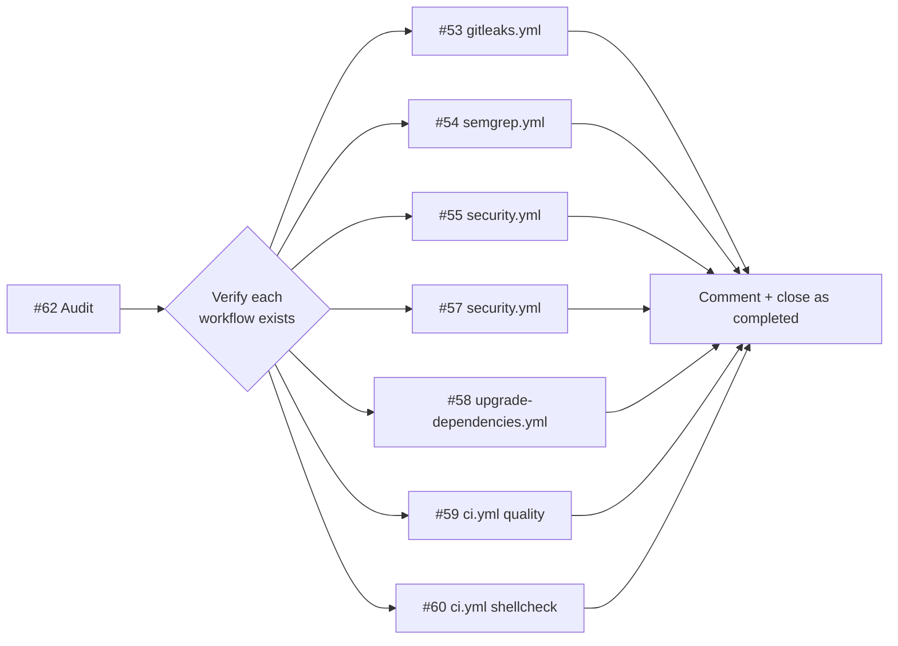

## Summary

Audit of the seven open workflow-sync issues (#53, #54, #55, #57, #58, #59, #60) confirmed each is already covered by an existing workflow on the `Develop` branch. Posted a closing comment linking the existing workflow file/lines on every issue and closed each as completed. No code changes were required — the workflow-sync tool raised these because it scanned for specific filenames rather than detecting equivalent functionality. Closes #62.

## Evidence

Verification of each claim against the workflows in `.github/workflows/`:

| Issue | Workflow | Verified content |
|-------|----------|------------------|
| [#53](https://github.com/stSoftwareAU/NEAT-AI-core/issues/53) Gitleaks | `gitleaks.yml` | `gitleaks/gitleaks-action@v2` on every PR |
| [#54](https://github.com/stSoftwareAU/NEAT-AI-core/issues/54) Semgrep | `semgrep.yml` | `semgrep ci --config p/default` on every PR |
| [#55](https://github.com/stSoftwareAU/NEAT-AI-core/issues/55) Dependency Review | `security.yml:50` | `actions/dependency-review-action@v4` |
| [#57](https://github.com/stSoftwareAU/NEAT-AI-core/issues/57) Cargo Security Audit | `security.yml:36-46` | `rustsec/audit-check@v2` + `cargo audit` fallback |
| [#58](https://github.com/stSoftwareAU/NEAT-AI-core/issues/58) Cargo Dependency Updates | `upgrade-dependencies.yml` | Weekly `cargo upgrade` job opening a PR |
| [#59](https://github.com/stSoftwareAU/NEAT-AI-core/issues/59) Cargo Format & Clippy | `ci.yml:214-218` | `cargo fmt --all -- --check` + `cargo clippy --workspace --all-targets --all-features -- -D warnings` |
| [#60](https://github.com/stSoftwareAU/NEAT-AI-core/issues/60) ShellCheck | `ci.yml:241-254` | Installs `koalaman/shellcheck` and scans every `*.sh` |

This is a verification-only change with no source code edits, so there are no UI screenshots or benchmarks to capture.

## Test Plan

- Verification was performed by reading each referenced workflow file and confirming the cited action/command is present at the cited lines (see Evidence table).
- No automated tests were added — there is no production code change.
- All 7 closing comments and closures were applied via `gh issue comment` / `gh issue close --reason completed`.
